<div align="center">
 <p>
    
 </p>
  [<a href="README.md">English</a>] | [<b>日本語</b>]
</div>

---

<p align="center">
    <a href="https://github.com/Yamato-Security/hayabusa/releases"></a>
    <a href="https://github.com/Yamato-Security/hayabusa/releases"></a>
    <a href="https://github.com/Yamato-Security/hayabusa/stargazers"></a>
    <a href="https://github.com/Yamato-Security/hayabusa/graphs/contributors"></a>
    <a href="https://www.blackhat.com/asia-22/arsenal/schedule/#hayabusa-26211"></a>
    <a href="https://codeblue.jp/2022/en/talks/?content=talks_24"></a>
    <a href="https://www.seccon.jp/2022/"></a>
    <a href=""></a>
    <a href="https://rust-reportcard.xuri.me/report/github.com/Yamato-Security/hayabusa"></a>
    <a href="https://codecov.io/gh/Yamato-Security/hayabusa" ></a>
    <a href="https://twitter.com/SecurityYamato"></a>
</p>

# Hayabusa について

Hayabusaは、日本の[Yamato Security](https://yamatosecurity.connpass.com/)グループによって作られた**Windowsイベントログのファストフォレンジックタイムライン作成**および**脅威ハンティングツール**です。 Hayabusaは日本語で[「ハヤブサ」](https://ja.wikipedia.org/wiki/%E3%83%8F%E3%83%A4%E3%83%96%E3%82%B5)を意味し、ハヤブサが世界で最も速く、狩猟(hunting)に優れ、とても訓練しやすい動物であることから選ばれました。[Rust](https://www.rust-lang.org/) で開発され、マルチスレッドに対応し、可能な限り高速に動作するよう配慮されています。[Sigma](https://github.com/SigmaHQ/Sigma)ルールをHayabusaルール形式に変換する[ツール](https://github.com/Yamato-Security/hayabusa-rules/tree/main/tools/sigmac)も提供しています。Hayabusaの検知ルールもSigmaと同様にYML形式であり、カスタマイズ性や拡張性に優れます。稼働中のシステムで実行してライブ調査することも、複数のシステムからログを収集してオフライン調査することも可能です。また、 [Velociraptor](https://docs.velociraptor.app/)と[Hayabusa artifact](https://docs.velociraptor.app/exchange/artifacts/pages/windows.eventlogs.hayabusa/)を用いることで企業向けの広範囲なスレットハンティングとインシデントレスポンスにも活用できます。出力は一つのCSVタイムラインにまとめられ、Excel、[Timeline Explorer](https://ericzimmerman.github.io/#!index.md)、[Elastic Stack](doc/ElasticStackImport/ElasticStackImport-Japanese.md)、[Timesketch](https://timesketch.org/)等で簡単に分析できるようになります。

# 関連プロジェクト

* [EnableWindowsLogSettings](https://github.com/Yamato-Security/EnableWindowsLogSettings) - Sigmaベースの脅威ハンティングと、Windowsイベントログのファストフォレンジックタイムライン生成ツール。
* [Hayabusa Rules](https://github.com/Yamato-Security/hayabusa-rules/blob/main/README-Japanese.md) - Hayabusaのための検知ルール。
* [Hayabusa Sample EVTXs](https://github.com/Yamato-Security/hayabusa-sample-evtx) - Hayabusa/Sigma検出ルールをテストするためのサンプルevtxファイル。
* [Takajo](https://github.com/Yamato-Security/takajo/blob/main/README-Japanese.md) - Hayabusa結果の解析ツール。
* [WELA (Windows Event Log Analyzer)](https://github.com/Yamato-Security/WELA/blob/main/README-Japanese.md) - PowerShellで書かれたWindowsイベントログの解析ツール。

## 目次

- [Hayabusa について](#hayabusa-について)
- [関連プロジェクト](#関連プロジェクト)
  - [目次](#目次)
  - [主な目的](#主な目的)
    - [スレット(脅威)ハンティングと企業向けの広範囲なDFIR](#スレット脅威ハンティングと企業向けの広範囲なdfir)
    - [フォレンジックタイムラインの高速生成](#フォレンジックタイムラインの高速生成)
- [スクリーンショット](#スクリーンショット)
  - [起動画面](#起動画面)
  - [ターミナル出力画面](#ターミナル出力画面)
  - [イベント頻度タイムライン出力画面 (`-T`オプション)](#イベント頻度タイムライン出力画面--tオプション)
  - [結果サマリ画面](#結果サマリ画面)
  - [HTMLの結果サマリ (`-H`オプション)](#htmlの結果サマリ--hオプション)
  - [Excelでの解析](#excelでの解析)
  - [Timeline Explorerでの解析](#timeline-explorerでの解析)
  - [Criticalアラートのフィルタリングとコンピュータごとのグルーピング](#criticalアラートのフィルタリングとコンピュータごとのグルーピング)
  - [Elastic Stackダッシュボードでの解析](#elastic-stackダッシュボードでの解析)
  - [Timesketchでの解析](#timesketchでの解析)
- [タイムラインのサンプル結果](#タイムラインのサンプル結果)
- [特徴＆機能](#特徴機能)
- [ダウンロード](#ダウンロード)
- [Gitクローン](#gitクローン)
- [アドバンス: ソースコードからのコンパイル（任意）](#アドバンス-ソースコードからのコンパイル任意)
  - [Rustパッケージの更新](#rustパッケージの更新)
  - [32ビットWindowsバイナリのクロスコンパイル](#32ビットwindowsバイナリのクロスコンパイル)
  - [macOSでのコンパイルの注意点](#macosでのコンパイルの注意点)
  - [Linuxでのコンパイルの注意点](#linuxでのコンパイルの注意点)
  - [LinuxのMUSLバイナリのクロスコンパイル](#linuxのmuslバイナリのクロスコンパイル)
- [Hayabusaの実行](#hayabusaの実行)
  - [注意: アンチウィルス/EDRの誤検知と遅い初回実行](#注意-アンチウィルスedrの誤検知と遅い初回実行)
  - [Windows](#windows)
  - [Linux](#linux)
  - [macOS](#macos)
- [主なコマンド](#主なコマンド)
- [使用方法](#使用方法)
  - [デフォルトのヘルプメニュー](#デフォルトのヘルプメニュー)
  - [`csv-timeline`コマンド](#csv-timelineコマンド)
  - [`json-timeline`コマンド](#json-timelineコマンド)
  - [`logon-summary`コマンド](#logon-summaryコマンド)
  - [`metrics`コマンド](#metricsコマンド)
- [`pivot-keywords-list`コマンド](#pivot-keywords-listコマンド)
  - [`update-rules`コマンド](#update-rulesコマンド)
  - [`level-tuning`コマンド](#level-tuningコマンド)
  - [`set-default-profile`コマンド](#set-default-profileコマンド)
  - [`list-profiles`コマンド](#list-profilesコマンド)
  - [使用例](#使用例)
  - [ピボットキーワードの作成](#ピボットキーワードの作成)
  - [ログオン情報の要約](#ログオン情報の要約)
- [サンプルevtxファイルでHayabusaをテストする](#サンプルevtxファイルでhayabusaをテストする)
- [Hayabusaの出力](#hayabusaの出力)
  - [プロファイル](#プロファイル)
    - [1. `minimal`プロファイルの出力](#1-minimalプロファイルの出力)
    - [2. `standard`プロファイルの出力](#2-standardプロファイルの出力)
    - [3. `verbose`プロファイルの出力](#3-verboseプロファイルの出力)
    - [4. `all-field-info`プロファイルの出力](#4-all-field-infoプロファイルの出力)
    - [5. `all-field-info-verbose`プロファイルの出力](#5-all-field-info-verboseプロファイルの出力)
    - [6. `super-verbose`プロファイルの出力](#6-super-verboseプロファイルの出力)
    - [7. `timesketch-minimal`プロファイルの出力](#7-timesketch-minimalプロファイルの出力)
    - [8. `timesketch-verbose`プロファイルの出力](#8-timesketch-verboseプロファイルの出力)
    - [プロファイルの比較](#プロファイルの比較)
    - [Profile Field Aliases](#profile-field-aliases)
  - [Levelの省略](#levelの省略)
  - [MITRE ATT\&CK戦術の省略](#mitre-attck戦術の省略)
  - [Channel情報の省略](#channel情報の省略)
- [その他の省略](#その他の省略)
  - [プログレスバー](#プログレスバー)
  - [標準出力へのカラー設定](#標準出力へのカラー設定)
  - [結果のサマリ](#結果のサマリ)
    - [イベント頻度タイムライン](#イベント頻度タイムライン)
- [Hayabusaルール](#hayabusaルール)
  - [Hayabusa v.s. 変換されたSigmaルール](#hayabusa-vs-変換されたsigmaルール)
  - [検知ルールのチューニング](#検知ルールのチューニング)
  - [検知レベルのlevelチューニング](#検知レベルのlevelチューニング)
  - [イベントIDフィルタリング](#イベントidフィルタリング)
- [その他のWindowsイベントログ解析ツールおよび関連リソース](#その他のwindowsイベントログ解析ツールおよび関連リソース)
- [Windowsイベントログ設定のススメ](#windowsイベントログ設定のススメ)
- [Sysmon関係のプロジェクト](#sysmon関係のプロジェクト)
- [コミュニティによるドキュメンテーション](#コミュニティによるドキュメンテーション)
  - [英語](#英語)
  - [日本語](#日本語)
- [貢献](#貢献)
- [バグの報告](#バグの報告)
- [ライセンス](#ライセンス)
- [Twitter](#twitter)

## 主な目的

### スレット(脅威)ハンティングと企業向けの広範囲なDFIR

Hayabusaには現在、3000以上のSigmaルールと約150のHayabusa検知ルールがあり、定期的にルールが追加されています。
[Velociraptor](https://docs.velociraptor.app/)の[Hayabusa artifact](https://docs.velociraptor.app/exchange/artifacts/pages/windows.eventlogs.hayabusa/)を用いることで企業向けの広範囲なスレットハンティングだけでなくDFIR(デジタルフォレンジックとインシデントレスポンス)にも無料で利用することが可能です。この2つのオープンソースを組み合わせることで、SIEMが設定されていない環境でも実質的に遡及してSIEMを再現することができます。具体的な方法は[Eric Capuano](https://twitter.com/eric_capuano)の[こちら](https://www.youtube.com/watch?v=Q1IoGX--814)の動画で学ぶことができます。
 最終的な目標はインシデントレスポンスや定期的なスレットハンティングのために、HayabusaエージェントをすべてのWindows端末にインストールして、中央サーバーにアラートを返す仕組みを作ることです。

### フォレンジックタイムラインの高速生成

Windowsのイベントログは、
  1）解析が困難なデータ形式であること
  2）データの大半がノイズであり調査に有用でないこと
から、従来は非常に長い時間と手間がかかる解析作業となっていました。 Hayabusa は、有用なデータのみを抽出し、専門的なトレーニングを受けた分析者だけでなく、Windowsのシステム管理者であれば誰でも利用できる読みやすい形式で提示することを主な目的としています。
Hayabusaは従来のWindowsイベントログ分析解析と比較して、分析者が20%の時間で80%の作業を行えるようにすることを目指しています。

# スクリーンショット

## 起動画面

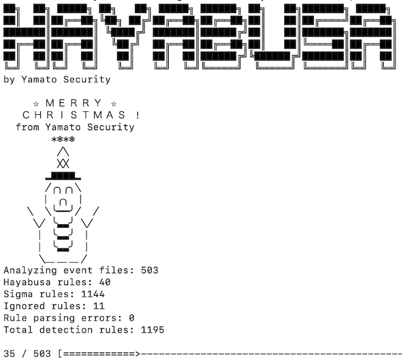

## ターミナル出力画面

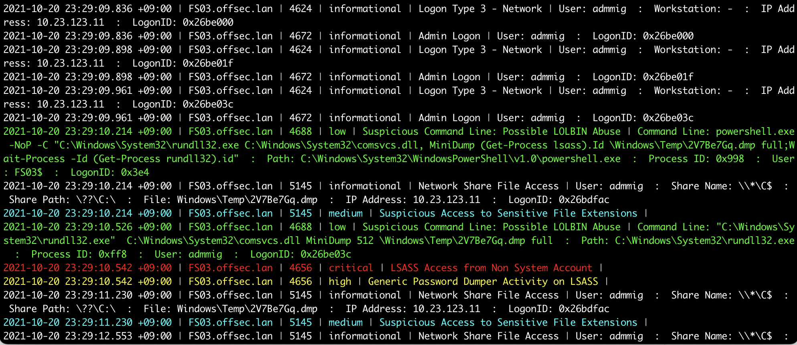

## イベント頻度タイムライン出力画面 (`-T`オプション)

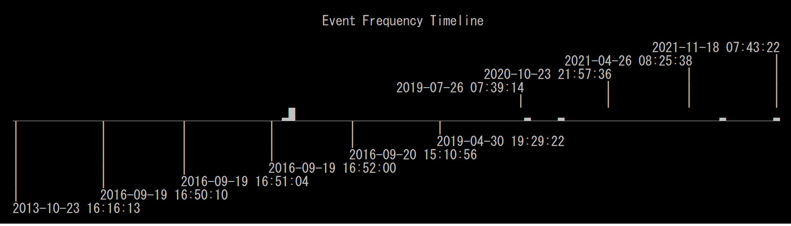

## 結果サマリ画面

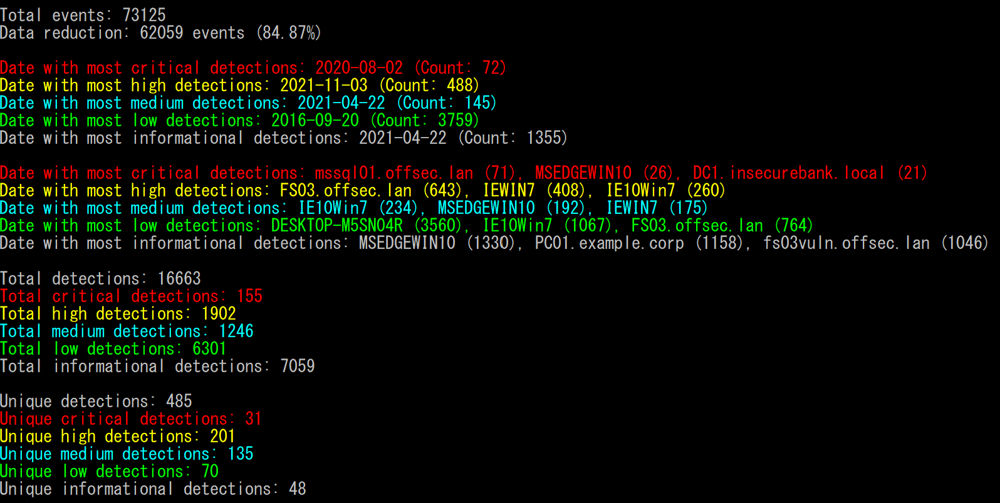

## HTMLの結果サマリ (`-H`オプション)

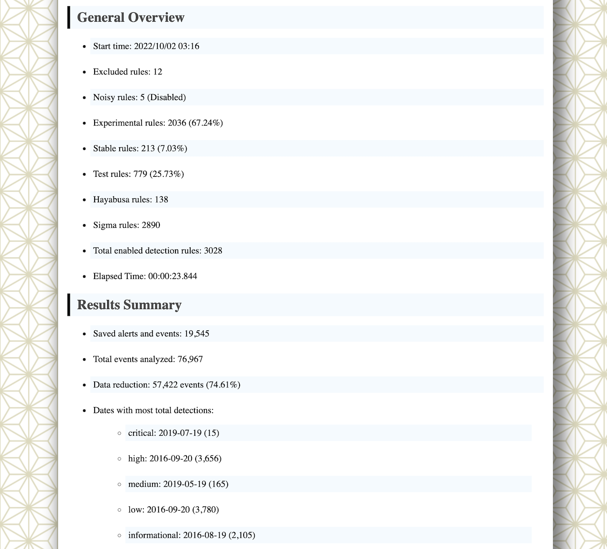

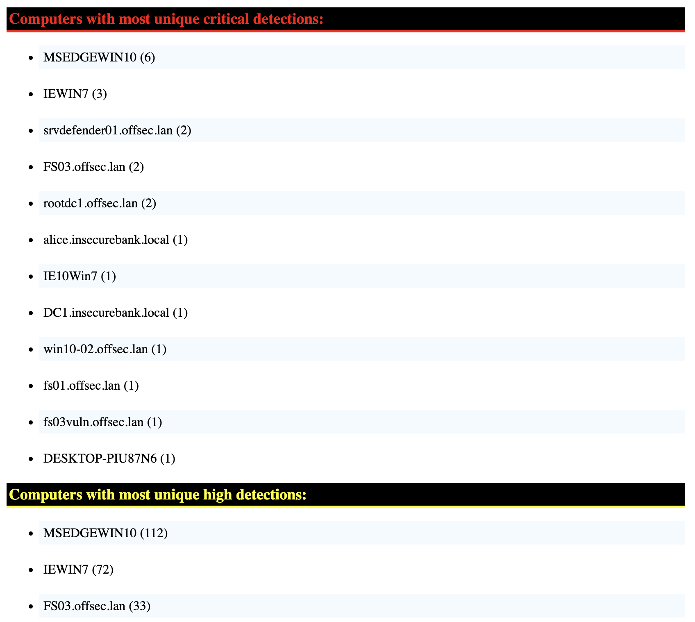

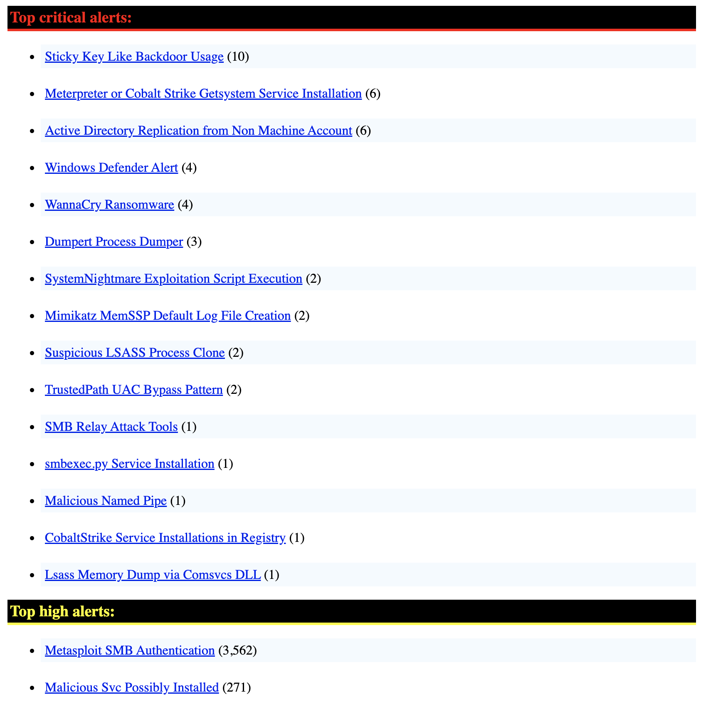

## Excelでの解析

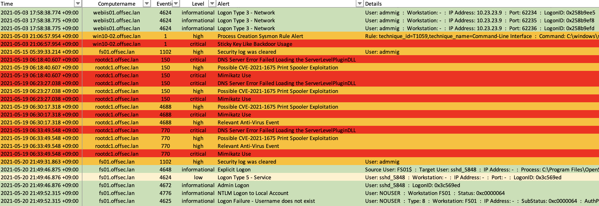

## Timeline Explorerでの解析


## Criticalアラートのフィルタリングとコンピュータごとのグルーピング

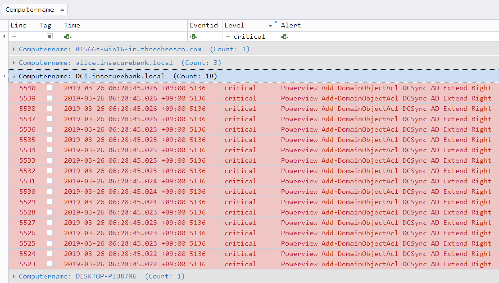

## Elastic Stackダッシュボードでの解析


## Timesketchでの解析


# タイムラインのサンプル結果

CSVのタイムラインをExcelやTimeline Explorerで分析する方法は[こちら](doc/CSV-AnalysisWithExcelAndTimelineExplorer-Japanese.pdf)で紹介しています。

CSVのタイムラインをElastic Stackにインポートする方法は[こちら](doc/ElasticStackImport/ElasticStackImport-Japanese.md)で紹介しています。

CSVのタイムラインをTimesketchにインポートする方法は[こちら](doc/TimesketchImport/TimesketchImport-Japanese.md)で紹介しています。

# 特徴＆機能

* クロスプラットフォーム対応: Windows, Linux, macOS。
* Rustで開発され、メモリセーフでハヤブサよりも高速です！
* マルチスレッド対応により、最大5倍のスピードアップを実現。
* フォレンジック調査やインシデントレスポンスのために、分析しやすいCSVタイムラインを作成します。
* 読みやすい/作成/編集可能なYMLベースのHayabusaルールで作成されたIoCシグネチャに基づくスレット。
* SigmaルールをHayabusaルールに変換するためのSigmaルールのサポートがされています。
* 現在、他の類似ツールに比べ最も多くのSigmaルールをサポートしており、カウントルール、新しい機能の`|equalsfield`や`|endswithfield`等にも対応しています。
* イベントログの統計。(どのような種類のイベントがあるのかを把握し、ログ設定のチューニングに有効です。)
* 不良ルールやノイズの多いルールを除外するルールチューニング設定が可能です。
* MITRE ATT&CKとのマッピング (CSVの出力ファイルのみ)。
* ルールレベルのチューニング。
* イベントログから不審なユーザやファイルを素早く特定するためのピボットキーワードの一覧作成。
* 詳細な調査のために全フィールド情報の出力。
* 成功と失敗したユーザログオンの要約。
* [Velociraptor](https://docs.velociraptor.app/)と組み合わせた企業向けの広範囲なすべてのエンドポイントに対するスレットハンティングとDFIR。
* CSV、JSON、JSONL形式とHTML結果サマリの出力。
* 毎日のSigmaルール更新。

# ダウンロード

[Releases](https://github.com/Yamato-Security/hayabusa/releases)ページからHayabusaの安定したバージョンでコンパイルされたバイナリが含まれている最新版もしくはソースコードをダウンロードできます。

# Gitクローン

以下の`git clone`コマンドでレポジトリをダウンロードし、ソースコードからコンパイルして使用することも可能です：

```bash
git clone https://github.com/Yamato-Security/hayabusa.git --recursive
```

**注意：** mainブランチは開発中のバージョンです。まだ正式にリリースされていない新機能が使えるかもしれないが、バグがある可能性もあるので、テスト版だと思って下さい。

※ `--recursive`をつけ忘れた場合、サブモジュールとして管理されている`rules`フォルダ内のファイルはダウンロードされません。

`git pull --recurse-submodules`コマンド、もしくは以下のコマンドで`rules`フォルダを同期し、Hayabusaの最新のルールを更新することができます:

```bash
hayabusa-2.1.0-win-x64.exe update-rules
```

アップデートが失敗した場合は、`rules`フォルダの名前を変更してから、もう一回アップデートしてみて下さい。

>> 注意: アップデートを実行する際に `rules` フォルダは [hayabusa-rules](https://github.com/Yamato-Security/hayabusa-rules) レポジトリの最新のルールとコンフィグファイルに置き換えられます
>> 既存ファイルへの修正はすべて上書きされますので、アップデート実行前に編集したファイルのバックアップをおすすめします。
>> もし、`level-tuning` を行っているのであれば、アップデート後にルールファイルの再調整をしてください
>> `rules`フォルダ内に新しく追加したルールは、アップデート時に上書きもしくは削除は行われません。

# アドバンス: ソースコードからのコンパイル（任意）

Rustがインストールされている場合、以下のコマンドでソースコードからコンパイルすることができます:

注意: hayabusaをコンパイルするためにはRust(rustc)が`1.65.0`以上であることが必要です。

```bash
cargo build --release
```

以下のコマンドで定期的にRustをアップデートしてください：

```bash
rustup update stable
```

コンパイルされたバイナリは`target/release`フォルダ配下で作成されます。

## Rustパッケージの更新

コンパイル前に最新のRust crateにアップデートすることで、最新のライブラリを利用することができます:

```bash
cargo update
```

※ アップデート後、何か不具合がありましたらお知らせください。

## 32ビットWindowsバイナリのクロスコンパイル

以下のコマンドで64ビットのWindows端末で32ビットのバイナリをクロスコンパイルできます:

```bash
rustup install stable-i686-pc-windows-msvc
rustup target add i686-pc-windows-msvc
rustup run stable-i686-pc-windows-msvc cargo build --release
```

> **注意: Rust の新しい安定版が出たときには必ず`rustup install stable-i686-pc-windows-msvc`を実行してください。`rustup update stable` はクロスコンパイル用のコンパイラを更新しないので、ビルドエラーが発生することがあります。**

## macOSでのコンパイルの注意点

opensslについてのコンパイルエラーが表示される場合は、[Homebrew](https://brew.sh/)をインストールしてから、以下のパッケージをインストールする必要があります：

```bash
brew install pkg-config
brew install openssl
```

## Linuxでのコンパイルの注意点

opensslについてのコンパイルエラーが表示される場合は、以下のパッケージをインストールする必要があります。

Ubuntu系のディストロ:

```bash
sudo apt install libssl-dev
```

Fedora系のディストロ:

```bash
sudo yum install openssl-devel
```

## LinuxのMUSLバイナリのクロスコンパイル

まず、Linux OSでターゲットをインストールします。

```bash
rustup install stable-x86_64-unknown-linux-musl
rustup target add x86_64-unknown-linux-musl
```

以下のようにコンパイルします:

```bash
cargo build --release --target=x86_64-unknown-linux-musl
```

> **注意: Rust の新しい安定版が出たときには必ず`rustup install stable-x86_64-unknown-linux-musl`を実行してください。`rustup update stable` はクロスコンパイル用のコンパイラを更新しないので、ビルドエラーが発生することがあります。**

MUSLバイナリは`./target/x86_64-unknown-linux-musl/release/`ディレクトリ配下に作成されます。
MUSLバイナリはGNUバイナリより約15％遅いですが、より多くのLinuxバージョンとディストロで実行できます。

# Hayabusaの実行

## 注意: アンチウィルス/EDRの誤検知と遅い初回実行

Hayabusa実行する際や、`.yml`ルールのダウンロードや実行時にルール内でdetectionに不審なPowerShellコマンドや`mimikatz`のようなキーワードが書かれている際に、アンチウィルスやEDRにブロックされる可能性があります。
誤検知のため、セキュリティ対策の製品がHayabusaを許可するように設定する必要があります。
マルウェア感染が心配であれば、ソースコードを確認した上で、自分でバイナリをコンパイルして下さい。

Windows PC起動後の初回実行時に時間がかかる場合があります。これはWindows Defenderのリアルタイムスキャンが行われていることが原因です。リアルタイムスキャンを無効にするかHayabusaのディレクトリをアンチウィルススキャンから除外することでこの現象は解消しますが、設定を変える前にセキュリティリスクを十分ご考慮ください。

## Windows

コマンドプロンプトやWindows Terminalから32ビットもしくは64ビットのWindowsバイナリをHayabusaのルートディレクトリから実行します。

例: `hayabusa-2.1.0-win-x64.exe`

## Linux

まず、バイナリに実行権限を与える必要があります。

```bash
chmod +x ./hayabusa-2.1.0-lin-gnu
```

次に、Hayabusaのルートディレクトリから実行します：

```bash
./hayabusa-2.1.0-lin-gnu
```

## macOS

まず、ターミナルやiTerm2からバイナリに実行権限を与える必要があります。

```bash
chmod +x ./hayabusa-2.1.0-mac-intel
```

次に、Hayabusaのルートディレクトリから実行してみてください：

```bash
./hayabusa-2.1.0-mac-intel
```

macOSの最新版では、以下のセキュリティ警告が出る可能性があります：

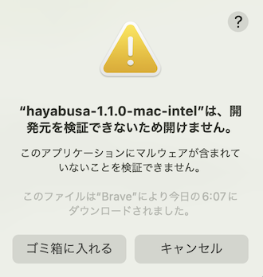

macOSの環境設定から「セキュリティとプライバシー」を開き、「一般」タブから「このまま許可」ボタンをクリックしてください。

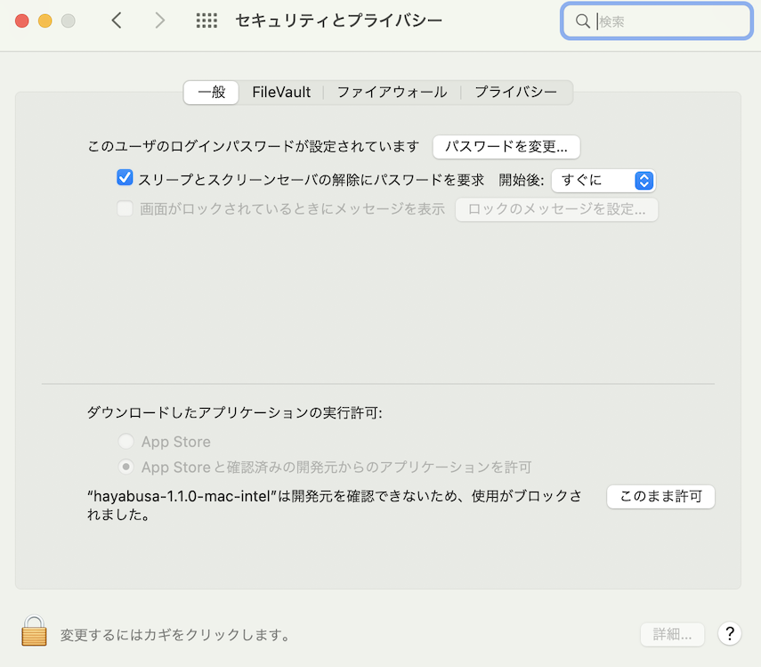

その後、ターミナルからもう一回実行してみてください：

```bash
./hayabusa-2.1.0-mac-intel
```

以下の警告が出るので、「開く」をクリックしてください。

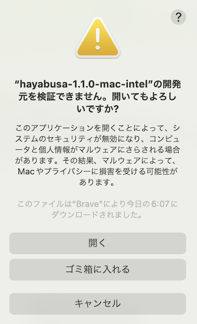

これで実行できるようになります。

# 主なコマンド

* `csv-timeline`: CSV形式のタイムラインを出力する。
* `json-timeline`: JSON/JSONL形式のタイムラインを出力する。
* `logon-summary`: ログオンイベントのサマリを出力する。
* `metrics`: イベントIDに基づくイベントの合計と割合の集計を出力する。
* `pivot-keywords-list`: ピボットする不審なキーワードのリストを作成する。
* `update-rules`: GitHubの[hayabusa-rules](https://github.com/Yamato-Security/hayabusa-rules)リポジトリにある最新のルールに同期させる。
* `level-tuning`: アラート`level`のカスタムチューニング。
* `list-profiles` : 出力プロファイルの一覧表示。
* `set-default-profile`: デフォルトプロファイルを変更する。

# 使用方法

## デフォルトのヘルプメニュー

```
Usage:
  hayabusa.exe help <COMMAND>
  hayabusa.exe <COMMAND> [OPTIONS]

Commands:
  csv-timeline         CSV形式のタイムラインを出力
  json-timeline        JSON/JSONL形式のタイムラインを出力
  logon-summary        ログオンイベントのサマリを出力
  metrics              イベントIDに基づくイベントの合計と割合の集計を出力
  pivot-keywords-list  ピボットキーワードの一覧作成
  update-rules         rulesフォルダをhayabusa-rulesのgithubリポジトリの最新版に更新する
  level-tuning         ルールlevelのチューニング (デフォルト: ./rules/config/level_tuning.txt)
  set-default-profile  デフォルトの出力コンフィグを設定する
  list-contributors    コントリビュータの一覧表示  
  list-profiles        出力プロファイルの一覧表示
  help                 コマンドに付随するオプションのヘルプを表示する

Options:
      --no-color  カラーで出力しない
  -q, --quiet     Quietモード: 起動バナーを表示しない
```

## `csv-timeline`コマンド

```
Options:
  -t, --thread-number <NUMBER>    スレッド数 (デフォルト: パフォーマンスに最適な数値)
  -Q, --quiet-errors              Quiet errorsモード: エラーログを保存しない
  -c, --rules-config <DIRECTORY>  ルールフォルダのコンフィグディレクトリ (デフォルト: ./rules/config)
  -v, --verbose                   詳細な情報を出力する

Input:
  -d, --directory <DIRECTORY>  .evtxファイルを持つディレクトリのパス
  -f, --file <FILE>            1つの.evtxファイルに対して解析を行う
  -l, --live-analysis          ローカル端末のC:\Windows\System32\winevt\Logsフォルダを解析する

Advanced:
      --target-file-ext <EVTX_FILE_EXT>  evtx以外の拡張子を解析対象に追加する。 (例１: evtx_data 例２：evtx1,evtx2)
  -r, --rules <DIRECTORY/FILE>           ルールファイルまたはルールファイルを持つディレクトリ (デフォルト: ./rules)

Output:
  -P, --profile <PROFILE>   利用する出力プロファイル名を指定する
  -o, --output <FILE>       タイムラインを保存する (csv-timelineの例: results.csv, json-timelineの例: results.json)
  -H, --html-report <FILE>  HTML形式で詳細な結果を出力する (例: results.html)

Filtering:
      --enable-deprecated-rules  Deprecatedルールを有効にする
      --exclude-status <STATUS>  読み込み対象外とするルール内でのステータス (ex: experimental) (ex: stable,test)
  -m, --min-level <LEVEL>        結果出力をするルールの最低レベル (デフォルト: informational)
  -n, --enable-noisy-rules       Noisyルールを有効にする
      --timeline-end <DATE>      解析対象とするイベントログの終了時刻 (例: "2022-02-22 23:59:59 +09:00")
      --timeline-start <DATE>    解析対象とするイベントログの開始時刻 (例: "2020-02-22 00:00:00 +09:00")
  -e, --eid-filter               イベントIDによるフィルタリングを行う(コンフィグファイル: ./rules/config/target_event_IDs.txt)

Time Format:
      --European-time     ヨーロッパ形式で日付と時刻を出力する (例: 22-02-2022 22:00:00.123 +02:00)
      --ISO-8601          ISO-8601形式で日付と時刻を出力する (ex: 2022-02-22T10:10:10.1234567Z) (いつもUTC)
      --RFC-2822          RFC 2822形式で日付と時刻を出力する (例: Fri, 22 Feb 2022 22:00:00 -0600)
      --RFC-3339          RFC 3339形式で日付と時刻を出力する (例: 2022-02-22 22:00:00.123456-06:00)
      --US-military-time  24時間制(ミリタリータイム)のアメリカ形式で日付と時刻を出力する (例: 02-22-2022 22:00:00.123 -06:00)
      --US-time           アメリカ形式で日付と時刻を出力する (例: 02-22-2022 10:00:00.123 PM -06:00)
  -U, --UTC               UTC形式で日付と時刻を出力する (デフォルト: 現地時間)

Display Settings:
  -T, --visualize-timeline  イベント頻度タイムラインを出力する
      --no-summary          結果概要を出力しない
```

## `json-timeline`コマンド

```
Usage: json-timeline <INPUT> [OPTIONS]

Options:
  -t, --thread-number <NUMBER>    スレッド数 (デフォルト: パフォーマンスに最適な数値)
  -Q, --quiet-errors              Quiet errorsモード: エラーログを保存しない
  -c, --rules-config <DIRECTORY>  ルールフォルダのコンフィグディレクトリ (デフォルト: ./rules/config)
  -v, --verbose                   詳細な情報を出力する

Input:
  -d, --directory <DIRECTORY>  .evtxファイルを持つディレクトリのパス
  -f, --file <FILE>            1つの.evtxファイルに対して解析を行う
  -l, --live-analysis          ローカル端末のC:\Windows\System32\winevt\Logsフォルダを解析する

Advanced:
      --target-file-ext <EVTX_FILE_EXT>  evtx以外の拡張子を解析対象に追加する。 (例１: evtx_data 例２：evtx1,evtx2)
  -r, --rules <DIRECTORY/FILE>           ルールファイルまたはルールファイルを持つディレクトリ (デフォルト: ./rules)

Output:
  -p, --profile <PROFILE>   利用する出力プロファイル名を指定する
  -o, --output <FILE>       タイムラインを保存する (csv-timelineの例: result.csv, json-timelineの例: result.json)
  -H, --html-report <FILE>  HTML形式で詳細な結果を出力する (例: results.html)
  -J, --jsonl               JSONL形式でタイムラインを保存する (ex: -J -o results.jsonl)

Filtering:
      --enable-deprecated-rules  Deprecatedルールを有効にする
      --exclude-status <STATUS>  読み込み対象外とするルール内でのステータス (ex: experimental) (ex: stable,test)
  -m, --min-level <LEVEL>        結果出力をするルールの最低レベル (デフォルト: informational)
  -n, --enable-noisy-rules       Noisyルールを有効にする
      --timeline-end <DATE>      解析対象とするイベントログの終了時刻 (例: "2022-02-22 23:59:59 +09:00")
      --timeline-start <DATE>    解析対象とするイベントログの開始時刻 (例: "2020-02-22 00:00:00 +09:00")
  -e, --eid-filter               イベントIDによるフィルタリングを行う(コンフィグファイル: ./rules/config/target_event_IDs.txt)

Time Format:
      --European-time     ヨーロッパ形式で日付と時刻を出力する (例: 22-02-2022 22:00:00.123 +02:00)
      --ISO-8601          ISO-8601形式で日付と時刻を出力する (ex: 2022-02-22T10:10:10.1234567Z) (いつもUTC)
      --RFC-2822          RFC 2822形式で日付と時刻を出力する (例: Fri, 22 Feb 2022 22:00:00 -0600)
      --RFC-3339          RFC 3339形式で日付と時刻を出力する (例: 2022-02-22 22:00:00.123456-06:00)
      --US-military-time  24時間制(ミリタリータイム)のアメリカ形式で日付と時刻を出力する (例: 02-22-2022 22:00:00.123 -06:00)
      --US-time           アメリカ形式で日付と時刻を出力する (例: 02-22-2022 10:00:00.123 PM -06:00)
  -U, --UTC               UTC形式で日付と時刻を出力する (デフォルト: 現地時間)

Display Settings:
  -T, --visualize-timeline  イベント頻度タイムラインを出力する
      --no-summary          結果概要を出力しない
```

## `logon-summary`コマンド

```
Usage: logon-summary <INPUT> [OPTIONS]

Options:
  -t, --thread-number <NUMBER>    スレッド数 (デフォルト: パフォーマンスに最適な数値)
  -Q, --quiet-errors              Quiet errorsモード: エラーログを保存しない
  -c, --rules-config <DIRECTORY>  ルールフォルダのコンフィグディレクトリ (デフォルト: ./rules/config)
  -v, --verbose                   詳細な情報を出力する

Input:
  -d, --directory <DIRECTORY>  .evtxファイルを持つディレクトリのパス
  -f, --file <FILE>            1つの.evtxファイルに対して解析を行う
  -l, --live-analysis          ローカル端末のC:\Windows\System32\winevt\Logsフォルダを解析する

Advanced:
      --target-file-ext <EVTX_FILE_EXT>  evtx以外の拡張子を解析対象に追加する (例１: evtx_data 例２：evtx1,evtx2)

Output:
  -o, --output <FILE>  ログオンサマリをCSV形式で保存する (例: logon-summary.csv)
```

## `metrics`コマンド

```
Usage: metrics <INPUT> [OPTIONS]

Options:
  -t, --thread-number <NUMBER>    スレッド数 (デフォルト: パフォーマンスに最適な数値)
  -Q, --quiet-errors              Quiet errorsモード: エラーログを保存しない
  -c, --rules-config <DIRECTORY>  ルールフォルダのコンフィグディレクトリ (デフォルト: ./rules/config)
  -v, --verbose                   詳細な情報を出力する

Input:
  -d, --directory <DIRECTORY>  .evtxファイルを持つディレクトリのパス
  -f, --file <FILE>            1つの.evtxファイルに対して解析を行う
  -l, --live-analysis          ローカル端末のC:\Windows\System32\winevt\Logsフォルダを解析する

Advanced:
      --target-file-ext <EVTX_FILE_EXT>  evtx以外の拡張子を解析対象に追加する。 (例１: evtx_data 例２：evtx1,evtx2)

Output:
  -o, --output <FILE>       成功と失敗したログオン情報の要約を出力する (例: metrics.csv)
```

# `pivot-keywords-list`コマンド

```
Usage: pivot-keywords-list <INPUT> [OPTIONS]

Options:
  -t, --thread-number <NUMBER>    スレッド数 (デフォルト: パフォーマンスに最適な数値)
  -Q, --quiet-errors              Quiet errorsモード: エラーログを保存しない
  -c, --rules-config <DIRECTORY>  ルールフォルダのコンフィグディレクトリ (デフォルト: ./rules/config)
  -v, --verbose                   詳細な情報を出力する

Input:
  -d, --directory <DIRECTORY>  .evtxファイルを持つディレクトリのパス
  -f, --file <FILE>            1つの.evtxファイルに対して解析を行う
  -l, --live-analysis          ローカル端末のC:\Windows\System32\winevt\Logsフォルダを解析する

Advanced:
      --target-file-ext <EVTX_FILE_EXT>  evtx以外の拡張子を解析対象に追加する。 (例１: evtx_data 例２：evtx1,evtx2)

Output:
  -o, --output <FILE>       成功と失敗したログオン情報の要約を出力する (例: pivot-keywords.txt)

Filtering:
      --enable-deprecated-rules  Deprecatedルールを有効にする
      --exclude-status <STATUS>  読み込み対象外とするルール内でのステータス (ex: experimental) (ex: stable,test)
  -m, --min-level <LEVEL>        結果出力をするルールの最低レベル (デフォルト: informational)
  -n, --enable-noisy-rules       Noisyルールを有効にする
      --timeline-end <DATE>      解析対象とするイベントログの終了時刻 (例: "2022-02-22 23:59:59 +09:00")
      --timeline-start <DATE>    解析対象とするイベントログの開始時刻 (例: "2020-02-22 00:00:00 +09:00")
  -e, --eid-filter               イベントIDによるフィルタリングを行う(コンフィグファイル: ./rules/config/target_event_IDs.txt)
```

## `update-rules`コマンド

```
Usage: update-rules [OPTIONS]

Options:
      --no-color  カラーで出力しない
  -q, --quiet     Quietモード: 起動バナーを表示しない

Advanced:
  -r, --rules <DIRECTORY/FILE>  ルールファイルまたはルールファイルを持つディレクトリ (デフォルト: ./rules)
```

## `level-tuning`コマンド

```
Usage: level-tuning [OPTIONS]

Options:
  -f, --file <FILE>   ルールlevelのチューニング (デフォルト: ./rules/config/level_tuning.txt)
      --no-color      カラーで出力しない
  -q, --quiet         Quietモード: 起動バナーを表示しない
```

## `set-default-profile`コマンド

```
Usage: set-default-profile [OPTIONS]

Options:
  -p, --profile <PROFILE>  利用する出力プロファイル名を指定する
      --no-color           カラーで出力しない
  -q, --quiet              Quietモード: 起動バナーを表示しない
```

## `list-profiles`コマンド

```
Usage: list-profiles [OPTIONS]

Options:
      --no-color   カラーで出力しない
  -q, --quiet      Quietモード: 起動バナーを表示しない
```

## 使用例

* １つのWindowsイベントログファイルに対してHayabusaを実行する:

```
hayabusa-2.1.0-win-x64.exe csv-timeline -f eventlog.evtx
```

* `verbose`プロファイルで複数のWindowsイベントログファイルのあるsample-evtxディレクトリに対して、Hayabusaを実行する:

```
hayabusa-2.1.0-win-x64.exe csv-timeline -d .\hayabusa-sample-evtx -P verbose
```

* 全てのフィールド情報も含めて１つのCSVファイルにエクスポートして、Excel、Timeline Explorer、Elastic Stack等でさらに分析することができる(注意: `super-verbose`プロファイルを使すると、出力するファイルのサイズがとても大きくなる！):

```
hayabusa-2.1.0-win-x64.exe csv-timeline -d .\hayabusa-sample-evtx -o results.csv -P super-verbose
```

* タイムラインをJSON形式で保存する:

```
hayabusa-2.1.0-win-x64.exe json-timeline -d .\hayabusa-sample-evtx -o results.json
```

* Hayabusaルールのみを実行する（デフォルトでは`-r .\rules`にあるすべてのルールが利用される）:

```
hayabusa-2.1.0-win-x64.exe csv-timeline -d .\hayabusa-sample-evtx -r .\rules\hayabusa -o results.csv
```

* Windowsでデフォルトで有効になっているログに対してのみ、Hayabusaルールを実行する:

```
hayabusa-2.1.0-win-x64.exe csv-timeline -d .\hayabusa-sample-evtx -r .\rules\hayabusa\builtin -o results.csv
```

* Sysmonログに対してのみHayabusaルールを実行する:

```
hayabusa-2.1.0-win-x64.exe csv-timeline -d .\hayabusa-sample-evtx -r .\rules\hayabusa\sysmon -o results.csv
```

* Sigmaルールのみを実行する:

```
hayabusa-2.1.0-win-x64.exe csv-timeline -d .\hayabusa-sample-evtx -r .\rules\sigma -o results.csv
```

* 廃棄(deprecated)されたルール(`status`が`deprecated`になっているルール)とノイジールール(`.\rules\config\noisy_rules.txt`にルールIDが書かれているルール)を有効にする:

```
hayabusa-2.1.0-win-x64.exe csv-timeline -d .\hayabusa-sample-evtx --enable-noisy-rules --enable-deprecated-rules -o results.csv
```

* ログオン情報を分析するルールのみを実行し、UTCタイムゾーンで出力する:

```
hayabusa-2.1.0-win-x64.exe csv-timeline -d .\hayabusa-sample-evtx -r .\rules\hayabusa\builtin\Security\LogonLogoff\Logon -U -o results.csv
```

* 起動中のWindows端末上で実行し（Administrator権限が必要）、アラート（悪意のある可能性のある動作）のみを検知する:

```
hayabusa-2.1.0-win-x64.exe csv-timeline -l -m low
```

* criticalレベルのアラートからピボットキーワードの一覧を作成する(結果は結果毎に`keywords-Ip Address.txt`や`keywords-Users.txt`等に出力される):

```
hayabusa-2.1.0-win-x64.exe pivot-keywords-list -l -m critical -o keywords
```

* イベントIDの統計情報を出力する:

```
hayabusa-2.1.0-win-x64.exe metrics -f Security.evtx
```

* ログオンサマリを出力する:

```
hayabusa-2.1.0-win-x64.exe logon-summary -f Security.evtx
```

* 詳細なメッセージを出力する(処理に時間がかかるファイル、パースエラー等を特定するのに便利):

```
hayabusa-2.1.0-win-x64.exe csv-timeline -d .\hayabusa-sample-evtx -v
```

* Verbose出力の例:

```
Checking target evtx FilePath: "./hayabusa-sample-evtx/YamatoSecurity/T1027.004_Obfuscated Files or Information\u{a0}Compile After Delivery/sysmon.evtx"
1 / 509 [>-------------------------------------------------------------------------------------------------------------------------------------------] 0.20 % 1s 
Checking target evtx FilePath: "./hayabusa-sample-evtx/YamatoSecurity/T1558.004_Steal or Forge Kerberos Tickets AS-REP Roasting/Security.evtx"
2 / 509 [>-------------------------------------------------------------------------------------------------------------------------------------------] 0.39 % 1s 
Checking target evtx FilePath: "./hayabusa-sample-evtx/YamatoSecurity/T1558.003_Steal or Forge Kerberos Tickets\u{a0}Kerberoasting/Security.evtx"
3 / 509 [>-------------------------------------------------------------------------------------------------------------------------------------------] 0.59 % 1s 
Checking target evtx FilePath: "./hayabusa-sample-evtx/YamatoSecurity/T1197_BITS Jobs/Windows-BitsClient.evtx"
4 / 509 [=>------------------------------------------------------------------------------------------------------------------------------------------] 0.79 % 1s 
Checking target evtx FilePath: "./hayabusa-sample-evtx/YamatoSecurity/T1218.004_Signed Binary Proxy Execution\u{a0}InstallUtil/sysmon.evtx"
5 / 509 [=>------------------------------------------------------------------------------------------------------------------------------------------] 0.98 % 1s
```

* 結果を[Timesketch](https://timesketch.org/)にインポートできるCSV形式に保存する:

```
hayabusa-2.1.0-win-x64.exe csv-timeline -d ../hayabusa-sample-evtx --RFC-3339 -o timesketch-import.csv -P timesketch -U
```

* エラーログの出力をさせないようにする:
デフォルトでは、Hayabusaはエラーメッセージをエラーログに保存します。
エラーメッセージを保存したくない場合は、`-Q`を追加してください。

## ピボットキーワードの作成

``pivot-keywords-list``コマンドを使うことで不審なユーザやホスト名、プロセスなどを一覧で出力することができ、イベントログから素早く特定することができます。
ピボットキーワードのカスタマイズは`./config/pivot_keywords.txt`を変更することで行うことができます。以下はデフォルトの設定になります:

```txt
Users.SubjectUserName
Users.TargetUserName
Users.User
Logon IDs.SubjectLogonId
Logon IDs.TargetLogonId
Workstation Names.WorkstationName
Ip Addresses.IpAddress
Processes.Image
```

形式は`KeywordName.FieldName`となっています。例えばデフォルトの設定では、`Users`というリストは検知したイベントから`SubjectUserName`、 `TargetUserName` 、 `User`のフィールドの値が一覧として出力されます。hayabusaのデフォルトでは検知したすべてのイベントから結果を出力するため、`pivot-keyword-list`コマンドを使うときには `-m` もしくは `--min-level` オプションを併せて使って検知するイベントのレベルを指定することをおすすめします。まず`-m critical`を指定して、最も高い`critical`レベルのアラートのみを対象として、レベルを必要に応じて下げていくとよいでしょう。結果に正常なイベントにもある共通のキーワードが入っている可能性が高いため、手動で結果を確認してから、不審なイベントにありそうなキーワードリストを１つのファイルに保存し、`grep -f keywords.txt timeline.csv`等のコマンドで不審なアクティビティに絞ったタイムラインを作成することができます。

## ログオン情報の要約

``logon-summary`コマンドを使うことでログオン情報の要約(ユーザ名、ログイン成功数、ログイン失敗数)の画面出力ができます。単体のevtxファイルを解析したい場合は`-f`オプションを利用してください。複数のevtxファイルを対象としたい場合は`-d` オプションを合わせて使うことでevtxファイルごとのログイン情報の要約を出力できます。

# サンプルevtxファイルでHayabusaをテストする

Hayabusaをテストしたり、新しいルールを作成したりするためのサンプルevtxファイルをいくつか提供しています: [https://github.com/Yamato-Security/Hayabusa-sample-evtx](https://github.com/Yamato-Security/Hayabusa-sample-evtx)

以下のコマンドで、サンプルのevtxファイルを新しいサブディレクトリ `hayabusa-sample-evtx` にダウンロードすることができます:

```bash
git clone https://github.com/Yamato-Security/hayabusa-sample-evtx.git
```

# Hayabusaの出力

## プロファイル

Hayabusaの`config/profiles.yaml`設定ファイルでは、５つのプロファイルが定義されています:

1. `minimal`
2. `standard` (デフォルト)
3. `verbose`
4. `all-field-info`
5. `all-field-info-verbose`
6. `super-verbose`
7. `timesketch-minimal`
8. `timesketch-verbose`

このファイルを編集することで、簡単に独自のプロファイルをカスタマイズしたり、追加したりすることができます。
`set-default-profile -P <profile>`オプションでデフォルトのプロファイルを変更することもできます。
利用可能なプロファイルとそのフィールド情報を表示するには、`csv-timeline --list-profiles`オプションを使用してください。

### 1. `minimal`プロファイルの出力

`%Timestamp%`, `%Computer%`, `%Channel%`, `%EventID%`, `%Level%`, `%RuleTitle%`, `%Details%`

### 2. `standard`プロファイルの出力

`%Timestamp%`, `%Computer%`, `%Channel%`, `%EventID%`, `%Level%`, `%RecordID%`, `%RuleTitle%`, `%Details%`

### 3. `verbose`プロファイルの出力

`%Timestamp%`, `%Computer%`, `%Channel%`, `%EventID%`, `%Level%`, `%MitreTactics`, `%MitreTags%`, `%OtherTags%`, `%RecordID%`, `%RuleTitle%`, `%Details%`, `%RuleFile%`, `%EvtxFile%`

### 4. `all-field-info`プロファイルの出力

最小限の`details`情報を出力する代わりに、イベントにあるすべての`EventData`フィールド情報(`%AllFieldInfo%`)が出力されます。

`%Timestamp%`, `%Computer%`, `%Channel%`, `%EventID%`, `%Level%`, `%RecordID%`, `%RuleTitle%`, `%AllFieldInfo%`, `%RuleFile%`, `%EvtxFile%`

### 5. `all-field-info-verbose`プロファイルの出力

`all-field-info`とタグ情報が出力されます。

`%Timestamp%`, `%Computer%`, `%Channel%`, `%EventID%`, `%Level%`, `%MitreTactics`, `%MitreTags%`, `%OtherTags%`, `%RecordID%`, `%RuleTitle%`, `%AllFieldInfo%`, `%RuleFile%`, `%EvtxFile%`

### 6. `super-verbose`プロファイルの出力

`verbose`プロファイルで出力される情報とイベントにあるすべての`EventData`フィールド情報(`%AllFieldInfo%`)の**両方**が出力されます。
**(注意: 出力ファイルサイズは約2倍になります！)**

`%Timestamp%`, `%Computer%`, `%Channel%`, `%Provider%`, `%EventID%`, `%Level%`, `%MitreTactics`, `%MitreTags%`, `%OtherTags%`, `%RecordID%`, `%RuleTitle%`, `%RuleAuthor%`, `%RuleCreationDate%`, `%RuleModifiedDate%`, `%Status%`, `%Details%`, `%RuleFile%`, `%EvtxFile%`, `%AllFieldInfo%`

### 7. `timesketch-minimal`プロファイルの出力

[Timesketch](https://timesketch.org/)にインポートできる`verbose`プロファイル。

`%Timestamp%`, `hayabusa`, `%RuleTitle%`, `%Computer%`, `%Channel%`, `%EventID%`, `%Level%`, `%MitreTactics`, `%MitreTags%`, `%OtherTags%`, `%RecordID%`, `%Details%`, `%RuleFile%`, `%EvtxFile%`

### 8. `timesketch-verbose`プロファイルの出力

[Timesketch](https://timesketch.org/)にインポートできる`verbose`プロファイル。
**(注意: 出力ファイルサイズは約2倍になります！)**

`%Timestamp%`, `hayabusa`, `%RuleTitle%`, `%Computer%`, `%Channel%`, `%EventID%`, `%Level%`, `%MitreTactics`, `%MitreTags%`, `%OtherTags%`, `%RecordID%`, `%Details%`, `%RuleFile%`, `%EvtxFile%`, `%AllFieldInfo%`

### プロファイルの比較

以下のベンチマークは、2018年製のマックブックプロ上で7.5GBのEVTXデータに対して実施されました。

| プロファイル | 処理時間 | 結果のファイルサイズ |
| :---: | :---: | :---: |
| minimal | 16分18秒 | 690 MB |
| standard | 16分23秒 | 710 MB |
| verbose | 17分 | 990 MB |
| timesketch-minimal | 17分 | 1015 MB |
| all-field-info-verbose | 16分50秒 | 1.6 GB |
| super-verbose | 17分12秒 | 2.1 GB |

### Profile Field Aliases

| エイリアス名 | Hayabusaの出力情報 |
| :--- | :--- |
|%Timestamp% | デフォルトでは`YYYY-MM-DD HH:mm:ss.sss +hh:mm`形式になっている。イベントログの`<Event><System><TimeCreated SystemTime>`フィールドから来ている。デフォルトのタイムゾーンはローカルのタイムゾーンになるが、`--UTC`オプションでUTCに変更することができる。 |
|%Computer% | イベントログの`<Event><System><Computer>`フィールド。 |
|%Channel% |  ログ名。イベントログの`<Event><System><EventID>`フィールド。 |
|%EventID% | イベントログの`<Event><System><EventID>`フィールド。 |
|%Level% | YML検知ルールの`level`フィールド。(例：`informational`、`low`、`medium`、`high`、`critical`) |
|%MitreTactics% | MITRE ATT&CKの[戦術](https://attack.mitre.org/tactics/enterprise/) (例: Initial Access、Lateral Movement等々） |
|%MitreTags% | MITRE ATT&CKの戦術以外の情報。attack.g(グループ)、attack.t(技術)、attack.s(ソフトウェア)の情報を出力する。 |
|%OtherTags% | YML検知ルールの`tags`フィールドから`MitreTactics`、`MitreTags`以外のキーワードを出力する。|
|%RecordID% | `<Event><System><EventRecordID>`フィールドのイベントレコードID。 |
|%RuleTitle% | YML検知ルールの`title`フィールド。 |
|%Details% | YML検知ルールの`details`フィールドから来ていますが、このフィールドはHayabusaルールにしかありません。このフィールドはアラートとイベントに関する追加情報を提供し、ログのフィールドから有用なデータを抽出することができます。イベントキーのマッピングが間違っている場合、もしくはフィールドが存在しない場合で抽出ができなかった箇所は`n/a` (not available)と記載されます。YML検知ルールに`details`フィールドが存在しない時のdetailsのメッセージを`./rules/config/default_details.txt`で設定できます。`default_details.txt`では`Provider Name`、`EventID`、`details`の組み合わせで設定することができます。default_details.txt`やYML検知ルールに対応するルールが記載されていない場合はすべてのフィールド情報を出力します。 |
|%AllFieldInfo% | すべてのフィールド情報。 |
|%RuleFile% | アラートまたはイベントを生成した検知ルールのファイル名。 |
|%EvtxFile% | アラートまたはイベントを起こしたevtxファイルへのパス。 |
|%RuleAuthor% | YML検知ルールの `author` フィールド。 |
|%RuleCreationDate% | YML検知ルールの `date` フィールド。 |
|%RuleModifiedDate% | YML検知ルールの `modified` フィールド。 |
|%Status% | YML検知ルールの `status` フィールド。 |
|%RuleID% | YML検知ルールの `id` フィールド。 |
|%Provider% | `<Event><System><Provider>` フィールド内の`Name`属性。 |
|%RenderedMessage% | WEC機能で転送されたイベントログの`<Event><RenderingInfo><Message>`フィールド。 |

これらのエイリアスは、出力プロファイルで使用することができます。また、他の[イベントキーエイリアス](https://github.com/Yamato-Security/hayabusa-rules/blob/main/README-Japanese.md#%E3%82%A4%E3%83%99%E3%83%B3%E3%83%88%E3%82%AD%E3%83%BC%E3%82%A8%E3%82%A4%E3%83%AA%E3%82%A2%E3%82%B9)を定義し、他のフィールドを出力することもできます。

## Levelの省略

簡潔に出力するためにLevelを以下のように省略し出力しています。

* `crit`: `critical`
* `high`: `high`
* `med `: `medium`
* `low `: `low`
* `info`: `informational`

## MITRE ATT&CK戦術の省略

簡潔に出力するためにMITRE ATT&CKの戦術を以下のように省略しています。
`./config/mitre_tactics.txt`の設定ファイルで自由に編集できます。

* `Recon` : Reconnaissance (偵察)
* `ResDev` : Resource Development (リソース開発)
* `InitAccess` : Initial Access (初期アクセス)
* `Exec` : Execution (実行)
* `Persis` : Persistence (永続化)
* `PrivEsc` : Privilege Escalation (権限昇格)
* `Evas` : Defense Evasion (防御回避)
* `CredAccess` : Credential Access (認証情報アクセス)
* `Disc` : Discovery (探索)
* `LatMov` : Lateral Movement (横展開)
* `Collect` : Collection (収集)
* `C2` : Command and Control (遠隔操作)
* `Exfil` : Exfiltration (持ち出し)
* `Impact` : Impact (影響)

## Channel情報の省略

簡潔に出力するためにChannelの表示を以下のように省略しています。
`./rules/config/channel_abbreviations.txt`の設定ファイルで自由に編集できます。

* `App` : `Application`
* `AppLocker` : `Microsoft-Windows-AppLocker/*`
* `BitsCli` : `Microsoft-Windows-Bits-Client/Operational`
* `CodeInteg` : `Microsoft-Windows-CodeIntegrity/Operational`
* `Defender` : `Microsoft-Windows-Windows Defender/Operational`
* `DHCP-Svr` : `Microsoft-Windows-DHCP-Server/Operational`
* `DNS-Svr` : `DNS Server`
* `DvrFmwk` : `Microsoft-Windows-DriverFrameworks-UserMode/Operational`
* `Exchange` : `MSExchange Management`
* `Firewall` : `Microsoft-Windows-Windows Firewall With Advanced Security/Firewall`
* `KeyMgtSvc` : `Key Management Service`
* `LDAP-Cli` : `Microsoft-Windows-LDAP-Client/Debug`
* `NTLM` `Microsoft-Windows-NTLM/Operational`
* `OpenSSH` : `OpenSSH/Operational`
* `PrintAdm` : `Microsoft-Windows-PrintService/Admin`
* `PrintOp` : `Microsoft-Windows-PrintService/Operational`
* `PwSh` : `Microsoft-Windows-PowerShell/Operational`
* `PwShClassic` : `Windows PowerShell`
* `RDP-Client` : `Microsoft-Windows-TerminalServices-RDPClient/Operational`
* `Sec` : `Security`
* `SecMitig` : `Microsoft-Windows-Security-Mitigations/*`
* `SmbCliSec` : `Microsoft-Windows-SmbClient/Security`
* `SvcBusCli` : `Microsoft-ServiceBus-Client`
* `Sys` : `System`
* `Sysmon` : `Microsoft-Windows-Sysmon/Operational`
* `TaskSch` : `Microsoft-Windows-TaskScheduler/Operational`
* `WinRM` : `Microsoft-Windows-WinRM/Operational`
* `WMI` : `Microsoft-Windows-WMI-Activity/Operational`

# その他の省略

できるだけ簡潔にするために、以下の略語を使用しています:

* `Acct` -> Account
* `Addr` -> Address
* `Auth` -> Authentication
* `Cli` -> Client
* `Chan` -> Channel
* `Cmd` -> Command
* `Cnt` -> Count
* `Comp` -> Computer
* `Conn` -> Connection/Connected
* `Creds` -> Credentials
* `Crit` -> Critical
* `Disconn` -> Disconnection/Disconnected
* `Dir` -> Directory
* `Drv` -> Driver
* `Dst` -> Destination
* `EID` -> Event ID
* `Err` -> Error
* `Exec` -> Execution
* `FW` -> Firewall
* `Grp` -> Group
* `Img` -> Image
* `Inj` -> Injection
* `Krb` -> Kerberos
* `LID` -> Logon ID
* `Med` -> Medium
* `Net` -> Network
* `Obj` -> Object
* `Op` -> Operational/Operation
* `Proto` -> Protocol
* `PW` -> Password
* `Reconn` -> Reconnection
* `Req` -> Request
* `Rsp` -> Response
* `Sess` -> Session
* `Sig` -> Signature
* `Susp` -> Suspicious
* `Src` -> Source
* `Svc` -> Service
* `Svr` -> Server
* `Temp` -> Temporary
* `Term` -> Termination/Terminated
* `Tkt` -> Ticket
* `Tgt` -> Target
* `Unkwn` -> Unknown
* `Usr` -> User
* `Perm` -> Permament
* `Pkg` -> Package
* `Priv` -> Privilege
* `Proc` -> Process
* `PID` -> Process ID
* `PGUID` -> Process GUID (Global Unique ID)
* `Ver` -> Version

## プログレスバー

プログレス・バーは、複数のevtxファイルに対してのみ機能します。
解析したevtxファイルの数と割合をリアルタイムで表示します。

## 標準出力へのカラー設定

Hayabusaの結果は`level`毎に文字色が変わります。
`./config/level_color.txt`の値を変更することで文字色を変えることができます。
形式は`level名,(6桁のRGBのカラーhex)`です。
カラー出力をしないようにしたい場合は`--no-color`オプションをご利用ください。

## 結果のサマリ

元々のイベント数、検知したイベント数、データ削減の統計、検知数情報、最多検知日、最多検知端末名、最多アラート等の情報がスキャン後に出力されます。

### イベント頻度タイムライン

`-T`または`--visualize-timeline`オプションを使うことで、検知したイベントの数が5以上の時、頻度のタイムライン(スパークライン)を画面に出力します。
マーカーの数は最大10個です。デフォルトのCommand PromptとPowerShell Promptでは文字化けがでるので、Windows TerminalやiTerm2等のターミナルをご利用ください。

# Hayabusaルール

Hayabusa検知ルールはSigmaのようなYML形式で記述され、`rules`ディレクトリに入っています。
[https://github.com/Yamato-Security/hayabusa-rules](https://github.com/Yamato-Security/hayabusa-rules)のレポジトリで管理しているので、ルールのissueやpull requestはhayabusaのレポジトリではなく、ルールレポジトリへお願いします。

ルールの作成方法については、[hayabusa-rulesレポジトリのREADME](https://github.com/Yamato-Security/hayabusa-rules/blob/main/README-Japanese.md) をお読みください。

[hayabusa-rulesレポジトリ](https://github.com/Yamato-Security/hayabusa-rules)にあるすべてのルールは、`rules`フォルダに配置する必要があります。
`level`がinformationのルールは`イベント`とみなされ、`low`以上は`アラート`とみなされます。

Hayabusaルールのディレクトリ構造は、2つのディレクトリに分かれています:

* `builtin`: Windowsの組み込み機能で生成できるログ。
* `sysmon`: [sysmon](https://docs.microsoft.com/en-us/sysinternals/downloads/sysmon)によって生成されるログ。

ルールはさらにログタイプ（例：Security、Systemなど）によってディレクトリに分けられ、次の形式で名前が付けられます。

現在のルールをご確認いただき、新規作成時のテンプレートとして、また検知ロジックの確認用としてご利用ください。

## Hayabusa v.s. 変換されたSigmaルール

Sigmaルールは、最初にHayabusaルール形式に変換する必要があります。変換のやり方は[ここ](https://github.com/Yamato-Security/hayabusa-rules/tree/main/tools/sigmac/README-Japanese.md)で説明されています。
Hayabusaルールは`|contains|all`、`1 of selection*`、`all of selection*`、[Rust正規表現クレート](https://docs.rs/regex/1.5.4/regex/)では機能しない正規表現を使用するルールをデフォルトで対応していないため、コンバータが必要です。
殆どのルールはSigmaルールと互換性があるので、Sigmaルールのようにその他のSIEM形式に変換できます。
Hayabusaルールは、Windowsのイベントログ解析専用に設計されており、以下のような利点があります:

1. ログの有用なフィールドのみから抽出された追加情報を表示するための `details`フィールドを追加しています。
2. Hayabusaルールはすべてサンプルログに対してテストされ、検知することが確認されています。
   > 変換処理のバグ、サポートされていない機能、実装の違い(正規表現など)により、一部のSigmaルールは意図したとおりに動作しない可能性があります。
3. Sigmaルール仕様にない集計式(例：`|equalsfield`)の利用。

**制限事項**: 私たちの知る限り、Hayabusa はオープンソースの Windows イベントログ解析ツールの中でSigmaルールを最も多くサポートしていますが、まだサポートされていないルールもあります。

1. [Sigmaルール仕様](https://github.com/SigmaHQ/sigma-specification)の`count`以外の集計式。
2. `|near`、`|base64offset|contains`を使用するルール。

## 検知ルールのチューニング

ファイアウォールやIDSと同様に、シグネチャベースのツールは、環境に合わせて調整が必要になるため、特定のルールを永続的または一時的に除外する必要がある場合があります。

ルールID(例: `4fe151c2-ecf9-4fae-95ae-b88ec9c2fca6`) を `./rules/config/exclude_rules.txt`に追加すると、不要なルールや利用できないルールを無視することができます。

ルールIDを `./rules/config/noisy_rules.txt`に追加して、デフォルトでルールを無視することもできますが、`-n`または `--enable-noisy-rules`オプションを指定してルールを使用することもできます。

## 検知レベルのlevelチューニング

Hayabusaルール、Sigmaルールはそれぞれの作者が検知した際のリスクレベルを決めています。
ユーザが独自のリスクレベルに設定するには`./rules/config/level_tuning.txt`に変換情報を書き、`hayabusa-2.1.0-win-x64.exe level-tuning`を実行することでルールファイルが書き換えられます。
ルールファイルが直接書き換えられることに注意して使用してください。

`./rules/config/level_tuning.txt`の例:

```csv
id,new_level
00000000-0000-0000-0000-000000000000,informational # sample level tuning line
```

ルールディレクトリ内で`id`が`00000000-0000-0000-0000-000000000000`のルールのリスクレベルが`informational`に書き換えられます。

## イベントIDフィルタリング

デフォルトでは、すべてのイベントに対してスキャンを行います。
パフォーマンスを上げるために、検知ルールでイベントIDが定義されていないイベントを`-e, --eid-filter`オプションで無視することができます。
`./rules/config/target_event_IDs.txt`で定義されたIDがスキャンされます。

# その他のWindowsイベントログ解析ツールおよび関連リソース

「すべてを統治する1つのツール」というものはなく、それぞれにメリットがあるため、これらの他の優れたツールやプロジェクトをチェックして、どれが気に入ったかを確認することをお勧めします。

* [APT-Hunter](https://github.com/ahmedkhlief/APT-Hunter) - Pythonで開発された攻撃検知ツール。
* [Awesome Event IDs](https://github.com/stuhli/awesome-event-ids) -  フォレンジック調査とインシデント対応に役立つイベントIDのリソース。
* [Chainsaw](https://github.com/countercept/chainsaw) - Rustで開発されたSigmaベースの攻撃検知ツール。
* [DeepBlueCLI](https://github.com/sans-blue-team/DeepBlueCLI) - [Eric Conrad](https://twitter.com/eric_conrad) によってPowershellで開発された攻撃検知ツール。
* [Epagneul](https://github.com/jurelou/epagneul) - Windowsイベントログの可視化ツール。
* [EventList](https://github.com/miriamxyra/EventList/) - [Miriam Wiesner](https://github.com/miriamxyra)によるセキュリティベースラインの有効なイベントIDをMITRE ATT&CKにマッピングするPowerShellツール。
* [MITRE ATT&CKとWindowイベントログIDのマッピング](https://www.socinvestigation.com/mapping-mitre-attck-with-window-event-log-ids/) - 作者：[Michel de CREVOISIER](https://twitter.com/mdecrevoisier)
* [EvtxECmd](https://github.com/EricZimmerman/evtx) - [Eric Zimmerman](https://twitter.com/ericrzimmerman)によるEvtxパーサー。
* [EVTXtract](https://github.com/williballenthin/EVTXtract) - 未使用領域やメモリダンプからEVTXファイルを復元するツール。
* [EvtxToElk](https://www.dragos.com/blog/industry-news/evtxtoelk-a-python-module-to-load-windows-event-logs-into-elasticsearch/) - Elastic StackにEvtxデータを送信するPythonツール。
* [EVTX ATTACK Samples](https://github.com/sbousseaden/EVTX-ATTACK-SAMPLES) - [SBousseaden](https://twitter.com/SBousseaden) によるEVTX攻撃サンプルイベントログファイル。
* [EVTX-to-MITRE-Attack](https://github.com/mdecrevoisier/EVTX-to-MITRE-Attack) - [Michel de CREVOISIER](https://twitter.com/mdecrevoisier)によるATT&CKにマッピングされたEVTX攻撃サンプルログのレポジトリ。
* [EVTX parser](https://github.com/omerbenamram/evtx) - [@OBenamram](https://twitter.com/obenamram) によって書かれた、Hayabusaが使用しているRustライブラリ。
* [Grafiki](https://github.com/lucky-luk3/Grafiki) - SysmonとPowerShellログの可視化ツール。
* [LogonTracer](https://github.com/JPCERTCC/LogonTracer) - [JPCERTCC](https://twitter.com/jpcert) による、横方向の動きを検知するためにログオンを視覚化するグラフィカルなインターフェース。
* [NSA Windows Event Monitoring Guidance](https://github.com/nsacyber/Event-Forwarding-Guidance/tree/master/Events) - NSAのWindowsイベントログ監視ガイド。
* [RustyBlue](https://github.com/Yamato-Security/RustyBlue) - 大和セキュリティによるDeepBlueCLIのRust版。
* [Sigma](https://github.com/SigmaHQ/Sigma) - コミュニティベースの汎用SIEMルール。
* [SOF-ELK](https://github.com/philhagen/sof-elk) - [Phil Hagen](https://twitter.com/philhagen) によるDFIR解析用のElastic Stack VM。
* [so-import-evtx](https://docs.securityonion.net/en/2.3/so-import-evtx.html) - evtxファイルをSecurityOnionにインポートするツール。
* [SysmonTools](https://github.com/nshalabi/SysmonTools) - Sysmonの設定とオフライン可視化ツール。
* [Timeline Explorer](https://ericzimmerman.github.io/#!index.md) - [Eric Zimmerman](https://twitter.com/ericrzimmerman) による最高のCSVタイムラインアナライザ。
* [Windows Event Log Analysis - Analyst Reference](https://www.forwarddefense.com/media/attachments/2021/05/15/windows-event-log-analyst-reference.pdf) - Forward DefenseのSteve AnsonによるWindowsイベントログ解析の参考資料。
* [WELA (Windows Event Log Analyzer)](https://github.com/Yamato-Security/WELA/) - [Yamato Security](https://github.com/Yamato-Security/)によるWindowsイベントログ解析のマルチツール。
* [Zircolite](https://github.com/wagga40/Zircolite) - Pythonで書かれたSigmaベースの攻撃検知ツール。

# Windowsイベントログ設定のススメ

Windows機での悪性な活動を検知する為には、デフォルトのログ設定を改善することが必要です。
どのようなログ設定を有効にする必要があるのか、また、自動的に適切な設定を有効にするためのスクリプトを、別のプロジェクトとして作成しました: [https://github.com/Yamato-Security/EnableWindowsLogSettings](https://github.com/Yamato-Security/EnableWindowsLogSettings)

以下のサイトを閲覧することもおすすめします。:

* [JSCU-NL (Joint Sigint Cyber Unit Netherlands) Logging Essentials](https://github.com/JSCU-NL/logging-essentials)
* [ACSC (Australian Cyber Security Centre) Logging and Fowarding Guide](https://www.cyber.gov.au/acsc/view-all-content/publications/windows-event-logging-and-forwarding)
* [Malware Archaeology Cheat Sheets](https://www.malwarearchaeology.com/cheat-sheets)

# Sysmon関係のプロジェクト

フォレンジックに有用な証拠を作り、高い精度で検知をさせるためには、sysmonをインストールする必要があります。以下のサイトを参考に設定することをおすすめします。:

* [Sysmon Modular](https://github.com/olafhartong/sysmon-modular)
* [TrustedSec Sysmon Community Guide](https://github.com/trustedsec/SysmonCommunityGuide)
* [SwiftOnSecurityのSysmon設定ファイル](https://github.com/SwiftOnSecurity/sysmon-config)
* [Neo23x0によるSwiftOnSecurityのSysmon設定ファイルのフォーク](https://github.com/Neo23x0/sysmon-config)
* [ion-stormによるSwiftOnSecurityのSysmon設定ファイルのフォーク](https://github.com/ion-storm/sysmon-config)

# コミュニティによるドキュメンテーション

## 英語

* 2022/06/19 [VelociraptorチュートリアルとHayabusaの統合方法](https://www.youtube.com/watch?v=Q1IoGX--814) by [Eric Capuano](https://twitter.com/eric_capuano)
* 2022/01/24 [Hayabusa結果をneo4jで可視化する方法](https://www.youtube.com/watch?v=7sQqz2ek-ko) by Matthew Seyer ([@forensic_matt](https://twitter.com/forensic_matt))

## 日本語

* 2022/01/22 [Hayabusa結果をElastic Stackで可視化する方法](https://qiita.com/kzzzzo2/items/ead8ccc77b7609143749) by [@kzzzzo2](https://qiita.com/kzzzzo2)
* 2021/12/31 [Windowsイベントログ解析ツール「Hayabusa」を使ってみる](https://itib.hatenablog.com/entry/2021/12/31/222946) by itiB ([@itiB_S144](https://twitter.com/itiB_S144))
* 2021/12/27 [Hayabusaの中身](https://kazuminkun.hatenablog.com/entry/2021/12/27/190535) by Kazuminn ([@k47_um1n](https://twitter.com/k47_um1n))

# 貢献

どのような形でも構いませんので、ご協力をお願いします。プルリクエスト、ルール作成、evtxログのサンプルなどがベストですが、機能リクエスト、バグの通知なども大歓迎です。

少なくとも、私たちのツールを気に入っていただけたなら、GitHubで星を付けて、あなたのサポートを表明してください。

# バグの報告

見つけたバグを[こちら](https://github.com/Yamato-Security/hayabusa/issues/new?assignees=&labels=bug&template=bug_report.md&title=%5Bbug%5D)でご連絡ください。報告されたバグを喜んで修正します！

# ライセンス

Hayabusaは[GPLv3](https://www.gnu.org/licenses/gpl-3.0.en.html)で公開され、すべてのルールは[Detection Rule License (DRL) 1.1](https://github.com/SigmaHQ/sigma/blob/master/LICENSE.Detection.Rules.md)で公開されています。

# Twitter

[@SecurityYamato](https://twitter.com/SecurityYamato)でHayabusa、ルール更新、その他の大和セキュリティツール等々について情報を提供しています。
