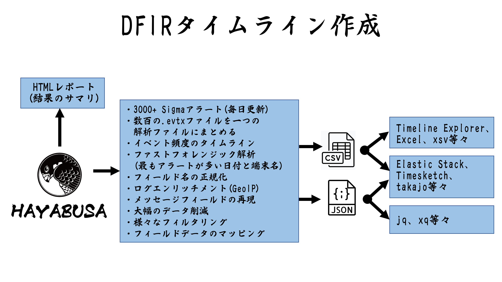
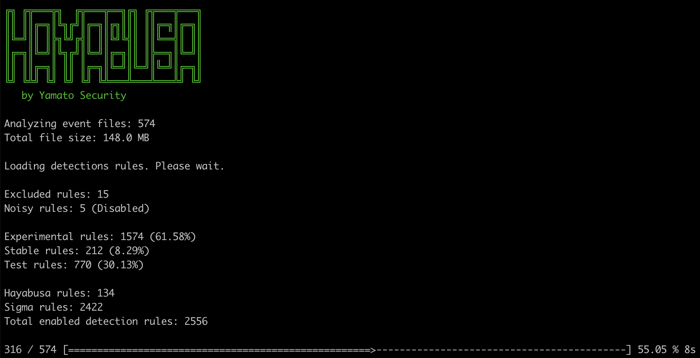
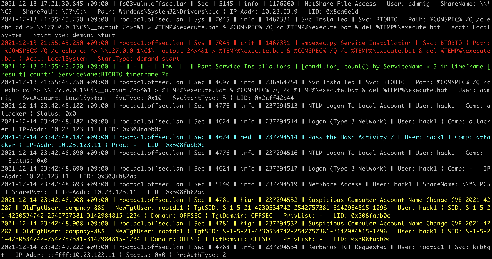
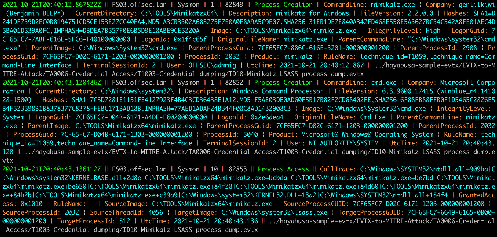
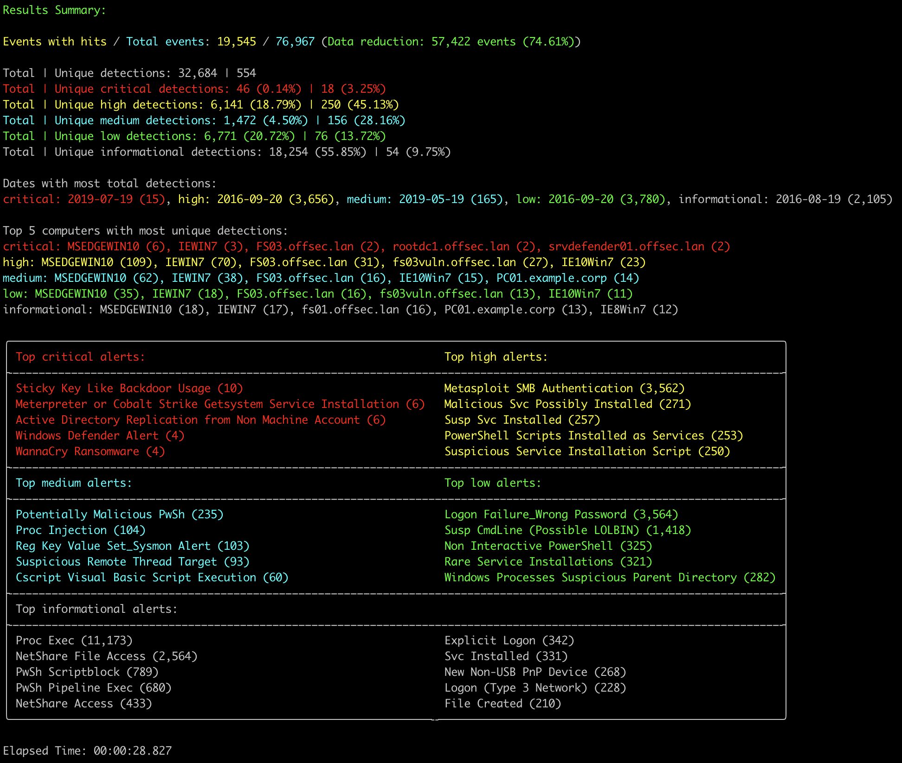
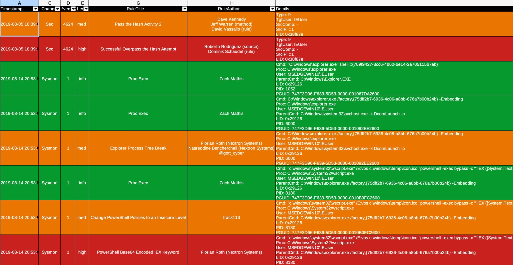

<div align="center">
 <p>
    
 </p>
  [<a href="README.md">English</a>] | [<b>日本語</b>]
</div>

---

<p align="center">
    <a href="https://github.com/Yamato-Security/hayabusa/releases"></a>
    <a href="https://github.com/Yamato-Security/hayabusa/releases"></a>
    <a href="https://github.com/Yamato-Security/hayabusa/stargazers"></a>
    <a href="https://github.com/Yamato-Security/hayabusa/graphs/contributors"></a>
    <a href="https://www.blackhat.com/asia-22/arsenal/schedule/#hayabusa-26211"></a>
    <a href="https://codeblue.jp/2022/en/talks/?content=talks_24"></a>
    <a href="https://www.seccon.jp/2022/seccon_workshop/windows.html"></a>
    <a href="https://www.security-camp.or.jp/minicamp/tokyo2023.html"></a>
    <a href="https://www.sans.org/cyber-security-training-events/digital-forensics-summit-2023/"></a>
    <a href=""></a>
    <a href="https://rust-reportcard.xuri.me/report/github.com/Yamato-Security/hayabusa"></a>
    <a href="https://codecov.io/gh/Yamato-Security/hayabusa" ></a>
    <a href="https://twitter.com/SecurityYamato"></a>
</p>

# Hayabusa について

Hayabusaは、日本の[Yamato Security](https://yamatosecurity.connpass.com/)グループによって作られた**Windowsイベントログのファストフォレンジックタイムライン作成**および**脅威ハンティングツール**です。 Hayabusaは日本語で[「ハヤブサ」](https://ja.wikipedia.org/wiki/%E3%83%8F%E3%83%A4%E3%83%96%E3%82%B5)を意味し、ハヤブサが世界で最も速く、狩猟(hunting)に優れ、とても訓練しやすい動物であることから選ばれました。[Rust](https://www.rust-lang.org/) で開発され、マルチスレッドに対応し、可能な限り高速に動作するよう配慮されています。[Sigma](https://github.com/SigmaHQ/Sigma)ルールをHayabusaルール形式に変換する[ツール](https://github.com/Yamato-Security/hayabusa-rules/tree/main/tools/sigmac)も提供しています。Hayabusaの検知ルールもSigmaと同様にYML形式であり、カスタマイズ性や拡張性に優れます。稼働中のシステムで実行してライブ調査することも、複数のシステムからログを収集してオフライン調査することも可能です。また、 [Velociraptor](https://docs.velociraptor.app/)と[Hayabusa artifact](https://docs.velociraptor.app/exchange/artifacts/pages/windows.eventlogs.hayabusa/)を用いることで企業向けの広範囲なスレットハンティングとインシデントレスポンスにも活用できます。出力は一つのCSVタイムラインにまとめられ、[LibreOffice](https://www.libreoffice.org/)、[Timeline Explorer](https://ericzimmerman.github.io/#!index.md)、[Elastic Stack](doc/ElasticStackImport/ElasticStackImport-Japanese.md)、[Timesketch](https://timesketch.org/)等で簡単に分析できるようになります。

# 関連プロジェクト

* [EnableWindowsLogSettings](https://github.com/Yamato-Security/EnableWindowsLogSettings) - Sigmaベースの脅威ハンティングと、Windowsイベントログのファストフォレンジックタイムライン生成ツール。
* [Hayabusa Rules](https://github.com/Yamato-Security/hayabusa-rules/blob/main/README-Japanese.md) - Hayabusaのための検知ルール。
* [Hayabusa Sample EVTXs](https://github.com/Yamato-Security/hayabusa-sample-evtx) - Hayabusa/Sigma検出ルールをテストするためのサンプルevtxファイル。
* [Takajo](https://github.com/Yamato-Security/takajo/blob/main/README-Japanese.md) - Hayabusa結果の解析ツール。
* [WELA (Windows Event Log Analyzer)](https://github.com/Yamato-Security/WELA/blob/main/README-Japanese.md) - PowerShellで書かれたWindowsイベントログの解析ツール。

## 目次

- [Hayabusa について](#hayabusa-について)
- [関連プロジェクト](#関連プロジェクト)
  - [目次](#目次)
  - [主な目的](#主な目的)
    - [スレット(脅威)ハンティングと企業向けの広範囲なDFIR](#スレット脅威ハンティングと企業向けの広範囲なdfir)
    - [フォレンジックタイムラインの高速生成](#フォレンジックタイムラインの高速生成)
- [スクリーンショット](#スクリーンショット)
  - [起動](#起動)
  - [DFIRタイムラインのターミナル出力](#dfirタイムラインのターミナル出力)
  - [キーワード検索結果](#キーワード検索結果)
  - [検知頻度タイムライン出力 (`-T`オプション)](#検知頻度タイムライン出力--tオプション)
  - [結果サマリ (Results Summary)](#結果サマリ-results-summary)
  - [HTMLの結果サマリ (`-H`オプション)](#htmlの結果サマリ--hオプション)
  - [LibreOfficeでのDFIRタイムライン解析 (`-M` マルチライン出力)](#libreofficeでのdfirタイムライン解析--m-マルチライン出力)
  - [Timeline ExplorerでのDFIRタイムライン解析](#timeline-explorerでのdfirタイムライン解析)
  - [Criticalアラートのフィルタリングとコンピュータごとのグルーピング](#criticalアラートのフィルタリングとコンピュータごとのグルーピング)
  - [Elastic Stackダッシュボードでの解析](#elastic-stackダッシュボードでの解析)
  - [Timesketchでの解析](#timesketchでの解析)
- [タイムライン結果のインポートと解析について](#タイムライン結果のインポートと解析について)
- [jqによるJSON形式の結果の解析](#jqによるjson形式の結果の解析)
- [特徴＆機能](#特徴機能)
- [ダウンロード](#ダウンロード)
- [Gitクローン](#gitクローン)
- [アドバンス: ソースコードからのコンパイル（任意）](#アドバンス-ソースコードからのコンパイル任意)
  - [Rustパッケージの更新](#rustパッケージの更新)
  - [32ビットWindowsバイナリのクロスコンパイル](#32ビットwindowsバイナリのクロスコンパイル)
  - [macOSでのコンパイルの注意点](#macosでのコンパイルの注意点)
  - [Linuxでのコンパイルの注意点](#linuxでのコンパイルの注意点)
  - [LinuxのMUSLバイナリのクロスコンパイル](#linuxのmuslバイナリのクロスコンパイル)
- [Hayabusaの実行](#hayabusaの実行)
  - [スキャンウィザード](#スキャンウィザード)
    - [Core ルール](#core-ルール)
    - [Core+ ルール](#core-ルール-1)
    - [Core++ ルール](#core-ルール-2)
    - [Emerging Threats (ET) アドオンルール](#emerging-threats-et-アドオンルール)
    - [Threat Hunting (TH) アドオンルール](#threat-hunting-th-アドオンルール)
  - [注意: アンチウィルス/EDRの誤検知と遅い初回実行](#注意-アンチウィルスedrの誤検知と遅い初回実行)
  - [Windows](#windows)
    - [パスにスペースが含まれるファイルまたはディレクトリをスキャンしようとするとエラーが発生した場合](#パスにスペースが含まれるファイルまたはディレクトリをスキャンしようとするとエラーが発生した場合)
  - [Linux](#linux)
  - [macOS](#macos)
- [コマンド一覧](#コマンド一覧)
  - [分析コマンド:](#分析コマンド)
  - [DFIRタイムライン作成のコマンド:](#dfirタイムライン作成のコマンド)
  - [汎用コマンド:](#汎用コマンド)
- [コマンド使用方法](#コマンド使用方法)
  - [分析コマンド](#分析コマンド-1)
    - [`computer-metrics`コマンド](#computer-metricsコマンド)
      - [`computer-metrics`コマンドの使用例](#computer-metricsコマンドの使用例)
    - [`eid-metrics`コマンド](#eid-metricsコマンド)
      - [`eid-metrics`コマンドの使用例](#eid-metricsコマンドの使用例)
      - [`eid-metrics`コマンドの設定ファイル](#eid-metricsコマンドの設定ファイル)
    - [`logon-summary`コマンド](#logon-summaryコマンド)
      - [`logon-summary`コマンドの使用例](#logon-summaryコマンドの使用例)
    - [`pivot-keywords-list`コマンド](#pivot-keywords-listコマンド)
      - [`pivot-keywords-list`コマンドの使用例](#pivot-keywords-listコマンドの使用例)
      - [`pivot-keywords-list`の設定ファイル](#pivot-keywords-listの設定ファイル)
    - [`search`コマンド](#searchコマンド)
      - [`search`コマンドの使用例](#searchコマンドの使用例)
      - [`search`の設定ファイル](#searchの設定ファイル)
  - [DFIRタイムラインコマンド](#dfirタイムラインコマンド)
    - [`csv-timeline`コマンド](#csv-timelineコマンド)
      - [`csv-timeline`コマンドの使用例](#csv-timelineコマンドの使用例)
      - [アドバンス - GeoIPのログエンリッチメント](#アドバンス---geoipのログエンリッチメント)
        - [GeoIPの設定ファイル](#geoipの設定ファイル)
        - [GeoIPデータベースの自動アップデート](#geoipデータベースの自動アップデート)
      - [`csv-timeline`コマンドの設定ファイル](#csv-timelineコマンドの設定ファイル)
    - [`json-timeline`コマンド](#json-timelineコマンド)
      - [`json-timeline`コマンドの使用例と設定ファイル](#json-timelineコマンドの使用例と設定ファイル)
    - [`level-tuning`コマンド](#level-tuningコマンド)
      - [`level-tuning`コマンドの使用例](#level-tuningコマンドの使用例)
      - [`level-tuning`の設定ファイル](#level-tuningの設定ファイル)
    - [`list-profiles`コマンド](#list-profilesコマンド)
    - [`set-default-profile`コマンド](#set-default-profileコマンド)
      - [`set-default-profile`コマンドの使用例](#set-default-profileコマンドの使用例)
  - [`update-rules`コマンド](#update-rulesコマンド)
    - [`update-rules`コマンドの使用例](#update-rulesコマンドの使用例)
- [タイムライン出力](#タイムライン出力)
  - [出力プロファイル](#出力プロファイル)
    - [1. `minimal`プロファイルの出力](#1-minimalプロファイルの出力)
    - [2. `standard`プロファイルの出力](#2-standardプロファイルの出力)
    - [3. `verbose`プロファイルの出力](#3-verboseプロファイルの出力)
    - [4. `all-field-info`プロファイルの出力](#4-all-field-infoプロファイルの出力)
    - [5. `all-field-info-verbose`プロファイルの出力](#5-all-field-info-verboseプロファイルの出力)
    - [6. `super-verbose`プロファイルの出力](#6-super-verboseプロファイルの出力)
    - [7. `timesketch-minimal`プロファイルの出力](#7-timesketch-minimalプロファイルの出力)
    - [8. `timesketch-verbose`プロファイルの出力](#8-timesketch-verboseプロファイルの出力)
    - [プロファイルの比較](#プロファイルの比較)
    - [プロファイルのフィールドエイリアス](#プロファイルのフィールドエイリアス)
      - [その他のプロファイルのフィールドエイリアス](#その他のプロファイルのフィールドエイリアス)
  - [Levelの省略](#levelの省略)
  - [MITRE ATT\&CK戦術の省略](#mitre-attck戦術の省略)
  - [Channel情報の省略](#channel情報の省略)
- [その他の省略](#その他の省略)
  - [プログレスバー](#プログレスバー)
  - [カラー出力](#カラー出力)
  - [結果のサマリ (Results Summary)](#結果のサマリ-results-summary)
    - [検知頻度タイムライン](#検知頻度タイムライン)
- [Hayabusaルール](#hayabusaルール)
  - [Sigma v.s. Hayabusa(ビルトインSigmaとの互換性のある)ルール](#sigma-vs-hayabusaビルトインsigmaとの互換性のあるルール)
- [その他のWindowsイベントログ解析ツールおよび関連リソース](#その他のwindowsイベントログ解析ツールおよび関連リソース)
- [Windowsイベントログ設定のススメ](#windowsイベントログ設定のススメ)
- [Sysmon関係のプロジェクト](#sysmon関係のプロジェクト)
- [コミュニティによるドキュメンテーション](#コミュニティによるドキュメンテーション)
  - [英語](#英語)
  - [日本語](#日本語)
- [貢献](#貢献)
- [バグの報告](#バグの報告)
- [ライセンス](#ライセンス)
- [Twitter](#twitter)

## 主な目的

### スレット(脅威)ハンティングと企業向けの広範囲なDFIR

Hayabusaには現在、2500以上のSigmaルールと150以上のHayabusa検知ルールがあり、定期的にルールが追加されています。
[Velociraptor](https://docs.velociraptor.app/)の[Hayabusa artifact](https://docs.velociraptor.app/exchange/artifacts/pages/windows.eventlogs.hayabusa/)を用いることで企業向けの広範囲なスレットハンティングだけでなくDFIR(デジタルフォレンジックとインシデントレスポンス)にも無料で利用することが可能です。
この2つのオープンソースを組み合わせることで、SIEMが設定されていない環境でも実質的に遡及してSIEMを再現することができます。
具体的な方法は[Eric Capuano](https://twitter.com/eric_capuano)の[こちら](https://www.youtube.com/watch?v=Q1IoGX--814)の動画で学ぶことができます。

### フォレンジックタイムラインの高速生成

Windowsのイベントログは、1）解析が困難なデータ形式であること、2）データの大半がノイズであり調査に有用でないことから、従来は非常に長い時間と手間がかかる解析作業となっていました。
Hayabusaは、有用なデータのみを抽出し、専門的なトレーニングを受けた分析者だけでなく、Windowsのシステム管理者であれば誰でも利用できる読みやすい形式で提示することを主な目的としています。
Hayabusaは従来のWindowsイベントログ分析解析と比較して、分析者が20%の時間で80%の作業を行えるようにすることを目指しています。



# スクリーンショット

## 起動



## DFIRタイムラインのターミナル出力



## キーワード検索結果



## 検知頻度タイムライン出力 (`-T`オプション)


## 結果サマリ (Results Summary)



## HTMLの結果サマリ (`-H`オプション)


## LibreOfficeでのDFIRタイムライン解析 (`-M` マルチライン出力)



## Timeline ExplorerでのDFIRタイムライン解析


## Criticalアラートのフィルタリングとコンピュータごとのグルーピング


## Elastic Stackダッシュボードでの解析


## Timesketchでの解析


# タイムライン結果のインポートと解析について

CSVのタイムラインをExcelやTimeline Explorerで分析する方法は[こちら](doc/CSV-AnalysisWithExcelAndTimelineExplorer-Japanese.pdf)で紹介しています。

CSVのタイムラインをElastic Stackにインポートする方法は[こちら](doc/ElasticStackImport/ElasticStackImport-Japanese.md)で紹介しています。

CSVのタイムラインをTimesketchにインポートする方法は[こちら](doc/TimesketchImport/TimesketchImport-Japanese.md)で紹介しています。

# jqによるJSON形式の結果の解析

JSON形式の結果を`jq`で解析する方法については、[こちら](/doc/AnalysisWithJQ-Japanese.md)を参照してください。

# 特徴＆機能

* クロスプラットフォーム対応: Windows, Linux, macOS。
* Rustで開発され、メモリセーフでハヤブサよりも高速です！
* マルチスレッド対応により、最大5倍のスピードアップを実現。
* フォレンジック調査やインシデントレスポンスのために、分析しやすいCSVタイムラインを作成します。
* 読みやすい/作成/編集可能なYMLベースのHayabusaルールで作成されたIoCシグネチャに基づくスレットハンティング。
* SigmaルールをHayabusaルールに変換するためのSigmaルールのサポートがされています。
* 現在、他の類似ツールに比べ最も多くのSigmaルールをサポートしており、カウントルール、新しい機能の`|equalsfield`や`|endswithfield`等にも対応しています。
* コンピュータ名の統計。(イベントの多い特定のコンピュータをフィルタリングするのに便利です。)
* イベントログの統計。(どのような種類のイベントがあるのかを把握し、ログ設定のチューニングに有効です。)
* 不良ルールやノイズの多いルールを除外するルールチューニング設定が可能です。
* MITRE ATT&CKとのマッピング。
* ルールレベルのチューニング。
* イベントログから不審なユーザやファイルを素早く特定するためのピボットキーワードの一覧作成。
* 詳細な調査のために全フィールド情報の出力。
* 成功と失敗したユーザログオンの要約。
* [Velociraptor](https://docs.velociraptor.app/)と組み合わせた企業向けの広範囲なすべてのエンドポイントに対するスレットハンティングとDFIR。
* CSV、JSON、JSONL形式とHTML結果サマリの出力。
* 毎日のSigmaルール更新。
* JSON形式のログ入力にも対応。
* ログフィールドの正規化
* IPアドレスにGeoIP（ASN、都市、国）情報を付加することによるログエンリッチメント。
* キーワードや正規表現で全イベントの検索。
* フィールドデータのマッピング (例: `0xc0000234` -> `ACCOUNT LOCKED`)
* 空領域からのEvtxレコードカービング。
* 出力時のイベント重複排除。(レコード復元が有効になっている場合や、バックアップされたevtxファイル、VSSから抽出されたevtxファイルなどが含まれている場合に便利。)
* スキャン設定ウィザードにより、有効にするルールの選択が容易に。(誤検出を減らすためなど。）
* PowerShell classicログのフィールドパースと抽出。

# ダウンロード

[Releases](https://github.com/Yamato-Security/hayabusa/releases)ページからHayabusaの安定したバージョンでコンパイルされたバイナリが含まれている最新版もしくはソースコードをダウンロードできます。

# Gitクローン

以下の`git clone`コマンドでレポジトリをダウンロードし、ソースコードからコンパイルして使用することも可能です：

```bash
git clone https://github.com/Yamato-Security/hayabusa.git --recursive
```

> **注意：** mainブランチは開発中のバージョンです。まだ正式にリリースされていない新機能が使えるかもしれないが、バグがある可能性もあるので、テスト版だと思って下さい。

※ `--recursive`をつけ忘れた場合、サブモジュールとして管理されている`rules`フォルダ内のファイルはダウンロードされません。

`git pull --recurse-submodules`コマンド、もしくは以下のコマンドで`rules`フォルダを同期し、Hayabusaの最新のルールを更新することができます:

```bash
hayabusa.exe update-rules
```

アップデートが失敗した場合は、`rules`フォルダの名前を変更してから、もう一回アップデートしてみて下さい。

>> 注意: アップデートを実行する際に `rules` フォルダは [hayabusa-rules](https://github.com/Yamato-Security/hayabusa-rules) レポジトリの最新のルールとコンフィグファイルに置き換えられます
>> 既存ファイルへの修正はすべて上書きされますので、アップデート実行前に編集したファイルのバックアップをおすすめします。
>> もし、`level-tuning` を行っているのであれば、アップデート後にルールファイルの再調整をしてください
>> `rules`フォルダ内に新しく追加したルールは、アップデート時に上書きもしくは削除は行われません。

# アドバンス: ソースコードからのコンパイル（任意）

Rustがインストールされている場合、以下のコマンドでソースコードからコンパイルすることができます:

注意: hayabusaをコンパイルするためにはRust(rustc)が最新版であることが必要です。

```bash
cargo build --release
```

最新のunstable版はmainブランチから、最新の安定版は[Releases](https://github.com/Yamato-Security/hayabusa/releases)ページからダウンロードできます。

以下のコマンドで定期的にRustをアップデートしてください：

```bash
rustup update stable
```

コンパイルされたバイナリは`target/release`フォルダ配下で作成されます。

## Rustパッケージの更新

コンパイル前に最新のRust crateにアップデートすることで、最新のライブラリを利用することができます:

```bash
cargo update
```

> アップデート後、何か不具合がありましたらお知らせください。

## 32ビットWindowsバイナリのクロスコンパイル

以下のコマンドで64ビットのWindows端末で32ビットのバイナリをクロスコンパイルできます:

```bash
rustup install stable-i686-pc-windows-msvc
rustup target add i686-pc-windows-msvc
rustup run stable-i686-pc-windows-msvc cargo build --release
```

> **注意: Rust の新しい安定版が出たときには必ず`rustup install stable-i686-pc-windows-msvc`を実行してください。`rustup update stable` はクロスコンパイル用のコンパイラを更新しないので、ビルドエラーが発生することがあります。**

## macOSでのコンパイルの注意点

opensslについてのコンパイルエラーが表示される場合は、[Homebrew](https://brew.sh/)をインストールしてから、以下のパッケージをインストールする必要があります：

```bash
brew install pkg-config
brew install openssl
```

## Linuxでのコンパイルの注意点

opensslについてのコンパイルエラーが表示される場合は、以下のパッケージをインストールする必要があります。

Ubuntu系のディストロ:

```bash
sudo apt install libssl-dev
```

Fedora系のディストロ:

```bash
sudo yum install openssl-devel
```

## LinuxのMUSLバイナリのクロスコンパイル

まず、Linux OSでターゲットをインストールします。

```bash
rustup install stable-x86_64-unknown-linux-musl
rustup target add x86_64-unknown-linux-musl
```

以下のようにコンパイルします:

```bash
cargo build --release --target=x86_64-unknown-linux-musl
```

> **注意: Rust の新しい安定版が出たときには必ず`rustup install stable-x86_64-unknown-linux-musl`を実行してください。`rustup update stable` はクロスコンパイル用のコンパイラを更新しないので、ビルドエラーが発生することがあります。**

MUSLバイナリは`./target/x86_64-unknown-linux-musl/release/`ディレクトリ配下に作成されます。
MUSLバイナリはGNUバイナリより約15％遅いですが、より多くのLinuxバージョンとディストロで実行できます。

# Hayabusaの実行

## スキャンウィザード

`csv-timeline`や`json-timeline`などのコマンドは、デフォルトでスキャンウィザードが有効になりました。
これは、ユーザのニーズや好みに応じて、どの検知ルールを有効にするかを簡単に選択できるようにするためのものであります。
読み込む検知ルールのセットは、Sigmaプロジェクトの公式リストに基づいています。
詳細は[このブログ記事](https://blog.sigmahq.io/introducing-sigma-rule-packages-releases-76043ce42e81)で説明されています。
`w, --no-wizard`オプションを追加することで、簡単にウィザードを無効にし、従来の方法でHayabusaを使用できます。

### Core ルール

`core`ルールセットは、ステータスが`test`または`stable`かつ、レベルが`high`または`critical`のルールを有効にします。
これらは高品質のルールで、多くの誤検知は発生しないはずです。
ルールのステータスが`test`または`stable`であるため、6ヶ月以上の間に誤検知が報告されていません。
ルールは攻撃者の戦術、一般的な不審なアクティビティ、または悪意のある振る舞いに一致します。
これは`--exclude-status deprecated,unsupported,experimental --min-level high`オプションを使用した場合と同じです。

### Core+ ルール

`core+`ルールセットは、ステータスが`test`または`stable`かつ、レベルが`medium`以上のルールを有効にします。
`medium`ルールは、しばしば特定のアプリケーション、正当なユーザーの行動、または組織のスクリプトと一致するため、追加のチューニングが必要です。
これは`--exclude-status deprecated,unsupported,experimental --min-level medium`オプションを使用した場合と同じです。

### Core++ ルール

`core++`ルールセットは、ステータスが`experimental`、`test`、`stable`のいずれかかつ、レベルが`medium`以上のルールを有効にします。
これらのルールは最先端のものです。
これらはSigmaHQプロジェクトで提供されているベースラインのevtxファイルに対して検証され、複数のエンジニアによってレビューされています。
それ以外最初は、ほとんどテストされていません。
これらは、できるだけ早く脅威を検出できる場合に使用しますが、誤検知のしきい値を高く保つのにコストがかかります。
これは`--exclude-status deprecated,unsupported --min-level medium`オプションを使用した場合と同じです。

### Emerging Threats (ET) アドオンルール

`Emerging Threats (ET)`ルールセットは、`detection.emerging_threats`のタグを持つルールを有効にします。
これらのルールは特定の脅威を対象とし、情報がまだほとんど入手できていない現在の脅威に特に役立ちます。
これらのルールは多くの誤検知を生成しないはずですが、時間とともに関連性が低下します。
これらのルールが無効になっている場合、`--exclude-tag detection.emerging_threats`オプションを使用した場合と同じです。
ウィザードを無効にしてHayabusaを従来の方法で実行する場合、これらのルールはデフォルトで含まれます。

### Threat Hunting (TH) アドオンルール

`Threat Hunting (TH)`ルールセットは、`detection.threat_hunting`のタグを持つルールを有効にします。
これらのルールは未知の悪意のあるアクティビティを検出するかもしれませんが、通常は誤検知が多くなります。
これらのルールが無効になっている場合、`--exclude-tag detection.threat_hunting`オプションを使用した場合と同じです。
ウィザードを無効にしてHayabusaを従来の方法で実行する場合、これらのルールはデフォルトで含まれます。

## 注意: アンチウィルス/EDRの誤検知と遅い初回実行

Hayabusa実行する際や、`.yml`ルールのダウンロードや実行時にルール内でdetectionに不審なPowerShellコマンドや`mimikatz`のようなキーワードが書かれている際に、アンチウィルスやEDRにブロックされる可能性があります。
誤検知のため、セキュリティ対策の製品がHayabusaを許可するように設定する必要があります。
マルウェア感染が心配であれば、ソースコードを確認した上で、自分でバイナリをコンパイルして下さい。

Windows PC起動後の初回実行時に時間がかかる場合があります。
これはWindows Defenderのリアルタイムスキャンが行われていることが原因です。
リアルタイムスキャンを無効にするかHayabusaのディレクトリをアンチウィルススキャンから除外することでこの現象は解消しますが、設定を変える前にセキュリティリスクを十分ご考慮ください。

## Windows

コマンドプロンプトやWindows Terminalから32ビットもしくは64ビットのWindowsバイナリをHayabusaのルートディレクトリから実行します。

### パスにスペースが含まれるファイルまたはディレクトリをスキャンしようとするとエラーが発生した場合

Windowsに組み込まれているコマンドプロンプトまたはPowerShellプロンプトを使用する場合、ファイルまたはディレクトリのパスに空白があると、.evtxファイルをロードできないというエラーが表示されることがあります。
.evtxファイルを正しくロードするために、以下のことを行ってください:
1. ファイルまたはディレクトリのパスをダブルクォートで囲む。
2. ディレクトリパスの場合は、最後の文字にバックスラッシュを入れない。

## Linux

まず、バイナリに実行権限を与える必要があります。

```bash
chmod +x ./hayabusa
```

次に、Hayabusaのルートディレクトリから実行します：

```bash
./hayabusa
```

## macOS

まず、ターミナルやiTerm2からバイナリに実行権限を与える必要があります。

```bash
chmod +x ./hayabusa
```

次に、Hayabusaのルートディレクトリから実行してみてください：

```bash
./hayabusa
```

macOSの最新版では、以下のセキュリティ警告が出る可能性があります：


macOSの環境設定から「セキュリティとプライバシー」を開き、「一般」タブから「このまま許可」ボタンをクリックしてください。


その後、ターミナルからもう一回実行してみてください：

```bash
./hayabusa
```

以下の警告が出るので、「開く」をクリックしてください。


これで実行できるようになります。

# コマンド一覧

## 分析コマンド:
* `computer-metrics`: コンピュータ名に基づくイベントの合計を出力する。
* `eid-metrics`: イベントIDに基づくイベントの合計と割合の集計を出力する。
* `logon-summary`: ログオンイベントのサマリを出力する。
* `pivot-keywords-list`: ピボットする不審なキーワードのリストを作成する。
* `search`: キーワードや正規表現で全イベントの検索。

## DFIRタイムライン作成のコマンド:
* `csv-timeline`: CSV形式のタイムラインを出力する。
* `json-timeline`: JSON/JSONL形式のタイムラインを出力する。
* `level-tuning`: アラート`level`のカスタムチューニング。
* `list-profiles`: 出力プロファイルの一覧表示。
* `set-default-profile`: デフォルトプロファイルを変更する。
* `update-rules`: GitHubの[hayabusa-rules](https://github.com/Yamato-Security/hayabusa-rules)リポジトリにある最新のルールに同期させる。

## 汎用コマンド:
* `help`: このメッセージまたは指定されたコマンドのヘルプを表示する。
* `list-contributors`: コントリビュータ一覧の表示

# コマンド使用方法

## 分析コマンド

### `computer-metrics`コマンド

`computer-metrics`コマンドを使用すると、イベントIDの総数や割合をチャンネルごとに分けて表示することができます。

```
Usage: computer-metrics <INPUT> [OPTIONS]

Input:
  -d, --directory <DIR>        .evtxファイルを持つディレクトリのパス
  -f, --file <FILE>            1つの.evtxファイルに対して解析を行う
  -l, --live-analysis          ローカル端末のC:\Windows\System32\winevt\Logsフォルダを解析する
  -J, --JSON-input             .evtxファイルの代わりにJSON形式のログファイル(.jsonまたは.jsonl)をスキャンする
  -x, --recover-records        空ページからevtxレコードをカービングする (デフォルト: 無効)

Filtering:
      --timeline-offset <OFFSET>  オフセットに基づく最近のイベントのスキャン (例: 1y, 3M, 30d, 24h, 30m)

Output:
  -o, --output <FILE>       イベントIDに基づくイベントの合計と割合の集計を出力する (例: computer-metrics.csv)

Display Settings:
      --no-color       カラーで出力しない
  -q, --quiet          Quietモード: 起動バナーを表示しない
  -v, --verbose        詳細な情報を出力する

General Options:
  -C, --clobber                          結果ファイルを上書きする
  -Q, --quiet-errors                     Quiet errorsモード: エラーログを保存しない
  -c, --rules-config <DIR>               ルールフォルダのコンフィグディレクトリ (デフォルト: ./rules/config)
      --target-file-ext <FILE-EXT...>  evtx以外の拡張子を解析対象に追加する。 (例１: evtx_data 例２: evtx1,evtx2)
  -t, --threads <NUMBER>                 スレッド数 (デフォルト: パフォーマンスに最適な数値)
```

#### `computer-metrics`コマンドの使用例

* ディレクトリに対してイベントIDの統計情報を出力する: `hayabusa.exe computer-metrics -d ../logs`
* 結果をCSVファイルに保存する: `hayabusa.exe computer-metrics -d ../logs -o computer-metrics.csv`


### `eid-metrics`コマンド

`eid-metrics`コマンドを使用すると、イベントIDの総数や割合をチャンネルごとに分けて表示することができます。

```
Usage: eid-metrics <INPUT> [OPTIONS]

Input:
  -d, --directory <DIR>        .evtxファイルを持つディレクトリのパス
  -f, --file <FILE>            1つの.evtxファイルに対して解析を行う
  -l, --live-analysis          ローカル端末のC:\Windows\System32\winevt\Logsフォルダを解析する
  -J, --JSON-input             .evtxファイルの代わりにJSON形式のログファイル(.jsonまたは.jsonl)をスキャンする
  -x, --recover-records        空ページからevtxレコードをカービングする (デフォルト: 無効)

Filtering:
      --exclude-computer <COMPUTER...>  特定のコンピュータ名をスキャンしない (例: ComputerA) (例: ComputerA,ComputerB)
      --include-computer <COMPUTER...>  特定のコンピュータ名のみをスキャンする (例: ComputerA) (例: ComputerA,ComputerB)
      --timeline-offset <OFFSET>        オフセットに基づく最近のイベントのスキャン (例: 1y, 3M, 30d, 24h, 30m)

Output:
  -o, --output <FILE>       イベントIDに基づくイベントの合計と割合の集計を出力する (例: eid-metrics.csv)

Display Settings:
      --no-color       カラーで出力しない
  -q, --quiet          Quietモード: 起動バナーを表示しない
  -v, --verbose        詳細な情報を出力する

General Options:
  -C, --clobber                          結果ファイルを上書きする
  -Q, --quiet-errors                     Quiet errorsモード: エラーログを保存しない
  -c, --rules-config <DIR>               ルールフォルダのコンフィグディレクトリ (デフォルト: ./rules/config)
      --target-file-ext <FILE-EXT...>    evtx以外の拡張子を解析対象に追加する。 (例１: evtx_data 例２: evtx1,evtx2)
  -t, --threads <NUMBER>                 スレッド数 (デフォルト: パフォーマンスに最適な数値)

Time Format:
      --European-time     ヨーロッパ形式で日付と時刻を出力する (例: 22-02-2022 22:00:00.123 +02:00)
      --ISO-8601          ISO-8601形式で日付と時刻を出力する (例: 2022-02-22T10:10:10.1234567Z) (UTC時刻)
      --RFC-2822          RFC 2822形式で日付と時刻を出力する (例: Fri, 22 Feb 2022 22:00:00 -0600)
      --RFC-3339          RFC 3339形式で日付と時刻を出力する (例: 2022-02-22 22:00:00.123456-06:00)
      --US-military-time  24時間制(ミリタリータイム)のアメリカ形式で日付と時刻を出力する (例: 02-22-2022 22:00:00.123 -06:00)
      --US-time           アメリカ形式で日付と時刻を出力する (例: 02-22-2022 10:00:00.123 PM -06:00)
  -U, --UTC               UTC形式で日付と時刻を出力する (デフォルト: 現地時間)
```

#### `eid-metrics`コマンドの使用例

* 一つのファイルに対してイベントIDの統計情報を出力する: `hayabusa.exe eid-metrics -f Security.evtx`
* ディレクトリに対してイベントIDの統計情報を出力する: `hayabusa.exe eid-metrics -d ../logs`
* 結果をCSVファイルに保存する: `hayabusa.exe eid-metrics -f Security.evtx -o eid-metrics.csv`

#### `eid-metrics`コマンドの設定ファイル

チャンネル名、イベントID、イベントのタイトルは、`rules/config/channel_eid_info.txt`で定義されています。

例:
```
Channel,EventID,EventTitle
Microsoft-Windows-Sysmon/Operational,1,Process Creation.
Microsoft-Windows-Sysmon/Operational,2,File Creation Timestamp Changed. (Possible Timestomping)
Microsoft-Windows-Sysmon/Operational,3,Network Connection.
Microsoft-Windows-Sysmon/Operational,4,Sysmon Service State Changed.
```


### `logon-summary`コマンド

`logon-summary`コマンドを使うことでログオン情報の要約(ユーザ名、ログイン成功数、ログイン失敗数)の画面出力ができます。
単体のevtxファイルを解析したい場合は`-f`オプションを利用してください。複数のevtxファイルを対象としたい場合は`-d`オプションを合わせて使うことでevtxファイルごとのログイン情報の要約を出力できます。

```
Usage: logon-summary <INPUT> [OPTIONS]

Input:
  -d, --directory <DIR>        .evtxファイルを持つディレクトリのパス
  -f, --file <FILE>            1つの.evtxファイルに対して解析を行う
  -l, --live-analysis          ローカル端末のC:\Windows\System32\winevt\Logsフォルダを解析する
  -J, --JSON-input             .evtxファイルの代わりにJSON形式のログファイル(.jsonまたは.jsonl)をスキャンする
  -x, --recover-records        空ページからevtxレコードをカービングする (デフォルト: 無効)

Filtering:
      --exclude-computer <COMPUTER...>  特定のコンピュータ名をスキャンしない (例: ComputerA) (例: ComputerA,ComputerB)
      --include-computer <COMPUTER...>  特定のコンピュータ名のみをスキャンする (例: ComputerA) (例: ComputerA,ComputerB)
      --timeline-end <DATE>             解析対象とするイベントログの終了時刻 (例: "2022-02-22 23:59:59 +09:00")
      --timeline-offset <OFFSET>        オフセットに基づく最近のイベントのスキャン (例: 1y, 3M, 30d, 24h, 30m)
      --timeline-start <DATE>           解析対象とするイベントログの開始時刻 (例: "2020-02-22 00:00:00 +09:00")

Output:
  -o, --output <FILENAME-PREFIX>  ログオンサマリをCSV形式で２つのファイルに保存する (例: -o logon-summary.csv)

Display Settings:
      --no-color            カラーで出力しない
  -q, --quiet               Quietモード: 起動バナーを表示しない
  -v, --verbose             詳細な情報を出力する

General Options:
  -C, --clobber                          結果ファイルを上書きする
  -Q, --quiet-errors                     Quiet errorsモード: エラーログを保存しない
  -c, --rules-config <DIR>               ルールフォルダのコンフィグディレクトリ (デフォルト: ./rules/config)
      --target-file-ext <FILE-EXT...>    evtx以外の拡張子を解析対象に追加する (例１: evtx_data 例２:evtx1,evtx2)
  -t, --threads <NUMBER>                 スレッド数 (デフォルト: パフォーマンスに最適な数値)

Time Format:
      --European-time     ヨーロッパ形式で日付と時刻を出力する (例: 22-02-2022 22:00:00.123 +02:00)
      --ISO-8601          ISO-8601形式で日付と時刻を出力する (例: 2022-02-22T10:10:10.1234567Z) (UTC時刻)
      --RFC-2822          RFC 2822形式で日付と時刻を出力する (例: Fri, 22 Feb 2022 22:00:00 -0600)
      --RFC-3339          RFC 3339形式で日付と時刻を出力する (例: 2022-02-22 22:00:00.123456-06:00)
      --US-military-time  24時間制(ミリタリータイム)のアメリカ形式で日付と時刻を出力する (例: 02-22-2022 22:00:00.123 -06:00)
      --US-time           アメリカ形式で日付と時刻を出力する (例: 02-22-2022 10:00:00.123 PM -06:00)
  -U, --UTC               UTC形式で日付と時刻を出力する (デフォルト: 現地時間)
```

#### `logon-summary`コマンドの使用例

* ログオンサマリの出力: `hayabusa.exe logon-summary -f Security.evtx`
* ログオンサマリ結果を保存する: `hayabusa.exe logon-summary -d ../logs -o logon-summary.csv`


### `pivot-keywords-list`コマンド

`pivot-keywords-list`コマンドを使用すると、異常なユーザ、ホスト名、プロセスなどを迅速に特定し、イベントを関連付けるための固有のピボットキーワードのリストを作成することができます。

重要：デフォルトでは、Hayabusaはすべてのイベント（informationalおよびそれ以上）から結果を返すので、`pivot-keywords-list`コマンドと`-m, --min-level`オプションを組み合わせることを強くお勧めします。
例えば、まず`-m critical`で`critical`アラートのみのキーワードを作成し、次に`-m high`、`-m medium`等々と続けていきます。
検索結果には、多くの通常のイベントと一致する共通のキーワードが含まれている可能性が高いので、検索結果を手動でチェックし、固有のキーワードのリストを1つのファイルに作成した後、`grep -f keywords.txt timeline.csv`といったコマンドで疑わしい活動のタイムラインを絞り込み作成することが可能です。

```
Usage: pivot-keywords-list <INPUT> [OPTIONS]

Input:
  -d, --directory <DIR>        .evtxファイルを持つディレクトリのパス
  -f, --file <FILE>            1つの.evtxファイルに対して解析を行う
  -l, --live-analysis          ローカル端末のC:\Windows\System32\winevt\Logsフォルダを解析する
  -J, --JSON-input             .evtxファイルの代わりにJSON形式のログファイル(.jsonまたは.jsonl)をスキャンする
  -x, --recover-records        空ページからevtxレコードをカービングする (デフォルト: 無効)

Filtering:
  -E, --EID-filter                      速度を上げるため主なEIDだけスキャンする (コンフィグファイル: ./rules/config/target_event_IDs.txt)
  -D, --enable-deprecated-rules         ステータスがdeprecatedのルールを有効にする
  -n, --enable-noisy-rules              Noisyルールを有効にする
  -u, --enable-unsupported-rules        ステータスがunsupportedのルールを有効にする
  -e, --exact-level <LEVEL>             特定のレベルだけスキャンする (informational, low, medium, high, critical)
      --exclude-computer <COMPUTER...>  特定のコンピュータ名をスキャンしない (例: ComputerA) (例: ComputerA,ComputerB)
      --exclude-eid <EID...>            高速化のために特定のEIDをスキャンしない (例: 1) (例: 1,4688)
      --exclude-status <STATUS...>      読み込み対象外とするルール内でのステータス (例１: experimental) (例２: stable,test)
      --include-computer <COMPUTER...>  特定のコンピュータ名のみをスキャンする (例: ComputerA) (例: ComputerA,ComputerB)
      --exclude-tag <TAG...>            特定のタグを持つルールをロードしない (例: sysmon)
      --include-eid <EID...>            指定したEIDのみをスキャンして高速化する (例 1) (例: 1,4688)
      --include-tag <TAG...>            特定のタグを持つルールのみをロードする (例１: attack.execution,attack.discovery) (例２: wmi)
  -m, --min-level <LEVEL>               結果出力をするルールの最低レベル (デフォルト: informational)
      --timeline-end <DATE>             解析対象とするイベントログの終了時刻 (例: "2022-02-22 23:59:59 +09:00")
      --timeline-offset <OFFSET>        オフセットに基づく最近のイベントのスキャン (例: 1y, 3M, 30d, 24h, 30m)
      --timeline-start <DATE>           解析対象とするイベントログの開始時刻 (例: "2020-02-22 00:00:00 +09:00")

Output:
  -o, --output <FILE>       ピボットキーワードの一覧を複数ファイルに出力する (例: pivot-keywords.txt)

Display Settings:
      --no-color       カラーで出力しない
  -q, --quiet          Quietモード: 起動バナーを表示しない
  -v, --verbose        詳細な情報を出力する

General Options:
  -C, --clobber                          結果ファイルを上書きする
  -Q, --quiet-errors                     Quiet errorsモード: エラーログを保存しない
  -c, --rules-config <DIR>               ルールフォルダのコンフィグディレクトリ (デフォルト: ./rules/config)
      --target-file-ext <FILE-EXT...>    evtx以外の拡張子を解析対象に追加する。 (例１: evtx_data 例２: evtx1,evtx2)
  -t, --threads <NUMBER>                 スレッド数 (デフォルト: パフォーマンスに最適な数値)
```

#### `pivot-keywords-list`コマンドの使用例

* ピボットキーワードを画面に出力します: `hayabusa.exe pivot-keywords-list -d ../logs -m critical`
* 重要なアラートからピボットキーワードのリストを作成し、その結果を保存します。(結果は、`keywords-Ip Addresses.txt`、`keywords-Users.txt`等に保存されます):

```
hayabusa.exe pivot-keywords-list -d ../logs -m critical -o keywords
```

#### `pivot-keywords-list`の設定ファイル

検索キーワードは、`./rules/config/pivot_keywords.txt`を編集することでカスタマイズすることができます。
デフォルト設定は[こちらのページ](https://github.com/Yamato-Security/hayabusa-rules/blob/main/config/pivot_keywords.txt)です。


フォーマットは、`キーワード名.フィールド名`です。例えば、`Users`のリストを作成する場合、Hayabusaは、`SubjectUserName`、`TargetUserName`、`User`フィールドにあるすべての値をリストアップします。


### `search`コマンド

`search`コマンドは、すべてのイベントのキーワード検索が可能です。
(※Hayabusaの検知結果だけではありません。）
Hayabusaの検知ルールでなにかの痕跡を検知できなくても、検索機能で検知できる可能性があるので、便利です。

```
Usage: hayabusa.exe search <INPUT> <--keywords "<KEYWORDS>" OR --regex "<REGEX>"> [OPTIONS]

Display Settings:
      --no-color  カラーで出力しない
  -q, --quiet     Quietモード: 起動バナーを表示しない
  -v, --verbose   詳細な情報を出力する

Input:
  -d, --directory <DIR>        .evtxファイルを持つディレクトリのパス
  -f, --file <FILE>            1つの.evtxファイルに対して解析を行う
  -l, --live-analysis          ローカル端末のC:\Windows\System32\winevt\Logsフォルダを解析する
  -x, --recover-records        空ページからevtxレコードをカービングする (デフォルト: 無効)

Filtering:
  -a, --and-logic                    ANDロジックでキーワード検索を行う (デフォルト: OR)
  -F, --filter <FILTER...>           特定のフィールドでフィルタする
  -i, --ignore-case                  大文字と小文字を区別しない
  -k, --keywords <KEYWORD...>        キーワードでの検索
  -r, --regex <REGEX>                正規表現での検索
      --timeline-offset <OFFSET>     オフセットに基づく最近のイベントのスキャン (例: 1y, 3M, 30d, 24h, 30m)

Output:
  -J, --JSON-output    JSON形式で検索結果を保存する (例: -J -o results.json)
  -L, --JSONL-output   JSONL形式で検索結果を保存 (例: -L -o results.jsonl)
  -M, --multiline      イベントフィールド情報を複数の行に出力する
  -o, --output <FILE>  ログオンサマリをCSV形式で保存する (例: search.csv)

General Options:
  -C, --clobber                          結果ファイルを上書きする
  -Q, --quiet-errors                     Quiet errorsモード: エラーログを保存しない
  -c, --rules-config <DIR>               ルールフォルダのコンフィグディレクトリ (デフォルト: ./rules/config)
      --target-file-ext <FILE-EXT...>    evtx以外の拡張子を解析対象に追加する (例１: evtx_data 例２:evtx1,evtx2)
  -t, --threads <NUMBER>                 スレッド数 (デフォルト: パフォーマンスに最適な数値)

Time Format:
      --European-time     ヨーロッパ形式で日付と時刻を出力する (例: 22-02-2022 22:00:00.123 +02:00)
      --ISO-8601          ISO-8601形式で日付と時刻を出力する (例: 2022-02-22T10:10:10.1234567Z) (UTC時刻)
      --RFC-2822          RFC 2822形式で日付と時刻を出力する (例: Fri, 22 Feb 2022 22:00:00 -0600)
      --RFC-3339          RFC 3339形式で日付と時刻を出力する (例: 2022-02-22 22:00:00.123456-06:00)
      --US-military-time  24時間制(ミリタリータイム)のアメリカ形式で日付と時刻を出力する (例: 02-22-2022 22:00:00.123 -06:00)
      --US-time           アメリカ形式で日付と時刻を出力する (例: 02-22-2022 10:00:00.123 PM -06:00)
  -U, --UTC               UTC形式で日付と時刻を出力する (デフォルト: 現地時間)
```

#### `search`コマンドの使用例

* `../hayabusa-sample-evtx`ディレクトリで`mimikatz`のキーワードを検索する:

```
hayabusa.exe search -d ../hayabusa-sample-evtx -k "mimikatz"
```

> 注意: `mimikatz`のキーワードがデータ内のどこかに存在する場合にマッチする。完全一致しなくても良い。

* `../hayabusa-sample-evtx`ディレクトリで`mimikatz`または`kali`のキーワードを検索する:

```
hayabusa.exe search -d ../hayabusa-sample-evtx -k "mimikatz" -k "kali"
```

* `../hayabusa-sample-evtx`ディレクトリで大文字小文字を区別せずに`mimikatz`のキーワードを検索する:

```
hayabusa.exe search -d ../hayabusa-sample-evtx -k "mimikatz" -i
```

* `../hayabusa-sample-evtx`ディレクトリで正規表現を使用し、IPアドレスを検索する:

```
hayabusa.exe search -d ../hayabusa-sample-evtx -r "(?:[0-9]{1,3}\.){3}[0-9]{1,3}"
```

* `../hayabusa-sample-evtx`ディレクトリで`WorkstationName`フィールドが`kali`の条件で、全イベントを表示する:

```
hayabusa.exe search -d ../hayabusa-sample-evtx -r ".*" -F WorkstationName:"kali"
```

> ※ `.*`の正規表現を使用すると、すべてのイベントが表示される。

#### `search`の設定ファイル

`./rules/config/channel_abbreviations.txt`: チャンネル名とその略称のマッピング。


## DFIRタイムラインコマンド

### `csv-timeline`コマンド

`csv-timeline`コマンドはイベントのフォレンジックタイムラインをCSV形式で作成します。

```
Usage: csv-timeline <INPUT> [OPTIONS]

Input:
  -d, --directory <DIR>    .evtxファイルを持つディレクトリのパス
  -f, --file <FILE>        1つの.evtxファイルに対して解析を行う
  -l, --live-analysis      ローカル端末のC:\Windows\System32\winevt\Logsフォルダを解析する
  -J, --JSON-input         .evtxファイルの代わりにJSON形式のログファイル(.jsonまたは.jsonl)をスキャンする
  -x, --recover-records    空ページからevtxレコードをカービングする (デフォルト: 無効)

Filtering:
  -E, --EID-filter                      速度を上げるため主なEIDだけスキャンする (コンフィグファイル: ./rules/config/target_event_IDs.txt)
  -D, --enable-deprecated-rules         ステータスがdeprecatedのルールを有効にする
  -n, --enable-noisy-rules              Noisyルールを有効にする
  -u, --enable-unsupported-rules        ステータスがunsupportedのルールを有効にする
  -e, --exact-level <LEVEL>             特定のレベルだけスキャンする (informational, low, medium, high, critical)
      --exclude-category <CATEGORY...>  特定のlogsourceカテゴリを持つルールをロードしない (例: process_creation,pipe_created)
      --exclude-computer <COMPUTER...>  特定のコンピュータ名をスキャンしない (例: ComputerA) (例: ComputerA,ComputerB)
      --exclude-eid <EID...>            高速化のために特定のEIDをスキャンしない (例: 1) (例: 1,4688)
      --exclude-status <STATUS...>      読み込み対象外とするルール内でのステータス (例１: experimental) (例２: stable,test)
      --exclude-tag <TAG...>            特定のタグを持つルールをロードしない (例: sysmon)
      --include-category <CATEGORY...>  特定のlogsourceカテゴリを持つルールのみをロードする (例: process_creation,pipe_created)
      --include-computer <COMPUTER...>  特定のコンピュータ名のみをスキャンする (例: ComputerA) (例: ComputerA,ComputerB)
      --include-eid <EID...>            指定したEIDのみをスキャンして高速化する (例: 1) (例: 1,4688)
      --include-tag <TAG...>            特定のタグを持つルールのみをロードする (例１: attack.execution,attack.discovery) (例２: wmi)
  -m, --min-level <LEVEL>               結果出力をするルールの最低レベル (デフォルト: informational)
  -P, --proven-rules                    実績のあるルールだけでスキャンし、高速化する (./rules/config/proven_rules.txt)
      --timeline-end <DATE>             解析対象とするイベントログの終了時刻 (例: "2022-02-22 23:59:59 +09:00")
      --timeline-offset <OFFSET>        オフセットに基づく最近のイベントのスキャン (例: 1y, 3M, 30d, 24h, 30m)
      --timeline-start <DATE>           解析対象とするイベントログの開始時刻 (例: "2020-02-22 00:00:00 +09:00")

Output:
  -G, --GeoIP <MAXMIND-DB-DIR>       IPアドレスのGeoIP(ASN、都市、国)情報を追加する
  -H, --HTML-report <FILE>           HTML形式で詳細な結果を出力する (例: results.html)
  -M, --multiline                    イベントフィールド情報を複数の行に出力する
  -F, --no-field-data-mapping        フィールドデータのマッピングを無効にする
      --no-pwsh-field-extraction     PowerShell Classicログフィールド抽出の無効化
  -o, --output <FILE>                タイムラインを保存する (例: results.csv)
  -p, --profile <PROFILE>            利用する出力プロファイル名を指定する
  -R, --remove-duplicate-data        重複したフィールドデータは「DUP」に置き換えられる (ファイルサイズが約10〜15％削減される)
  -X, --remove-duplicate-detections  重複した検知項目を削除する (デフォルト: 無効)

Display Settings:
      --no-color            カラーで出力しない
  -N, --no-summary          結果概要を出力しない (多少速くなる)
  -q, --quiet               Quietモード: 起動バナーを表示しない
  -v, --verbose             詳細な情報を出力する
  -T, --visualize-timeline  検知頻度タイムラインを出力する（ターミナルはUnicodeに対応する必要がある）

General Options:
  -C, --clobber                          結果ファイルを上書きする
  -w, --no-wizard                        質問はしない。すべてのイベントとアラートをスキャンする
  -Q, --quiet-errors                     Quiet errorsモード: エラーログを保存しない
  -r, --rules <DIR/FILE>                 ルールファイルまたはルールファイルを持つディレクトリ (デフォルト: ./rules)
  -c, --rules-config <DIR>               ルールフォルダのコンフィグディレクトリ (デフォルト: ./rules/config)
      --target-file-ext <FILE-EXT...>    evtx以外の拡張子を解析対象に追加する。 (例１: evtx_data 例２: evtx1,evtx2)
  -t, --threads <NUMBER>                 スレッド数 (デフォルト: パフォーマンスに最適な数値)

Time Format:
      --European-time     ヨーロッパ形式で日付と時刻を出力する (例: 22-02-2022 22:00:00.123 +02:00)
      --ISO-8601          ISO-8601形式で日付と時刻を出力する (例: 2022-02-22T10:10:10.1234567Z) (UTC時刻)
      --RFC-2822          RFC 2822形式で日付と時刻を出力する (例: Fri, 22 Feb 2022 22:00:00 -0600)
      --RFC-3339          RFC 3339形式で日付と時刻を出力する (例: 2022-02-22 22:00:00.123456-06:00)
      --US-military-time  24時間制(ミリタリータイム)のアメリカ形式で日付と時刻を出力する (例: 02-22-2022 22:00:00.123 -06:00)
      --US-time           アメリカ形式で日付と時刻を出力する (例: 02-22-2022 10:00:00.123 PM -06:00)
  -U, --UTC               UTC形式で日付と時刻を出力する (デフォルト: 現地時間)
```

#### `csv-timeline`コマンドの使用例

* デフォルトの`standard`プロファイルで１つのWindowsイベントログファイルに対してHayabusaを実行する:

```
hayabusa.exe csv-timeline -f eventlog.evtx
```

* `verbose`プロファイルで複数のWindowsイベントログファイルのあるsample-evtxディレクトリに対して、Hayabusaを実行する:

```
hayabusa.exe csv-timeline -d .\hayabusa-sample-evtx -p verbose
```

* 全てのフィールド情報も含めて１つのCSVファイルにエクスポートして、LibreOffice、Timeline Explorer、Elastic Stack等でさらに分析することができる(注意: `super-verbose`プロファイルを使すると、出力するファイルのサイズがとても大きくなる！):

```
hayabusa.exe csv-timeline -d .\hayabusa-sample-evtx -o results.csv -p super-verbose
```

* EID(イベントID)フィルタを有効にし、タイムラインをJSON形式で保存する:

> 注意: EIDフィルタを有効にすると、私達のテストでは処理時間が約10〜15%速くなりますが、アラートを見逃す可能性があります。

```
hayabusa.exe csv-timeline -E -d .\hayabusa-sample-evtx -o results.csv
```

* Hayabusaルールのみを実行する（デフォルトでは`-r .\rules`にあるすべてのルールが利用される）:

```
hayabusa.exe csv-timeline -d .\hayabusa-sample-evtx -r .\rules\hayabusa -o results.csv -w
```

* Windowsでデフォルトで有効になっているログに対してのみ、Hayabusaルールを実行する:

```
hayabusa.exe csv-timeline -d .\hayabusa-sample-evtx -r .\rules\hayabusa\builtin -o results.csv -w
```

* Sysmonログに対してのみHayabusaルールを実行する:

```
hayabusa.exe csv-timeline -d .\hayabusa-sample-evtx -r .\rules\hayabusa\sysmon -o results.csv -w
```

* Sigmaルールのみを実行する:

```
hayabusa.exe csv-timeline -d .\hayabusa-sample-evtx -r .\rules\sigma -o results.csv -w
```

* 廃棄(deprecated)されたルール(`status`が`deprecated`になっているルール)とノイジールール(`.\rules\config\noisy_rules.txt`にルールIDが書かれているルール)を有効にする:

> 注意: 最近、廃止されたルールはSigmaリポジトリで別のディレクトリに置かれるようになり、Hayabusaではもうデフォルトでは含まれないようになりました。
> 従って、廃止されたルールを有効にする必要はないでしょう。

```
hayabusa.exe csv-timeline -d .\hayabusa-sample-evtx --enable-noisy-rules --enable-deprecated-rules -o results.csv -w
```

* ログオン情報を分析するルールのみを実行し、UTCタイムゾーンで出力する:

```
hayabusa.exe csv-timeline -d .\hayabusa-sample-evtx -r .\rules\hayabusa\builtin\Security\LogonLogoff\Logon -U -o results.csv -w
```

* 起動中のWindows端末上で実行し（Administrator権限が必要）、アラート（悪意のある可能性のある動作）のみを検知する:

```
hayabusa.exe csv-timeline -l -m low
```

* 詳細なメッセージを出力する(処理に時間がかかるファイル、パースエラー等を特定するのに便利):

```
hayabusa.exe csv-timeline -d .\hayabusa-sample-evtx -v
```

* Verbose出力の例:

ルールファイルの読み込み:

```
Loaded rule: rules/sigma/builtin/deprecated/proc_creation_win_susp_run_folder.yml
Loaded rule: rules/sigma/builtin/deprecated/proc_creation_win_execution_mssql_xp_cmdshell_stored_procedure.yml
Loaded rule: rules/sigma/builtin/deprecated/proc_creation_win_susp_squirrel_lolbin.yml
Loaded rule: rules/sigma/builtin/win_alert_mimikatz_keywords.yml
```

スキャン中のエラー:
```
[ERROR] Failed to parse event file.
EventFile: ../logs/Microsoft-Rdms-UI%4Operational.evtx
Error: Failed to parse record number 58471

[ERROR] Failed to parse event file.
EventFile: ../logs/Microsoft-Rdms-UI%4Operational.evtx
Error: Failed to parse record number 58470

[ERROR] Failed to parse event file.
EventFile: ../logs/Microsoft-Windows-AppxPackaging%4Operational.evtx
Error: An error occurred while trying to serialize binary xml to output.
```

* 結果を[Timesketch](https://timesketch.org/)にインポートできるCSV形式に保存する:

```
hayabusa.exe csv-timeline -d ../hayabusa-sample-evtx --RFC-3339 -o timesketch-import.csv -p timesketch -U
```

* エラーログの出力をさせないようにする:
デフォルトでは、Hayabusaはエラーメッセージをエラーログに保存します。
エラーメッセージを保存したくない場合は、`-Q`を追加してください。

#### アドバンス - GeoIPのログエンリッチメント

無償のGeoLite2のジオロケーションデータで、SrcIP（ソースIPアドレス）フィールドとTgtIP（ターゲットIPアドレス）フィールドにGeoIP（ASN組織、都市、国）情報を追加することができます。

手順:
1. まずMaxMindのアカウントを[こちら](https://dev.maxmind.com/geoip/geolite2-free-geolocation-data)で登録してください。
2. [ダウンロードページ](https://www.maxmind.com/en/accounts/current/geoip/downloads)から3つの`.mmdb`ファイルをダウンロードし、ディレクトリに保存してください。ファイル名は、`GeoLite2-ASN.mmdb`、`GeoLite2-City.mmdb`、`GeoLite2-Country.mmdb`であることをご確認ください。
3. `csv-timeline`または`json-timeline`コマンドを実行する際には、`-G`オプションの後にMaxMindデータベースのあるディレクトリを追加してください。

* `csv-timeline`を使用すると、次の6つのカラムが追加で出力されます: `SrcASN`、`SrcCity`、`SrcCountry`、`TgtASN`、`TgtCity`、`TgtCountry`
* `json-timeline`を使用すると、同じ`SrcASN`、`SrcCity`、`SrcCountry`、`TgtASN`、`TgtCity`、`TgtCountry`フィールドが`Details`オブジェクトに追加されますが、情報を含む場合のみとなります。

* `SrcIP`または`TgtIP`がlocalhost (`127.0.0.1`、`::1`等々)の場合、`SrcASN`または`TgtASN`は、`Local`として出力されます。
* `SrcIP`または`TgtIP`がプライベートIPアドレス (`10.0.0.0/8`、`fe80::/10`等々)の場合、`SrcASN`または`TgtASN`は、`Private`として出力されます。

##### GeoIPの設定ファイル

GeoIPデータベースで検索される送信元と送信先のIPアドレスを含むフィールド名は、`rules/config/geoip_field_mapping.yaml`で定義されています。
必要であれば、このリストに追加することができます。
また、このファイルには、どのイベントからIPアドレス情報を抽出するかを決定するフィルタセクションもあります。

##### GeoIPデータベースの自動アップデート

MaxMind GeoIP データベースは、2 週間ごとに更新されます。
これらのデータベースを自動的に更新するために、[こちら](https://github.com/maxmind/geoipupdate)からMaxMindの`geoipupdate`のツールをインストールすることができます。

macOSでの手順:
1. `brew install geoipupdate`
2. `/usr/local/etc/GeoIP.conf`を編集する: MaxMindのウェブサイトにログインした後に作成した`AccountID`と`LicenseKey`を入れる。`EditionIDs`の行に、`EditionIDs GeoLite2-ASN GeoLite2-City GeoLite2-Country`とあることを確認する。
3. `geoipupdate`を実行する。
4. GeoIP情報を追加する場合は、`-G /usr/local/var/GeoIP`を追加する。

Windowsでの手順:
1. [Releases](https://github.com/maxmind/geoipupdate/releases)ページからWindowsバイナリの最新版(例: `geoipupdate_4.10.0_windows_amd64.zip`)をダウンロードする。
2. `\ProgramData\MaxMind/GeoIPUpdate\GeoIP.conf`を編集する: MaxMindのウェブサイトにログインした後に作成した`AccountID`と`LicenseKey`を入れる。`EditionIDs`の行に、`EditionIDs GeoLite2-ASN GeoLite2-City GeoLite2-Country`とあることを確認する。
3. `geoipupdate`を実行する。

#### `csv-timeline`コマンドの設定ファイル

`./rules/config/channel_abbreviations.txt`: チャンネル名とその略称のマッピング。

`./rules/config/default_details.txt`: ルールに`details:`行が指定されていない場合に、どのようなデフォルトのフィールド情報 (`%Details%`フィールド)を出力するかを設定するファイルです。
プロバイダー名とイベントIDを元に作成されます。

`./rules/config/eventkey_alias.txt`: このファイルには、フィールドの短い名前のエイリアスと、元の長いフィールド名のマッピングがあります。

例:
```
InstanceID,Event.UserData.UMDFHostDeviceArrivalBegin.InstanceId
IntegrityLevel,Event.EventData.IntegrityLevel
IpAddress,Event.EventData.IpAddress
```

ここでフィールドが定義されていない場合、Hayabusaは自動的に`Event.EventData`にあるフィールドを使用してみます。

`./rules/config/exclude_rules.txt`: このファイルには、使用から除外されるルールIDのリストがあります。
通常は、あるルールが別のルールに置き換わったか、そもそもそのルールが使用できないことが原因です。
ファイアウォールやIDSと同様に、シグネチャベースのツールは、自身の環境に合わせてチューニングする必要があるため、特定のルールを恒久的または一時的に除外する必要があるかもしれません。
`./rules/config/exclude_rules.txt`にルールID (例:`4fe151c2-ecf9-4fae-95ae-b88ec9c2fca6`)を追加すると、不要なルールや使用できないルールを無視できます。

`./rules/config/noisy_rules.txt`: このファイルには、デフォルトでは無効になっているルールのIDが入っています。`-n, --enable-noisy-rules`オプションでノイジールールを有効にできます。
これらのルールは通常、性質上ノイズが多いか、誤検出があるためです。

`./rules/config/target_event_IDs.txt`: EIDフィルターが有効な場合、このファイルで指定されたイベントIDのみがスキャンされます。
デフォルトでは、Hayabusaはすべてのイベントをスキャンしますが、パフォーマンスを向上させたい場合は、`-E, --EID-filter`オプションを使用してください。
これにより、通常10〜25％の速度向上があります。


### `json-timeline`コマンド

`json-timeline`コマンドは、JSONまたはJSONL形式でイベントのフォレンジックタイムラインを作成します。
JSONLへの出力は、JSONよりも高速でファイルサイズも小さいので、結果をElastic Stack等の他のツールにインポートするだけなら、JSONLが理想です。
テキストエディタで手動で解析する場合は、JSONの方が良いでしょう。
CSV出力は小さいタイムライン(通常2GB以下)をLibreOfficeやTimeline Explorerのようなツールにインポートするのに適しています。
JSONは、`jq`等のツールでデータ(大きな結果ファイルを含む)をより詳細に分析する場合に最適です。`Details`フィールドが分離されているので、分析が容易になるからです。
(CSV出力では、すべてのイベントログのフィールドが1つの大きな`Details`カラムに入っており、データのソートなどが難しくなっています。)

```
Usage: json-timeline <INPUT> [OPTIONS]

Input:
  -d, --directory <DIR>    .evtxファイルを持つディレクトリのパス
  -f, --file <FILE>        1つの.evtxファイルに対して解析を行う
  -l, --live-analysis      ローカル端末のC:\Windows\System32\winevt\Logsフォルダを解析する
  -J, --JSON-input         .evtxファイルの代わりにJSON形式のログファイル(.jsonまたは.jsonl)をスキャンする
  -x, --recover-records    空ページからevtxレコードをカービングする (デフォルト: 無効)

Filtering:
  -E, --EID-filter                      速度を上げるため主なEIDだけスキャンする (コンフィグファイル: ./rules/config/target_event_IDs.txt)
  -D, --enable-deprecated-rules         ステータスがdeprecatedのルールを有効にする
  -n, --enable-noisy-rules              Noisyルールを有効にする
  -u, --enable-unsupported-rules        ステータスがunsupportedのルールを有効にする
  -e, --exact-level <LEVEL>             特定のレベルだけスキャンする (informational, low, medium, high, critical)
      --exclude-category <CATEGORY...>  特定のlogsourceカテゴリを持つルールをロードしない (例: process_creation,pipe_created)
      --exclude-computer <COMPUTER...>  特定のコンピュータ名をスキャンしない (例: ComputerA) (例: ComputerA,ComputerB)
      --exclude-eid <EID...>            高速化のために特定のEIDをスキャンしない (例: 1) (例: 1,4688)
      --exclude-status <STATUS...>      読み込み対象外とするルール内でのステータス (例１: experimental) (例２: stable,test)
      --exclude-tag <TAG...>            特定のタグを持つルールをロードしない (例: sysmon)
      --include-category <CATEGORY...>  特定のlogsourceカテゴリを持つルールのみをロードする (例: process_creation,pipe_created)
      --include-computer <COMPUTER...>  特定のコンピュータ名のみをスキャンする (例: ComputerA) (例: ComputerA,ComputerB)
      --include-eid <EID...>            指定したEIDのみをスキャンして高速化する (例: 1) (例: 1,4688)
      --include-tag <TAG...>            特定のタグを持つルールのみをロードする (例１: attack.execution,attack.discovery) (例２: wmi)
  -m, --min-level <LEVEL>               結果出力をするルールの最低レベル (デフォルト: informational)
  -P, --proven-rules                    実績のあるルールだけでスキャンし、高速化する (./rules/config/proven_rules.txt)
      --timeline-end <DATE>             解析対象とするイベントログの終了時刻 (例: "2022-02-22 23:59:59 +09:00")
      --timeline-offset <OFFSET>        オフセットに基づく最近のイベントのスキャン (例: 1y, 3M, 30d, 24h, 30m)
      --timeline-start <DATE>           解析対象とするイベントログの開始時刻 (例: "2020-02-22 00:00:00 +09:00")

Output:
  -G, --GeoIP <MAXMIND-DB-DIR>       IPアドレスのGeoIP(ASN、都市、国)情報を追加する
  -H, --HTML-report <FILE>           HTML形式で詳細な結果を出力する (例: results.html)
  -L, --JSONL-output                 タイムラインをJSONL形式で保存する (例: -L -o results.jsonl)
  -F, --no-field-data-mapping        フィールドデータのマッピングを無効にする
      --no-pwsh-field-extraction     PowerShell Classicログフィールド抽出の無効化
  -o, --output <FILE>                タイムラインを保存する (例: results.csv)
  -p, --profile <PROFILE>            利用する出力プロファイル名を指定する
  -R, --remove-duplicate-data        重複したフィールドデータは「DUP」に置き換えられる (ファイルサイズが約10〜15％削減される)
  -X, --remove-duplicate-detections  重複した検知項目を削除する (デフォルト: 無効)

Display Settings:
      --no-color            カラーで出力しない
  -N, --no-summary          結果概要を出力しない (多少速くなる)
  -q, --quiet               Quietモード: 起動バナーを表示しない
  -v, --verbose             詳細な情報を出力する
  -T, --visualize-timeline  検知頻度タイムラインを出力する（ターミナルはUnicodeに対応する必要がある）

General Options:
  -C, --clobber                          結果ファイルを上書きする
  -w, --no-wizard                        質問はしない。すべてのイベントとアラートをスキャンする
  -Q, --quiet-errors                     Quiet errorsモード: エラーログを保存しない
  -r, --rules <DIR/FILE>                 ルールファイルまたはルールファイルを持つディレクトリ (デフォルト: ./rules)
  -c, --rules-config <DIR>               ルールフォルダのコンフィグディレクトリ (デフォルト: ./rules/config)
      --target-file-ext <FILE-EXT...>    evtx以外の拡張子を解析対象に追加する。 (例１: evtx_data 例２：evtx1,evtx2)
  -t, --threads <NUMBER>                 スレッド数 (デフォルト: パフォーマンスに最適な数値)

Time Format:
      --European-time     ヨーロッパ形式で日付と時刻を出力する (例: 22-02-2022 22:00:00.123 +02:00)
      --ISO-8601          ISO-8601形式で日付と時刻を出力する (例: 2022-02-22T10:10:10.1234567Z) (UTC時刻)
      --RFC-2822          RFC 2822形式で日付と時刻を出力する (例: Fri, 22 Feb 2022 22:00:00 -0600)
      --RFC-3339          RFC 3339形式で日付と時刻を出力する (例: 2022-02-22 22:00:00.123456-06:00)
      --US-military-time  24時間制(ミリタリータイム)のアメリカ形式で日付と時刻を出力する (例: 02-22-2022 22:00:00.123 -06:00)
      --US-time           アメリカ形式で日付と時刻を出力する (例: 02-22-2022 10:00:00.123 PM -06:00)
  -U, --UTC               UTC形式で日付と時刻を出力する (デフォルト: 現地時間)
```

#### `json-timeline`コマンドの使用例と設定ファイル

`json-timeline`のオプションと設定ファイルは、`csv-timeline`と同じですが、JSONL形式で出力するための`-L, --JSONL-output`オプションが1つ追加されています。

### `level-tuning`コマンド

`level-tuning`コマンドを使用すると、環境に応じてリスクレベルを上げたり下げたりして、ルールのアラートレベルを調整できます。

```
Usage: level-tuning [OPTIONS]

Display Settings:
      --no-color      カラーで出力しない
  -q, --quiet         Quietモード: 起動バナーを表示しない

General Options:
  -f, --file <FILE>   ルールlevelのチューニング (デフォルト: ./rules/config/level_tuning.txt)
```

#### `level-tuning`コマンドの使用例

* 通常使用: `hayabusa.exe level-tuning`
* カスタム設定ファイルに基づくルールのアラートレベルの調整: `hayabusa.exe level-tuning -f my_level_tuning.txt`

#### `level-tuning`の設定ファイル

HayabubsaとSigmaのルール作成者は、アラートのリスクレベルを判定してルールを作成します。
しかし、実際のリスクレベルは環境に応じて異なる場合があります。
`./rules/config/level_tuning.txt`にルールを追加して `hayabusa.exe level-tuning`を実行すると、ルールファイル内の`level`行が更新され、リスクレベルを調整することができます。
ルールファイルが直接更新されますので、ご注意ください。

> 注意: `update-rules`を実行するたびに、アラートレベルが元の設定に上書きされるので、レベルを変更したい場合は、`update-rules`を実行した後に、`level-tuning`コマンドも実行する必要があります。

`./rules/config/level_tuning.txt`の一例:

```csv
id,new_level
00000000-0000-0000-0000-000000000000,informational # レベルチューニングのサンプル
```

この場合、ルールディレクトリ内の`id`が`00000000-0000-0000000000`のルールのアラート`level`が、`informational`に書き換えられます。
設定可能なレベルは、`critical`、`high`、`medium`、`low`、`informational`です。

### `list-profiles`コマンド

```
Usage: list-profiles [OPTIONS]

Display Settings:
      --no-color   カラーで出力しない
  -q, --quiet      Quietモード: 起動バナーを表示しない
```

### `set-default-profile`コマンド

```
Usage: set-default-profile [OPTIONS]

Display Settings:
      --no-color           カラーで出力しない
  -q, --quiet              Quietモード: 起動バナーを表示しない

General Options:
  -p, --profile <PROFILE>  利用する出力プロファイル名を指定する
```

#### `set-default-profile`コマンドの使用例

* デフォルトプロファイルを`minimal`に設定する: `hayabusa.exe set-default-profile minimal`
* デフォルトプロファイルを`super-verbose`に設定する: `hayabusa.exe set-default-profile super-verbose`

## `update-rules`コマンド

`update-rules`コマンドは、`rules`フォルダを[HayabusaルールのGitHubリポジトリ](https://github.com/Yamato-Security/hayabusa-rules)と同期し、ルールと設定ファイルを更新します。

```
Usage: update-rules [OPTIONS]

Display Settings:
      --no-color  カラーで出力しない
  -q, --quiet     Quietモード: 起動バナーを表示しない

General Options:
  -r, --rules <DIR/FILE>  ルールファイルまたはルールファイルを持つディレクトリ (デフォルト: ./rules)
```

### `update-rules`コマンドの使用例

普段は次のように実行します: `hayabusa.exe update-rules`

# タイムライン出力

## 出力プロファイル

Hayabusaの`config/profiles.yaml`設定ファイルでは、５つのプロファイルが定義されています:

1. `minimal`
2. `standard` (デフォルト)
3. `verbose`
4. `all-field-info`
5. `all-field-info-verbose`
6. `super-verbose`
7. `timesketch-minimal`
8. `timesketch-verbose`

このファイルを編集することで、簡単に独自のプロファイルをカスタマイズしたり、追加したりすることができます。
`set-default-profile --profile <profile>`コマンドでデフォルトのプロファイルを変更することもできます。
利用可能なプロファイルとそのフィールド情報を表示するには、`list-profiles`コマンドを使用してください。

### 1. `minimal`プロファイルの出力

`%Timestamp%, %Computer%, %Channel%, %EventID%, %Level%, %RecordID%, %RuleTitle%, %Details%`

### 2. `standard`プロファイルの出力

`%Timestamp%, %Computer%, %Channel%, %EventID%, %Level%, %RecordID%, %RuleTitle%, %Details%, %ExtraFieldInfo%`

### 3. `verbose`プロファイルの出力

`%Timestamp%, %Computer%, %Channel%, %EventID%, %Level%, %MitreTactics%, %MitreTags%, %OtherTags%, %RecordID%, %RuleTitle%, %Details%, %ExtraFieldInfo%, %RuleFile%, %EvtxFile%`

### 4. `all-field-info`プロファイルの出力

最小限の`details`情報を出力する代わりに、イベントにあるすべての`EventData`フィールド情報(`%AllFieldInfo%`)が出力されます。フィールド名は元々のフィールド名になります。

`%Timestamp%, %Computer%, %Channel%, %EventID%, %Level%, %RecordID%, %RuleTitle%, %AllFieldInfo%, %RuleFile%, %EvtxFile%`

### 5. `all-field-info-verbose`プロファイルの出力

`%Timestamp%, %Computer%, %Channel%, %EventID%, %Level%, %MitreTactics%, %MitreTags%, %OtherTags%, %RecordID%, %RuleTitle%, %AllFieldInfo%, %RuleFile%, %EvtxFile%`

### 6. `super-verbose`プロファイルの出力

`%Timestamp%, %Computer%, %Channel%, %EventID%, %Level%, %RuleTitle%, %RuleAuthor%, %RuleModifiedDate%, %Status%, %RecordID%, %Details%, %ExtraFieldInfo%, %MitreTactics%, %MitreTags%, %OtherTags%, %Provider%, %RuleCreationDate%, %RuleFile%, %EvtxFile%`

### 7. `timesketch-minimal`プロファイルの出力

[Timesketch](https://timesketch.org/)にインポートできるプロファイル。

`%Timestamp%, hayabusa, %RuleTitle%, %Computer%, %Channel%, %EventID%, %Level%, %MitreTactics%, %MitreTags%, %OtherTags%, %RecordID%, %Details%, %RuleFile%, %EvtxFile%`

### 8. `timesketch-verbose`プロファイルの出力

`%Timestamp%, hayabusa, %RuleTitle%, %Computer%, %Channel%, %EventID%, %Level%, %MitreTactics%, %MitreTags%, %OtherTags%, %RecordID%, %Details%, %ExtraFieldInfo%, %RuleFile%, %EvtxFile%`

### プロファイルの比較

以下のベンチマークは、2018年製のLenovo P51 (CPU: Xeon 4コア / メモリ: 64GB)上で3GBのEVTXデータに対して3891件のルールを有効にして実施されました。(2023/06/01)

| プロファイル | 処理時間 | 結果のファイルサイズ | ファイルサイズ増加 |
| :---: | :---: | :---: | :---: |
| minimal | 8分50秒 | 770 MB | -30% |
| standard (デフォルト) | 9分00秒 | 1.1 GB | 無し |
| verbose | 9分10秒 | 1.3 GB | +20% |
| all-field-info | 9分3秒 | 1.2 GB | +10% |
| all-field-info-verbose | 9分10秒 | 1.3 GB | +20% |
| super-verbose | 9分12秒 | 1.5 GB | +35% |

### プロファイルのフィールドエイリアス

ビルトインの出力プロファイルで出力できる情報は以下の通り:

| エイリアス名 | Hayabusaの出力情報 |
| :--- | :--- |
|%AllFieldInfo% | すべてのフィールド情報。 |
|%Channel% |  ログ名。イベントログの`<Event><System><EventID>`フィールド。 |
|%Computer% | イベントログの`<Event><System><Computer>`フィールド。 |
|%Details% | YML検知ルールの`details`フィールドから来ていますが、このフィールドはHayabusaルールにしかありません。このフィールドはアラートとイベントに関する追加情報を提供し、ログのフィールドから有用なデータを抽出することができます。イベントキーのマッピングが間違っている場合、もしくはフィールドが存在しない場合で抽出ができなかった箇所は`n/a` (not available)と記載されます。YML検知ルールに`details`フィールドが存在しない時のdetailsのメッセージを`./rules/config/default_details.txt`で設定できます。`default_details.txt`では`Provider Name`、`EventID`、`details`の組み合わせで設定することができます。default_details.txt`やYML検知ルールに対応するルールが記載されていない場合はすべてのフィールド情報を出力します。 |
|%ExtraFieldInfo% | %Details%で出力されなかったフィールドデータを出力する。 |
|%EventID% | イベントログの`<Event><System><EventID>`フィールド。 |
|%EvtxFile% | アラートまたはイベントを起こしたevtxファイルへのパス。 |
|%Level% | YML検知ルールの`level`フィールド。(例：`informational`、`low`、`medium`、`high`、`critical`) |
|%MitreTactics% | MITRE ATT&CKの[戦術](https://attack.mitre.org/tactics/enterprise/) (例: Initial Access、Lateral Movement等々） |
|%MitreTags% | MITRE ATT&CKの戦術以外の情報。attack.g(グループ)、attack.t(技術)、attack.s(ソフトウェア)の情報を出力する。 |
|%OtherTags% | YML検知ルールの`tags`フィールドから`MitreTactics`、`MitreTags`以外のキーワードを出力する。|
|%Provider% | `<Event><System><Provider>` フィールド内の`Name`属性。 |
|%RecordID% | `<Event><System><EventRecordID>`フィールドのイベントレコードID。 |
|%RuleAuthor% | YML検知ルールの `author` フィールド。 |
|%RuleCreationDate% | YML検知ルールの `date` フィールド。 |
|%RuleFile% | アラートまたはイベントを生成した検知ルールのファイル名。 |
|%RuleModifiedDate% | YML検知ルールの `modified` フィールド。 |
|%RuleTitle% | YML検知ルールの`title`フィールド。 |
|%Status% | YML検知ルールの `status` フィールド。 |
|%Timestamp% | デフォルトでは`YYYY-MM-DD HH:mm:ss.sss +hh:mm`形式になっている。イベントログの`<Event><System><TimeCreated SystemTime>`フィールドから来ている。デフォルトのタイムゾーンはローカルのタイムゾーンになるが、`--UTC`オプションでUTCに変更することができる。 |

#### その他のプロファイルのフィールドエイリアス

必要であれば、これらのエイリアスを出力プロファイルに追加することもできます:

| エイリアス名 | Hayabusaの出力情報 |
| :--- | :--- |
|%RenderedMessage% | WEC機能で転送されたイベントログの`<Event><RenderingInfo><Message>`フィールド。 |
|%RuleID% | YML検知ルールの`id`フィールド。 |

注意: これらはビルトインプロファイルには**含まれていない**ので、手動で`config/default_profile.yaml`ファイルを編集し、以下の行を追加する必要があります:

```
Message: "%RenderedMessage%"
RuleID: "%RuleID%"
```

また、[イベントキーエイリアス](https://github.com/Yamato-Security/hayabusa-rules/blob/main/README-Japanese.md#%E3%82%A4%E3%83%99%E3%83%B3%E3%83%88%E3%82%AD%E3%83%BC%E3%82%A8%E3%82%A4%E3%83%AA%E3%82%A2%E3%82%B9)を定義し、出力することもできます。

## Levelの省略

簡潔に出力するために`level`を以下のように省略し出力しています。

* `crit`: `critical`
* `high`: `high`
* `med `: `medium`
* `low `: `low`
* `info`: `informational`

## MITRE ATT&CK戦術の省略

簡潔に出力するためにMITRE ATT&CKの戦術を以下のように省略しています。
`./config/mitre_tactics.txt`の設定ファイルで自由に編集できます。

* `Recon` : Reconnaissance (偵察)
* `ResDev` : Resource Development (リソース開発)
* `InitAccess` : Initial Access (初期アクセス)
* `Exec` : Execution (実行)
* `Persis` : Persistence (永続化)
* `PrivEsc` : Privilege Escalation (権限昇格)
* `Evas` : Defense Evasion (防御回避)
* `CredAccess` : Credential Access (認証情報アクセス)
* `Disc` : Discovery (探索)
* `LatMov` : Lateral Movement (横展開)
* `Collect` : Collection (収集)
* `C2` : Command and Control (遠隔操作)
* `Exfil` : Exfiltration (持ち出し)
* `Impact` : Impact (影響)

## Channel情報の省略

簡潔に出力するためにChannelの表示を以下のように省略しています。
`./rules/config/channel_abbreviations.txt`の設定ファイルで自由に編集できます。

* `App` : `Application`
* `AppLocker` : `Microsoft-Windows-AppLocker/*`
* `BitsCli` : `Microsoft-Windows-Bits-Client/Operational`
* `CodeInteg` : `Microsoft-Windows-CodeIntegrity/Operational`
* `Defender` : `Microsoft-Windows-Windows Defender/Operational`
* `DHCP-Svr` : `Microsoft-Windows-DHCP-Server/Operational`
* `DNS-Svr` : `DNS Server`
* `DvrFmwk` : `Microsoft-Windows-DriverFrameworks-UserMode/Operational`
* `Exchange` : `MSExchange Management`
* `Firewall` : `Microsoft-Windows-Windows Firewall With Advanced Security/Firewall`
* `KeyMgtSvc` : `Key Management Service`
* `LDAP-Cli` : `Microsoft-Windows-LDAP-Client/Debug`
* `NTLM` `Microsoft-Windows-NTLM/Operational`
* `OpenSSH` : `OpenSSH/Operational`
* `PrintAdm` : `Microsoft-Windows-PrintService/Admin`
* `PrintOp` : `Microsoft-Windows-PrintService/Operational`
* `PwSh` : `Microsoft-Windows-PowerShell/Operational`
* `PwShClassic` : `Windows PowerShell`
* `RDP-Client` : `Microsoft-Windows-TerminalServices-RDPClient/Operational`
* `Sec` : `Security`
* `SecMitig` : `Microsoft-Windows-Security-Mitigations/*`
* `SmbCliSec` : `Microsoft-Windows-SmbClient/Security`
* `SvcBusCli` : `Microsoft-ServiceBus-Client`
* `Sys` : `System`
* `Sysmon` : `Microsoft-Windows-Sysmon/Operational`
* `TaskSch` : `Microsoft-Windows-TaskScheduler/Operational`
* `WinRM` : `Microsoft-Windows-WinRM/Operational`
* `WMI` : `Microsoft-Windows-WMI-Activity/Operational`

# その他の省略

できるだけ簡潔にするために、以下の略語を使用しています:

* `Acct` -> Account
* `Addr` -> Address
* `Auth` -> Authentication
* `Cli` -> Client
* `Chan` -> Channel
* `Cmd` -> Command
* `Cnt` -> Count
* `Comp` -> Computer
* `Conn` -> Connection/Connected
* `Creds` -> Credentials
* `Crit` -> Critical
* `Disconn` -> Disconnection/Disconnected
* `Dir` -> Directory
* `Drv` -> Driver
* `Dst` -> Destination
* `EID` -> Event ID
* `Err` -> Error
* `Exec` -> Execution
* `FW` -> Firewall
* `Grp` -> Group
* `Img` -> Image
* `Inj` -> Injection
* `Krb` -> Kerberos
* `LID` -> Logon ID
* `Med` -> Medium
* `Net` -> Network
* `Obj` -> Object
* `Op` -> Operational/Operation
* `Proto` -> Protocol
* `PW` -> Password
* `Reconn` -> Reconnection
* `Req` -> Request
* `Rsp` -> Response
* `Sess` -> Session
* `Sig` -> Signature
* `Susp` -> Suspicious
* `Src` -> Source
* `Svc` -> Service
* `Svr` -> Server
* `Temp` -> Temporary
* `Term` -> Termination/Terminated
* `Tkt` -> Ticket
* `Tgt` -> Target
* `Unkwn` -> Unknown
* `Usr` -> User
* `Perm` -> Permament
* `Pkg` -> Package
* `Priv` -> Privilege
* `Proc` -> Process
* `PID` -> Process ID
* `PGUID` -> Process GUID (Global Unique ID)
* `Ver` -> Version

## プログレスバー

プログレス・バーは、複数のevtxファイルに対してのみ機能します。
解析したevtxファイルの数と割合をリアルタイムで表示します。

## カラー出力

Hayabusaの結果は`level`毎に文字色が変わります。
`./config/level_color.txt`の値を変更することで文字色を変えることができます。形式は`level名,(6桁のRGBのカラーhex)`です。
カラー出力をしないようにしたい場合は`--no-color`オプションをご利用ください。

## 結果のサマリ (Results Summary)

元々のイベント数、検知したイベント数、データ削減の統計、検知数情報、最多検知日、最多検知端末名、最多アラート等の情報がスキャン後に出力されます。

### 検知頻度タイムライン

`-T, --visualize-timeline`オプションを使うことで、検知したイベントの数が5以上の時、頻度のタイムライン(スパークライン)を画面に出力します。
マーカーの数は最大10個です。デフォルトのCommand PromptとPowerShell Promptでは文字化けがでるので、Windows TerminalやiTerm2等のターミナルをご利用ください。

# Hayabusaルール

Hayabusa検知ルールはSigmaのようなYML形式で記述され、`rules`ディレクトリに入っています。
[https://github.com/Yamato-Security/hayabusa-rules](https://github.com/Yamato-Security/hayabusa-rules)のレポジトリで管理しているので、ルールのissueやpull requestはhayabusaのレポジトリではなく、ルールレポジトリへお願いします。

ルールの作成方法については、[hayabusa-rulesレポジトリのREADME](https://github.com/Yamato-Security/hayabusa-rules/blob/main/README-Japanese.md) をお読みください。

[hayabusa-rulesレポジトリ](https://github.com/Yamato-Security/hayabusa-rules)にあるすべてのルールは、`rules`フォルダに配置する必要があります。
`level`がinformationのルールは`イベント`とみなされ、`low`以上は`アラート`とみなされます。

Hayabusaルールのディレクトリ構造は、2つのディレクトリに分かれています:

* `builtin`: Windowsの組み込み機能で生成できるログ。
* `sysmon`: [sysmon](https://docs.microsoft.com/en-us/sysinternals/downloads/sysmon)によって生成されるログ。

ルールはさらにログタイプ（例：Security、Systemなど）によってディレクトリに分けられ、次の形式で名前が付けられます。

現在のルールをご確認いただき、新規作成時のテンプレートとして、また検知ロジックの確認用としてご利用ください。

## Sigma v.s. Hayabusa(ビルトインSigmaとの互換性のある)ルール

Hayabusaは、`logsource`フィールドを内部で処理することを唯一の例外として、Sigmaルールをネイティブにサポートしています。
過検知を減らすため、コンバータで変換した方が良いです。変換のやり方は[ここ](https://github.com/Yamato-Security/hayabusa-rules/tree/main/tools/sigmac/README-Japanese.md)で説明されています。
これにより、適切な`Channel`と`EventID`が追加され、`process_creation`のような特定のカテゴリに対してフィールドマッピングが行われます。

殆どのルールはSigmaルールと互換性があるので、Sigmaルールのようにその他のSIEM形式に変換できます。
Hayabusaルールは、Windowsのイベントログ解析専用に設計されており、以下のような利点があります:

1. ログの有用なフィールドのみから抽出された追加情報を表示するための`details`フィールドを追加しています。
2. Hayabusaルールはすべてサンプルログに対してテストされ、検知することが確認されています。
3. Sigmaルール仕様にない集計式(例：`|equalsfield`、`|endswithfield`)の利用。

私たちの知る限り、HayabusaはオープンソースのWindowsイベントログ解析ツールの中でSigmaルールを最も多くサポートしています。

# その他のWindowsイベントログ解析ツールおよび関連リソース

* [AllthingsTimesketch](https://github.com/blueteam0ps/AllthingsTimesketch) - PlasoとHayabusaの結果をTimesketchにインポートするNodeREDワークフロー。
* [APT-Hunter](https://github.com/ahmedkhlief/APT-Hunter) - Pythonで開発された攻撃検知ツール。
* [Awesome Event IDs](https://github.com/stuhli/awesome-event-ids) -  フォレンジック調査とインシデント対応に役立つイベントIDのリソース。
* [Chainsaw](https://github.com/countercept/chainsaw) - Rustで開発されたSigmaベースの攻撃検知ツール。
* [DeepBlueCLI](https://github.com/sans-blue-team/DeepBlueCLI) - [Eric Conrad](https://twitter.com/eric_conrad) によってPowershellで開発された攻撃検知ツール。
* [Epagneul](https://github.com/jurelou/epagneul) - Windowsイベントログの可視化ツール。
* [EventList](https://github.com/miriamxyra/EventList/) - [Miriam Wiesner](https://github.com/miriamxyra)によるセキュリティベースラインの有効なイベントIDをMITRE ATT&CKにマッピングするPowerShellツール。
* [MITRE ATT&CKとWindowイベントログIDのマッピング](https://www.socinvestigation.com/mapping-mitre-attck-with-window-event-log-ids/) - 作者：[Michel de CREVOISIER](https://twitter.com/mdecrevoisier)
* [EvtxECmd](https://github.com/EricZimmerman/evtx) - [Eric Zimmerman](https://twitter.com/ericrzimmerman)によるEvtxパーサー。
* [EVTXtract](https://github.com/williballenthin/EVTXtract) - 未使用領域やメモリダンプからEVTXファイルを復元するツール。
* [EvtxToElk](https://www.dragos.com/blog/industry-news/evtxtoelk-a-python-module-to-load-windows-event-logs-into-elasticsearch/) - Elastic StackにEvtxデータを送信するPythonツール。
* [EVTX ATTACK Samples](https://github.com/sbousseaden/EVTX-ATTACK-SAMPLES) - [SBousseaden](https://twitter.com/SBousseaden) によるEVTX攻撃サンプルイベントログファイル。
* [EVTX-to-MITRE-Attack](https://github.com/mdecrevoisier/EVTX-to-MITRE-Attack) - [Michel de CREVOISIER](https://twitter.com/mdecrevoisier)によるATT&CKにマッピングされたEVTX攻撃サンプルログのレポジトリ。
* [EVTX parser](https://github.com/omerbenamram/evtx) - [@OBenamram](https://twitter.com/obenamram) によって書かれた、Hayabusaが使用しているRustライブラリ。
* [Grafiki](https://github.com/lucky-luk3/Grafiki) - SysmonとPowerShellログの可視化ツール。
* [LogonTracer](https://github.com/JPCERTCC/LogonTracer) - [JPCERTCC](https://twitter.com/jpcert) による、横方向の動きを検知するためにログオンを視覚化するグラフィカルなインターフェース。
* [NSA Windows Event Monitoring Guidance](https://github.com/nsacyber/Event-Forwarding-Guidance/tree/master/Events) - NSAのWindowsイベントログ監視ガイド。
* [RustyBlue](https://github.com/Yamato-Security/RustyBlue) - 大和セキュリティによるDeepBlueCLIのRust版。
* [Sigma](https://github.com/SigmaHQ/Sigma) - コミュニティベースの汎用SIEMルール。
* [SOF-ELK](https://github.com/philhagen/sof-elk) - [Phil Hagen](https://twitter.com/philhagen) によるDFIR解析用のElastic Stack VM。
* [so-import-evtx](https://docs.securityonion.net/en/2.3/so-import-evtx.html) - evtxファイルをSecurityOnionにインポートするツール。
* [SysmonTools](https://github.com/nshalabi/SysmonTools) - Sysmonの設定とオフライン可視化ツール。
* [Timeline Explorer](https://ericzimmerman.github.io/#!index.md) - [Eric Zimmerman](https://twitter.com/ericrzimmerman) による最高のCSVタイムラインアナライザ。
* [Windows Event Log Analysis - Analyst Reference](https://www.forwarddefense.com/media/attachments/2021/05/15/windows-event-log-analyst-reference.pdf) - Forward DefenseのSteve AnsonによるWindowsイベントログ解析の参考資料。
* [WELA (Windows Event Log Analyzer)](https://github.com/Yamato-Security/WELA/) - [Yamato Security](https://github.com/Yamato-Security/)によるWindowsイベントログ解析のマルチツール。
* [Zircolite](https://github.com/wagga40/Zircolite) - Pythonで書かれたSigmaベースの攻撃検知ツール。

# Windowsイベントログ設定のススメ

Windows機での悪性な活動を検知する為には、デフォルトのログ設定を改善することが必要です。
どのようなログ設定を有効にする必要があるのか、また、自動的に適切な設定を有効にするためのスクリプトを、別のプロジェクトとして作成しました: [https://github.com/Yamato-Security/EnableWindowsLogSettings](https://github.com/Yamato-Security/EnableWindowsLogSettings)

以下のサイトを閲覧することもおすすめします。:

* [JSCU-NL (Joint Sigint Cyber Unit Netherlands) Logging Essentials](https://github.com/JSCU-NL/logging-essentials)
* [ACSC (Australian Cyber Security Centre) Logging and Fowarding Guide](https://www.cyber.gov.au/acsc/view-all-content/publications/windows-event-logging-and-forwarding)
* [Malware Archaeology Cheat Sheets](https://www.malwarearchaeology.com/cheat-sheets)

# Sysmon関係のプロジェクト

フォレンジックに有用な証拠を作り、高い精度で検知をさせるためには、sysmonをインストールする必要があります。以下のサイトを参考に設定することをおすすめします。:

* [Sysmon Modular](https://github.com/olafhartong/sysmon-modular)
* [TrustedSec Sysmon Community Guide](https://github.com/trustedsec/SysmonCommunityGuide)
* [SwiftOnSecurityのSysmon設定ファイル](https://github.com/SwiftOnSecurity/sysmon-config)
* [Neo23x0によるSwiftOnSecurityのSysmon設定ファイルのフォーク](https://github.com/Neo23x0/sysmon-config)
* [ion-stormによるSwiftOnSecurityのSysmon設定ファイルのフォーク](https://github.com/ion-storm/sysmon-config)

# コミュニティによるドキュメンテーション

## 英語

* 2023/03/21 [Eric Capuano](https://twitter.com/eric_capuano)氏による[Find Threats in Event Logs with Hayabusa](https://blog.ecapuano.com/p/find-threats-in-event-logs-with-hayabusa)
* 2023/03/14 Fukusuke Takahashi氏による[Hayabusa開発者向けRustパフォーマンスガイド](doc/RustPerformance-English.md)
* 2022/06/19 [Eric Capuano](https://twitter.com/eric_capuano)氏による[VelociraptorチュートリアルとHayabusaの統合方法](https://www.youtube.com/watch?v=Q1IoGX--814)
* 2022/01/24 Matthew Seyer ([@forensic_matt](https://twitter.com/forensic_matt))氏による[Hayabusa結果をneo4jで可視化する方法](https://www.youtube.com/watch?v=7sQqz2ek-ko)

## 日本語

* 2023/09/29 NECセキュリティブログ: [HayabusaとSplunkによるファストフォレンジック効率化](https://jpn.nec.com/cybersecurity/blog/230929/index.html)
* 2023/09/13 FFRIセキュリティブログ: [HayabusaによるWindowsイベントログ解析](https://engineers.ffri.jp/entry/2023/09/13/130750)
* 2023/03/14 Fukusuke Takahashi氏による[Hayabusa開発者向けRustパフォーマンスガイド](doc/RustPerformance-Japanese.md)
* 2022/01/22 [@kzzzzo2](https://qiita.com/kzzzzo2)氏による[Hayabusa結果をElastic Stackで可視化する方法](https://qiita.com/kzzzzo2/items/ead8ccc77b7609143749)
* 2021/12/31 itiB ([@itiB_S144](https://twitter.com/itiB_S144))氏による[Windowsイベントログ解析ツール「Hayabusa」を使ってみる](https://itib.hatenablog.com/entry/2021/12/31/222946)
* 2021/12/27 Kazuminn ([@k47_um1n](https://twitter.com/k47_um1n))氏による[Hayabusaの中身](https://kazuminkun.hatenablog.com/entry/2021/12/27/190535)

# 貢献

どのような形でも構いませんので、ご協力をお願いします。
プルリクエスト、ルール作成、evtxログのサンプルなどがベストですが、機能リクエスト、バグの通知なども大歓迎です。

少なくとも、私たちのツールを気に入っていただけたなら、GitHubで星を付けて、あなたのサポートを表明してください。

# バグの報告

見つけたバグを[こちら](https://github.com/Yamato-Security/hayabusa/issues/new?assignees=&labels=bug&template=bug_report.md&title=%5Bbug%5D)でご連絡ください。
報告されたバグを喜んで修正します！

Hayabusaルールの問題点（誤検出、バグ等々）を発見された方は、hayabusa-rulesのGitHubの[Issues](https://github.com/Yamato-Security/hayabusa-rules/issues/new)ページにご報告ください。

Sigmaルールの問題点（誤検出、バグ等々）を発見された方は、上流のSigmaHQ GitHubの[Issues](https://github.com/SigmaHQ/sigma/issues)ページにご報告ください。

# ライセンス

Hayabusaは[GPLv3](https://www.gnu.org/licenses/gpl-3.0.en.html)で公開され、すべてのルールは[Detection Rule License (DRL) 1.1](https://github.com/SigmaHQ/sigma/blob/master/LICENSE.Detection.Rules.md)で公開されています。

Hayabusaは、MaxMind社が作成したGeoLite2データを使用しており、[https://www.maxmind.com](https://www.maxmind.com)から入手可能です。

# Twitter

[@SecurityYamato](https://twitter.com/SecurityYamato)でHayabusa、ルール更新、その他の大和セキュリティツール等々について情報を提供しています。