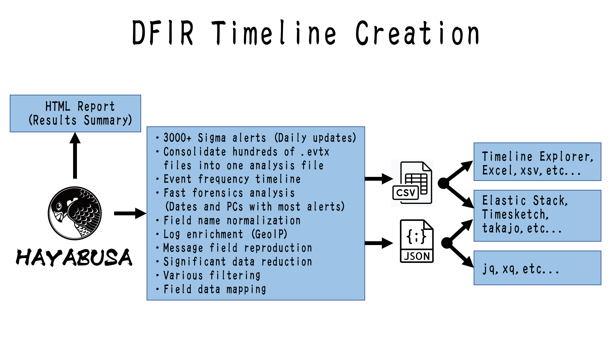

<div align="center">
 <p>
    
 </p>
 [ <b>English</b> ] | [<a href="README-Japanese.md">日本語</a>]
</div>

---

<p align="center">
    <a href="https://github.com/Yamato-Security/hayabusa/releases"></a>
    <a href="https://github.com/Yamato-Security/hayabusa/releases"></a>
    <a href="https://github.com/Yamato-Security/hayabusa/stargazers"></a>
    <a href="https://github.com/Yamato-Security/hayabusa/graphs/contributors"></a>
    <a href="https://www.blackhat.com/asia-22/arsenal/schedule/#hayabusa-26211"></a>
    <a href="https://codeblue.jp/2022/en/talks/?content=talks_24"></a>
    <a href="https://www.seccon.jp/2022/seccon_workshop/windows.html"></a>
    <a href="https://www.security-camp.or.jp/minicamp/tokyo2023.html"></a>
    <a href="https://www.sans.org/cyber-security-training-events/digital-forensics-summit-2023/"></a>
    <a href=""></a>
    <a href="https://rust-reportcard.xuri.me/report/github.com/Yamato-Security/hayabusa"></a>
    <a href="https://codecov.io/gh/Yamato-Security/hayabusa" ></a>
    <a href="https://twitter.com/SecurityYamato"></a>
</p>

# About Hayabusa

Hayabusa is a **Windows event log fast forensics timeline generator** and **threat hunting tool** created by the [Yamato Security](https://yamatosecurity.connpass.com/) group in Japan. Hayabusa means ["peregrine falcon"](https://en.wikipedia.org/wiki/Peregrine_falcon) in Japanese and was chosen as peregrine falcons are the fastest animal in the world, great at hunting and highly trainable. It is written in [Rust](https://www.rust-lang.org/) and supports multi-threading in order to be as fast as possible. We have provided a [tool](https://github.com/Yamato-Security/hayabusa-rules/tree/main/tools/sigmac) to convert [Sigma](https://github.com/SigmaHQ/sigma) rules into Hayabusa rule format. The Sigma-compatible Hayabusa detection rules are written in YML in order to be as easily customizable and extensible as possible. Hayabusa can be run either on single running systems for live analysis, by gathering logs from single or multiple systems for offline analysis, or by running the [Hayabusa artifact](https://docs.velociraptor.app/exchange/artifacts/pages/windows.eventlogs.hayabusa/) with [Velociraptor](https://docs.velociraptor.app/) for enterprise-wide threat hunting and incident response. The output will be consolidated into a single CSV timeline for easy analysis in [LibreOffice](https://www.libreoffice.org/), [Timeline Explorer](https://ericzimmerman.github.io/#!index.md), [Elastic Stack](doc/ElasticStackImport/ElasticStackImport-English.md), [Timesketch](https://timesketch.org/), etc...

# Companion Projects

* [EnableWindowsLogSettings](https://github.com/Yamato-Security/EnableWindowsLogSettings) - Documentation and scripts to properly enable Windows event logs.
* [Hayabusa Rules](https://github.com/Yamato-Security/hayabusa-rules) - Detection rules for hayabusa.
* [Hayabusa Sample EVTXs](https://github.com/Yamato-Security/hayabusa-sample-evtx) - Sample evtx files to use for testing hayabusa/sigma detection rules.
* [Takajo](https://github.com/Yamato-Security/takajo) - An analyzer for hayabusa results.
* [WELA (Windows Event Log Analyzer)](https://github.com/Yamato-Security/WELA) - An analyzer for Windows event logs written in PowerShell.

## Table of Contents

- [About Hayabusa](#about-hayabusa)
- [Companion Projects](#companion-projects)
  - [Table of Contents](#table-of-contents)
  - [Main Goals](#main-goals)
    - [Threat Hunting and Enterprise-wide DFIR](#threat-hunting-and-enterprise-wide-dfir)
    - [Fast Forensics Timeline Generation](#fast-forensics-timeline-generation)
- [Screenshots](#screenshots)
  - [Startup](#startup)
  - [DFIR Timeline Terminal Output](#dfir-timeline-terminal-output)
  - [Keyword Search Results](#keyword-search-results)
  - [Detection Fequency Timeline (`-T` option)](#detection-fequency-timeline--t-option)
  - [Results Summary](#results-summary)
  - [HTML Results Summary (`-H` option)](#html-results-summary--h-option)
  - [DFIR Timeline Analysis in LibreOffice (`-M` Multiline Output)](#dfir-timeline-analysis-in-libreoffice--m-multiline-output)
  - [DFIR Timeline Analysis in Timeline Explorer](#dfir-timeline-analysis-in-timeline-explorer)
  - [Critical Alert Filtering and Computer Grouping in Timeline Explorer](#critical-alert-filtering-and-computer-grouping-in-timeline-explorer)
  - [Analysis with the Elastic Stack Dashboard](#analysis-with-the-elastic-stack-dashboard)
  - [Analysis in Timesketch](#analysis-in-timesketch)
- [Importing and Analyzing Timeline Results](#importing-and-analyzing-timeline-results)
- [Analyzing JSON-formatted results with JQ](#analyzing-json-formatted-results-with-jq)
- [Features](#features)
- [Downloads](#downloads)
- [Git Cloning](#git-cloning)
- [Advanced: Compiling From Source (Optional)](#advanced-compiling-from-source-optional)
  - [Updating Rust Packages](#updating-rust-packages)
  - [Cross-compiling 32-bit Windows Binaries](#cross-compiling-32-bit-windows-binaries)
  - [macOS Compiling Notes](#macos-compiling-notes)
  - [Linux Compiling Notes](#linux-compiling-notes)
  - [Cross-compiling Linux MUSL Binaries](#cross-compiling-linux-musl-binaries)
- [Running Hayabusa](#running-hayabusa)
  - [Scan Wizard](#scan-wizard)
    - [Core Rules](#core-rules)
    - [Core+ Rules](#core-rules-1)
    - [Core++ Rules](#core-rules-2)
    - [Emerging Threats (ET) Add-On Rules](#emerging-threats-et-add-on-rules)
    - [Threat Hunting (TH) Add-On Rules](#threat-hunting-th-add-on-rules)
  - [Caution: Anti-Virus/EDR Warnings and Slow Runtimes](#caution-anti-virusedr-warnings-and-slow-runtimes)
  - [Windows](#windows)
    - [Error when trying to scan a file or directory with a space in the path](#error-when-trying-to-scan-a-file-or-directory-with-a-space-in-the-path)
  - [Linux](#linux)
  - [macOS](#macos)
- [Command List](#command-list)
  - [Analysis Commands:](#analysis-commands)
  - [DFIR Timeline Commands:](#dfir-timeline-commands)
  - [General Commands:](#general-commands)
- [Command Usage](#command-usage)
  - [Analysis Commands](#analysis-commands-1)
    - [`computer-metrics` command](#computer-metrics-command)
      - [`computer-metrics` command examples](#computer-metrics-command-examples)
    - [`eid-metrics` command](#eid-metrics-command)
      - [`eid-metrics` command examples](#eid-metrics-command-examples)
      - [`eid-metrics` command config file](#eid-metrics-command-config-file)
    - [`logon-summary` command](#logon-summary-command)
      - [`logon-summary` command examples](#logon-summary-command-examples)
    - [`pivot-keywords-list` command](#pivot-keywords-list-command)
      - [`pivot-keywords-list` command examples](#pivot-keywords-list-command-examples)
      - [`pivot-keywords-list` config file](#pivot-keywords-list-config-file)
    - [`search` command](#search-command)
      - [`search` command examples](#search-command-examples)
      - [`search` command config files](#search-command-config-files)
  - [DFIR Timeline Commands](#dfir-timeline-commands-1)
    - [`csv-timeline` command](#csv-timeline-command)
      - [`csv-timeline` command examples](#csv-timeline-command-examples)
      - [Advanced - GeoIP Log Enrichment](#advanced---geoip-log-enrichment)
        - [GeoIP config file](#geoip-config-file)
        - [Automatic updates of GeoIP databases](#automatic-updates-of-geoip-databases)
      - [`csv-timeline` command config files](#csv-timeline-command-config-files)
    - [`json-timeline` command](#json-timeline-command)
      - [`json-timeline` command examples and config files](#json-timeline-command-examples-and-config-files)
    - [`level-tuning` command](#level-tuning-command)
      - [`level-tuning` command examples](#level-tuning-command-examples)
      - [`level-tuning` config file](#level-tuning-config-file)
    - [`list-profiles` command](#list-profiles-command)
    - [`set-default-profile` command](#set-default-profile-command)
      - [`set-default-profile` command examples](#set-default-profile-command-examples)
    - [`update-rules` command](#update-rules-command)
      - [`update-rules` command example](#update-rules-command-example)
- [Timeline Output](#timeline-output)
  - [Output Profiles](#output-profiles)
    - [1. `minimal` profile output](#1-minimal-profile-output)
    - [2. `standard` profile output](#2-standard-profile-output)
    - [3. `verbose` profile output](#3-verbose-profile-output)
    - [4. `all-field-info` profile output](#4-all-field-info-profile-output)
    - [5. `all-field-info-verbose` profile output](#5-all-field-info-verbose-profile-output)
    - [6. `super-verbose` profile output](#6-super-verbose-profile-output)
    - [7. `timesketch-minimal` profile output](#7-timesketch-minimal-profile-output)
    - [8. `timesketch-verbose` profile output](#8-timesketch-verbose-profile-output)
    - [Profile Comparison](#profile-comparison)
    - [Profile Field Aliases](#profile-field-aliases)
      - [Extra Profile Field Aliases](#extra-profile-field-aliases)
  - [Level Abbrevations](#level-abbrevations)
  - [MITRE ATT\&CK Tactics Abbreviations](#mitre-attck-tactics-abbreviations)
  - [Channel Abbreviations](#channel-abbreviations)
  - [Other Abbreviations](#other-abbreviations)
  - [Progress Bar](#progress-bar)
  - [Color Output](#color-output)
  - [Results Summary](#results-summary-1)
    - [Detection Fequency Timeline](#detection-fequency-timeline)
- [Hayabusa Rules](#hayabusa-rules)
  - [Sigma v.s. Hayabusa (Built-in Sigma Compatible) Rules](#sigma-vs-hayabusa-built-in-sigma-compatible-rules)
- [Other Windows Event Log Analyzers and Related Resources](#other-windows-event-log-analyzers-and-related-resources)
- [Windows Logging Recommendations](#windows-logging-recommendations)
- [Sysmon Related Projects](#sysmon-related-projects)
- [Community Documentation](#community-documentation)
  - [English](#english)
  - [Japanese](#japanese)
- [Contribution](#contribution)
- [Bug Submission](#bug-submission)
- [License](#license)
- [Twitter](#twitter)

## Main Goals

### Threat Hunting and Enterprise-wide DFIR

Hayabusa currently has over 2500 Sigma rules and over 150 Hayabusa built-in detection rules with more rules being added regularly.
It can be used for enterprise-wide proactive threat hunting as well as DFIR (Digital Forensics and Incident Response) for free with [Velociraptor](https://docs.velociraptor.app/)'s [Hayabusa artifact](https://docs.velociraptor.app/exchange/artifacts/pages/windows.eventlogs.hayabusa/).
By combining these two open-source tools, you can essentially retroactively reproduce a SIEM when there is no SIEM setup in the environment.
You can learn about how to do this by watching [Eric Capuano](https://twitter.com/eric_capuano)'s Velociraptor walkthrough [here](https://www.youtube.com/watch?v=Q1IoGX--814).

### Fast Forensics Timeline Generation

Windows event log analysis has traditionally been a very long and tedious process because Windows event logs are 1) in a data format that is hard to analyze and 2) the majority of data is noise and not useful for investigations.
Hayabusa's goal is to extract out only useful data and present it in a concise as possible easy-to-read format that is usable not only by professionally trained analysts but any Windows system administrator.
Hayabusa hopes to let analysts get 80% of their work done in 20% of the time when compared to traditional Windows event log analysis.



# Screenshots

## Startup


## DFIR Timeline Terminal Output


## Keyword Search Results


## Detection Fequency Timeline (`-T` option)


## Results Summary


## HTML Results Summary (`-H` option)


## DFIR Timeline Analysis in LibreOffice (`-M` Multiline Output)


## DFIR Timeline Analysis in Timeline Explorer


## Critical Alert Filtering and Computer Grouping in Timeline Explorer


## Analysis with the Elastic Stack Dashboard


## Analysis in Timesketch


# Importing and Analyzing Timeline Results

You can learn how to analyze CSV timelines in Excel and Timeline Explorer [here](doc/CSV-AnalysisWithExcelAndTimelineExplorer-English.pdf).

You can learn how to import CSV files into Elastic Stack [here](doc/ElasticStackImport/ElasticStackImport-English.md).

You can learn how to import CSV files into Timesketch [here](doc/TimesketchImport/TimesketchImport-English.md).

# Analyzing JSON-formatted results with JQ

You can learn how to analyze JSON-formatted results with `jq` [here](doc/AnalysisWithJQ-English.md).

# Features

* Cross-platform support: Windows, Linux, macOS.
* Developed in Rust to be memory safe and fast.
* Multi-thread support delivering up to a 5x speed improvement.
* Creates single easy-to-analyze timelines for forensic investigations and incident response.
* Threat hunting based on IoC signatures written in easy to read/create/edit YML based hayabusa rules.
* Sigma rule support to convert sigma rules to hayabusa rules.
* Currently it supports the most sigma rules compared to other similar tools and even supports count rules and new aggregators such as `|equalsfield` and `|endswithfield`.
* Computer metrics. (Useful for filtering on/out certain computers with a large amount of events.)
* Event ID metrics. (Useful for getting a picture of what types of events there are and for tuning your log settings.)
* Rule tuning configuration by excluding unneeded or noisy rules.
* MITRE ATT&CK mapping of tactics.
* Rule level tuning.
* Create a list of unique pivot keywords to quickly identify abnormal users, hostnames, processes, etc... as well as correlate events.
* Output all fields for more thorough investigations.
* Successful and failed logon summary.
* Enterprise-wide threat hunting and DFIR on all endpoints with [Velociraptor](https://docs.velociraptor.app/).
* Output to CSV, JSON/JSONL and HTML Summary Reports.
* Daily Sigma rule updates.
* Support for JSON-formatted log input.
* Log field normalization. (Converting multiple fields with different naming conventions into the same field name.)
* Log enrichment by adding GeoIP (ASN, city, country) information to IP addresses.
* Search all events for keywords or regular expressions.
* Field data mapping. (Ex: `0xc0000234` -> `ACCOUNT LOCKED`)
* Evtx record carving from evtx slack space.
* Event de-duplication when outputting. (Useful when recovery records is enabled or when you include backed up evtx files, evtx files from VSS, etc...)
* Scan setting wizard to help choose which rules to enable easier. (In order to reduce false positives, etc...)
* PowerShell classic log field parsing and extraction.

# Downloads

Please download the latest stable version of Hayabusa with compiled binaries or compile the source code from the [Releases](https://github.com/Yamato-Security/hayabusa/releases) page.

# Git Cloning

You can `git clone` the repository with the following command and compile binary from source code:

**Warning:** The main branch of the repository is for development purposes so you may be able to access new features not yet officially released, however, there may be bugs so consider it unstable.

```bash
git clone https://github.com/Yamato-Security/hayabusa.git --recursive
```

> **Note:** If you forget to use --recursive option, the `rules` folder, which is managed as a git submodule, will not be cloned.

You can sync the `rules` folder and get latest Hayabusa rules with `git pull --recurse-submodules` or use the following command:

```bash
hayabusa.exe update-rules
```

If the update fails, you may need to rename the `rules` folder and try again.

>> Caution: When updating, rules and config files in the `rules` folder are replaced with the latest rules and config files in the [hayabusa-rules](https://github.com/Yamato-Security/hayabusa-rules) repository.
>> Any changes you make to existing files will be overwritten, so we recommend that you make backups of any files that you edit before updating.
>> If you are performing level tuning with `level-tuning`, please re-tune your rule files after each update.
>> If you add **new** rules inside of the `rules` folder, they will **not** be overwritten or deleted when updating.

# Advanced: Compiling From Source (Optional)

If you have Rust installed, you can compile from source with the following command:

Note: To compile, you usually need the latest version of Rust.

```bash
cargo build --release
```

You can download the latest unstable version from the main branch or the latest stable version from the [Releases](https://github.com/Yamato-Security/hayabusa/releases) page.

Be sure to periodically update Rust with:

```bash
rustup update stable
```

The compiled binary will be outputted in the `./target/release` folder.

## Updating Rust Packages

You can update to the latest Rust crates before compiling:

```bash
cargo update
```

> Please let us know if anything breaks after you update.

## Cross-compiling 32-bit Windows Binaries

You can create 32-bit binaries on 64-bit Windows systems with the following:

```bash
rustup install stable-i686-pc-windows-msvc
rustup target add i686-pc-windows-msvc
rustup run stable-i686-pc-windows-msvc cargo build --release
```

> **Warning: Be sure to run `rustup install stable-i686-pc-windows-msvc` whenever there is a new stable version of Rust as `rustup update stable` will not update the compiler for cross compiling and you may receive build errors.**

## macOS Compiling Notes

If you receive compile errors about openssl, you will need to install [Homebrew](https://brew.sh/) and then install the following packages:

```bash
brew install pkg-config
brew install openssl
```

## Linux Compiling Notes

If you receive compile errors about openssl, you will need to install the following package.

Ubuntu-based distros:

```bash
sudo apt install libssl-dev
```

Fedora-based distros:

```bash
sudo yum install openssl-devel
```

## Cross-compiling Linux MUSL Binaries

On a Linux OS, first install the target.

```bash
rustup install stable-x86_64-unknown-linux-musl
rustup target add x86_64-unknown-linux-musl
```

Compile with:

```bash
cargo build --release --target=x86_64-unknown-linux-musl
```

> **Warning: Be sure to run `rustup install stable-x86_64-unknown-linux-musl` whenever there is a new stable version of Rust as `rustup update stable` will not update the compiler for cross compiling and you may receive build errors.**

The MUSL binary will be created in the `./target/x86_64-unknown-linux-musl/release/` directory.
MUSL binaries are are about 15% slower than the GNU binaries, however, they are more portable accross different versions and distributions of linux.

# Running Hayabusa

## Scan Wizard

Commands like `csv-timeline` and `json-timeline` now have a scan wizard enabled by default.
This is intended to help users easily choose which detection rules they want to enable according to their needs and preferences.
The sets of detections rules to load are based off of the official lists in the Sigma project.
Details are explained in [this blog post](https://blog.sigmahq.io/introducing-sigma-rule-packages-releases-76043ce42e81).
You can easily turn off the wizard and use Hayabusa in its traditional way by adding the `-w, --no-wizard` option.

### Core Rules

The `core` rule set enables rules that have a status of `test` or `stable` and a level of `high` or `critical`.
These are high quality rules of high confidence and relevance and should not produce many false positives.
The rule status is `test` or `stable` which means no false positives were reported for over 6 months.
Rules will match on attacker techniques, generic suspicious activity, or malicious behavior.
It is the same as using the `--exclude-status deprecated,unsupported,experimental --min-level high` options.

### Core+ Rules

The `core+` rule set enables rules that have a status of `test` or `stable` and a level of `medium` or higher.
`medium` rules most often need additional tuning as certain applications, legitimate user behavior or scripts of an organization might be matched.
It is the same as using the `--exclude-status deprecated,unsupported,experimental --min-level medium` options.

### Core++ Rules

The `core++` rule set enables rules that have a status of `experimental`, `test` or `stable` and a level of `medium` or higher.
These rules are bleeding edge.
They are validated against the baseline evtx files available at the SigmaHQ project and reviewed by multiple detection engineers.
Other than that they are pretty much untested at first.
Use these if you want to be able to detect threats as early as possible at the cost of managing a higher threshold of false positives.
It is the same as using the `--exclude-status deprecated,unsupported --min-level medium` options.

### Emerging Threats (ET) Add-On Rules

The `Emerging Threats (ET)` rule set enables rules that have a tag of `detection.emerging_threats`.
These rules target specific threats and are especially useful for current threats where not much information is available yet.
These rules should not have many false positives but will decrease in relevance over time.
When these rules are not enabled, it is the same as using the `--exclude-tag detection.emerging_threats` option.
When running Hayabusa traditionally without the wizard, these rules will be included by default.

### Threat Hunting (TH) Add-On Rules

The `Threat Hunting (TH)` rule set enables rules that have a tag of `detection.threat_hunting`.
These rules may detect unknown malicious activity, however, will typicially have more false positives.
When these rules are not enabled, it is the same as using the `--exclude-tag detection.threat_hunting` option.
When running Hayabusa traditionally without the wizard, these rules will be included by default.

## Caution: Anti-Virus/EDR Warnings and Slow Runtimes

You may receive an alert from anti-virus or EDR products when trying to run hayabusa or even just when downloading the `.yml` rules as there will be keywords like `mimikatz` and suspicious PowerShell commands in the detection signature.
These are false positives so will need to configure exclusions in your security products to allow hayabusa to run.
If you are worried about malware or supply chain attacks, please check the hayabusa source code and compile the binaries yourself.

You may experience slow runtime especially on the first run after a reboot due to the real-time protection of Windows Defender.
You can avoid this by temporarily turning real-time protection off or adding an exclusion to the hayabusa runtime directory.
(Please take into consideration the security risks before doing these.)

## Windows

In a Command/PowerShell Prompt or Windows Terminal, just run the appropriate 32-bit or 64-bit Windows binary.

### Error when trying to scan a file or directory with a space in the path

When using the built-in Command or PowerShell prompt in Windows, you may receive an error that Hayabusa was not able to load any .evtx files if there is a space in your file or directory path.
In order to load the .evtx files properly, be sure to do the following:
1. Enclose the file or directory path with double quotes.
2. If it is a directory path, make sure that you do not include a backslash for the last character.

## Linux

You first need to make the binary executable.

```bash
chmod +x ./hayabusa
```

Then run it from the Hayabusa root directory:

```bash
./hayabusa
```

## macOS

From Terminal or iTerm2, you first need to make the binary executable.

```bash
chmod +x ./hayabusa
```

Then, try to run it from the Hayabusa root directory:

```bash
./hayabusa
```

On the latest version of macOS, you may receive the following security error when you try to run it:


Click "Cancel" and then from System Preferences, open "Security & Privacy" and from the General tab, click "Allow Anyway".


After that, try to run it again.

```bash
./hayabusa
```

The following warning will pop up, so please click "Open".


You should now be able to run hayabusa.

# Command List

## Analysis Commands:
* `computer-metrics`: Print the number of events based on computer names.
* `eid-metrics`: Print the number and percentage of events based on Event ID.
* `logon-summary`: Print a summary of logon events.
* `pivot-keywords-list`: Print a list of suspicious keywords to pivot on.
* `search`: Search all events by keyword(s) or regular expressions

## DFIR Timeline Commands:
* `csv-timeline`: Save the timeline in CSV format.
* `json-timeline`: Save the timeline in JSON/JSONL format.
* `level-tuning`: Custom tune the alerts' `level`.
* `list-profiles`: List the available output profiles.
* `set-default-profile`: Change the default profile.
* `update-rules`: Sync the rules to the latest rules in the [hayabusa-rules](https://github.com/Yamato-Security/hayabusa-rules) GitHub repository.

## General Commands:
* `help`: Print this message or the help of the given subcommand(s)
* `list-contributors`: Print the list of contributors

# Command Usage

## Analysis Commands

### `computer-metrics` command

You can use the `computer-metrics` command to print out the total number and percentage of Event IDs seperated by Channels.

```
Usage: computer-metrics <INPUT> [OPTIONS]

Input:
  -d, --directory <DIR>  Directory of multiple .evtx files
  -f, --file <FILE>      File path to one .evtx file
  -l, --live-analysis    Analyze the local C:\Windows\System32\winevt\Logs folder
  -J, --JSON-input       Scan JSON formatted logs instead of .evtx (.json or .jsonl)
  -x, --recover-records  Carve evtx records from slack space (default: disabled)

Filtering:
      --timeline-offset <OFFSET>  Scan recent events based on an offset (ex: 1y, 3M, 30d, 24h, 30m)

Output:
  -o, --output <FILE>  Save the results in CSV format (ex: computer-metrics.csv)

Display Settings:
      --no-color  Disable color output
  -q, --quiet     Quiet mode: do not display the launch banner
  -v, --verbose   Output verbose information

General Options:
  -C, --clobber                        Overwrite files when saving
  -Q, --quiet-errors                   Quiet errors mode: do not save error logs
  -c, --rules-config <DIR>             Specify custom rule config directory (default: ./rules/config)
      --target-file-ext <FILE-EXT...>  Specify additional evtx file extensions (ex: evtx_data)
  -t, --threads <NUMBER>               Number of threads (default: optimal number for performance)
```

#### `computer-metrics` command examples

* Print computer name metrics from a directory: `hayabusa.exe computer-metrics -d ../logs`
* Save results to a CSV file: `hayabusa.exe computer-metrics -d ../logs -o computer-metrics.csv`


### `eid-metrics` command

You can use the `eid-metrics` command to print out the total number and percentage of Event IDs seperated by Channels.

```
Usage: eid-metrics <INPUT> [OPTIONS]

Input:
  -d, --directory <DIR>  Directory of multiple .evtx files
  -f, --file <FILE>      File path to one .evtx file
  -l, --live-analysis    Analyze the local C:\Windows\System32\winevt\Logs folder
  -J, --JSON-input       Scan JSON formatted logs instead of .evtx (.json or .jsonl)
  -x, --recover-records  Carve evtx records from slack space (default: disabled)

Filtering:
      --exclude-computer <COMPUTER...>  Do not scan specified computer names (ex: ComputerA) (ex: ComputerA,ComputerB)
      --include-computer <COMPUTER...>  Scan only specified computer names (ex: ComputerA) (ex: ComputerA,ComputerB)
      --timeline-offset <OFFSET>        Scan recent events based on an offset (ex: 1y, 3M, 30d, 24h, 30m)

Output:
  -o, --output <FILE>  Save the Metrics in CSV format (ex: metrics.csv)

Display Settings:
      --no-color  Disable color output
  -q, --quiet     Quiet mode: do not display the launch banner
  -v, --verbose   Output verbose information

General Options:
  -C, --clobber                        Overwrite files when saving
  -Q, --quiet-errors                   Quiet errors mode: do not save error logs
  -c, --rules-config <DIR>             Specify custom rule config directory (default: ./rules/config)
      --target-file-ext <FILE-EXT...>  Specify additional evtx file extensions (ex: evtx_data)
  -t, --threads <NUMBER>               Number of threads (default: optimal number for performance)

Time Format:
      --European-time     Output timestamp in European time format (ex: 22-02-2022 22:00:00.123 +02:00)
      --ISO-8601          Output timestamp in ISO-8601 format (ex: 2022-02-22T10:10:10.1234567Z) (Always UTC)
      --RFC-2822          Output timestamp in RFC 2822 format (ex: Fri, 22 Feb 2022 22:00:00 -0600)
      --RFC-3339          Output timestamp in RFC 3339 format (ex: 2022-02-22 22:00:00.123456-06:00)
      --US-military-time  Output timestamp in US military time format (ex: 02-22-2022 22:00:00.123 -06:00)
      --US-time           Output timestamp in US time format (ex: 02-22-2022 10:00:00.123 PM -06:00)
  -U, --UTC               Output time in UTC format (default: local time)
```

#### `eid-metrics` command examples

* Print Event ID metrics from a single file: `hayabusa.exe eid-metrics -f Security.evtx`
* Print Event ID metrics from a directory: `hayabusa.exe eid-metrics -d ../logs`
* Save results to a CSV file: `hayabusa.exe eid-metrics -f Security.evtx -o eid-metrics.csv`

#### `eid-metrics` command config file

The channel, event IDs and titles of the events are defined in `rules/config/channel_eid_info.txt`.

Example:
```
Channel,EventID,EventTitle
Microsoft-Windows-Sysmon/Operational,1,Process Creation.
Microsoft-Windows-Sysmon/Operational,2,File Creation Timestamp Changed. (Possible Timestomping)
Microsoft-Windows-Sysmon/Operational,3,Network Connection.
Microsoft-Windows-Sysmon/Operational,4,Sysmon Service State Changed.
```


### `logon-summary` command

You can use the `logon-summary` command to output logon information summary (logon usernames and successful and failed logon count).
You can display the logon information for one evtx file with `-f` or multiple evtx files with the `-d` option.

```
Usage: logon-summary <INPUT> [OPTIONS]

Input:
  -d, --directory <DIR>  Directory of multiple .evtx files
  -f, --file <FILE>      File path to one .evtx file
  -l, --live-analysis    Analyze the local C:\Windows\System32\winevt\Logs folder
  -J, --JSON-input       Scan JSON formatted logs instead of .evtx (.json or .jsonl)
  -x, --recover-records  Carve evtx records from slack space (default: disabled)

Filtering:
      --exclude-computer <COMPUTER...>  Do not scan specified computer names (ex: ComputerA) (ex: ComputerA,ComputerB)
      --include-computer <COMPUTER...>  Scan only specified computer names (ex: ComputerA) (ex: ComputerA,ComputerB)
      --timeline-end <DATE>             End time of the event logs to load (ex: "2022-02-22 23:59:59 +09:00")
      --timeline-offset <OFFSET>        Scan recent events based on an offset (ex: 1y, 3M, 30d, 24h, 30m)
      --timeline-start <DATE>           Start time of the event logs to load (ex: "2020-02-22 00:00:00 +09:00")

Output:
  -o, --output <FILENAME-PREFIX>  Save the logon summary to two CSV files (ex: -o logon-summary)

Display Settings:
      --no-color  Disable color output
  -q, --quiet     Quiet mode: do not display the launch banner
  -v, --verbose   Output verbose information

General Options:
  -C, --clobber                        Overwrite files when saving
  -Q, --quiet-errors                   Quiet errors mode: do not save error logs
  -c, --rules-config <DIR>             Specify custom rule config directory (default: ./rules/config)
      --target-file-ext <FILE-EXT...>  Specify additional evtx file extensions (ex: evtx_data)
  -t, --threads <NUMBER>               Number of threads (default: optimal number for performance)

Time Format:
      --European-time     Output timestamp in European time format (ex: 22-02-2022 22:00:00.123 +02:00)
      --ISO-8601          Output timestamp in ISO-8601 format (ex: 2022-02-22T10:10:10.1234567Z) (Always UTC)
      --RFC-2822          Output timestamp in RFC 2822 format (ex: Fri, 22 Feb 2022 22:00:00 -0600)
      --RFC-3339          Output timestamp in RFC 3339 format (ex: 2022-02-22 22:00:00.123456-06:00)
      --US-military-time  Output timestamp in US military time format (ex: 02-22-2022 22:00:00.123 -06:00)
      --US-time           Output timestamp in US time format (ex: 02-22-2022 10:00:00.123 PM -06:00)
  -U, --UTC               Output time in UTC format (default: local time)
```

#### `logon-summary` command examples

* Print logon summary: `hayabusa.exe logon-summary -f Security.evtx`
* Save logon summary results: `hayabusa.exe logon-summary -d ../logs -o logon-summary.csv`


### `pivot-keywords-list` command

You can use the `pivot-keywords-list` command to create a list of unique pivot keywords to quickly identify abnormal users, hostnames, processes, etc... as well as correlate events.

Important: by default, hayabusa will return results from all events (informational and higher) so we highly recommend combining the `pivot-keywords-list` command with the `-m, --min-level` option.
For example, start off with only creating keywords from `critical` alerts with `-m critical` and then continue with `-m high`, `-m medium`, etc...
There will most likely be common keywords in your results that will match on many normal events, so after manually checking the results and creating a list of unique keywords in a single file, you can then create a narrowed down timeline of suspicious activity with a command like `grep -f keywords.txt timeline.csv`.

```
Usage: pivot-keywords-list <INPUT> [OPTIONS]

Input:
  -d, --directory <DIR>  Directory of multiple .evtx files
  -f, --file <FILE>      File path to one .evtx file
  -l, --live-analysis    Analyze the local C:\Windows\System32\winevt\Logs folder
  -J, --JSON-input       Scan JSON formatted logs instead of .evtx (.json or .jsonl)
  -x, --recover-records  Carve evtx records from slack space (default: disabled)

Filtering:
  -E, --EID-filter                      Scan only common EIDs for faster speed (./rules/config/target_event_IDs.txt)
  -D, --enable-deprecated-rules         Enable rules with a status of deprecated
  -n, --enable-noisy-rules              Enable rules set to noisy (./rules/config/noisy_rules.txt)
  -u, --enable-unsupported-rules        Enable rules with a status of unsupported
  -e, --exact-level <LEVEL>             Only load rules with a specific level (informational, low, medium, high, critical)
      --exclude-computer <COMPUTER...>  Do not scan specified computer names (ex: ComputerA) (ex: ComputerA,ComputerB)
      --exclude-eid <EID...>            Do not scan specific EIDs for faster speed (ex: 1) (ex: 1,4688)
      --exclude-status <STATUS...>      Do not load rules according to status (ex: experimental) (ex: stable,test)
      --exclude-tag <TAG...>            Do not load rules with specific tags (ex: sysmon)
      --include-computer <COMPUTER...>  Scan only specified computer names (ex: ComputerA) (ex: ComputerA,ComputerB)
      --include-eid <EID...>            Scan only specified EIDs for faster speed (ex: 1) (ex: 1,4688)
      --include-tag <TAG...>            Only load rules with specific tags (ex: attack.execution,attack.discovery)
  -m, --min-level <LEVEL>               Minimum level for rules to load (default: informational)
      --timeline-end <DATE>             End time of the event logs to load (ex: "2022-02-22 23:59:59 +09:00")
      --timeline-offset <OFFSET>        Scan recent events based on an offset (ex: 1y, 3M, 30d, 24h, 30m)
      --timeline-start <DATE>           Start time of the event logs to load (ex: "2020-02-22 00:00:00 +09:00")

Output:
  -o, --output <FILENAME-PREFIX>  Save pivot words to separate files (ex: PivotKeywords)

Display Settings:
      --no-color  Disable color output
  -q, --quiet     Quiet mode: do not display the launch banner
  -v, --verbose   Output verbose information

General Options:
  -C, --clobber                        Overwrite files when saving
  -Q, --quiet-errors                   Quiet errors mode: do not save error logs
  -c, --rules-config <DIR>             Specify custom rule config directory (default: ./rules/config)
      --target-file-ext <FILE-EXT...>  Specify additional evtx file extensions (ex: evtx_data)
  -t, --threads <NUMBER>               Number of threads (default: optimal number for performance)
```

#### `pivot-keywords-list` command examples

* Output pivot keywords to screen: `hayabusa.exe pivot-keywords-list -d ../logs -m critical`
* Create a list of pivot keywords from critical alerts and save the results. (Results will be saved to `keywords-Ip Addresses.txt`, `keywords-Users.txt`, etc...):

```
hayabusa.exe pivot-keywords-list -d ../logs -m critical -o keywords`
```

#### `pivot-keywords-list` config file

You can customize what keywords you want to search for by editing `./rules/config/pivot_keywords.txt`.
[This page](https://github.com/Yamato-Security/hayabusa-rules/blob/main/config/pivot_keywords.txt) is the default setting.


The format is `KeywordName.FieldName`. For example, when creating the list of `Users`, hayabusa will list up all the values in the `SubjectUserName`, `TargetUserName` and `User` fields.


### `search` command

The `search` command will let you keyword search on all events.
(Not just Hayabusa detection results.)
This is useful to determine if there is any evidence in events that are not detected by Hayabusa.

```
Usage: hayabusa.exe search <INPUT> <--keywords "<KEYWORDS>" OR --regex "<REGEX>"> [OPTIONS]

Display Settings:
      --no-color  Disable color output
  -q, --quiet     Quiet mode: do not display the launch banner
  -v, --verbose   Output verbose information

Input:
  -d, --directory <DIR>  Directory of multiple .evtx files
  -f, --file <FILE>      File path to one .evtx file
  -l, --live-analysis    Analyze the local C:\Windows\System32\winevt\Logs folder
  -x, --recover-records  Carve evtx records from slack space (default: disabled)

Filtering:
  -a, --and-logic                 Search keywords with AND logic (default: OR)
  -F, --filter <FILTER...>        Filter by specific field(s)
  -i, --ignore-case               Case-insensitive keyword search
  -k, --keyword <KEYWORD...>      Search by keyword(s)
  -r, --regex <REGEX>             Search by regular expression
      --timeline-offset <OFFSET>  Scan recent events based on an offset (ex: 1y, 3M, 30d, 24h, 30m)

Output:
  -J, --JSON-output    Save the search results in JSON format (ex: -J -o results.json)
  -L, --JSONL-output   Save the search results in JSONL format (ex: -L -o results.jsonl)
  -M, --multiline      Output event field information in multiple rows
  -o, --output <FILE>  Save the search results in CSV format (ex: search.csv)

General Options:
  -C, --clobber                        Overwrite files when saving
  -Q, --quiet-errors                   Quiet errors mode: do not save error logs
  -c, --rules-config <DIR>             Specify custom rule config directory (default: ./rules/config)
      --target-file-ext <FILE-EXT...>  Specify additional evtx file extensions (ex: evtx_data)
  -t, --threads <NUMBER>               Number of threads (default: optimal number for performance)

Time Format:
      --European-time     Output timestamp in European time format (ex: 22-02-2022 22:00:00.123 +02:00)
      --ISO-8601          Output timestamp in ISO-8601 format (ex: 2022-02-22T10:10:10.1234567Z) (Always UTC)
      --RFC-2822          Output timestamp in RFC 2822 format (ex: Fri, 22 Feb 2022 22:00:00 -0600)
      --RFC-3339          Output timestamp in RFC 3339 format (ex: 2022-02-22 22:00:00.123456-06:00)
      --US-military-time  Output timestamp in US military time format (ex: 02-22-2022 22:00:00.123 -06:00)
      --US-time           Output timestamp in US time format (ex: 02-22-2022 10:00:00.123 PM -06:00)
  -U, --UTC               Output time in UTC format (default: local time)
```

#### `search` command examples

* Search the `../hayabusa-sample-evtx` directory for the keyword `mimikatz`:

```
hayabusa.exe search -d ../hayabusa-sample-evtx -k "mimikatz"
```

> Note: The keyword will match if `mimikatz` is found anywhere in the data. It is not an exact match.

* Search the `../hayabusa-sample-evtx` directory for the keywords `mimikatz` or `kali`:

```
hayabusa.exe search -d ../hayabusa-sample-evtx -k "mimikatz" -k "kali"
```

* Search the `../hayabusa-sample-evtx` directory for the keyword `mimikatz` and ignore case:

```
hayabusa.exe search -d ../hayabusa-sample-evtx -k "mimikatz" -i
```

* Search the `../hayabusa-sample-evtx` directory for IP addresses using regular expressions:

```
hayabusa.exe search -d ../hayabusa-sample-evtx -r "(?:[0-9]{1,3}\.){3}[0-9]{1,3}"
```

* Search the `../hayabusa-sample-evtx` directory and show all events where the `WorkstationName` field is `kali`:

```
hayabusa.exe search -d ../hayabusa-sample-evtx -r ".*" -F WorkstationName:"kali"
```

> Note: `.*` is the regular expression to match on every event.

#### `search` command config files

`./rules/config/channel_abbreviations.txt`: Mappings of channel names and their abbreviations.


## DFIR Timeline Commands

### `csv-timeline` command

The `csv-timeline` command will create a forensics timeline of events in CSV format.

```
Usage: csv-timeline <INPUT> [OPTIONS]

Input:
  -d, --directory <DIR>  Directory of multiple .evtx files
  -f, --file <FILE>      File path to one .evtx file
  -l, --live-analysis    Analyze the local C:\Windows\System32\winevt\Logs folder
  -J, --JSON-input       Scan JSON formatted logs instead of .evtx (.json or .jsonl)
  -x, --recover-records  Carve evtx records from slack space (default: disabled)

Filtering:
  -E, --EID-filter                      Scan only common EIDs for faster speed (./rules/config/target_event_IDs.txt)
  -D, --enable-deprecated-rules         Enable rules with a status of deprecated
  -n, --enable-noisy-rules              Enable rules set to noisy (./rules/config/noisy_rules.txt)
  -u, --enable-unsupported-rules        Enable rules with a status of unsupported
  -e, --exact-level <LEVEL>             Only load rules with a specific level (informational, low, medium, high, critical)
      --exclude-category <CATEGORY...>  Do not load rules with specified logsource categories (ex: process_creation,pipe_created)
      --exclude-computer <COMPUTER...>  Do not scan specified computer names (ex: ComputerA) (ex: ComputerA,ComputerB)
      --exclude-eid <EID...>            Do not scan specific EIDs for faster speed (ex: 1) (ex: 1,4688)
      --exclude-status <STATUS...>      Do not load rules according to status (ex: experimental) (ex: stable,test)
      --exclude-tag <TAG...>            Do not load rules with specific tags (ex: sysmon)
      --include-category <CATEGORY...>  Only load rules with specified logsource categories (ex: process_creation,pipe_created)
      --include-computer <COMPUTER...>  Scan only specified computer names (ex: ComputerA) (ex: ComputerA,ComputerB)
      --include-eid <EID...>            Scan only specified EIDs for faster speed (ex: 1) (ex: 1,4688)
      --include-tag <TAG...>            Only load rules with specific tags (ex: attack.execution,attack.discovery)
  -m, --min-level <LEVEL>               Minimum level for rules to load (default: informational)
  -P, --proven-rules                    Scan with only proven rules for faster speed (./rules/config/proven_rules.txt)
      --timeline-end <DATE>             End time of the event logs to load (ex: "2022-02-22 23:59:59 +09:00")
      --timeline-offset <OFFSET>        Scan recent events based on an offset (ex: 1y, 3M, 30d, 24h, 30m)
      --timeline-start <DATE>           Start time of the event logs to load (ex: "2020-02-22 00:00:00 +09:00")

Output:
  -G, --GeoIP <MAXMIND-DB-DIR>       Add GeoIP (ASN, city, country) info to IP addresses
  -H, --HTML-report <FILE>           Save Results Summary details to an HTML report (ex: results.html)
  -M, --multiline                    Output event field information in multiple rows
  -F, --no-field-data-mapping        Disable field data mapping
      --no-pwsh-field-extraction     Disable field extraction of PowerShell classic logs
  -o, --output <FILE>                Save the timeline in CSV format (ex: results.csv)
  -p, --profile <PROFILE>            Specify output profile
  -R, --remove-duplicate-data        Duplicate field data will be replaced with "DUP"
  -X, --remove-duplicate-detections  Remove duplicate detections (default: disabled)

Display Settings:
      --no-color            Disable color output
  -N, --no-summary          Do not display Results Summary for faster speed
  -q, --quiet               Quiet mode: do not display the launch banner
  -v, --verbose             Output verbose information
  -T, --visualize-timeline  Output event frequency timeline (terminal needs to support unicode)

General Options:
  -C, --clobber                        Overwrite files when saving
  -w, --no-wizard                      Do not ask questions. Scan for all events and alerts
  -Q, --quiet-errors                   Quiet errors mode: do not save error logs
  -r, --rules <DIR/FILE>               Specify a custom rule directory or file (default: ./rules)
  -c, --rules-config <DIR>             Specify custom rule config directory (default: ./rules/config)
      --target-file-ext <FILE-EXT...>  Specify additional evtx file extensions (ex: evtx_data)
  -t, --threads <NUMBER>               Number of threads (default: optimal number for performance)

Time Format:
      --European-time     Output timestamp in European time format (ex: 22-02-2022 22:00:00.123 +02:00)
      --ISO-8601          Output timestamp in ISO-8601 format (ex: 2022-02-22T10:10:10.1234567Z) (Always UTC)
      --RFC-2822          Output timestamp in RFC 2822 format (ex: Fri, 22 Feb 2022 22:00:00 -0600)
      --RFC-3339          Output timestamp in RFC 3339 format (ex: 2022-02-22 22:00:00.123456-06:00)
      --US-military-time  Output timestamp in US military time format (ex: 02-22-2022 22:00:00.123 -06:00)
      --US-time           Output timestamp in US time format (ex: 02-22-2022 10:00:00.123 PM -06:00)
  -U, --UTC               Output time in UTC format (default: local time)
```

#### `csv-timeline` command examples

* Run hayabusa against one Windows event log file with default `standard` profile:

```
hayabusa.exe csv-timeline -f eventlog.evtx
```

* Run hayabusa against the sample-evtx directory with multiple Windows event log files with the verbose profile:

```
hayabusa.exe csv-timeline -d .\hayabusa-sample-evtx -p verbose
```

* Export to a single CSV file for further analysis with LibreOffice, Timeline Explorer, Elastic Stack, etc... and include all field information (Warning: your file output size will become much larger with the `super-verbose` profile!):

```
hayabusa.exe csv-timeline -d .\hayabusa-sample-evtx -o results.csv -p super-verbose
```

* Enable the EID (Event ID) filter:

> Note: Enabling the EID filter will speed up the analysis by about 10-15% in our tests but there is a possibility of missing alerts.

```
hayabusa.exe csv-timeline -E -d .\hayabusa-sample-evtx -o results.csv
```

* Only run hayabusa rules (the default is to run all the rules in `-r .\rules`):

```
hayabusa.exe csv-timeline -d .\hayabusa-sample-evtx -r .\rules\hayabusa -o results.csv -w
```

* Only run hayabusa rules for logs that are enabled by default on Windows:

```
hayabusa.exe csv-timeline -d .\hayabusa-sample-evtx -r .\rules\hayabusa\builtin -o results.csv -w
```

* Only run hayabusa rules for sysmon logs:

```
hayabusa.exe csv-timeline -d .\hayabusa-sample-evtx -r .\rules\hayabusa\sysmon -o results.csv -w
```

* Only run sigma rules:

```
hayabusa.exe csv-timeline -d .\hayabusa-sample-evtx -r .\rules\sigma -o results.csv -w
```

* Enable deprecated rules (those with `status` marked as `deprecated`) and noisy rules (those whose rule ID is listed in `.\rules\config\noisy_rules.txt`):

> Note: Recently, deprecated rules are now located in a separate directory in the sigma repository so are not included by default anymore in Hayabusa.
> Therefore, you probably have no need to enable deprecated rules.

```
hayabusa.exe csv-timeline -d .\hayabusa-sample-evtx --enable-noisy-rules --enable-deprecated-rules -o results.csv -w
```

* Only run rules to analyze logons and output in the UTC timezone:

```
hayabusa.exe csv-timeline -d .\hayabusa-sample-evtx -r .\rules\hayabusa\builtin\Security\LogonLogoff\Logon -U -o results.csv -w
```

* Run on a live Windows machine (requires Administrator privileges) and only detect alerts (potentially malicious behavior):

```
hayabusa.exe csv-timeline -l -m low
```

* Print verbose information (useful for determining which files take long to process, parsing errors, etc...):

```
hayabusa.exe csv-timeline -d .\hayabusa-sample-evtx -v
```

* Verbose output example:

Loading rules:

```
Loaded rule: rules/sigma/builtin/deprecated/proc_creation_win_susp_run_folder.yml
Loaded rule: rules/sigma/builtin/deprecated/proc_creation_win_execution_mssql_xp_cmdshell_stored_procedure.yml
Loaded rule: rules/sigma/builtin/deprecated/proc_creation_win_susp_squirrel_lolbin.yml
Loaded rule: rules/sigma/builtin/win_alert_mimikatz_keywords.yml
```

Errors during the scan:
```
[ERROR] Failed to parse event file.
EventFile: ../logs/Microsoft-Rdms-UI%4Operational.evtx
Error: Failed to parse record number 58471

[ERROR] Failed to parse event file.
EventFile: ../logs/Microsoft-Rdms-UI%4Operational.evtx
Error: Failed to parse record number 58470

[ERROR] Failed to parse event file.
EventFile: ../logs/Microsoft-Windows-AppxPackaging%4Operational.evtx
Error: An error occurred while trying to serialize binary xml to output.
```

* Output to a CSV format compatible to import into [Timesketch](https://timesketch.org/):

```
hayabusa.exe csv-timeline -d ../hayabusa-sample-evtx --RFC-3339 -o timesketch-import.csv -p timesketch -U
```

* Quiet error mode:
By default, hayabusa will save error messages to error log files.
If you do not want to save error messages, please add `-Q`.

#### Advanced - GeoIP Log Enrichment

You can add GeoIP (ASN organization, city and country) information to SrcIP (source IP) fields and TgtIP (target IP) fields with the free GeoLite2 geolocation data.

Steps:
1. First sign up for a MaxMind account [here](https://dev.maxmind.com/geoip/geolite2-free-geolocation-data).
2. Download the three `.mmdb` files from the [download page](https://www.maxmind.com/en/accounts/current/geoip/downloads) and save them to a directory. The filenames should be called `GeoLite2-ASN.mmdb`,	`GeoLite2-City.mmdb` and `GeoLite2-Country.mmdb`.
3. When running the `csv-timeline` or `json-timeline` commands, add the `-G` option followed by the directory with the MaxMind databases.

* When `csv-timeline` is used, the following 6 columns will be additionally outputted: `SrcASN`, `SrcCity`, `SrcCountry`, `TgtASN`, `TgtCity`, `TgtCountry`.
* When `json-timeline` is used, the same `SrcASN`, `SrcCity`, `SrcCountry`, `TgtASN`, `TgtCity`, `TgtCountry` fields will be added to the `Details` object, but only if they contain information.

* When `SrcIP` or `TgtIP` is localhost (`127.0.0.1`, `::1`, etc...), `SrcASN` or `TgtASN` will be outputted as `Local`.
* When `SrcIP` or `TgtIP` is a private IP address (`10.0.0.0/8`, `fe80::/10`, etc...), `SrcASN` or `TgtASN` will be outputted as `Private`.

##### GeoIP config file

The field names that contain source and target IP addresses that get looked up in the GeoIP databases are defined in `rules/config/geoip_field_mapping.yaml`.
You can add to this list if necessary.
There is also a filter section in this file that determines what events to extract IP address information from.

##### Automatic updates of GeoIP databases

MaxMind GeoIP databases are updated every 2 weeks.
You can install the MaxMind `geoipupdate` tool [here](https://github.com/maxmind/geoipupdate) in order to automatically update these databases.

Steps on macOS:
1. `brew install geoipupdate`
2. Edit `/usr/local/etc/GeoIP.conf`: Put in your `AccountID` and `LicenseKey` you create after logging into the MaxMind website. Make sure the `EditionIDs` line says `EditionIDs GeoLite2-ASN GeoLite2-City GeoLite2-Country`.
3. Run `geoipupdate`.
4. Add `-G /usr/local/var/GeoIP` when you want to add GeoIP information.

Steps on Windows:
1. Download the latest Windows binary (Ex: `geoipupdate_4.10.0_windows_amd64.zip`) from the [Releases](https://github.com/maxmind/geoipupdate/releases) page.
2. Edit `\ProgramData\MaxMind/GeoIPUpdate\GeoIP.conf`: Put in your `AccountID` and `LicenseKey` you create after logging into the MaxMind website. Make sure the `EditionIDs` line says `EditionIDs GeoLite2-ASN GeoLite2-City GeoLite2-Country`.
3. Run the `geoipupdate` executable.

#### `csv-timeline` command config files

`./rules/config/channel_abbreviations.txt`: Mappings of channel names and their abbreviations.

`./rules/config/default_details.txt`: The configuration file for what default field information (`%Details%` field) should be outputted if no `details:` line is specified in a rule.
This is based on provider name and event IDs.

`./rules/config/eventkey_alias.txt`: This file has the mappings of short name aliases for fields and their original longer field names.

Example:
```
InstanceID,Event.UserData.UMDFHostDeviceArrivalBegin.InstanceId
IntegrityLevel,Event.EventData.IntegrityLevel
IpAddress,Event.EventData.IpAddress
```

If a field is not defined here, Hayabusa will automatically check under `Event.EventData` for the field.

`./rules/config/exclude_rules.txt`: This file has a list of rule IDs that will be excluded from use.
Usually this is because one rule has replaced another or the rule cannot be used in the first place.
Like firewalls and IDSes, any signature-based tool will require some tuning to fit your environment so you may need to permanently or temporarily exclude certain rules.
You can add a rule ID (Example: `4fe151c2-ecf9-4fae-95ae-b88ec9c2fca6`) to `./rules/config/exclude_rules.txt` in order to ignore any rule that you do not need or cannot be used.

`./rules/config/noisy_rules.txt`: This file a list of rule IDs that are disabled by default but can be enabled by enabling noisy rules with the `-n, --enable-noisy-rules` option.
These rules are usually noisy by nature or due to false positives.

`./rules/config/target_event_IDs.txt`: Only the event IDs specified in this file will be scanned if the EID filter is enabled.
By default, Hayabusa will scan all events, but if you want to improve performance, please use the `-E, --EID-filter` option.
This usually results in a 10~25% speed improvement.


### `json-timeline` command

The `json-timeline` command will create a forensics timeline of events in JSON or JSONL format.
Outputting to JSONL will be faster and smaller file size than JSON so is good if you are going to just import the results into another tool like Elastic Stack.
JSON is better if you are going to manually analyze the results with a text editor.
CSV output is good for importing smaller timelines (usually less than 2GB) into tools like LibreOffice or Timeline Explorer.
JSON is best for more detailed analysis of data (including large results files) with tools like `jq` as the `Details` fields are separated for easier analysis.
(In the CSV output, all of the event log fields are in one big `Details` column making sorting of data, etc... more difficult.)

```
Usage: json-timeline <INPUT> [OPTIONS]

Input:
  -d, --directory <DIR>  Directory of multiple .evtx files
  -f, --file <FILE>      File path to one .evtx file
  -l, --live-analysis    Analyze the local C:\Windows\System32\winevt\Logs folder
  -J, --JSON-input       Scan JSON formatted logs instead of .evtx (.json or .jsonl)
  -x, --recover-records  Carve evtx records from slack space (default: disabled)

Filtering:
  -E, --EID-filter                      Scan only common EIDs for faster speed (./rules/config/target_event_IDs.txt)
  -D, --enable-deprecated-rules         Enable rules with a status of deprecated
  -n, --enable-noisy-rules              Enable rules set to noisy (./rules/config/noisy_rules.txt)
  -u, --enable-unsupported-rules        Enable rules with a status of unsupported
  -e, --exact-level <LEVEL>             Only load rules with a specific level (informational, low, medium, high, critical)
      --exclude-category <CATEGORY...>  Do not load rules with specified logsource categories (ex: process_creation,pipe_created)
      --exclude-computer <COMPUTER...>  Do not scan specified computer names (ex: ComputerA) (ex: ComputerA,ComputerB)
      --exclude-eid <EID...>            Do not scan specific EIDs for faster speed (ex: 1) (ex: 1,4688)
      --exclude-status <STATUS...>      Do not load rules according to status (ex: experimental) (ex: stable,test)
      --exclude-tag <TAG...>            Do not load rules with specific tags (ex: sysmon)
      --include-category <CATEGORY...>  Only load rules with specified logsource categories (ex: process_creation,pipe_created)
      --include-computer <COMPUTER...>  Scan only specified computer names (ex: ComputerA) (ex: ComputerA,ComputerB)
      --include-eid <EID...>            Scan only specified EIDs for faster speed (ex: 1) (ex: 1,4688)
      --include-tag <TAG...>            Only load rules with specific tags (ex: attack.execution,attack.discovery)
  -m, --min-level <LEVEL>               Minimum level for rules to load (default: informational)
  -P, --proven-rules                    Scan with only proven rules for faster speed (./rules/config/proven_rules.txt)
      --timeline-end <DATE>             End time of the event logs to load (ex: "2022-02-22 23:59:59 +09:00")
      --timeline-offset <OFFSET>        Scan recent events based on an offset (ex: 1y, 3M, 30d, 24h, 30m)
      --timeline-start <DATE>           Start time of the event logs to load (ex: "2020-02-22 00:00:00 +09:00")

Output:
  -G, --GeoIP <MAXMIND-DB-DIR>       Add GeoIP (ASN, city, country) info to IP addresses
  -H, --HTML-report <FILE>           Save Results Summary details to an HTML report (ex: results.html)
  -L, --JSONL-output                 Save the timeline in JSONL format (ex: -L -o results.jsonl)
  -F, --no-field-data-mapping        Disable field data mapping
      --no-pwsh-field-extraction     Disable field extraction of PowerShell classic logs
  -o, --output <FILE>                Save the timeline in JSON format (ex: results.json)
  -p, --profile <PROFILE>            Specify output profile
  -R, --remove-duplicate-data        Duplicate field data will be replaced with "DUP"
  -X, --remove-duplicate-detections  Remove duplicate detections (default: disabled)

Display Settings:
      --no-color            Disable color output
  -N, --no-summary          Do not display Results Summary for faster speed
  -q, --quiet               Quiet mode: do not display the launch banner
  -v, --verbose             Output verbose information
  -T, --visualize-timeline  Output event frequency timeline (terminal needs to support unicode)

General Options:
  -C, --clobber                        Overwrite files when saving
  -w, --no-wizard                      Do not ask questions. Scan for all events and alerts
  -Q, --quiet-errors                   Quiet errors mode: do not save error logs
  -r, --rules <DIR/FILE>               Specify a custom rule directory or file (default: ./rules)
  -c, --rules-config <DIR>             Specify custom rule config directory (default: ./rules/config)
      --target-file-ext <FILE-EXT...>  Specify additional evtx file extensions (ex: evtx_data)
  -t, --threads <NUMBER>               Number of threads (default: optimal number for performance)

Time Format:
      --European-time     Output timestamp in European time format (ex: 22-02-2022 22:00:00.123 +02:00)
      --ISO-8601          Output timestamp in ISO-8601 format (ex: 2022-02-22T10:10:10.1234567Z) (Always UTC)
      --RFC-2822          Output timestamp in RFC 2822 format (ex: Fri, 22 Feb 2022 22:00:00 -0600)
      --RFC-3339          Output timestamp in RFC 3339 format (ex: 2022-02-22 22:00:00.123456-06:00)
      --US-military-time  Output timestamp in US military time format (ex: 02-22-2022 22:00:00.123 -06:00)
      --US-time           Output timestamp in US time format (ex: 02-22-2022 10:00:00.123 PM -06:00)
  -U, --UTC               Output time in UTC format (default: local time)
```

#### `json-timeline` command examples and config files

The options and config files for `json-timeline` are the same as `csv-timeline` but one extra option `-L, --JSONL-output` for outputting to JSONL format.

### `level-tuning` command

The `level-tuning` command will let you tune the alert levels for rules, either raising or decreasing the risk level according to your environment.

```
Usage: level-tuning [OPTIONS]

Display Settings:
      --no-color  Disable color output
  -q, --quiet     Quiet mode: do not display the launch banner

General Options:
  -f, --file <FILE>  Tune alert levels (default: ./rules/config/level_tuning.txt)
```

#### `level-tuning` command examples

* Normal usage: `hayabusa.exe level-tuning`
* Tune rule alert levels based on your custom config file: `hayabusa.exe level-tuning -f my_level_tuning.txt`

#### `level-tuning` config file

Hayabusa and Sigma rule authors will determine the risk level of the alert when writing their rules.
However, the actual risk level may differ according to the environment.
You can tune the risk level of the rules by adding them to `./rules/config/level_tuning.txt` and executing `hayabusa.exe level-tuning` which will update the `level` line in the rule file.
Please note that the rule file will be updated directly.

> Warning: Anytime you run `update-rules`, the original alert level will overwrite any settings you have changed, so you will need to run the `level-tuning` command after every time you run `update-rules` if you want to change the levels.

`./rules/config/level_tuning.txt` sample line:

```csv
id,new_level
00000000-0000-0000-0000-000000000000,informational # sample level tuning line
```

In this case, the risk level of the rule with an `id` of `00000000-0000-0000-0000-000000000000` in the rules directory will have its `level` rewritten to `informational`.
The possible levels to set are `critical`, `high`, `medium`, `low` and `informational`.

### `list-profiles` command

```
Usage: list-profiles [OPTIONS]

Display Settings:
      --no-color  Disable color output
  -q, --quiet     Quiet mode: do not display the launch banner
```

### `set-default-profile` command

```
Usage: set-default-profile [OPTIONS]

Display Settings:
      --no-color  Disable color output
  -q, --quiet     Quiet mode: do not display the launch banner

General Options:
  -p, --profile <PROFILE>  Specify output profile
```

#### `set-default-profile` command examples

* Set the default profile to `minimal`: `hayabusa.exe set-default-profile minimal`
* Set the default profile to `super-verbose`: `hayabusa.exe set-default-profile super-verbose`

### `update-rules` command

The `update-rules` command will sync the `rules` folder with the [Hayabusa rules github repository](https://github.com/Yamato-Security/hayabusa-rules), updating the rules and config files.

```
Usage: update-rules [OPTIONS]

Display Settings:
      --no-color  Disable color output
  -q, --quiet     Quiet mode: do not display the launch banner

General Options:
  -r, --rules <DIR/FILE>  Specify a custom rule directory or file (default: ./rules)
```

#### `update-rules` command example

You will normally just execute this: `hayabusa.exe update-rules`

# Timeline Output

## Output Profiles

Hayabusa has 5 pre-defined output profiles to use in `config/profiles.yaml`:

1. `minimal`
2. `standard` (default)
3. `verbose`
4. `all-field-info`
5. `all-field-info-verbose`
6. `super-verbose`
7. `timesketch-minimal`
8. `timesketch-verbose`

You can easily customize or add your own profiles by editing this file.
You can also easily change the default profile with `set-default-profile --profile <profile>`.
Use the `list-profiles` command to show the available profiles and their field information.

### 1. `minimal` profile output

`%Timestamp%, %Computer%, %Channel%, %EventID%, %Level%, %RecordID%, %RuleTitle%, %Details%`

### 2. `standard` profile output

`%Timestamp%, %Computer%, %Channel%, %EventID%, %Level%, %RecordID%, %RuleTitle%, %Details%, %ExtraFieldInfo%`

### 3. `verbose` profile output

`%Timestamp%, %Computer%, %Channel%, %EventID%, %Level%, %MitreTactics%, %MitreTags%, %OtherTags%, %RecordID%, %RuleTitle%, %Details%, %ExtraFieldInfo%, %RuleFile%, %EvtxFile%`

### 4. `all-field-info` profile output

Instead of outputting the minimal `details` information, all field information in the `EventData` and `UserData` sections will be outputted along with their original field names.

`%Timestamp%, %Computer%, %Channel%, %EventID%, %Level%, %RecordID%, %RuleTitle%, %AllFieldInfo%, %RuleFile%, %EvtxFile%`

### 5. `all-field-info-verbose` profile output

`%Timestamp%, %Computer%, %Channel%, %EventID%, %Level%, %MitreTactics%, %MitreTags%, %OtherTags%, %RecordID%, %RuleTitle%, %AllFieldInfo%, %RuleFile%, %EvtxFile%`

### 6. `super-verbose` profile output

`%Timestamp%, %Computer%, %Channel%, %EventID%, %Level%, %RuleTitle%, %RuleAuthor%, %RuleModifiedDate%, %Status%, %RecordID%, %Details%, %ExtraFieldInfo%, %MitreTactics%, %MitreTags%, %OtherTags%, %Provider%, %RuleCreationDate%, %RuleFile%, %EvtxFile%`

### 7. `timesketch-minimal` profile output

Output to a format compatible with importing into [Timesketch](https://timesketch.org/).

`%Timestamp%, hayabusa, %RuleTitle%, %Computer%, %Channel%, %EventID%, %Level%, %MitreTactics%, %MitreTags%, %OtherTags%, %RecordID%, %Details%, %RuleFile%, %EvtxFile%`

### 8. `timesketch-verbose` profile output

`%Timestamp%, hayabusa, %RuleTitle%, %Computer%, %Channel%, %EventID%, %Level%, %MitreTactics%, %MitreTags%, %OtherTags%, %RecordID%, %Details%, %ExtraFieldInfo%, %RuleFile%, %EvtxFile%`

### Profile Comparison

The following benchmarks were conducted on a 2018 Lenovo P51 (Xeon 4 Core CPU / 64GB RAM) with 3GB of evtx data and 3891 rules enabled. (2023/06/01)

| Profile | Processing Time | Output Filesize | Filesize Increase |
| :---: | :---: | :---: | :---: |
| minimal | 8 minutes 50 seconds | 770 MB | -30% |
| standard (default) | 9 minutes 00 seconds | 1.1 GB | None |
| verbose | 9 minutes 10 seconds | 1.3 GB | +20% |
| all-field-info | 9 minutes 3 seconds | 1.2 GB | +10% |
| all-field-info-verbose | 9 minutes 10 seconds | 1.3 GB | +20% |
| super-verbose | 9 minutes 12 seconds | 1.5 GB | +35% |

### Profile Field Aliases

The following information can be outputted with built-in output profiles:

| Alias name | Hayabusa output information|
| :--- | :--- |
|%AllFieldInfo% | All field information. |
|%Channel% | The name of log. `<Event><System><Channel>` field. |
|%Computer% | The `<Event><System><Computer>` field. |
|%Details% | The `details` field in the YML detection rule, however, only hayabusa rules have this field. This field gives extra information about the alert or event and can extract useful data from the fields in event logs. For example, usernames, command line information, process information, etc... When a placeholder points to a field that does not exist or there is an incorrect alias mapping, it will be outputted as `n/a` (not available). If the `details` field is not specified (i.e. sigma rules), default `details` messages to extract fields defined in `./rules/config/default_details.txt` will be outputted. You can add more default `details` messages by adding the `Provider Name`, `EventID` and `details` message you want to output in `default_details.txt`. When no `details` field is defined in a rule nor in `default_details.txt`, all fields will be outputted to the `details` column. |
|%ExtraFieldInfo% | Print the field information that was not outputted in %Details%. |
|%EventID% | The `<Event><System><EventID>` field. |
|%EvtxFile% | The evtx filename that caused the alert or event. |
|%Level% | The `level` field in the YML detection rule. (`informational`, `low`, `medium`, `high`, `critical`) |
|%MitreTactics% | MITRE ATT&CK [tactics](https://attack.mitre.org/tactics/enterprise/) (Ex: Initial Access, Lateral Movement, etc...). |
|%MitreTags% | MITRE ATT&CK Group ID, Technique ID and Software ID. |
|%OtherTags% | Any keyword in the `tags` field in a YML detection rule which is not included in `MitreTactics` or `MitreTags`. |
|%Provider% | The `Name` attribute in `<Event><System><Provider>` field. |
|%RecordID% | The Event Record ID from `<Event><System><EventRecordID>` field. |
|%RuleAuthor% | The `author` field in the YML detection rule. |
|%RuleCreationDate% | The `date` field in the YML detection rule. |
|%RuleFile% | The filename of the detection rule that generated the alert or event. |
|%RuleModifiedDate% | The `modified` field in the YML detection rule. |
|%RuleTitle% | The `title` field in the YML detection rule. |
|%Status% | The `status` field in the YML detection rule. |
|%Timestamp% | Default is `YYYY-MM-DD HH:mm:ss.sss +hh:mm` format. `<Event><System><TimeCreated SystemTime>` field in the event log. The default timezone will be the local timezone but you can change the timezone to UTC with the `--UTC` option. |

#### Extra Profile Field Aliases

You can also add these extra aliases to your output profile if you need them:

| Alias name | Hayabusa output information|
| :--- | :--- |
|%RenderedMessage% | The `<Event><RenderingInfo><Message>` field in WEC forwarded logs. |
|%RuleID% | The `id` field in the YML detection rule. |

Note: these are **not** included in any built in profiles so you will need to manually edit the `config/default_profile.yaml` file and add the following lines:

```
Message: "%RenderedMessage%"
RuleID: "%RuleID%"
```

You can also define [event key aliases](https://github.com/Yamato-Security/hayabusa-rules/blob/main/README.md#eventkey-aliases) to output other fields.

## Level Abbrevations

In order to save space, we use the following abbrevations when displaying the alert `level`.

* `crit`: `critical`
* `high`: `high`
* `med `: `medium`
* `low `: `low`
* `info`: `informational`

## MITRE ATT&CK Tactics Abbreviations

In order to save space, we use the following abbreviations when displaying MITRE ATT&CK tactic tags.
You can freely edit these abbreviations in the `./config/mitre_tactics.txt` configuration file.

* `Recon` : Reconnaissance
* `ResDev` : Resource Development
* `InitAccess` : Initial Access
* `Exec` : Execution
* `Persis` : Persistence
* `PrivEsc` : Privilege Escalation
* `Evas` : Defense Evasion
* `CredAccess` : Credential Access
* `Disc` : Discovery
* `LatMov` : Lateral Movement
* `Collect` : Collection
* `C2` : Command and Control
* `Exfil` : Exfiltration
* `Impact` : Impact

## Channel Abbreviations

In order to save space, we use the following abbreviations when displaying Channel.
You can freely edit these abbreviations in the `./rules/config/channel_abbreviations.txt` configuration file.

* `App` : `Application`
* `AppLocker` : `Microsoft-Windows-AppLocker/*`
* `BitsCli` : `Microsoft-Windows-Bits-Client/Operational`
* `CodeInteg` : `Microsoft-Windows-CodeIntegrity/Operational`
* `Defender` : `Microsoft-Windows-Windows Defender/Operational`
* `DHCP-Svr` : `Microsoft-Windows-DHCP-Server/Operational`
* `DNS-Svr` : `DNS Server`
* `DvrFmwk` : `Microsoft-Windows-DriverFrameworks-UserMode/Operational`
* `Exchange` : `MSExchange Management`
* `Firewall` : `Microsoft-Windows-Windows Firewall With Advanced Security/Firewall`
* `KeyMgtSvc` : `Key Management Service`
* `LDAP-Cli` : `Microsoft-Windows-LDAP-Client/Debug`
* `NTLM` `Microsoft-Windows-NTLM/Operational`
* `OpenSSH` : `OpenSSH/Operational`
* `PrintAdm` : `Microsoft-Windows-PrintService/Admin`
* `PrintOp` : `Microsoft-Windows-PrintService/Operational`
* `PwSh` : `Microsoft-Windows-PowerShell/Operational`
* `PwShClassic` : `Windows PowerShell`
* `RDP-Client` : `Microsoft-Windows-TerminalServices-RDPClient/Operational`
* `Sec` : `Security`
* `SecMitig` : `Microsoft-Windows-Security-Mitigations/*`
* `SmbCliSec` : `Microsoft-Windows-SmbClient/Security`
* `SvcBusCli` : `Microsoft-ServiceBus-Client`
* `Sys` : `System`
* `Sysmon` : `Microsoft-Windows-Sysmon/Operational`
* `TaskSch` : `Microsoft-Windows-TaskScheduler/Operational`
* `WinRM` : `Microsoft-Windows-WinRM/Operational`
* `WMI` : `Microsoft-Windows-WMI-Activity/Operational`

## Other Abbreviations

The following abbreviations are used in rules in order to make the output as concise as possible:

* `Acct` -> Account
* `Addr` -> Address
* `Auth` -> Authentication
* `Cli` -> Client
* `Chan` -> Channel
* `Cmd` -> Command
* `Cnt` -> Count
* `Comp` -> Computer
* `Conn` -> Connection/Connected
* `Creds` -> Credentials
* `Crit` -> Critical
* `Disconn` -> Disconnection/Disconnected
* `Dir` -> Directory
* `Drv` -> Driver
* `Dst` -> Destination
* `EID` -> Event ID
* `Err` -> Error
* `Exec` -> Execution
* `FW` -> Firewall
* `Grp` -> Group
* `Img` -> Image
* `Inj` -> Injection
* `Krb` -> Kerberos
* `LID` -> Logon ID
* `Med` -> Medium
* `Net` -> Network
* `Obj` -> Object
* `Op` -> Operational/Operation
* `Proto` -> Protocol
* `PW` -> Password
* `Reconn` -> Reconnection
* `Req` -> Request
* `Rsp` -> Response
* `Sess` -> Session
* `Sig` -> Signature
* `Susp` -> Suspicious
* `Src` -> Source
* `Svc` -> Service
* `Svr` -> Server
* `Temp` -> Temporary
* `Term` -> Termination/Terminated
* `Tkt` -> Ticket
* `Tgt` -> Target
* `Unkwn` -> Unknown
* `Usr` -> User
* `Perm` -> Permament
* `Pkg` -> Package
* `Priv` -> Privilege
* `Proc` -> Process
* `PID` -> Process ID
* `PGUID` -> Process GUID (Global Unique ID)
* `Ver` -> Version

## Progress Bar

The progress bar will only work with multiple evtx files.
It will display in real time the number and percent of evtx files that it has finished analyzing.

## Color Output

The alerts will be outputted in color based on the alert `level`.
You can change the default colors in the config file at `./config/level_color.txt` in the format of `level,(RGB 6-digit ColorHex)`.
If you want to disable color output, you can use `--no-color` option.

## Results Summary

Total events, the number of events with hits, data reduction metrics, total and unique detections, dates with the most detections, top computers with detections and top alerts are displayed after every scan.

### Detection Fequency Timeline

If you add the `-T, --visualize-timeline` option, the Event Frequency Timeline feature displays a sparkline frequency timeline of detected events.
Note: There needs to be more than 5 events. Also, the characters will not render correctly on the default Command Prompt or PowerShell Prompt, so please use a terminal like Windows Terminal, iTerm2, etc...

# Hayabusa Rules

Hayabusa detection rules are written in a sigma-like YML format and are located in the `rules` folder.
The rules are hosted at [https://github.com/Yamato-Security/hayabusa-rules](https://github.com/Yamato-Security/hayabusa-rules) so please send any issues and pull requests for rules there instead of the main Hayabusa repository.

Please read [the hayabusa-rules repository README](https://github.com/Yamato-Security/hayabusa-rules/blob/main/README.md) to understand about the rule format and how to create rules.

All of the rules from the hayabusa-rules repository should be placed in the `rules` folder.
`informational` level rules are considered `events`, while anything with a `level` of `low` and higher are considered `alerts`.

The hayabusa rule directory structure is separated into 2 directories:

* `builtin`: logs that can be generated by Windows built-in functionality.
* `sysmon`: logs that are generated by [sysmon](https://docs.microsoft.com/en-us/sysinternals/downloads/sysmon).

Rules are further seperated into directories by log type (Example: Security, System, etc...) and are named in the following format:

Please check out the current rules to use as a template in creating new ones or for checking the detection logic.

## Sigma v.s. Hayabusa (Built-in Sigma Compatible) Rules

Hayabusa supports Sigma rules natively with a single exception of handling the `logsource` fields internally.
In order to reduce false positives, , Sigma rules should be run through our convertor explained [here](https://github.com/Yamato-Security/hayabusa-rules/blob/main/tools/sigmac/README.md).
This will add the proper `Channel` and `EventID`, and perform field mapping for certain categories like `process_creation`.

Almost all Hayabusa rules are compatible with the Sigma format so you can use them just like Sigma rules to convert to other SIEM formats.
Hayabusa rules are designed solely for Windows event log analysis and have the following benefits:

1. An extra `details` field to display additional information taken from only the useful fields in the log.
2. They are all tested against sample logs and are known to work.
3. Extra aggregators not found in sigma, such as `|equalsfield` and `|endswithfield`.

To our knowledge, hayabusa provides the greatest native support for sigma rules out of any open source Windows event log analysis tool.

# Other Windows Event Log Analyzers and Related Resources

* [AllthingsTimesketch](https://github.com/blueteam0ps/AllthingsTimesketch) - A NodeRED workflow that imports Plaso and Hayabusa results into Timesketch.
* [APT-Hunter](https://github.com/ahmedkhlief/APT-Hunter) - Attack detection tool written in Python.
* [Awesome Event IDs](https://github.com/stuhli/awesome-event-ids) -  Collection of Event ID resources useful for Digital Forensics and Incident Response
* [Chainsaw](https://github.com/countercept/chainsaw) - Another sigma-based attack detection tool written in Rust.
* [DeepBlueCLI](https://github.com/sans-blue-team/DeepBlueCLI) - Attack detection tool written in Powershell by [Eric Conrad](https://twitter.com/eric_conrad).
* [Epagneul](https://github.com/jurelou/epagneul) - Graph visualization for Windows event logs.
* [EventList](https://github.com/miriamxyra/EventList/) - Map security baseline event IDs to MITRE ATT&CK by [Miriam Wiesner](https://github.com/miriamxyra).
* [Mapping MITRE ATT&CK with Window Event Log IDs](https://www.socinvestigation.com/mapping-mitre-attck-with-window-event-log-ids/) - by [Michel de CREVOISIER](https://twitter.com/mdecrevoisier)
* [EvtxECmd](https://github.com/EricZimmerman/evtx) - Evtx parser by [Eric Zimmerman](https://twitter.com/ericrzimmerman).
* [EVTXtract](https://github.com/williballenthin/EVTXtract) - Recover EVTX log files from unallocated space and memory images.
* [EvtxToElk](https://www.dragos.com/blog/industry-news/evtxtoelk-a-python-module-to-load-windows-event-logs-into-elasticsearch/) - Python tool to send Evtx data to Elastic Stack.
* [EVTX ATTACK Samples](https://github.com/sbousseaden/EVTX-ATTACK-SAMPLES) - EVTX attack sample event log files by [SBousseaden](https://twitter.com/SBousseaden).
* [EVTX-to-MITRE-Attack](https://github.com/mdecrevoisier/EVTX-to-MITRE-Attack) - EVTX attack sample event log files mapped to ATT&CK by [Michel de CREVOISIER](https://twitter.com/mdecrevoisier)
* [EVTX parser](https://github.com/omerbenamram/evtx) - the Rust evtx library we use written by [@OBenamram](https://twitter.com/obenamram).
* [Grafiki](https://github.com/lucky-luk3/Grafiki) - Sysmon and PowerShell log visualizer.
* [LogonTracer](https://github.com/JPCERTCC/LogonTracer) - A graphical interface to visualize logons to detect lateral movement by [JPCERTCC](https://twitter.com/jpcert_en).
* [NSA Windows Event Monitoring Guidance](https://github.com/nsacyber/Event-Forwarding-Guidance/tree/master/Events) - NSA's guide on what to monitor for.
* [RustyBlue](https://github.com/Yamato-Security/RustyBlue) - Rust port of DeepBlueCLI by Yamato Security.
* [Sigma](https://github.com/SigmaHQ/sigma) - Community based generic SIEM rules.
* [SOF-ELK](https://github.com/philhagen/sof-elk) - A pre-packaged VM with Elastic Stack to import data for DFIR analysis by [Phil Hagen](https://twitter.com/philhagen)
* [so-import-evtx](https://docs.securityonion.net/en/2.3/so-import-evtx.html) - Import evtx files into Security Onion.
* [SysmonTools](https://github.com/nshalabi/SysmonTools) - Configuration and off-line log visualization tool for Sysmon.
* [Timeline Explorer](https://ericzimmerman.github.io/#!index.md) - The best CSV timeline analyzer by [Eric Zimmerman](https://twitter.com/ericrzimmerman).
* [Windows Event Log Analysis - Analyst Reference](https://www.forwarddefense.com/media/attachments/2021/05/15/windows-event-log-analyst-reference.pdf) - by Forward Defense's Steve Anson.
* [WELA (Windows Event Log Analyzer)](https://github.com/Yamato-Security/WELA) - The swiff-army knife for Windows event logs by [Yamato Security](https://github.com/Yamato-Security/)
* [Zircolite](https://github.com/wagga40/Zircolite) - Sigma-based attack detection tool written in Python.

# Windows Logging Recommendations

In order to properly detect malicious activity on Windows machines, you will need to improve the default log settings.
We have created a seperate project to document what log settings need to be enabled as well as scripts to automatically enable the proper settings at [https://github.com/Yamato-Security/EnableWindowsLogSettings](https://github.com/Yamato-Security/EnableWindowsLogSettings).

We also recommend the following sites for guidance:

* [JSCU-NL (Joint Sigint Cyber Unit Netherlands) Logging Essentials](https://github.com/JSCU-NL/logging-essentials)
* [ACSC (Australian Cyber Security Centre) Logging and Fowarding Guide](https://www.cyber.gov.au/acsc/view-all-content/publications/windows-event-logging-and-forwarding)
* [Malware Archaeology Cheat Sheets](https://www.malwarearchaeology.com/cheat-sheets)

# Sysmon Related Projects

To create the most forensic evidence and detect with the highest accuracy, you need to install sysmon. We recommend the following sites and config files:

* [TrustedSec Sysmon Community Guide](https://github.com/trustedsec/SysmonCommunityGuide)
* [Sysmon Modular](https://github.com/olafhartong/sysmon-modular)
* [SwiftOnSecurity Sysmon Config](https://github.com/SwiftOnSecurity/sysmon-config)
* [SwiftOnSecurity Sysmon Config fork by Neo23x0](https://github.com/Neo23x0/sysmon-config)
* [SwiftOnSecurity Sysmon Config fork by ion-storm](https://github.com/ion-storm/sysmon-config)

# Community Documentation

## English

* 2023/03/21 [Find Threats in Event Logs with Hayabusa](https://blog.ecapuano.com/p/find-threats-in-event-logs-with-hayabusa) by [Eric Capuano](https://twitter.com/eric_capuano)
* 2023/03/14 [Rust Performance Guide for Hayabusa Developers](doc/RustPerformance-English.md) by Fukusuke Takahashi
* 2022/06/19 [Velociraptor Walkthrough and Hayabusa Integration](https://www.youtube.com/watch?v=Q1IoGX--814) by [Eric Capuano](https://twitter.com/eric_capuano)
* 2022/01/24 [Graphing Hayabusa results in neo4j](https://www.youtube.com/watch?v=7sQqz2ek-ko) by Matthew Seyer ([@forensic_matt](https://twitter.com/forensic_matt))

## Japanese

* 2023/09/29 [Fast Forensics with Hayabusa and Splunk](https://jpn.nec.com/cybersecurity/blog/230929/index.html) by NEC Security Blog
* 2023/09/13 [Windows Event Log Analysis with Hayabusa](https://engineers.ffri.jp/entry/2023/09/13/130750) by FFRI
* 2022/03/14 [Rust Performance Guide for Hayabusa Developers](doc/RustPerformance-Japanese.md) by Fukusuke Takahashi
* 2022/01/22 [Visualizing Hayabusa results in Elastic Stack](https://qiita.com/kzzzzo2/items/ead8ccc77b7609143749) by [@kzzzzo2](https://qiita.com/kzzzzo2)
* 2021/12/31 [Intro to Hayabusa](https://itib.hatenablog.com/entry/2021/12/31/222946) by itiB ([@itiB_S144](https://twitter.com/itiB_S144))
* 2021/12/27 [Hayabusa internals](https://kazuminkun.hatenablog.com/entry/2021/12/27/190535) by Kazuminn ([@k47_um1n](https://twitter.com/k47_um1n))

# Contribution

We would love any form of contribution.
Pull requests, rule creation and sample evtx logs are the best but feature requests, notifying us of bugs, etc... are also very welcome.

At the least, if you like our tool then please give us a star on GitHub and show your support!

# Bug Submission

Please submit any bugs you find [here.](https://github.com/Yamato-Security/hayabusa/issues/new?assignees=&labels=bug&template=bug_report.md&title=%5Bbug%5D)
This project is currently actively maintained and we are happy to fix any bugs reported.

If you find any issues (false positives, bugs, etc...) with Hayabusa rules, please report them to the hayabusa-rules GitHub issues page [here](https://github.com/Yamato-Security/hayabusa-rules/issues/new).

If you find any issues (false positives, bugs, etc...) with Sigma rules, please report them to the upstream SigmaHQ GitHub issues page [here](https://github.com/SigmaHQ/sigma/issues).

# License

Hayabusa is released under [GPLv3](https://www.gnu.org/licenses/gpl-3.0.en.html) and all rules are released under the [Detection Rule License (DRL) 1.1](https://github.com/SigmaHQ/sigma/blob/master/LICENSE.Detection.Rules.md).

Hayabusa uses GeoLite2 data created by MaxMind, available from [https://www.maxmind.com](https://www.maxmind.com).

# Twitter

You can recieve the latest news about Hayabusa, rule updates, other Yamato Security tools, etc... by following us on Twitter at [@SecurityYamato](https://twitter.com/SecurityYamato).