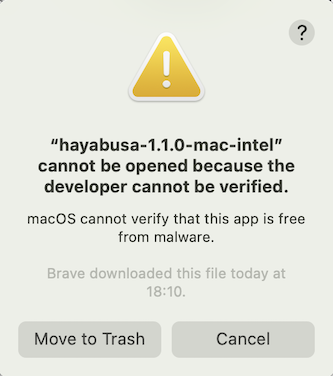
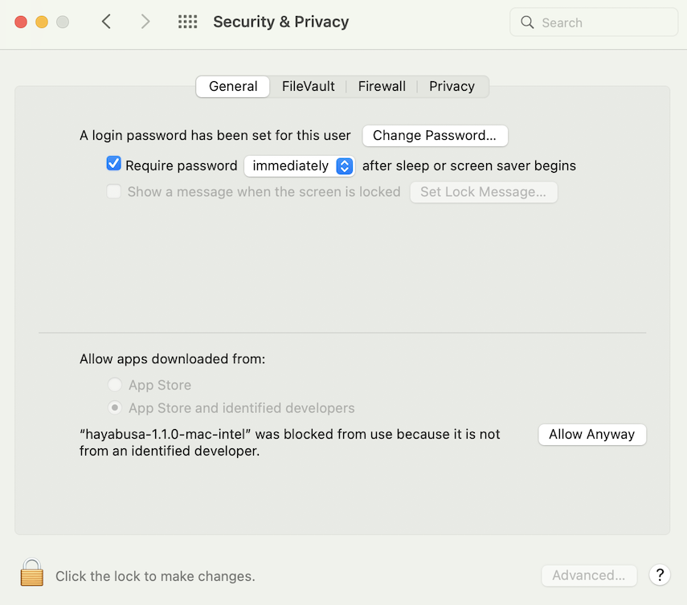
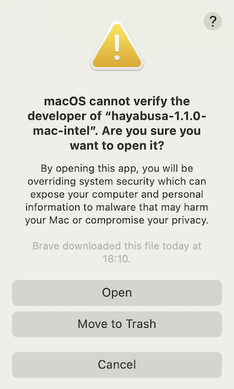

<div align="center">
 <p>
    
 </p>
 [ <b>English</b> ] | [<a href="README-Japanese.md">日本語</a>]
</div>

---

<p align="center">
    <a href="https://github.com/Yamato-Security/hayabusa/releases"></a>
    <a href="https://github.com/Yamato-Security/hayabusa/releases"></a>
    <a href="https://github.com/Yamato-Security/hayabusa/stargazers"></a>
    <a href="https://github.com/Yamato-Security/hayabusa/graphs/contributors"></a>
    <a href="https://www.blackhat.com/asia-22/arsenal/schedule/#hayabusa-26211"></a>
    <a href="https://codeblue.jp/2022/en/talks/?content=talks_24"></a>
    <a href="https://www.seccon.jp/2022/"></a>
    <a href=""></a>
    <a href="https://rust-reportcard.xuri.me/report/github.com/Yamato-Security/hayabusa"></a>
    <a href="https://codecov.io/gh/Yamato-Security/hayabusa" ></a>
    <a href="https://twitter.com/SecurityYamato"></a>
</p>

# About Hayabusa

Hayabusa is a **Windows event log fast forensics timeline generator** and **threat hunting tool** created by the [Yamato Security](https://yamatosecurity.connpass.com/) group in Japan. Hayabusa means ["peregrine falcon"](https://en.wikipedia.org/wiki/Peregrine_falcon) in Japanese and was chosen as peregrine falcons are the fastest animal in the world, great at hunting and highly trainable. It is written in [Rust](https://www.rust-lang.org/) and supports multi-threading in order to be as fast as possible. We have provided a [tool](https://github.com/Yamato-Security/hayabusa-rules/tree/main/tools/sigmac) to convert [Sigma](https://github.com/SigmaHQ/sigma) rules into Hayabusa rule format. The Sigma-compatible Hayabusa detection rules are written in YML in order to be as easily customizable and extensible as possible. Hayabusa can be run either on single running systems for live analysis, by gathering logs from single or multiple systems for offline analysis, or by running the [Hayabusa artifact](https://docs.velociraptor.app/exchange/artifacts/pages/windows.eventlogs.hayabusa/) with [Velociraptor](https://docs.velociraptor.app/) for enterprise-wide threat hunting and incident response. The output will be consolidated into a single CSV timeline for easy analysis in Excel, [Timeline Explorer](https://ericzimmerman.github.io/#!index.md), [Elastic Stack](doc/ElasticStackImport/ElasticStackImport-English.md), [Timesketch](https://timesketch.org/), etc...

# Companion Projects

* [EnableWindowsLogSettings](https://github.com/Yamato-Security/EnableWindowsLogSettings) - Documentation and scripts to properly enable Windows event logs.
* [Hayabusa Rules](https://github.com/Yamato-Security/hayabusa-rules) - Detection rules for hayabusa.
* [Hayabusa Sample EVTXs](https://github.com/Yamato-Security/hayabusa-sample-evtx) - Sample evtx files to use for testing hayabusa/sigma detection rules.
* [Takajo](https://github.com/Yamato-Security/takajo) - An analyzer for hayabusa results.
* [WELA (Windows Event Log Analyzer)](https://github.com/Yamato-Security/WELA) - An analyzer for Windows event logs written in PowerShell.

## Table of Contents

- [About Hayabusa](#about-hayabusa)
- [Companion Projects](#companion-projects)
  - [Table of Contents](#table-of-contents)
  - [Main Goals](#main-goals)
    - [Threat Hunting and Enterprise-wide DFIR](#threat-hunting-and-enterprise-wide-dfir)
    - [Fast Forensics Timeline Generation](#fast-forensics-timeline-generation)
- [Screenshots](#screenshots)
  - [Startup](#startup)
  - [Terminal Output](#terminal-output)
  - [Event Fequency Timeline (`-T` option)](#event-fequency-timeline--t-option)
  - [Results Summary](#results-summary)
  - [HTML Results Summary (`-H` option)](#html-results-summary--h-option)
  - [Analysis in Excel](#analysis-in-excel)
  - [Analysis in Timeline Explorer](#analysis-in-timeline-explorer)
  - [Critical Alert Filtering and Computer Grouping in Timeline Explorer](#critical-alert-filtering-and-computer-grouping-in-timeline-explorer)
  - [Analysis with the Elastic Stack Dashboard](#analysis-with-the-elastic-stack-dashboard)
  - [Analysis in Timesketch](#analysis-in-timesketch)
- [Analyzing Sample Timeline Results](#analyzing-sample-timeline-results)
- [Features](#features)
- [Downloads](#downloads)
- [Git cloning](#git-cloning)
- [Advanced: Compiling From Source (Optional)](#advanced-compiling-from-source-optional)
  - [Updating Rust Packages](#updating-rust-packages)
  - [Cross-compiling 32-bit Windows Binaries](#cross-compiling-32-bit-windows-binaries)
  - [macOS Compiling Notes](#macos-compiling-notes)
  - [Linux Compiling Notes](#linux-compiling-notes)
  - [Cross-compiling Linux MUSL Binaries](#cross-compiling-linux-musl-binaries)
- [Running Hayabusa](#running-hayabusa)
  - [Caution: Anti-Virus/EDR Warnings and Slow Runtimes](#caution-anti-virusedr-warnings-and-slow-runtimes)
  - [Windows](#windows)
  - [Linux](#linux)
  - [macOS](#macos)
- [Main Commands](#main-commands)
- [Usage](#usage)
  - [Main Help Menu](#main-help-menu)
  - [`csv-timeline` command](#csv-timeline-command)
  - [`json-timeline` command](#json-timeline-command)
  - [`logon-summary` command](#logon-summary-command)
  - [`metrics` command](#metrics-command)
  - [`pivot-keywords-list` command](#pivot-keywords-list-command)
  - [`update-rules` command](#update-rules-command)
  - [`level-tuning` command](#level-tuning-command)
  - [`set-default-profile` command](#set-default-profile-command)
  - [`list-profiles` command](#list-profiles-command)
  - [Usage Examples](#usage-examples)
  - [Pivot Keyword Generator](#pivot-keyword-generator)
  - [Logon Summary Generator](#logon-summary-generator)
- [Testing Hayabusa on Sample Evtx Files](#testing-hayabusa-on-sample-evtx-files)
- [Hayabusa Output](#hayabusa-output)
  - [Profiles](#profiles)
    - [1. `minimal` profile output](#1-minimal-profile-output)
    - [2. `standard` profile output](#2-standard-profile-output)
    - [3. `verbose` profile output](#3-verbose-profile-output)
    - [4. `all-field-info` profile output](#4-all-field-info-profile-output)
    - [5. `all-field-info-verbose` profile output](#5-all-field-info-verbose-profile-output)
    - [6. `super-verbose` profile output](#6-super-verbose-profile-output)
    - [7. `timesketch-minimal` profile output](#7-timesketch-minimal-profile-output)
    - [8. `timesketch-verbose` profile output](#8-timesketch-verbose-profile-output)
    - [Profile Comparison](#profile-comparison)
    - [Profile Field Aliases](#profile-field-aliases)
  - [Level Abbrevations](#level-abbrevations)
  - [MITRE ATT\&CK Tactics Abbreviations](#mitre-attck-tactics-abbreviations)
  - [Channel Abbreviations](#channel-abbreviations)
- [Other Abbreviations](#other-abbreviations)
  - [Progress Bar](#progress-bar)
  - [Color Output](#color-output)
  - [Results Summary](#results-summary-1)
    - [Event Fequency Timeline](#event-fequency-timeline)
- [Hayabusa Rules](#hayabusa-rules)
  - [Hayabusa v.s. Converted Sigma Rules](#hayabusa-vs-converted-sigma-rules)
  - [Detection Rule Tuning](#detection-rule-tuning)
  - [Detection Level Tuning](#detection-level-tuning)
  - [Event ID Filtering](#event-id-filtering)
- [Other Windows Event Log Analyzers and Related Resources](#other-windows-event-log-analyzers-and-related-resources)
- [Windows Logging Recommendations](#windows-logging-recommendations)
- [Sysmon Related Projects](#sysmon-related-projects)
- [Community Documentation](#community-documentation)
  - [English](#english)
  - [Japanese](#japanese)
- [Contribution](#contribution)
- [Bug Submission](#bug-submission)
- [License](#license)
- [Twitter](#twitter)

## Main Goals

### Threat Hunting and Enterprise-wide DFIR

Hayabusa currently has over 3000 Sigma rules and around 150 Hayabusa built-in detection rules with more rules being added regularly. It can be used for enterprise-wide proactive threat hunting as well as DFIR (Digital Forensics and Incident Response) for free with [Velociraptor](https://docs.velociraptor.app/)'s [Hayabusa artifact](https://docs.velociraptor.app/exchange/artifacts/pages/windows.eventlogs.hayabusa/). By combining these two open-source tools, you can essentially retroactively reproduce a SIEM when there is no SIEM setup in the environment. You can learn about how to do this by watching [Eric Capuano](https://twitter.com/eric_capuano)'s Velociraptor walkthrough [here](https://www.youtube.com/watch?v=Q1IoGX--814).

### Fast Forensics Timeline Generation

Windows event log analysis has traditionally been a very long and tedious process because Windows event logs are 1) in a data format that is hard to analyze and 2) the majority of data is noise and not useful for investigations. Hayabusa's goal is to extract out only useful data and present it in a concise as possible easy-to-read format that is usable not only by professionally trained analysts but any Windows system administrator.
Hayabusa hopes to let analysts get 80% of their work done in 20% of the time when compared to traditional Windows event log analysis.

# Screenshots

## Startup


## Terminal Output


## Event Fequency Timeline (`-T` option)


## Results Summary


## HTML Results Summary (`-H` option)


## Analysis in Excel


## Analysis in Timeline Explorer


## Critical Alert Filtering and Computer Grouping in Timeline Explorer


## Analysis with the Elastic Stack Dashboard


## Analysis in Timesketch


# Analyzing Sample Timeline Results

You can learn how to analyze CSV timelines in Excel and Timeline Explorer [here](doc/CSV-AnalysisWithExcelAndTimelineExplorer-English.pdf).

You can learn how to import CSV files into Elastic Stack [here](doc/ElasticStackImport/ElasticStackImport-English.md).

You can learn how to import CSV files into Timesketch [here](doc/TimesketchImport/TimesketchImport-English.md).

# Features

* Cross-platform support: Windows, Linux, macOS.
* Developed in Rust to be memory safe and faster than a hayabusa falcon!
* Multi-thread support delivering up to a 5x speed improvement.
* Creates a single easy-to-analyze CSV timeline for forensic investigations and incident response.
* Threat hunting based on IoC signatures written in easy to read/create/edit YML based hayabusa rules.
* Sigma rule support to convert sigma rules to hayabusa rules.
* Currently it supports the most sigma rules compared to other similar tools and even supports count rules and new aggregators such as `|equalsfield` and `|endswithfield`.
* Event ID metrics. (Useful for getting a picture of what types of events there are and for tuning your log settings.)
* Rule tuning configuration by excluding unneeded or noisy rules.
* MITRE ATT&CK mapping of tactics.
* Rule level tuning.
* Create a list of unique pivot keywords to quickly identify abnormal users, hostnames, processes, etc... as well as correlate events.
* Output all fields for more thorough investigations.
* Successful and failed logon summary.
* Enterprise-wide threat hunting and DFIR on all endpoints with [Velociraptor](https://docs.velociraptor.app/).
* Output to CSV, JSON/JSONL and HTML Summary Reports.
* Daily Sigma rule updates.

# Downloads

Please download the latest stable version of Hayabusa with compiled binaries or compile the source code from the [Releases](https://github.com/Yamato-Security/hayabusa/releases) page.

# Git cloning

You can `git clone` the repository with the following command and compile binary from source code:

**Warning:** The main branch of the repository is for development purposes so you may be able to access new features not yet officially released, however, there may be bugs so consider it unstable.

```bash
git clone https://github.com/Yamato-Security/hayabusa.git --recursive
```

Note: If you forget to use --recursive option, the `rules` folder, which is managed as a git submodule, will not be cloned.

You can sync the `rules` folder and get latest Hayabusa rules with `git pull --recurse-submodules` or use the following command:

```bash
hayabusa-2.1.0-win-x64.exe update-rules
```

If the update fails, you may need to rename the `rules` folder and try again.

>> Caution: When updating, rules and config files in the `rules` folder are replaced with the latest rules and config files in the [hayabusa-rules](https://github.com/Yamato-Security/hayabusa-rules) repository.
>> Any changes you make to existing files will be overwritten, so we recommend that you make backups of any files that you edit before updating.
>> If you are performing level tuning with `level-tuning`, please re-tune your rule files after each update.
>> If you add **new** rules inside of the `rules` folder, they will **not** be overwritten or deleted when updating.

# Advanced: Compiling From Source (Optional)

If you have Rust installed, you can compile from source with the following command:

Note: To compile, you need a Rust(rustc) version of `1.66.0` or higher.

```bash
cargo build --release
```

You can download the latest unstable version from the main branch or the latest stable version from the [Releases](https://github.com/Yamato-Security/hayabusa/releases) page.

Be sure to periodically update Rust with:

```bash
rustup update stable
```

The compiled binary will be outputted in the `./target/release` folder.

## Updating Rust Packages

You can update to the latest Rust crates before compiling:

```bash
cargo update
```

Please let us know if anything breaks after you update.

## Cross-compiling 32-bit Windows Binaries

You can create 32-bit binaries on 64-bit Windows systems with the following:

```bash
rustup install stable-i686-pc-windows-msvc
rustup target add i686-pc-windows-msvc
rustup run stable-i686-pc-windows-msvc cargo build --release
```

> **Warning: Be sure to run `rustup install stable-i686-pc-windows-msvc` whenever there is a new stable version of Rust as `rustup update stable` will not update the compiler for cross compiling and you may receive build errors.**

## macOS Compiling Notes

If you receive compile errors about openssl, you will need to install [Homebrew](https://brew.sh/) and then install the following packages:

```bash
brew install pkg-config
brew install openssl
```

## Linux Compiling Notes

If you receive compile errors about openssl, you will need to install the following package.

Ubuntu-based distros:

```bash
sudo apt install libssl-dev
```

Fedora-based distros:

```bash
sudo yum install openssl-devel
```

## Cross-compiling Linux MUSL Binaries

On a Linux OS, first install the target.

```bash
rustup install stable-x86_64-unknown-linux-musl
rustup target add x86_64-unknown-linux-musl
```

Compile with:

```bash
cargo build --release --target=x86_64-unknown-linux-musl
```

> **Warning: Be sure to run `rustup install stable-x86_64-unknown-linux-musl` whenever there is a new stable version of Rust as `rustup update stable` will not update the compiler for cross compiling and you may receive build errors.**

The MUSL binary will be created in the `./target/x86_64-unknown-linux-musl/release/` directory.
MUSL binaries are are about 15% slower than the GNU binaries, however, they are more portable accross different versions and distributions of linux.

# Running Hayabusa

## Caution: Anti-Virus/EDR Warnings and Slow Runtimes

You may receive an alert from anti-virus or EDR products when trying to run hayabusa or even just when downloading the `.yml` rules as there will be keywords like `mimikatz` and suspicious PowerShell commands in the detection signature.
These are false positives so will need to configure exclusions in your security products to allow hayabusa to run.
If you are worried about malware or supply chain attacks, please check the hayabusa source code and compile the binaries yourself.

You may experience slow runtime especially on the first run after a reboot due to the real-time protection of Windows Defender. You can avoid this by temporarily turning real-time protection off or adding an exclusion to the hayabusa runtime directory. (Please take into consideration the security risks before doing these.)

## Windows

In a Command/PowerShell Prompt or Windows Terminal, just run the appropriate 32-bit or 64-bit Windows binary.  

64-bit example: `hayabusa-2.1.0-win-x64.exe`

## Linux

You first need to make the binary executable.

```bash
chmod +x ./hayabusa-2.1.0-lin-gnu
```

Then run it from the Hayabusa root directory:

```bash
./hayabusa-2.1.0-lin-gnu
```

## macOS

From Terminal or iTerm2, you first need to make the binary executable.

```bash
chmod +x ./hayabusa-2.1.0-mac-intel
```

Then, try to run it from the Hayabusa root directory:

```bash
./hayabusa-2.1.0-mac-intel
```

On the latest version of macOS, you may receive the following security error when you try to run it:



Click "Cancel" and then from System Preferences, open "Security & Privacy" and from the General tab, click "Allow Anyway".



After that, try to run it again.

```bash
./hayabusa-2.1.0-mac-intel
```

The following warning will pop up, so please click "Open".



You should now be able to run hayabusa.

# Main Commands

* `csv-timeline`: Save the timeline in CSV format.
* `json-timeline`: Save the timeline in JSON/JSONL format.
* `logon-summary`: Print a summary of logon events.
* `metrics`: Print metrics of the number and percentage of events based on Event ID.
* `pivot-keywords-list`: Print a list of suspicious keywords to pivot on.
* `update-rules`: Sync the rules to the latest rules in the [hayabusa-rules](https://github.com/Yamato-Security/hayabusa-rules) GitHub repository.
* `level-tuning`: Custom tune the alerts' `level`.
* `set-default-profile`: Change the default profile.

# Usage

## Main Help Menu

```
Usage:
  hayabusa.exe help <COMMAND>
  hayabusa.exe <COMMAND> [OPTIONS]

Commands:
  csv-timeline         Save the timeline in CSV format
  json-timeline        Save the timeline in JSON/JSONL format
  logon-summary        Print a summary of successful and failed logons
  metrics              Print event ID metrics
  pivot-keywords-list  Create a list of pivot keywords
  update-rules         Update to the latest rules in the hayabusa-rules github repository
  level-tuning         Tune alert levels (default: ./rules/config/level_tuning.txt)
  set-default-profile  Set default output profile
  list-contributors    Print the list of contributors
  list-profiles        List the output profiles
  help                 Print this message or the help of the given subcommand(s)

Options:
      --no-color  Disable color output
  -q, --quiet     Quiet mode: do not display the launch banner
```

## `csv-timeline` command

```
Usage: csv-timeline <INPUT> [OPTIONS]

Options:
  -t, --thread-number <NUMBER>    Thread number (default: optimal number for performance)
  -Q, --quiet-errors              Quiet errors mode: do not save error logs
  -c, --rules-config <DIRECTORY>  Specify custom rule config directory (default: ./rules/config)
  -v, --verbose                   Output verbose information

Input:
  -d, --directory <DIRECTORY>  Directory of multiple .evtx files
  -f, --file <FILE>            File path to one .evtx file
  -l, --live-analysis          Analyze the local C:\Windows\System32\winevt\Logs folder

Advanced:
      --target-file-ext <EVTX_FILE_EXT>  Specify additional target file extensions (ex: evtx_data) (ex: evtx1,evtx2)
  -r, --rules <DIRECTORY/FILE>           Specify a custom rule directory or file (default: ./rules)

Output:
  -p, --profile <PROFILE>   Specify output profile
  -o, --output <FILE>       Save the timeline in format (csv-timeline ex: results.csv, json-timeline ex: results.json)
  -H, --html-report <FILE>  Save detail Results Summary in html (ex: results.html)

Filtering:
      --enable-deprecated-rules  Enable rules marked as deprecated
      --exclude-status <STATUS>  Ignore rules according to status (ex: experimental) (ex: stable,test)
  -m, --min-level <LEVEL>        Minimum level for rules (default: informational)
  -n, --enable-noisy-rules       Enable rules marked as noisy
      --timeline-end <DATE>      End time of the event logs to load (ex: "2022-02-22 23:59:59 +09:00")
      --timeline-start <DATE>    Start time of the event logs to load (ex: "2020-02-22 00:00:00 +09:00")
  -e, --eid-filter               Filter by Event IDs (config file: ./rules/config/target_event_IDs.txt)

Time Format:
      --European-time     Output timestamp in European time format (ex: 22-02-2022 22:00:00.123 +02:00)
      --ISO-8601          Output timestamp in ISO-8601 format (ex: 2022-02-22T10:10:10.1234567Z) (Always UTC)
      --RFC-2822          Output timestamp in RFC 2822 format (ex: Fri, 22 Feb 2022 22:00:00 -0600)
      --RFC-3339          Output timestamp in RFC 3339 format (ex: 2022-02-22 22:00:00.123456-06:00)
      --US-military-time  Output timestamp in US military time format (ex: 02-22-2022 22:00:00.123 -06:00)
      --US-time           Output timestamp in US time format (ex: 02-22-2022 10:00:00.123 PM -06:00)
  -U, --UTC               Output time in UTC format (default: local time)

Display Settings:
  -T, --visualize-timeline  Output event frequency timeline
      --no-summary          Do not display result summary
```

## `json-timeline` command

```
Usage: json-timeline <INPUT> [OPTIONS]

Options:
  -t, --thread-number <NUMBER>    Thread number (default: optimal number for performance)
  -Q, --quiet-errors              Quiet errors mode: do not save error logs
  -c, --rules-config <DIRECTORY>  Specify custom rule config directory (default: ./rules/config)
  -v, --verbose                   Output verbose information

Input:
  -d, --directory <DIRECTORY>  Directory of multiple .evtx files
  -f, --file <FILE>            File path to one .evtx file
  -l, --live-analysis          Analyze the local C:\Windows\System32\winevt\Logs folder

Advanced:
      --target-file-ext <EVTX_FILE_EXT>  Specify additional target file extensions (ex: evtx_data) (ex: evtx1,evtx2)
  -r, --rules <DIRECTORY/FILE>           Specify a custom rule directory or file (default: ./rules)

Output:
  -p, --profile <PROFILE>   Specify output profile
  -o, --output <FILE>       Save the timeline in format (csv-timeline ex: results.csv, json-timeline ex: results.json)
  -H, --html-report <FILE>  Save detail Results Summary in html (ex: results.html)
  -J, --jsonl               Save the timeline in JSONL format (ex: -J -o results.jsonl)

Filtering:
      --enable-deprecated-rules  Enable rules marked as deprecated
      --exclude-status <STATUS>  Ignore rules according to status (ex: experimental) (ex: stable,test)
  -m, --min-level <LEVEL>        Minimum level for rules (default: informational)
  -n, --enable-noisy-rules       Enable rules marked as noisy
      --timeline-end <DATE>      End time of the event logs to load (ex: "2022-02-22 23:59:59 +09:00")
      --timeline-start <DATE>    Start time of the event logs to load (ex: "2020-02-22 00:00:00 +09:00")
  -e, --eid-filter               Filter by Event IDs (config file: ./rules/config/target_event_IDs.txt)

Time Format:
      --European-time     Output timestamp in European time format (ex: 22-02-2022 22:00:00.123 +02:00)
      --ISO-8601          Output timestamp in ISO-8601 format (ex: 2022-02-22T10:10:10.1234567Z) (Always UTC)
      --RFC-2822          Output timestamp in RFC 2822 format (ex: Fri, 22 Feb 2022 22:00:00 -0600)
      --RFC-3339          Output timestamp in RFC 3339 format (ex: 2022-02-22 22:00:00.123456-06:00)
      --US-military-time  Output timestamp in US military time format (ex: 02-22-2022 22:00:00.123 -06:00)
      --US-time           Output timestamp in US time format (ex: 02-22-2022 10:00:00.123 PM -06:00)
  -U, --UTC               Output time in UTC format (default: local time)

Display Settings:
  -T, --visualize-timeline  Output event frequency timeline
      --no-summary          Do not display result summary
```

## `logon-summary` command

```
Usage: logon-summary <INPUT> [OPTIONS]

Options:
  -t, --thread-number <NUMBER>    Thread number (default: optimal number for performance)
  -Q, --quiet-errors              Quiet errors mode: do not save error logs
  -c, --rules-config <DIRECTORY>  Specify custom rule config directory (default: ./rules/config)
  -v, --verbose                   Output verbose information

Input:
  -d, --directory <DIRECTORY>  Directory of multiple .evtx files
  -f, --file <FILE>            File path to one .evtx file
  -l, --live-analysis          Analyze the local C:\Windows\System32\winevt\Logs folder

Advanced:
      --target-file-ext <EVTX_FILE_EXT>  Specify additional target file extensions (ex: evtx_data) (ex: evtx1,evtx2)

Output:
  -o, --output <FILE>  Save the Logon summary in CSV format (ex: logon-summary.csv)
```

## `metrics` command

```
Usage: metrics <INPUT> [OPTIONS]

Options:
  -t, --thread-number <NUMBER>    Thread number (default: optimal number for performance)
  -Q, --quiet-errors              Quiet errors mode: do not save error logs
  -c, --rules-config <DIRECTORY>  Specify custom rule config directory (default: ./rules/config)
  -v, --verbose                   Output verbose information

Input:
  -d, --directory <DIRECTORY>  Directory of multiple .evtx files
  -f, --file <FILE>            File path to one .evtx file
  -l, --live-analysis          Analyze the local C:\Windows\System32\winevt\Logs folder

Advanced:
      --target-file-ext <EVTX_FILE_EXT>  Specify additional target file extensions (ex: evtx_data) (ex: evtx1,evtx2)

Output:
  -o, --output <FILE>  Save the Metrics in CSV format (ex: metrics.csv)
```

## `pivot-keywords-list` command

```
Usage: pivot-keywords-list <INPUT> [OPTIONS]

Options:
  -t, --thread-number <NUMBER>    Thread number (default: optimal number for performance)
  -Q, --quiet-errors              Quiet errors mode: do not save error logs
  -c, --rules-config <DIRECTORY>  Specify custom rule config directory (default: ./rules/config)
  -v, --verbose                   Output verbose information

Input:
  -d, --directory <DIRECTORY>  Directory of multiple .evtx files
  -f, --file <FILE>            File path to one .evtx file
  -l, --live-analysis          Analyze the local C:\Windows\System32\winevt\Logs folder

Advanced:
      --target-file-ext <EVTX_FILE_EXT>  Specify additional target file extensions (ex: evtx_data) (ex: evtx1,evtx2)

Output:
  -o, --output <FILE>  Save pivot words to separate files (ex: pivot-keywords.txt)

Filtering:
      --enable-deprecated-rules  Enable rules marked as deprecated
      --exclude-status <STATUS>  Ignore rules according to status (ex: experimental) (ex: stable,test)
  -m, --min-level <LEVEL>        Minimum level for rules (default: informational)
  -n, --enable-noisy-rules       Enable rules marked as noisy
      --timeline-end <DATE>      End time of the event logs to load (ex: "2022-02-22 23:59:59 +09:00")
      --timeline-start <DATE>    Start time of the event logs to load (ex: "2020-02-22 00:00:00 +09:00")
  -e, --eid-filter               Filter by Event IDs (config file: ./rules/config/target_event_IDs.txt)
```

## `update-rules` command

```
Usage: update-rules [OPTIONS]

Options:
      --no-color  Disable color output
  -q, --quiet     Quiet mode: do not display the launch banner

Advanced:
  -r, --rules <DIRECTORY/FILE>  Specify a custom rule directory or file (default: ./rules)
```

## `level-tuning` command

```
Usage: level-tuning [OPTIONS]

Options:
  -f, --file <FILE>   Tune alert levels (default: ./rules/config/level_tuning.txt)
      --no-color      Disable color output
  -q, --quiet         Quiet mode: do not display the launch banner
```

## `set-default-profile` command

```
Usage: set-default-profile [OPTIONS]

Options:
  -p, --profile <PROFILE>  Specify output profile
      --no-color           Disable color output
  -q, --quiet              Quiet mode: do not display the launch banner
```

## `list-profiles` command

```
Usage: list-profiles [OPTIONS]

Options:
      --no-color  Disable color output
  -q, --quiet     Quiet mode: do not display the launch banner
```


## Usage Examples

* Run hayabusa against one Windows event log file with default standard profile:

```
hayabusa-2.1.0-win-x64.exe csv-timeline -f eventlog.evtx
```

* Run hayabusa against the sample-evtx directory with multiple Windows event log files with the verbose profile:

```
hayabusa-2.1.0-win-x64.exe csv-timeline -d .\hayabusa-sample-evtx -p verbose
```

* Export to a single CSV file for further analysis with excel, timeline explorer, elastic stack, etc... and include all field information (Warning: your file output size will become much larger with the `super-verbose` profile!):

```
hayabusa-2.1.0-win-x64.exe csv-timeline -d .\hayabusa-sample-evtx -o results.csv -p super-verbose
```

* Save the timline in JSON format:

```
hayabusa-2.1.0-win-x64.exe json-timeline -d .\hayabusa-sample-evtx -o results.json
```

* Only run hayabusa rules (the default is to run all the rules in `-r .\rules`):

```
hayabusa-2.1.0-win-x64.exe csv-timeline -d .\hayabusa-sample-evtx -r .\rules\hayabusa -o results.csv
```

* Only run hayabusa rules for logs that are enabled by default on Windows:

```
hayabusa-2.1.0-win-x64.exe csv-timeline -d .\hayabusa-sample-evtx -r .\rules\hayabusa\builtin -o results.csv
```

* Only run hayabusa rules for sysmon logs:

```
hayabusa-2.1.0-win-x64.exe csv-timeline -d .\hayabusa-sample-evtx -r .\rules\hayabusa\sysmon -o results.csv
```

* Only run sigma rules:

```
hayabusa-2.1.0-win-x64.exe csv-timeline -d .\hayabusa-sample-evtx -r .\rules\sigma -o results.csv
```

* Enable deprecated rules (those with `status` marked as `deprecated`) and noisy rules (those whose rule ID is listed in `.\rules\config\noisy_rules.txt`):

```
hayabusa-2.1.0-win-x64.exe csv-timeline -d .\hayabusa-sample-evtx --enable-noisy-rules --enable-deprecated-rules -o results.csv
```

* Only run rules to analyze logons and output in the UTC timezone:

```
hayabusa-2.1.0-win-x64.exe csv-timeline -d .\hayabusa-sample-evtx -r .\rules\hayabusa\builtin\Security\LogonLogoff\Logon -U -o results.csv
```

* Run on a live Windows machine (requires Administrator privileges) and only detect alerts (potentially malicious behavior):

```
hayabusa-2.1.0-win-x64.exe csv-timeline -l -m low
```

* Create a list of pivot keywords from critical alerts and save the results. (Results will be saved to `keywords-Ip Addresses.txt`, `keywords-Users.txt`, etc...):

```
hayabusa-2.1.0-win-x64.exe pivot-keywords-list -l -m critical -o keywords.txt
```

* Print Event ID metrics:

```
hayabusa-2.1.0-win-x64.exe metrics -f Security.evtx
```

* Print logon summary:

```
hayabusa-2.1.0-win-x64.exe logon-summary -f Security.evtx
```

* Print verbose information (useful for determining which files take long to process, parsing errors, etc...):

```
hayabusa-2.1.0-win-x64.exe csv-timeline -d .\hayabusa-sample-evtx -v
```

* Verbose output example:

```
Checking target evtx FilePath: "./hayabusa-sample-evtx/YamatoSecurity/T1027.004_Obfuscated Files or Information\u{a0}Compile After Delivery/sysmon.evtx"
1 / 509 [>-------------------------------------------------------------------------------------------------------------------------------------------] 0.20 % 1s 
Checking target evtx FilePath: "./hayabusa-sample-evtx/YamatoSecurity/T1558.004_Steal or Forge Kerberos Tickets AS-REP Roasting/Security.evtx"
2 / 509 [>-------------------------------------------------------------------------------------------------------------------------------------------] 0.39 % 1s 
Checking target evtx FilePath: "./hayabusa-sample-evtx/YamatoSecurity/T1558.003_Steal or Forge Kerberos Tickets\u{a0}Kerberoasting/Security.evtx"
3 / 509 [>-------------------------------------------------------------------------------------------------------------------------------------------] 0.59 % 1s 
Checking target evtx FilePath: "./hayabusa-sample-evtx/YamatoSecurity/T1197_BITS Jobs/Windows-BitsClient.evtx"
4 / 509 [=>------------------------------------------------------------------------------------------------------------------------------------------] 0.79 % 1s 
Checking target evtx FilePath: "./hayabusa-sample-evtx/YamatoSecurity/T1218.004_Signed Binary Proxy Execution\u{a0}InstallUtil/sysmon.evtx"
5 / 509 [=>------------------------------------------------------------------------------------------------------------------------------------------] 0.98 % 1s
```

* Output to a CSV format compatible to import into [Timesketch](https://timesketch.org/):

```
hayabusa-2.1.0-win-x64.exe csv-timeline -d ../hayabusa-sample-evtx --RFC-3339 -o timesketch-import.csv -p timesketch -U
```

* Quiet error mode:
By default, hayabusa will save error messages to error log files.
If you do not want to save error messages, please add `-Q`.

## Pivot Keyword Generator

You can use the `pivot-keywords-list` command to create a list of unique pivot keywords to quickly identify abnormal users, hostnames, processes, etc... as well as correlate events. You can customize what keywords you want to search for by editing `./config/pivot_keywords.txt`.
This is the default setting:

```txt
Users.SubjectUserName
Users.TargetUserName
Users.User
Logon IDs.SubjectLogonId
Logon IDs.TargetLogonId
Workstation Names.WorkstationName
Ip Addresses.IpAddress
Processes.Image
```

The format is `KeywordName.FieldName`. For example, when creating the list of `Users`, hayabusa will list up all the values in the `SubjectUserName`, `TargetUserName` and `User` fields. By default, hayabusa will return results from all events (informational and higher) so we highly recommend combining the `pivot-keyword-list` command with the `-m` or `--min-level` option. For example, start off with only creating keywords from `critical` alerts with `-m critical` and then continue with `-m high`, `-m medium`, etc... There will most likely be common keywords in your results that will match on many normal events, so after manually checking the results and creating a list of unique keywords in a single file, you can then create a narrowed down timeline of suspicious activity with a command like `grep -f keywords.txt timeline.csv`.

## Logon Summary Generator

You can use the `logon-summary` command to output logon information summary (logon usernames and successful and failed logon count).
You can display the logon information for one evtx file with `-f` or multiple evtx files with the `-d` option.

# Testing Hayabusa on Sample Evtx Files

We have provided some sample evtx files for you to test hayabusa and/or create new rules at [https://github.com/Yamato-Security/hayabusa-sample-evtx](https://github.com/Yamato-Security/hayabusa-sample-evtx)

You can download the sample evtx files to a new `hayabusa-sample-evtx` sub-directory with the following command:

```bash
git clone https://github.com/Yamato-Security/hayabusa-sample-evtx.git
```

# Hayabusa Output

## Profiles

Hayabusa has 5 pre-defined profiles to use in `config/profiles.yaml`:

1. `minimal`
2. `standard` (default)
3. `verbose`
4. `all-field-info`
5. `all-field-info-verbose`
6. `super-verbose`
7. `timesketch-minimal`
8. `timesketch-verbose`

You can easily customize or add your own profiles by editing this file.
You can also easily change the default profile with `set-default-profile -P <profile>`.
Use the `csv-timeline --list-profiles` option to show the available profiles and their field information.

### 1. `minimal` profile output

`%Timestamp%`, `%Computer%`, `%Channel%`, `%EventID%`, `%Level%`, `%RuleTitle%`, `%Details%`

### 2. `standard` profile output

`%Timestamp%`, `%Computer%`, `%Channel%`, `%EventID%`, `%Level%`, `%RecordID%`, `%RuleTitle%`, `%Details%`

### 3. `verbose` profile output

`%Timestamp%`, `%Computer%`, `%Channel%`, `%EventID%`, `%Level%`, `%MitreTactics`, `%MitreTags%`, `%OtherTags%`, `%RecordID%`, `%RuleTitle%`, `%Details%`, `%RuleFile%`, `%EvtxFile%`

### 4. `all-field-info` profile output

Instead of outputting the minimal `details` information, all field information in the `EventData` section will be outputted.

`%Timestamp%`, `%Computer%`, `%Channel%`, `%EventID%`, `%Level%`, `%RecordID%`, `%RuleTitle%`, `%AllFieldInfo%`, `%RuleFile%`, `%EvtxFile%`

### 5. `all-field-info-verbose` profile output

`all-field-info` profile plus tag information.

`%Timestamp%`, `%Computer%`, `%Channel%`, `%EventID%`, `%Level%`, `%MitreTactics`, `%MitreTags%`, `%OtherTags%`, `%RecordID%`, `%RuleTitle%`, `%AllFieldInfo%`, `%RuleFile%`, `%EvtxFile%`

### 6. `super-verbose` profile output

`verbose` profile plus all field information (`%AllFieldInfo%`). **(Warning: this will usually double the output file size!)**

`%Timestamp%`, `%Computer%`, `%Channel%`, `%Provider%`, `%EventID%`, `%Level%`, `%MitreTactics`, `%MitreTags%`, `%OtherTags%`, `%RecordID%`, `%RuleTitle%`, `%RuleAuthor%`, `%RuleCreationDate%`, `%RuleModifiedDate%`, `%Status%`, `%Details%`, `%RuleFile%`, `%EvtxFile%`, `%AllFieldInfo%`

### 7. `timesketch-minimal` profile output

The `verbose` profile that is compatible with importing into [Timesketch](https://timesketch.org/).

`%Timestamp%`, `hayabusa`, `%RuleTitle%`, `%Computer%`, `%Channel%`, `%EventID%`, `%Level%`, `%MitreTactics`, `%MitreTags%`, `%OtherTags%`, `%RecordID%`, `%Details%`, `%RuleFile%`, `%EvtxFile%`

### 8. `timesketch-verbose` profile output

The `super-verbose` profile that is compatible with importing into [Timesketch](https://timesketch.org/).
**(Warning: this will usually double the output file size!)**

`%Timestamp%`, `hayabusa`, `%RuleTitle%`, `%Computer%`, `%Channel%`, `%EventID%`, `%Level%`, `%MitreTactics`, `%MitreTags%`, `%OtherTags%`, `%RecordID%`, `%Details%`, `%RuleFile%`, `%EvtxFile%`, `%AllFieldInfo%`

### Profile Comparison

The following benchmarks were conducted on a 2018 MBP with 7.5GB of evtx data.

| Profile | Processing Time | Output Filesize |
| :---: | :---: | :---: |
| minimal | 16 minutes 18 seconds | 690 MB |
| standard | 16 minutes 23 seconds | 710 MB |
| verbose | 17 minutes | 990 MB |
| timesketch-minimal | 17 minutes | 1015 MB |
| all-field-info-verbose | 16 minutes 50 seconds | 1.6 GB |
| super-verbose | 17 minutes 12 seconds | 2.1 GB |

### Profile Field Aliases

| Alias name | Hayabusa output information|
| :--- | :--- |
|%Timestamp% | Default is `YYYY-MM-DD HH:mm:ss.sss +hh:mm` format. `<Event><System><TimeCreated SystemTime>` field in the event log. The default timezone will be the local timezone but you can change the timezone to UTC with the `--UTC` option. |
|%Computer% | The `<Event><System><Computer>` field. |
|%Channel% | The name of log. `<Event><System><Channel>` field. |
|%EventID% | The `<Event><System><EventID>` field. |
|%Level% | The `level` field in the YML detection rule. (`informational`, `low`, `medium`, `high`, `critical`) |
|%MitreTactics% | MITRE ATT&CK [tactics](https://attack.mitre.org/tactics/enterprise/) (Ex: Initial Access, Lateral Movement, etc...). |
|%MitreTags% | MITRE ATT&CK Group ID, Technique ID and Software ID. |
|%OtherTags% | Any keyword in the `tags` field in a YML detection rule which is not included in `MitreTactics` or `MitreTags`. |
|%RecordID% | The Event Record ID from `<Event><System><EventRecordID>` field. |
|%RuleTitle% | The `title` field in the YML detection rule. |
|%Details% | The `details` field in the YML detection rule, however, only hayabusa rules have this field. This field gives extra information about the alert or event and can extract useful data from the fields in event logs. For example, usernames, command line information, process information, etc... When a placeholder points to a field that does not exist or there is an incorrect alias mapping, it will be outputted as `n/a` (not available). If the `details` field is not specified (i.e. sigma rules), default `details` messages to extract fields defined in `./rules/config/default_details.txt` will be outputted. You can add more default `details` messages by adding the `Provider Name`, `EventID` and `details` message you want to output in `default_details.txt`. When no `details` field is defined in a rule nor in `default_details.txt`, all fields will be outputted to the `details` column. |
|%AllFieldInfo% | All field information. |
|%RuleFile% | The filename of the detection rule that generated the alert or event. |
|%EvtxFile% | The evtx filename that caused the alert or event. |
|%RuleAuthor% | The `author` field in the YML detection rule. |
|%RuleCreationDate% | The `date` field in the YML detection rule. |
|%RuleModifiedDate% | The `modified` field in the YML detection rule. |
|%Status% | The `status` field in the YML detection rule. |
|%RuleID% | The `id` field in the YML detection rule. |
|%Provider% | The `Name` attribute in `<Event><System><Provider>` field. |
|%RenderedMessage% | The `<Event><RenderingInfo><Message>` field in WEC forwarded logs. |

You can use these aliases in your output profiles, as well as define other [event key alises](https://github.com/Yamato-Security/hayabusa-rules/blob/main/README.md#eventkey-aliases) to output other fields.

## Level Abbrevations

In order to save space, we use the following abbrevations when displaying the alert `level`.

* `crit`: `critical`
* `high`: `high`
* `med `: `medium`
* `low `: `low`
* `info`: `informational`

## MITRE ATT&CK Tactics Abbreviations

In order to save space, we use the following abbreviations when displaying MITRE ATT&CK tactic tags.
You can freely edit these abbreviations in the `./config/mitre_tactics.txt` configuration file.

* `Recon` : Reconnaissance
* `ResDev` : Resource Development
* `InitAccess` : Initial Access
* `Exec` : Execution
* `Persis` : Persistence
* `PrivEsc` : Privilege Escalation
* `Evas` : Defense Evasion
* `CredAccess` : Credential Access
* `Disc` : Discovery
* `LatMov` : Lateral Movement
* `Collect` : Collection
* `C2` : Command and Control
* `Exfil` : Exfiltration
* `Impact` : Impact

## Channel Abbreviations

In order to save space, we use the following abbreviations when displaying Channel.
You can freely edit these abbreviations in the `./rules/config/channel_abbreviations.txt` configuration file.

* `App` : `Application`
* `AppLocker` : `Microsoft-Windows-AppLocker/*`
* `BitsCli` : `Microsoft-Windows-Bits-Client/Operational`
* `CodeInteg` : `Microsoft-Windows-CodeIntegrity/Operational`
* `Defender` : `Microsoft-Windows-Windows Defender/Operational`
* `DHCP-Svr` : `Microsoft-Windows-DHCP-Server/Operational`
* `DNS-Svr` : `DNS Server`
* `DvrFmwk` : `Microsoft-Windows-DriverFrameworks-UserMode/Operational`
* `Exchange` : `MSExchange Management`
* `Firewall` : `Microsoft-Windows-Windows Firewall With Advanced Security/Firewall`
* `KeyMgtSvc` : `Key Management Service`
* `LDAP-Cli` : `Microsoft-Windows-LDAP-Client/Debug`
* `NTLM` `Microsoft-Windows-NTLM/Operational`
* `OpenSSH` : `OpenSSH/Operational`
* `PrintAdm` : `Microsoft-Windows-PrintService/Admin`
* `PrintOp` : `Microsoft-Windows-PrintService/Operational`
* `PwSh` : `Microsoft-Windows-PowerShell/Operational`
* `PwShClassic` : `Windows PowerShell`
* `RDP-Client` : `Microsoft-Windows-TerminalServices-RDPClient/Operational`
* `Sec` : `Security`
* `SecMitig` : `Microsoft-Windows-Security-Mitigations/*`
* `SmbCliSec` : `Microsoft-Windows-SmbClient/Security`
* `SvcBusCli` : `Microsoft-ServiceBus-Client`
* `Sys` : `System`
* `Sysmon` : `Microsoft-Windows-Sysmon/Operational`
* `TaskSch` : `Microsoft-Windows-TaskScheduler/Operational`
* `WinRM` : `Microsoft-Windows-WinRM/Operational`
* `WMI` : `Microsoft-Windows-WMI-Activity/Operational`

# Other Abbreviations

The following abbreviations are used in rules in order to make the output as concise as possible:

* `Acct` -> Account
* `Addr` -> Address
* `Auth` -> Authentication
* `Cli` -> Client
* `Chan` -> Channel
* `Cmd` -> Command
* `Cnt` -> Count
* `Comp` -> Computer
* `Conn` -> Connection/Connected
* `Creds` -> Credentials
* `Crit` -> Critical
* `Disconn` -> Disconnection/Disconnected
* `Dir` -> Directory
* `Drv` -> Driver
* `Dst` -> Destination
* `EID` -> Event ID
* `Err` -> Error
* `Exec` -> Execution
* `FW` -> Firewall
* `Grp` -> Group
* `Img` -> Image
* `Inj` -> Injection
* `Krb` -> Kerberos
* `LID` -> Logon ID
* `Med` -> Medium
* `Net` -> Network
* `Obj` -> Object
* `Op` -> Operational/Operation
* `Proto` -> Protocol
* `PW` -> Password
* `Reconn` -> Reconnection
* `Req` -> Request
* `Rsp` -> Response
* `Sess` -> Session
* `Sig` -> Signature
* `Susp` -> Suspicious
* `Src` -> Source
* `Svc` -> Service
* `Svr` -> Server
* `Temp` -> Temporary
* `Term` -> Termination/Terminated
* `Tkt` -> Ticket
* `Tgt` -> Target
* `Unkwn` -> Unknown
* `Usr` -> User
* `Perm` -> Permament
* `Pkg` -> Package
* `Priv` -> Privilege
* `Proc` -> Process
* `PID` -> Process ID
* `PGUID` -> Process GUID (Global Unique ID)
* `Ver` -> Version

## Progress Bar

The progress bar will only work with multiple evtx files.
It will display in real time the number and percent of evtx files that it has finished analyzing.

## Color Output

The alerts will be outputted in color based on the alert `level`.
You can change the default colors in the config file at `./config/level_color.txt` in the format of `level,(RGB 6-digit ColorHex)`.
If you want to disable color output, you can use `--no-color` option.

## Results Summary

Total events, the number of events with hits, data reduction metrics, total and unique detections, dates with the most detections, top computers with detections and top alerts are displayed after every scan.

### Event Fequency Timeline

If you add `-T` or `--visualize-timeline` option, the Event Frequency Timeline feature displays a sparkline frequency timeline of detected events.
Note: There needs to be more than 5 events. Also, the characters will not render correctly on the default Command Prompt or PowerShell Prompt, so please use a terminal like Windows Terminal, iTerm2, etc...

# Hayabusa Rules

Hayabusa detection rules are written in a sigma-like YML format and are located in the `rules` folder.
The rules are hosted at [https://github.com/Yamato-Security/hayabusa-rules](https://github.com/Yamato-Security/hayabusa-rules) so please send any issues and pull requests for rules there instead of the main hayabusa repository.

Please read [the hayabusa-rules repository README](https://github.com/Yamato-Security/hayabusa-rules/blob/main/README.md) to understand about the rule format and how to create rules.

All of the rules from the hayabusa-rules repository should be placed in the `rules` folder.
`informational` level rules are considered `events`, while anything with a `level` of `low` and higher are considered `alerts`.

The hayabusa rule directory structure is separated into 2 directories:

* `builtin`: logs that can be generated by Windows built-in functionality.
* `sysmon`: logs that are generated by [sysmon](https://docs.microsoft.com/en-us/sysinternals/downloads/sysmon).

Rules are further seperated into directories by log type (Example: Security, System, etc...) and are named in the following format:

Please check out the current rules to use as a template in creating new ones or for checking the detection logic.

## Hayabusa v.s. Converted Sigma Rules

Sigma rules need to first be converted to hayabusa rule format explained [here](https://github.com/Yamato-Security/hayabusa-rules/blob/main/tools/sigmac/README.md).
A converter is needed as hayabusa rules do not support `|contains|all`, `1 of selection*`, `all of selection*` and regular expressions that do not work with the [Rust regex crate](https://docs.rs/regex/1.5.4/regex/) by default.
Almost all hayabusa rules are compatible with the sigma format so you can use them just like sigma rules to convert to other SIEM formats.
Hayabusa rules are designed solely for Windows event log analysis and have the following benefits:

1. An extra `details` field to display additional information taken from only the useful fields in the log.
2. They are all tested against sample logs and are known to work.
   > Some sigma rules may not work as intended due to bugs in the conversion process, unsupported features, or differences in implementation (such as in regular expressions).
3. Extra aggregators not found in sigma, such as `|equalsfield` and `|endswithfield`.

**Limitations**: To our knowledge, hayabusa provides the greatest support for sigma rules out of any open source Windows event log analysis tool, however, there are still rules that are not supported:

1. Aggregation expressions besides `count` in the [sigma rule specification](https://github.com/SigmaHQ/sigma-specification).
2. Rules that use `|near` or `|base64offset|contains`.

## Detection Rule Tuning

Like firewalls and IDSes, any signature-based tool will require some tuning to fit your environment so you may need to permanently or temporarily exclude certain rules.

You can add a rule ID (Example: `4fe151c2-ecf9-4fae-95ae-b88ec9c2fca6`) to `./rules/config/exclude_rules.txt` in order to ignore any rule that you do not need or cannot be used.

You can also add a rule ID to `./rules/config/noisy_rules.txt` in order to ignore the rule by default but still be able to use the rule with the `-n` or `--enable-noisy-rules` option.

## Detection Level Tuning

Hayabusa and Sigma rule authors will determine the risk level of the alert when writing their rules.
However, the actual risk level will differ between environments.
You can tune the risk level of the rules by adding them to `./rules/config/level_tuning.txt` and executing `hayabusa-2.1.0-win-x64.exe level-tuning` which will update the `level` line in the rule file.
Please note that the rule file will be updated directly.

`./rules/config/level_tuning.txt` sample line:

```csv
id,new_level
00000000-0000-0000-0000-000000000000,informational # sample level tuning line
```

In this case, the risk level of the rule with an `id` of `00000000-0000-0000-0000-000000000000` in the rules directory will have its `level` rewritten to `informational`.

## Event ID Filtering

By default, hayabusa scan all events.
If you want to improve performance, Please use the `-e, --eid-filter` option. By ignorning events that have no detection rules.
The IDs defined in `./rules/config/target_event_IDs.txt` will be scanned.

# Other Windows Event Log Analyzers and Related Resources

There is no "one tool to rule them all" and we have found that each has its own merits so we recommend checking out these other great tools and projects and seeing which ones you like.

* [APT-Hunter](https://github.com/ahmedkhlief/APT-Hunter) - Attack detection tool written in Python.
* [Awesome Event IDs](https://github.com/stuhli/awesome-event-ids) -  Collection of Event ID resources useful for Digital Forensics and Incident Response
* [Chainsaw](https://github.com/countercept/chainsaw) - Another sigma-based attack detection tool written in Rust.
* [DeepBlueCLI](https://github.com/sans-blue-team/DeepBlueCLI) - Attack detection tool written in Powershell by [Eric Conrad](https://twitter.com/eric_conrad).
* [Epagneul](https://github.com/jurelou/epagneul) - Graph visualization for Windows event logs.
* [EventList](https://github.com/miriamxyra/EventList/) - Map security baseline event IDs to MITRE ATT&CK by [Miriam Wiesner](https://github.com/miriamxyra).
* [Mapping MITRE ATT&CK with Window Event Log IDs](https://www.socinvestigation.com/mapping-mitre-attck-with-window-event-log-ids/) - by [Michel de CREVOISIER](https://twitter.com/mdecrevoisier)
* [EvtxECmd](https://github.com/EricZimmerman/evtx) - Evtx parser by [Eric Zimmerman](https://twitter.com/ericrzimmerman).
* [EVTXtract](https://github.com/williballenthin/EVTXtract) - Recover EVTX log files from unallocated space and memory images.
* [EvtxToElk](https://www.dragos.com/blog/industry-news/evtxtoelk-a-python-module-to-load-windows-event-logs-into-elasticsearch/) - Python tool to send Evtx data to Elastic Stack.
* [EVTX ATTACK Samples](https://github.com/sbousseaden/EVTX-ATTACK-SAMPLES) - EVTX attack sample event log files by [SBousseaden](https://twitter.com/SBousseaden).
* [EVTX-to-MITRE-Attack](https://github.com/mdecrevoisier/EVTX-to-MITRE-Attack) - EVTX attack sample event log files mapped to ATT&CK by [Michel de CREVOISIER](https://twitter.com/mdecrevoisier)
* [EVTX parser](https://github.com/omerbenamram/evtx) - the Rust evtx library we use written by [@OBenamram](https://twitter.com/obenamram).
* [Grafiki](https://github.com/lucky-luk3/Grafiki) - Sysmon and PowerShell log visualizer.
* [LogonTracer](https://github.com/JPCERTCC/LogonTracer) - A graphical interface to visualize logons to detect lateral movement by [JPCERTCC](https://twitter.com/jpcert_en).
* [NSA Windows Event Monitoring Guidance](https://github.com/nsacyber/Event-Forwarding-Guidance/tree/master/Events) - NSA's guide on what to monitor for.
* [RustyBlue](https://github.com/Yamato-Security/RustyBlue) - Rust port of DeepBlueCLI by Yamato Security.
* [Sigma](https://github.com/SigmaHQ/sigma) - Community based generic SIEM rules.
* [SOF-ELK](https://github.com/philhagen/sof-elk) - A pre-packaged VM with Elastic Stack to import data for DFIR analysis by [Phil Hagen](https://twitter.com/philhagen)
* [so-import-evtx](https://docs.securityonion.net/en/2.3/so-import-evtx.html) - Import evtx files into Security Onion.
* [SysmonTools](https://github.com/nshalabi/SysmonTools) - Configuration and off-line log visualization tool for Sysmon.
* [Timeline Explorer](https://ericzimmerman.github.io/#!index.md) - The best CSV timeline analyzer by [Eric Zimmerman](https://twitter.com/ericrzimmerman).
* [Windows Event Log Analysis - Analyst Reference](https://www.forwarddefense.com/media/attachments/2021/05/15/windows-event-log-analyst-reference.pdf) - by Forward Defense's Steve Anson.
* [WELA (Windows Event Log Analyzer)](https://github.com/Yamato-Security/WELA) - The swiff-army knife for Windows event logs by [Yamato Security](https://github.com/Yamato-Security/)
* [Zircolite](https://github.com/wagga40/Zircolite) - Sigma-based attack detection tool written in Python.

# Windows Logging Recommendations

In order to properly detect malicious activity on Windows machines, you will need to improve the default log settings.
We have created a seperate project to document what log settings need to be enabled as well as scripts to automatically enable the proper settings at [https://github.com/Yamato-Security/EnableWindowsLogSettings](https://github.com/Yamato-Security/EnableWindowsLogSettings).

We also recommend the following sites for guidance:

* [JSCU-NL (Joint Sigint Cyber Unit Netherlands) Logging Essentials](https://github.com/JSCU-NL/logging-essentials)
* [ACSC (Australian Cyber Security Centre) Logging and Fowarding Guide](https://www.cyber.gov.au/acsc/view-all-content/publications/windows-event-logging-and-forwarding)
* [Malware Archaeology Cheat Sheets](https://www.malwarearchaeology.com/cheat-sheets)

# Sysmon Related Projects

To create the most forensic evidence and detect with the highest accuracy, you need to install sysmon. We recommend the following sites and config files:

* [TrustedSec Sysmon Community Guide](https://github.com/trustedsec/SysmonCommunityGuide)
* [Sysmon Modular](https://github.com/olafhartong/sysmon-modular)
* [SwiftOnSecurity Sysmon Config](https://github.com/SwiftOnSecurity/sysmon-config)
* [SwiftOnSecurity Sysmon Config fork by Neo23x0](https://github.com/Neo23x0/sysmon-config)
* [SwiftOnSecurity Sysmon Config fork by ion-storm](https://github.com/ion-storm/sysmon-config)

# Community Documentation

## English

* 2022/06/19 [Velociraptor Walkthrough and Hayabusa Integration](https://www.youtube.com/watch?v=Q1IoGX--814) by [Eric Capuano](https://twitter.com/eric_capuano)
* 2022/01/24 [Graphing Hayabusa results in neo4j](https://www.youtube.com/watch?v=7sQqz2ek-ko) by Matthew Seyer ([@forensic_matt](https://twitter.com/forensic_matt))

## Japanese

* 2022/01/22 [Visualizing Hayabusa results in Elastic Stack](https://qiita.com/kzzzzo2/items/ead8ccc77b7609143749) by [@kzzzzo2](https://qiita.com/kzzzzo2)
* 2021/12/31 [Intro to Hayabusa](https://itib.hatenablog.com/entry/2021/12/31/222946) by itiB ([@itiB_S144](https://twitter.com/itiB_S144))
* 2021/12/27 [Hayabusa internals](https://kazuminkun.hatenablog.com/entry/2021/12/27/190535) by Kazuminn ([@k47_um1n](https://twitter.com/k47_um1n))

# Contribution

We would love any form of contribution. Pull requests, rule creation and sample evtx logs are the best but feature requests, notifying us of bugs, etc... are also very welcome.

At the least, if you like our tool then please give us a star on GitHub and show your support!

# Bug Submission

Please submit any bugs you find [here.](https://github.com/Yamato-Security/hayabusa/issues/new?assignees=&labels=bug&template=bug_report.md&title=%5Bbug%5D)
This project is currently actively maintained and we are happy to fix any bugs reported.

If you find any issues (false positives, bugs, etc...) with Hayabusa rules, please report them to the hayabusa-rules github issues page [here](https://github.com/Yamato-Security/hayabusa-rules/issues/new).

If you find any issues (false positives, bugs, etc...) with Sigma rules, please report them to the upstream SigmaHQ github issues page [here](https://github.com/SigmaHQ/sigma/issues).

# License

Hayabusa is released under [GPLv3](https://www.gnu.org/licenses/gpl-3.0.en.html) and all rules are released under the [Detection Rule License (DRL) 1.1](https://github.com/SigmaHQ/sigma/blob/master/LICENSE.Detection.Rules.md).

# Twitter

You can recieve the latest news about Hayabusa, rule updates, other Yamato Security tools, etc... by following us on Twitter at [@SecurityYamato](https://twitter.com/SecurityYamato).
