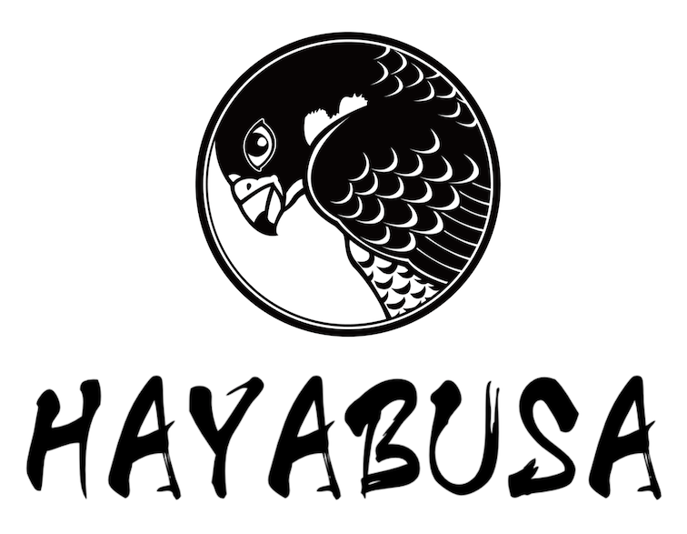

 

    
 

 

   <b>Windows event log fast forensics timeline generator and threat hunting tool.</b> 
   Written in memory-safe <a href="https://www.rust-lang.org/">Rust</a> by
   <a href="https://yamatosecurity.connpass.com/">Yamato Security</a> — the only open-source tool
   with full <a href="https://github.com/SigmaHQ/sigma">Sigma</a> support, including v2 correlation rules.
 

 

    
    
    
    
    
    
    
    
    
    
    
    
    
    
    
    
    
    
    
    
    
    
    
 

 <h2>
   📖 <a href="https://yamato-security.github.io/hayabusa/">Read the Documentation&nbsp;→</a>
 </h2>

 
   Available in 15 languages — English · 日本語 · 繁體中文 · 한국어 · Deutsch · Türkçe · Français ·
   Español · Português (Brasil) · Українська · हिन्दी · Bahasa Indonesia · မြန်မာဘာသာ · ไทย · العربية
 

---

## 🦅 About

Hayabusa is a **Windows event log fast forensics timeline generator** and **threat hunting tool**.
It is multi-threaded for speed and consolidates events from a single host or thousands of systems into
one **CSV / JSON / JSONL** timeline — ready for analysis in LibreOffice, [Timeline Explorer](https://ericzimmerman.github.io/),
[Elastic Stack](https://www.elastic.co/), [Timesketch](https://timesketch.org/) and more. It can run live on a
single system, gather logs for offline analysis, or hunt across the enterprise with [Velociraptor](https://docs.velociraptor.app/).

## 📖 Documentation

All documentation now lives on a dedicated, searchable, multi-language site:

> ### 👉 **[yamato-security.github.io/hayabusa](https://yamato-security.github.io/hayabusa/)**

| Section | |
| --- | --- |
| 🚀 [Getting Started](https://yamato-security.github.io/hayabusa/getting-started/) | Download, install and run Hayabusa |
| ⌨️ [Command Reference](https://yamato-security.github.io/hayabusa/commands/) | Every command and option, with examples |
| 📊 [Timeline Output](https://yamato-security.github.io/hayabusa/output/) | Output profiles, fields and abbreviations |
| 🧩 [Rules](https://yamato-security.github.io/hayabusa/rules/) | Detection rules and Sigma compatibility |
| 🔎 [Importing & Analysis](https://yamato-security.github.io/hayabusa/importing/) | Elastic Stack, Timesketch, Timeline Explorer, jq |

## ⬇️ Download

Grab the latest signed binaries from the [**Releases page**](https://github.com/Yamato-Security/hayabusa/releases),
or see [Getting Started](https://yamato-security.github.io/hayabusa/getting-started/) for live-response packages and building from source.

## 🗂️ Looking for the old README?

The previous single-page README is preserved unchanged:

- 📄 [**OLD-README.md**](OLD-README.md) — English
- 📄 [**OLD-README-Japanese.md**](OLD-README-Japanese.md) — 日本語

## 🤝 Contributing & License

Contributions and bug reports are very welcome — see [Contributing & Support](https://yamato-security.github.io/hayabusa/resources/contributing/).
Hayabusa is released under the [GNU AGPLv3](LICENSE.txt) license; detection rules are released under the
[Detection Rule License (DRL) 1.1](https://github.com/SigmaHQ/sigma/blob/master/LICENSE.Detection.Rules.md).

---

  Made with 🦅 by <a href="https://yamatosecurity.connpass.com/">Yamato Security</a>
  &nbsp;·&nbsp; <a href="https://twitter.com/SecurityYamato">@SecurityYamato</a>

