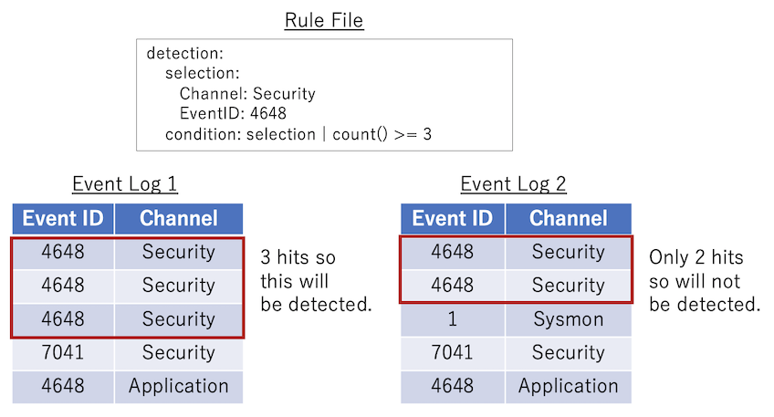
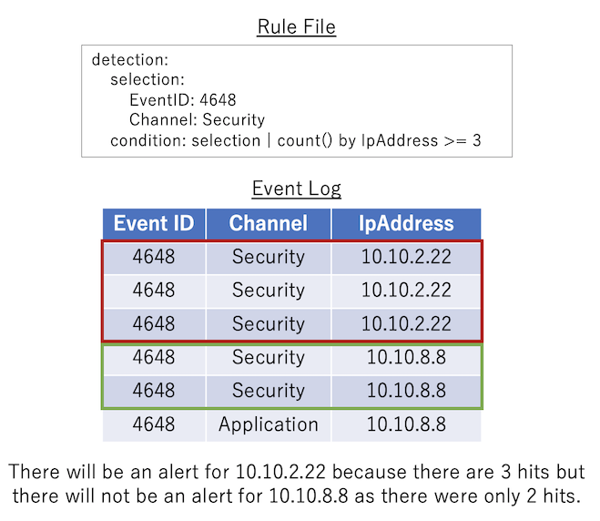
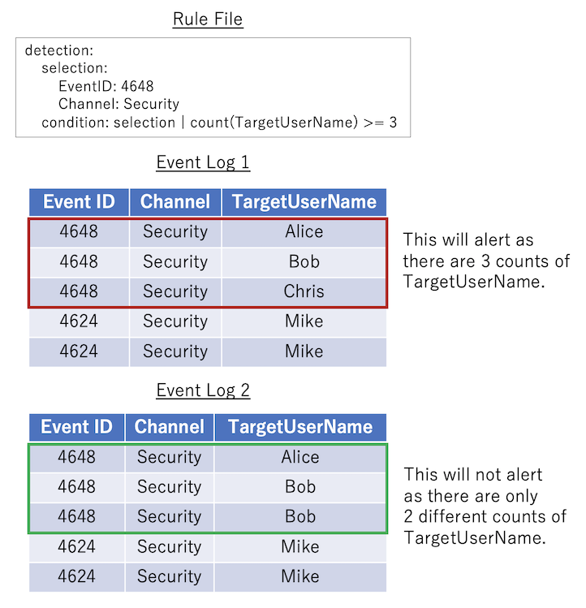
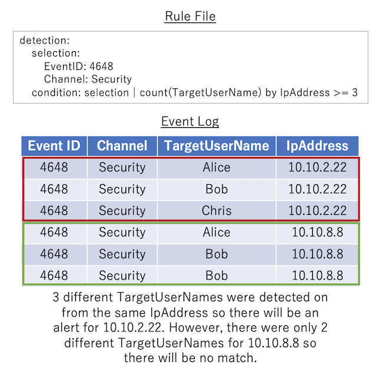

## About rule files
Hayabusa detection rules are written in [YAML](https://en.wikipedia.org/wiki/YAML) format.
They are a subset of sigma rules with some additions. We are trying to make them as close to sigma rules as possible so that it is easy to convert Hayabusa rules back to sigma to give back to the community.
Hayabusa rules can express complex detection rules by combining not only simple string matching but also regular expressions, `AND`, `OR`, and other conditions.
In this section, we will explain how to write Hayabusa detection rules.

# Rule file format
Example:

```yaml
#Author section
author: Eric Conrad, Zach Mathis
date: 2020/11/08
modified: 2021/11/26

#Alert section
title: User added to local Administrators group
title_jp: ユーザがローカル管理者グループに追加された
details: 'User: %SubjectUserName%  :  Group: %TargetUserName%  :  LogonID: %SubjectLogonId%'
details_jp: 'ユーザ: %SubjectUserName%  :  グループ名: %TargetUserName%  :  ログオンID: %SubjectLogonId%'
description: A user was added to the local Administrators group.
description_jp: ユーザがローカル管理者グループに追加された。

#Rule section
id: 611e2e76-a28f-4255-812c-eb8836b2f5bb
level: high
status: stable
detection:
    selection:
        Channel: Security
        EventID: 4732
        TargetUserName: Administrators
    condition: selection
falsepositives:
    - system administrator
tags:
    - attack.persistence
    - attack.t1098
references:
    - https://www.ultimatewindowssecurity.com/securitylog/encyclopedia/event.aspx?eventid=4732
sample-evtx: ./sample-evtx/EVTX-to-MITRE-Attack/TA0003-Persistence/T1098.xxx-Account manipulation/ID4732-User added to local admin groups.evtx
logsource: default
ruletype: Hayabusa
```

> ## Author section
* **author [required]**: Name of the author(s).
* **contributor** [optional]: Name of any contributor(s) (anyone who made any minor corrections).
* **date [required]**: Date the rule was made.
* **modified** [optional]: Date the rule was updated.

> ## Alert section
* **title [required]**: Rule file title. This will also be the name of the alert that gets displayed so the briefer the better. (Should not be longer than 85 characters.)
* **title_jp** [optional]: The title in Japanese.
* details [optional]: The details of the alert that gets displayed. Please output any fields in the Windows event log that are useful for analysis. Fields are seperated by `"  :  "` (two spaces on both sides). Field placeholders are enclosed with a `%` (Example: `%MemberName%`) and need to be defined in `config\eventkey_alias.txt`. (Explained below.)
* **details_jp** [optional]: The details message in Japanese.
* **description** [optional]: A description of the rule. This does not get displayed so you can make this long and detailed.
* **description_jp** [optional]: The description in Japanese.

> ## Rule section
* **id [required]**: A randomly generated version 4 UUID used to uniquely identify the rule. You can generate one [here](https://www.uuidgenerator.net/version4).
* **level [required]**: Severity level based on [sigma's definition](https://github.com/SigmaHQ/sigma/wiki/Specification). Please write one of the following: `informational`,`low`,`medium`,`high`,`critical`
* **status[required]**: `stable` for tested rules and `testing` for rules that need to be tested.
* **detection  [required]**: The detection logic goes here. (Explained below.)
* **falsepositives [required]**: The possibilities for false positives. For example: `system administrator`, `normal user usage`, `normal system usage`, `legacy application`, `security team`, `none`. If it is unknown, please write `unknown`.
* **tags** [optional]: If the technique is a [LOLBINS/LOLBAS](https://lolbas-project.github.io/) technique, please add the `lolbas` tag. If the alert can be mapped to a technique in the [MITRE ATT&CK](https://attack.mitre.org/) framework, please add the tactic ID (Example: `attack.t1098`) and any applicable tactics below:
    * `attack.impact` -> Impact
    * `attack.initial_access` -> Initial Access
    * `attack.execution` -> Execution
    * `attack.lateral_movement` -> Lateral Movement
    * `attack.persistence` -> Persistence
    * `attack.privilege_escalation` -> Privilege Escalation
    * `attack.reconnaissance` -> Reconnaissance
    * `attack.collection` -> Collection
    * `attack.command_and_control` -> Command and Control
    * `attack.credential_access` -> Credential Access
    * `attack.defense_evasion` -> Defense Evasion
    * `attack.discovery` -> Discovery
    * `attack.exfiltration` -> Exfiltration
    * `attack.resource_development` -> Resource Development  
* **references** [optional]: Any links to references.
* **sample-evtx [required]**: File path or URL to an event log file that this rule will detect.
* **logsource [required]**: The source of where the log comes from. Please specify one of the following:
  * `default`: For logs that are turned on in Windows by default.
  * `non-default`: For logs that need to be turned on through group policy, security baselines, etc...
  * `sysmon`: Logs that require sysmon to be installed.
* **non-default-setting** [optional]: Explanation of how to turn on the log setting for `non-default` log sources.
* **ruletype [required]**: `Hayabusa` for hayabusa rules. Rules automatically converted from sigma Windows rules will be `Sigma`.

# Detection field
## Selection fundamentals
First, the fundamentals of how to create a selection rule will be explained.

### How to write AND and OR logic
To write AND logic, we use nested dictionaries.
The detection rule below defines that **both conditions** have to be true in order for the rule to match.
* EventID has to exactly be `7040`.
* **AND**
* Channel has to exactly be `System`.

```yaml
detection:
    selection:
        Event.System.EventID: 7040
        Event.System.Channel: System
    condition: selection
```

To write OR logic, we use lists (Dictionaries that start with `- `).
In the detection rule below, **either one** of the conditions will result in the rule being triggered.
* EventID has to exactly be `7040`. 
* **OR**
* Channel has to exactly be `System`.

```yaml
detection:
    selection:
        - Event.System.EventID: 7040
        - Event.System.Channel: System
    condition: selection 
```

We can also combine `AND` and `OR` logic as shown below.
In this case, the rule matches when the following two conditions are both true.
* EventID is either exactly `7040` **OR** `7041`.
* **AND**
* Channel is exactly `System`.

```yaml
detection:
    selection:
        Event.System.EventID: 
          - 7040
          - 7041
        Event.System.Channel: System
    condition: selection
```

### Eventkeys
The following is an excerpt of a Windows event log, formatted in the original XML. The `Event.System.Channel` field in the rule file example above refers to the original XML tag: `<Event><System><Channel>System<Channel><System></Event>`. Nested XML tags are replaced by tag names seperated by dots (`.`). In hayabusa rules, these field strings connected together with dots are refered to as  `eventkeys`.

```xml
<Event xmlns='http://schemas.microsoft.com/win/2004/08/events/event'>
    <System>
        <EventID>7040</EventID>
        <Channel>System</Channel>
    </System>
    <EventData>
        <Data Name='param1'>Background Intelligent Transfer Service</Data>
        <Data Name='param2'>auto start</Data>
    </EventData>
</Event>
```

#### Eventkey Aliases
Long eventkeys with many `.` seperations are common, so hayabusa will use aliases to make them easier to work with. Aliases are defined in the `config\eventkey_alias.txt` file. This file is a CSV file made up of `alias` and `event_key` mappings. You can rewrite the rule above as shown below with aliases making the rule easier to read.

```yaml
detection:
    selection:
        Channel: System
        EventID: 7040
    condition: selection
```

#### Caution: Undefined Eventkey Aliases
Not all eventkey aliases are defined in `config\eventkey_alias.txt`. If you are not getting the correct data in the `details`(Alert details) message, and instead are getting results like `%EventID%` or if the selection in your detection logic is not working properly, then you need to update `config\eventkey_alias.txt` with a new alias.

### How to use XML attributes in conditions
XML elements may have attributes set by adding a space to the element. For example, `Name` in `Provider Name` below is an XML attribute of the `Provider` element. 

```xml
<Event xmlns='http://schemas.microsoft.com/win/2004/08/events/event'>
    <System>
        <Provider Name='Microsoft-Windows-Security-Auditing' Guid='{54849625-5478-4994-a5ba-3e3b0328c30d}'/>
        <EventID>4672</EventID>
        <EventRecordID>607469</EventRecordID>
        <Channel>Security</Channel>
        <Security />
    </System>
</Event>
```
To specify XML attributes in an eventkey, use the format `{eventkey}_attributes.{attribute_name}`. For example, to specify the `Name` attribute of the `Provider` element in a rule file, it would look like this:

```yaml
detection:
    selection:
        Channel: Security
        EventID: 4672
        Event.System.Provider_attributes.Name: 'Microsoft-Windows-Security-Auditing'
    condition: selection
```

### grep search
Hayabusa can perform grep searches in Windows event log files by not specifying any eventkeys.

To do a grep search, specify the detection as shown below. In this case, if the strings `mimikatz` or `metasploit` are included in the Windows Event log, it will match. It is also possible to specify wildcards.

```yaml
detection:
    selection:
        - mimikatz
        - metasploit
```

> Note: Hayabusa internally converts Windows event log data to JSON format before processing the data so it is not possible to match on XML tags.

### EventData
Windows event logs are divided into two parts: the `System` part where the fundamental data (Event ID, Timestamp, Record ID, Log name (Channel)) is written, and the `EventData` part where arbitrary data is written depending on the Event ID. The problem is that the names of the tags nested in EventData are all called `Data` so the eventkeys described so far cannot distinguish between `SubjectUserSid` and `SubjectUserName`.

```xml
<Event xmlns='http://schemas.microsoft.com/win/2004/08/events/event'>
    <System>
        <EventID>5379</EventID>
        <TimeCreated SystemTime='2021-10-20T10:16:18.7782563Z' />
        <EventRecordID>607469</EventRecordID>
        <Channel>Security</Channel>
        <Security />
    </System>
    <EventData>
        <Data Name='SubjectUserSid'>S-1-1-11-1111111111-111111111-1111111111-1111</Data>
        <Data Name='SubjectUserName'>hayabusa</Data>
        <Data Name='SubjectDomainName'>DESKTOP-HAYABUSA</Data>
        <Data Name='SubjectLogonId'>0x11111111</Data>
    </EventData>
</Event>
```

To deal with this problem, you can specify the value assigned in `Data Name`. For example, if you want to use `SubjectUserName` and `SubjectDomainName` in the EventData as a condition of a rule, you can describe it as follows:

```yaml
detection:
    selection:
        Channel: System
        EventID: 7040
        Event.EventData.SubjectUserName: hayabusa
        Event.EventData.SubjectDomainName: DESKTOP-HAYBUSA
    condition: selection
```

### Abnormal patterns in EventData
Some of the tags nested in `EventData` do not have a `Name` attribute.

```xml
<Event xmlns='http://schemas.microsoft.com/win/2004/08/events/event'>
    <System>
        <EventID>5379</EventID>
        <Channel>Security</Channel>
        <Security />
    </System>
    <EventData>
        <Data>Available</Data>
        <Data>None</Data>
        <Data>NewEngineState=Available PreviousEngineState=None SequenceNumber=9 HostName=ConsoleHost HostVersion=2.0 HostId=5cbb33bf-acf7-47cc-9242-141cd0ba9f0c EngineVersion=2.0 RunspaceId=c6e94dca-0daf-418c-860a-f751a9f2cbe1 PipelineId= CommandName= CommandType= ScriptName= CommandPath= CommandLine=</Data>
    </EventData>
</Event>
```

To detect an event log like the one above, you can specify an eventkey named `EventData`. In this case, the condition will match as long as any one of the nested tags without a `Name` attribute matches.

```yaml
detection:
    selection:
        Channel: Security
        EventID: 5379
        EventData: None
    condition: selection
```

## Pipes
A pipe can be used with eventkeys as shown below for matching strings. All of the conditions we have described so far use exact matches, but by using pipes, you can describe more flexible detection rules. In the following example, if the value of `EventData` matches the regular expression `[\s\S]*EngineVersion=2\.0[\s\S]*`, it will match the condition.

```yaml
detection:
    selection:
        Channel: Microsoft-Windows-PowerShell/Operational
        EventID: 400
        EventData|re: '[\s\S]*EngineVersion=2\.0[\s\S]*'
    condition: selection
```

This is a list of what you can specify after the pipe. At the moment, hayabusa does not support chaining multiple pipes together.
* startswith: Checks the string from the beginning
* endswith: Checks the end of the string
* contains: Checks if a word is contained in the data
* re: Use regular expressions. (We are using the regex crate so please out the documentation at https://docs.rs/regex/1.5.4/regex/ to know how to write correct regular expressions.) 
  > Caution: Some sigma rules that use regular expressions may fail to detect due to differences in how rust uses regular expressions.

## Wildcards
Wildcards can be used in eventkeys. In the example below, if `ProcessCommandLine` starts with the string "malware", the rule will match. 
The specification is fundamentally the same as sigma rule wildcards.

```yaml
detection:
    selection:
        Channel: Security
        EventID: 4688
        ProcessCommandLine: malware*
    condition: selection
```

The following two wildcards can be used.
* `*`: Matches any string of zero or more characters. (Internally it is converted to the regular expression `.*`)
* `?`: Matches any single character. (Internally converted to the regular expression `.`)

About escaping wildcards:
* Wildcards (`*` and `?`) can be escaped by using a backslash: `\*`, `\?`.
* If you want to use a backslash right before a wildcard then write `\\*` or `\\?`.
* Escaping is not required if you are using backslashes by themselves.

## Nesting keywords inside eventkeys
Eventkeys can be nested with specific keywords. 
In the example below, the rule will match if the following are true:
* `ServiceName` is called `malicious-service` or contains a regular expression in `./config/regex/detectlist_suspicous_services.txt`.
* `ImagePath` has a minimum of 1000 characters.
* `ImagePath` does not have any matches in the `allowlist`.

```yaml
detection:
    selection:
        Channel: System
        EventID: 7045
        ServiceName:
            - value: malicious-service
            - regexes: ./config/regex/detectlist_suspicous_services.txt
        ImagePath:
            min_length: 1000
            allowlist: ./config/regex/allowlist_legitimate_services.txt
    condition: selection
```

Currently, the following keywords can be specified:
* `value`: matches by string (wildcards and pipes can also be specified).
* `min_length`: matches when the number of characters is greater than or equal to the specified number.
* `regexes`: matches if one of the regular expressions in the file that you specify in this field matches.
* `allowlist`: rule will be skipped if there is any match found in the list of regular expressions in the file that you specify in this field.

### regexes and allowlist keywords
Hayabusa has two built-in regular expression files used for the `.\rules\hayabusa\default\alerts\System\7045_CreateOrModiftySystemProcess-WindowsService_MaliciousServiceInstalled.yml` file:
* `./config/regex/detectlist_suspicous_services.txt`: to detect suspicious service names
* `./config/regex/allowlist_legitimate_services.txt`: to allow legitimate services
  
Files defined in `regexes` and `allowlist` can be edited to change the behavior of all rules that reference them without having to change any rule file itself.

You can also use different detectlist and allowlist textfiles that you create.
Please refer to the built-in `./config/regex/detectlist_suspicous_services.txt` and `./config/regex/allowlist_legitimate_services.txt` when creating your own.

## condition
With the notation we explained above, you can express `AND` and `OR` logic but it will be confusing if you are trying to define complex logic.
When you want to make more complex rules, you should use the `condition` keyword as shown below.

```yaml
detection:
  SELECTION_1:
    EventID: 3
  SELECTION_2:
    Initiated: 'true'
  SELECTION_3:
    DestinationPort:
    - '4444'
    - '666'
  SELECTION_4:
    Image: '*\Program Files*'
  SELECTION_5:
    DestinationIp:
    - 10.*
    - 192.168.*
    - 172.16.*
    - 127.*
  SELECTION_6:
    DestinationIsIpv6: 'false'
  condition: (SELECTION_1 and (SELECTION_2 and SELECTION_3) and not ((SELECTION_4 or (SELECTION_5 and SELECTION_6))))
```

The following expressions can be used for `condition`.
* `{expression1} and {expression2}`: Require both {expression1} AND {expression2}
* `{expression1} or {expression2}`: Require either {expression1} OR {expression2}
* `not {expression}`: Reverse the logic of {expression}
* `( {expression} )`: Set precedance of {expression}. It follows the same precedance logic as in mathematics.

In the above example, selection names such as `SELECTION_1`, `SELECTION_2`, etc... are used but they can be named anything as long as they only contain the following characters: `a-z A-Z 0-9 _`
> However, please use the standard convention of `selection_1`, `selection_2`, `filter_1`, `filter_2`, etc... to make things easy to read whenever possible.

## not logic
Many rules will result in false positives so it is very common to have a selection for signatures to search for but also a filter selection to not alert on false positives.
For example:

```yaml
detection:
    selection:
        Channel: Security
        EventID: 4673
    filter: 
        - ProcessName: C:\Windows\System32\net.exe
        - ProcessName: C:\Windows\System32\lsass.exe
        - ProcessName: C:\Windows\System32\audiodg.exe
        - ProcessName: C:\Windows\System32\svchost.exe
        - ProcessName: C:\Windows\System32\mmc.exe
        - ProcessName: C:\Windows\System32\net.exe
        - ProcessName: C:\Windows\explorer.exe
        - ProcessName: C:\Windows\System32\SettingSyncHost.exe
        - ProcessName: C:\Windows\System32\sdiagnhost.exe
        - ProcessName|startswith: C:\Program Files
        - SubjectUserName: LOCAL SERVICE
    condition: selection and not filter
```

## Aggregation conditions (Count rules)
### Basics
The `condition` keyword described above implements not only `AND` and `OR` logic, but is also able to count or "aggregate" events.
This function is called the "aggregation condition" and is specified by connecting a condition with a pipe. 
In this password spray detection example below, a conditional expression is used to determine if there are 5 or more `TargetUserName` values from one source `IpAddress` within a timeframe of 5 minutes.

```yaml
detection:
  selection:
    Channel: Security
    EventID: 4648
  condition: selection | count(TargetUserName) by IpAddress > 5
  timeframe: 5m
```

Aggregation conditions can be defined in the following format:
* `count() {operator} {number}`: For log events that match the first condition before the pipe, the condition will match if the number of matched logs satisfies the condition expression specified by `{operator}` and `{number}`.  

`{operator}` can be one of the following:
* `==`: If the value is equal to the specified value, it is treated as matching the condition.
* `>=`: If the value is greater than or equal to the specified value, the condition is considered to have been met.
* `>`: If the value is greater than the specified value, the condition is considered to have been met.
* `<=`: If the value is less than or equal to the specified value, the condition is considered to have been met.
* `<`: If the value is less than the specified value, it will be treated as if the condition is met.  

`{number}` must be a number.

`timeframe` can be defined in the following:
* `15s`: 15 seconds
* `30m`: 30 minutes
* `12h`: 12 hours
* `7d`: 7 days
* `3M`: 3 months


### Four patterns for aggregation conditions:
1. No count argument or `by` keyword. Example: `selection | count() > 10`
   > If `selection` matches more than 10 times within the timeframe, the condition will match.
2. No count argument but there is a `by` keyword. Example: `selection | count() by IpAddress > 10`
   > `selection` will have to be true more than 10 times for the **same** `IpAddress`.
3. There is a count argument but no `by` keyword. Example: `selection | count(TargetUserName) > 10`
   > If `selection` matches and `TargetUserName` is **different** more than 10 times within the timeframe, the condition will match.
4. There is both a count argument and `by` keyword. Example: `selection | count(Users) by IpAddress > 10`
   > For the **same** `IpAddress`, there will need to be more than 10 **different** `TargetUserName` in order for the condition to match.

### Pattern 1 example:
This is the most basic pattern: `count() {operator} {number}`. The rule below will match if `selection` happens 3 or more times.



### Pattern 2 example:
`count() by {eventkey} {operator} {number}`: Log events that match the `condition` before the pipe are grouped by the **same** `{eventkey}`. If the number of matched events for each grouping satisfies the condition specified by `{operator}` and `{number}`, then the condition will match.



### Pattern 3 example:
`count({eventkey}) {operator} {number}`: Counts how many **different** values of `{eventkey}` exist in the log event that match the condition before the condition pipe. If the number satisfies the conditional expression specified in `{operator}` and `{number}`, the condition is considered to have been met.



### Pattern 4 example:
`count({eventkey_1}) by {eventkey_2} {operator} {number}`: The logs that match the condition before the condition pipe are grouped by the **same** `{eventkey_2}`, and the number of **different** values of `{eventkey_1}` in each group is counted. If the values counted for each grouping satisfy the conditional expression specified by `{operator}` and `{number}`, the condition will match.



### Count rule output:
The details output for count rules is fixed and will print the original count condition in `[condition]` followed by the recorded eventkeys in `[result]`. 

In the example below, a list of `TargetUserName` usernames that were being bruteforced followed by the source `IpAddress`:
```
[condition] count(TargetUserName) by IpAddress >= 5 in timeframe [result] count:41 TargetUserName:jorchilles/jlake/cspizor/lpesce/bgalbraith/jkulikowski/baker/eskoudis/dpendolino/sarmstrong/lschifano/drook/rbowes/ebooth/melliott/econrad/sanson/dmashburn/bking/mdouglas/cragoso/psmith/bhostetler/zmathis/thessman/kperryman/cmoody/cdavis/cfleener/gsalinas/wstrzelec/jwright/edygert/ssims/jleytevidal/celgee/Administrator/mtoussain/smisenar/tbennett/bgreenwood IpAddress:10.10.2.22 timeframe:5m
```
The timestamp of the alert will be the time from the first event detected.

# Rule creation advice
1. **When possible, always specify `Channel` and `EventID` name.** In the future, we may filter on channel names and event IDs so your rule may be ignored if this is not set.
   
2. **Please do not use multiple `selection` or `filter` fields and excessive grouping when it is not needed.** For example:

### Instead of:
```yaml
detection:
    SELECTION_1:
        Channnel: Security
    SELECTION_2:
        EventID: 4625
    SELECTION_3:
        LogonType: 3
    FILTER_1:
        SubStatus: "0xc0000064"   #Non-existent user
    FILTER_2:
        SubStatus: "0xc000006a"   #Wrong password
    condition: SELECTION_1 and SELECTION_2 and SELECTION_3 and not (FILTER_1 or FILTER_2)
```

### Please do this:
```yaml
detection:
    selection:
        Channel: Security
        EventID: 4625
        LogonType: 3
    filter:
        - SubStatus: "0xc0000064"   #Non-existent user
        - SubStatus: "0xc000006a"   #Wrong password
    condition: selection and not filter
```

3. **When you need multiple sections, please name the first section with channel and event ID information in the `section_basic_info` section and other selections with meaningful names after `section_` and `filter_`, or use the notation `section_1`, `filter_1`, etc... Also, please write comments to explain anything difficult to understand.**

### Instead of:
```yaml
detection:
    Takoyaki:
        Channel: Security
        EventID: 4648
    Naruto:
        TargetUserName|endswith: "$"  
        IpAddress: "-"
    Sushi: 
        SubjectUserName|endswith: "$"
        TargetUserName|endswith: "$"
        TargetInfo|endswith: "$"
    Godzilla:
        SubjectUserName|endswith: "$" 
    Ninja:
        TargetUserName|re: "(DWM|UMFD)-([0-9]|1[0-2])$" 
        IpAddress: "-"                                  
    Daisuki:
        - ProcessName|endswith: "powershell.exe"
        - ProcessName|endswith: "WMIC.exe"
    condition: Takoyaki and Daisuki and not (Naruto and not Godzilla) and not Ninja and not Sushi
```

### Please do this:
```yaml
detection:
    selection_1:
        Channel: Security
        EventID: 4648
    selection_2:
        TargetUserName|endswith: "$"  
        IpAddress: "-"
    filter_1:     #Filter system noise
        SubjectUserName|endswith: "$"
        TargetUserName|endswith: "$"
        TargetInfo|endswith: "$"
    filter_2:
        SubjectUserName|endswith: "$" 
    filter_3:
        TargetUserName|re: "(DWM|UMFD)-([0-9]|1[0-2])$" #Filter out default Desktop Windows Manager and User Mode Driver Framework accounts
        IpAddress: "-"                                  #Don't filter if the IP address is remote to catch attackers who created backdoor accounts that look like DWM-12, etc..
    selection_4:
        - ProcessName|endswith: "powershell.exe"
        - ProcessName|endswith: "WMIC.exe"
    condition: selection_1 and selection_4 and not (selection_2 and not filter_2) and not filter_3 and not filter_1
```

### Or ideally something like this:
```yaml
detection:
    selection_BasicInfo:
        Channel: Security
        EventID: 4648
    selection_TargetUserIsComputerAccount:
        TargetUserName|endswith: "$"  
        IpAddress: "-"
    filter_UsersAndTargetServerAreComputerAccounts:     #Filter system noise
        SubjectUserName|endswith: "$"
        TargetUserName|endswith: "$"
        TargetInfo|endswith: "$"
    filter_SubjectUserIsComputerAccount:
        SubjectUserName|endswith: "$" 
    filter_SystemAccounts:
        TargetUserName|re: "(DWM|UMFD)-([0-9]|1[0-2])$" #Filter out default Desktop Windows Manager and User Mode Driver Framework accounts
        IpAddress: "-"                                  #Don't filter if the IP address is remote to catch attackers who created backdoor accounts that look like DWM-12, etc..
    selection_SuspiciousProcess:
        - ProcessName|endswith: "powershell.exe"
        - ProcessName|endswith: "WMIC.exe"
    condition: selection_basic and selection_SuspiciousProcess and not (selection_TargetUserIsComputerAccount 
               and not filter_SubjectUserIsComputerAccount) and not filter_SystemAccounts and not filter_UsersAndTargetServerAreComputerAccounts
```

# Converting sigma rules to hayabusa format
We have created a backend for sigmac to convert rules from sigma to hayabusa format [here](https://github.com/Yamato-Security/hayabusa/blob/main/tools/sigmac/).

The documentation for how to use it is [here](https://github.com/Yamato-Security/hayabusa/blob/main/tools/sigmac/README-English.md).