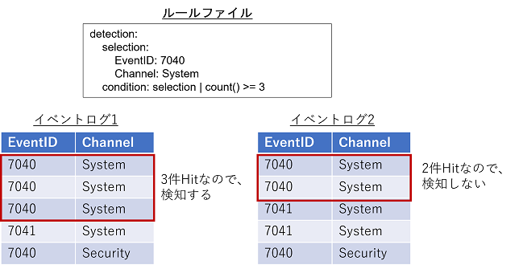
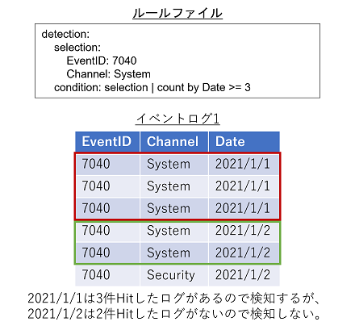
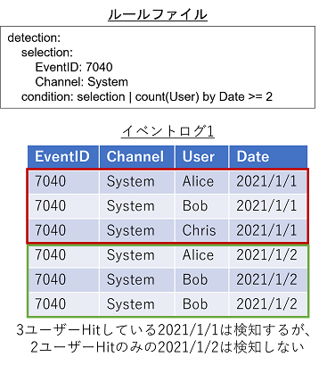
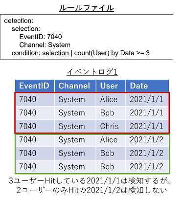

# Rule files
Hayabusa uses detection rules for Windows Event logs in a YAML format file.
It can express complex detection rules by combining not only simple string matching but also regular expressions, AND, OR, and other conditions.
In this section, we will explain how to write the detection rules.

# Rule file format
The rule file format is described below.

``````
title: PowerShell Execution Pipeline
description: This rule detect powershell execution pipeline.
author: Zach Mathis
detection:
    selection:
        Event.System.EventID: 7040
        Event.System.Channel: System
falsepositives:
    - unknown
level: medium
output: 'command=%CommandLine%'
creation_date: 2020/11/8
updated_date: 2020/11/8
``````

* title [required]: Rule file title. This will also be the name of the alert that gets displayed so the briefer the better.
* description [optional]: A description of the rule. This does not get displayed so you can make this long.
* author [optional]: The name of the person or persons who created the logic for the rule.
* detection  [required]: The detection logic goes here.
* falsepositives [optional]: The possibilities for false positives. For example: unknown、system administrator、normal user usage、normal system usage、legacy application、security team. If it is unknown, write "unknown".
* level [optional]: Risk level. Please write one of the following: `info`,`low`,`medium`,`high`,`critical`
* output [required]: The details of the alert. (Please output any and only useful fields in the Windows event log for easy analysis.)
* creation_date [optional]: The creation date.
* updated_date [optional]: The date of the last revision.

# About detection notation
## Detection fundamentals
First, the fundamentals of how to create a detection rule will be explained.

### How to write AND and OR logic
To write AND logic, we use the YAML hash.
The detection rule below defines that *both conditions* have to be true in order for the rule to match.
* EventID has to exactly be `7040`.
* Channel has to exactly be `System`.

``````
detection:
    selection:
        Event.System.EventID: 7040
        Event.System.Channel: System
``````

To write OR logic, we use arrays.
In the detection rule below, *either one* of the conditions will result in the rule being triggered.
* EventID has to exactly be `7040`.
* Channel has to exactly be `System`.

``````
detection:
    selection:
        - Event.System.EventID: 7040
        - Event.System.Channel: System
``````

We can also combine AND and OR logic as shown below.
In this case, the rule matches when the following two conditions are both true.
* EventID is either exactly `7040` or `7041`.
* Channel is exactly `System`.

``````
detection:
    selection:
        Event.System.EventID: 
          - 7040
          - 7041
        Event.System.Channel: System
``````

### Eventkey
The following is an excerpt of a Windows event log, formatted in the original XML. The `Event.System.Channel` in the rule file example refers to the XML `<Event><System><Channel>System<Channel><System></Event>`. For Windows event logs in XML format, as in this example, if you want to specify the values contained in the nested XML tags as the condition of the rule, you can specify them by connecting them with a dot (`. `). In the rule file, these strings connected together with dots are called `eventkeys`.

``````
<Event xmlns='http://schemas.microsoft.com/win/2004/08/events/event'>
    <System>
        <EventID>7040</EventID>
        <Channel>System</Channel>
    </System>
    <EventData>
        <Data Name='param1'>Background Intelligent Transfer Service</Data>
        <Data Name='param2'>auto start</Data>
    </EventData>
</Event>
``````

### Eventkey Aliases
Long eventkeys with many `.` seperations are common, so hayabusa will use aliases to make them easier to work with. Aliases are defined in the `config\eventkey_alias.txt` file. This file is a CSV file made up of `alias` and `event_key` mappings. You can rewrite the rule above as shown below with aliases making the rule easier to read.

``````
detection:
    selection:
        EventID: 7040
        Channel: System
``````

### How to use XML attributes in conditions
When Windows event logs are output in XML format, the XML attributes may have values set in them. In the example below, `Name` in `Provider Name` is an XML attribute.

````````````
<Event xmlns='http://schemas.microsoft.com/win/2004/08/events/event'>
    <System>
        <Provider Name='Microsoft-Windows-Security-Auditing' Guid='{54849625-5478-4994-a5ba-3e3b0328c30d}'/>
        <EventID>4672</EventID>
        <EventRecordID>607469</EventRecordID>
        <Channel>Security</Channel>
        <Security />
    </System>
</Event>
````````````
To specify XML attributes in an eventkey, use the format `{eventkey}_attributes.{attribute_name}`. For example, to specify the `Name` attribute of the `Provider` tag in the rule file, it would look like this:

``````
detection:
    selection:
        Channel: Security
        EventID: 4672
        Event.System.Provider_attributes.Name: 'Microsoft-Windows-Security-Auditing'
``````

### EventData
Windows event logs are divided into two parts: the `System` part where the fundamental data (Event ID, Timestamp, Record ID, Log name (aka Channel)) is written, and the `EventData` part where arbitrary data is written depending on the Event ID. The problem is that the names of the tags nested in EventData are all `Data` so the eventkeys described so far cannot distinguish between `SubjectUserSid` and `SubjectUserName`.

````````````
<Event xmlns='http://schemas.microsoft.com/win/2004/08/events/event'>
    <System>
        <EventID>5379</EventID>
        <TimeCreated SystemTime='2021-10-20T10:16:18.7782563Z' />
        <EventRecordID>607469</EventRecordID>
        <Channel>Security</Channel>
        <Security />
    </System>
    <EventData>
        <Data Name='SubjectUserSid'>S-1-1-11-1111111111-111111111-1111111111-1111</Data>
        <Data Name='SubjectUserName'>hayabusa</Data>
        <Data Name='SubjectDomainName'>DESKTOP-HAYABUSA</Data>
        <Data Name='SubjectLogonId'>0x11111111</Data>
    </EventData>
</Event>
````````````

To deal with this problem, you can specify the value specified for `Name` in the eventkey instead of `Data`. For example, if you want to use `SubjectUserName` and `SubjectDomainName` in the EventData as a condition of the rule, you can describe it as follows:

``````
detection:
    selection:
        EventID: 7040
        Channel: System
        Event.EventData.SubjectUserName: hayabusa
        Event.EventData.SubjectDomainName: DESKTOP-HAYBUSA
``````

### Special patterns in EventData
Some of the tags nested in EventData do not have a Name attribute.

``````
<Event xmlns='http://schemas.microsoft.com/win/2004/08/events/event'>
    <System>
        <EventID>5379</EventID>
        <Channel>Security</Channel>
        <Security />
    </System>
    <EventData>
        <Data>Available</Data>
        <Data>None</Data>
        <Data>NewEngineState=Available PreviousEngineState=None SequenceNumber=9 HostName=ConsoleHost HostVersion=2.0 HostId=5cbb33bf-acf7-47cc-9242-141cd0ba9f0c EngineVersion=2.0 RunspaceId=c6e94dca-0daf-418c-860a-f751a9f2cbe1 PipelineId= CommandName= CommandType= ScriptName= CommandPath= CommandLine=</Data>
    </EventData>
</Event>
``````

To detect an event log like the one above, you can specify an eventkey named `EventData`. In this case, the condition will matach as long as any one of the nested tags without a Name attribute matches.

``````
detection:
    selection:
        Channel: Security
        EventID: 5379
        EventData: None
``````

## Pipes
A pipe can be used with eventkeys as shown below. All of the conditions we have described so far use exact matches, but by using pipes, you can describe more flexible detection rules. In the following example, if the value of `CommandLine` matches the regular expression `yamato.*hayabusa`, it will match the condition.

``````
detection:
    selection:
        EventID: 7040
        Channel: System
        CommandLine|re: yamato.*hayabusa
``````

This is a list of what you can specify after the pipe. At the moment, hayabusa does not support chaining multiple pipes together.
* startswith: Checks the string from the beginning
* endswith: Checks the end of the string
* contains: Checks if a word is contained in the data
* re: Use regular expressions. (We are using the regex crate so please out the documentation at https://docs.rs/regex/1.5.4/regex/ on how to write regular expressions.)

## Wildcards
Wildcards can be specified for the value corresponding to eventkey. In the example below, if the CommandLine starts with the string "hayabusa", it will be processed as if it matches the condition. 
The specification is fundamentally the same as SIGMA rule wildcards.

``````
detection:
    selection:
        EventID: 7040
        Channel: System
        CommandLine: hayabusa*
``````

The following wildcards can be used.
* `*`: Matches any string of zero or more characters. (Internally it is converted to the regular expression `. *`.)
* `? `: Matches any single character. (Internally converted to the regular expression `. `.)

When wildcards are used, they will be interpreted according to the following rules.
* Wildcards (`*` and `? `) can be escaped by using a backslash (`/`).
* If you want to use a backslash right before a wildcard then write `\\*` or `\\?`.
* No escaping is required if you are using backslashes by themselves.

## Nesting keywords in the eventkey
The eventkey can be nested with specific keywords. 
In the example below, if the value of CommandLine matches the wildcard `aa*bb` and the length of the string is 10 or more, the condition will match.

``````
detection:
    selection:
        EventID: 7040
        Channel: System
        CommandLine:
            value: aa*bb
            min_length: 10
``````

Currently, the following keywords can be specified.
* value: matches by string (wildcards and pipes can also be specified).
* min_length: matches when the number of characters is greater than or equal to the specified number.
* regexes: matches if one of the regular expressions in the file that you specify in this field matches.
* allowlist: rule will be skipped if there is any match found in the list of regular expressions in the file that you specify in this field.

### regexes.txt and allowlist.txt
Hayabusa provides built-in rules using regular expressions (defined in `regexes.txt`) and allowlisting (defined in `allowlist.txt`).
regexes.txt and allowlist.txt can be edited to change the behavior of all referenced rules at once. 

You can also specify to use different regexes and allowlist textfiles.
Please refer to the default regexes.txt and allowlist.txt when creating your own.

## condition
With the notation we explained above, you can express AND and OR logic but it will be confusing if you are trying to define complex logic.
When you want to make more complex rules, you should use `condition` as shown below.

``````
detection:
    selection_1:
        EventID: 7040
    selection_2:
        EventID: 7041
    selection_3:
        Channel: System
    selection_4:
        CommandLine|contains: lsass.exe
    selection_5:
        CommandLine|contains: services.exe
    selection_6:
        ParentProcessName|contains: wininit.exe

    condition: ( selection_1 or selection_2 ) and selection_3 and ( selection_4 or selection_5 ) and ( not selection_6 ) 
``````

The following keywords can be used for `condition`.
* {expression1} and {expression2}: Require both {expression1} AND {expression2}
* {expression1} or {expression2}: Require either {expression1} OR {expression2}
* not {expression}: Reverse the logic of {expression}
* ( {expression} ) : Set precedance of {expression}. It follows the same precedance logic as in mathematics.

In the above example, names such as selection_1 and selection_2 are used for grouping conditional expressions, but there is no need to add the prefix "selection", and the user can define any name. However, the only characters that can be used are those that match the regular expression `\w`.

## aggregation condition
The condition field described above implements not only the AND and OR conditions, but also a function to aggregate the detected event logs. 
This function is called the aggregation condition, and is specified by connecting it with a pipe after the condition. 
In the example below, a conditional expression is used to determine if there are three or more `DestinationIp` values for each `SubjectUserName`.

``````
detection:
    selection:
        EventID: 7040
        Channel: System
    condition: selection | count(DestinationIp) by SubjectUserName >= 3
``````

The aggregation condition can be defined in the following format. Note that {number} must be a number.
* `count() {operator} {number}`: For log events that match the first condition before the pipe, the condition will match if the number of matched logs satisfies the condition expression specified by {operator} and {number}.



* `count() by {eventkey_2} {operator} {number}`: Log events that match the first condition before pipe are grouped by {eventkey_2}, and if the number of matched events for each grouping satisfies the condition expression specified by {operator} and {number}, the condition will match.



* `count({eventkey}) {operator} {number}`: Counts how many different values of {eventkey} exist in the log event that match the condition before the condition pipe. If the number satisfies the conditional expression specified in {operator} and {number}, the condition is considered to have been met.



* `count({eventkey_1}) by {eventkey_2} {operator} {number}`: The logs that match the condition before the condition pipe are grouped by {eventkey_2}, and the number of values of {eventkey_1} in each group is counted. If the values counted for each grouping satisfy the conditional expression specified by {operator} and {number}, the condition is considered to have been met.



In addition, the following can be specified for the above operator:
* `==`: If the value is equal to the specified value, it is treated as matching the condition.
* `>=`: If the value is greater than or equal to the specified value, the condition is considered to have been met.
* `>`: If the value is greater than the specified value, the condition is considered to have been met.
* `<=`: If the value is less than or equal to the specified value, the condition is considered to have been met.
* `<`: If the value is less than the specified value, it will be treated as if the condition is met.

# output notation
You can specify the message that will be outputted when the detection condition is met. 
In addition to outputting a fixed string, it is also possible to display the value in the event log by enclosing the eventkey in a `%`. 
In the example below, the eventkey value ScriptBlockText is used in the message when a detection is made.

``````
output: 'command=%ScriptBlockText%'
``````