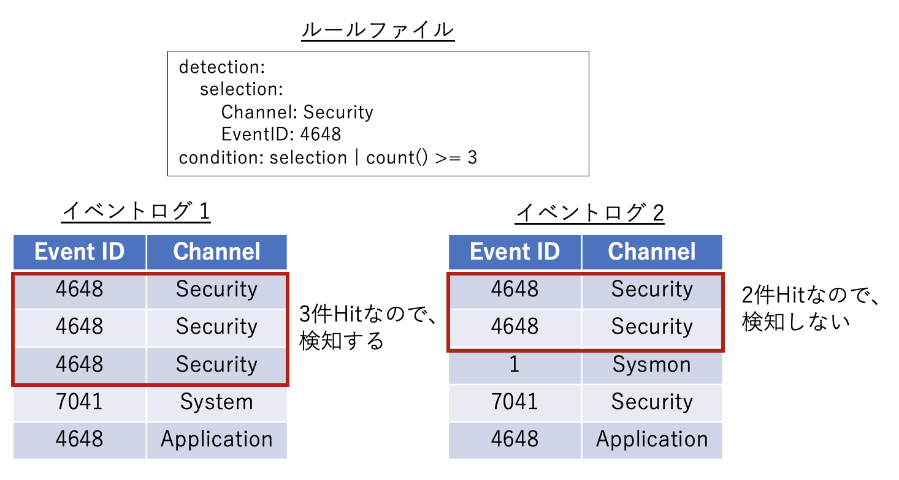
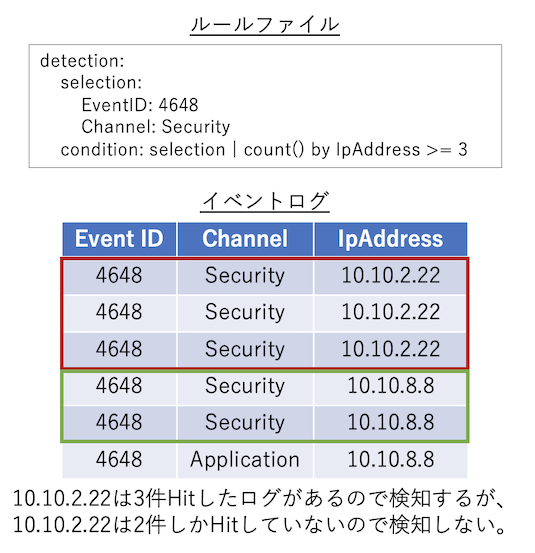
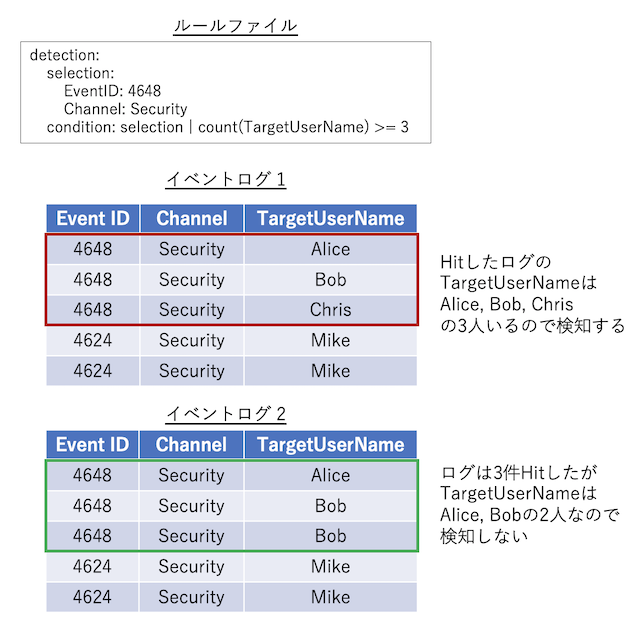
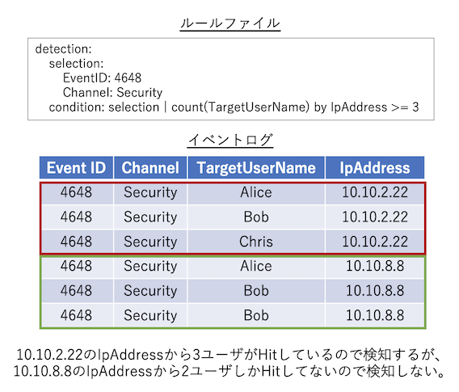

# ルールファイルについて
Hayabusaの検知ルールは[YAML](https://en.wikipedia.org/wiki/YAML) 形式で記述されています。
単純な文字列のマッチングだけでなく、正規表現や`AND`、`OR`などの条件を組み合わせて複雑な検知ルールを表現することができます。
本節ではHayabusaの検知ルールの書き方について説明します。

## ルールファイル形式
記述例:

```yaml
#Author section
author: Eric Conrad, Zach Mathis
date: 2020/11/08
modified: 2021/11/26

#Alert section
title: User added to local Administrators group
title_jp: ユーザがローカル管理者グループに追加された
details: 'User: %SubjectUserName%  :  Group: %TargetUserName%  :  LogonID: %SubjectLogonId%'
details_jp: 'ユーザ: %SubjectUserName%  :  グループ名: %TargetUserName%  :  ログオンID: %SubjectLogonId%'
description: A user was added to the local Administrators group.
description_jp: ユーザがローカル管理者グループに追加された。

#Rule section
id: 611e2e76-a28f-4255-812c-eb8836b2f5bb
level: high
status: stable
detection:
    selection:
        Channel: Security
        EventID: 4732
        TargetUserName: Administrators
    condition: selection
falsepositives:
    - system administrator
tags:
    - attack.persistence
    - attack.t1098
references:
    - https://www.ultimatewindowssecurity.com/securitylog/encyclopedia/event.aspx?eventid=4732
sample-evtx: ./sample-evtx/EVTX-to-MITRE-Attack/TA0003-Persistence/T1098.xxx-Account manipulation/ID4732-User added to local admin groups.evtx
logsource: default
ruletype: Hayabusa
```

> ## 著者名欄
* **author [必須]**: 著者名（複数可）。
* **contributor** [オプション]: 寄稿者の名前（細かい修正をした人）。
* **date [必須]**: ルールが作成された日付。
* **modified** [オプション]: ルールが更新された日付。

> ## アラートセクション
* **title [必須]**: ルールファイルのタイトル。これは表示されるアラートの名前にもなるので、簡潔であるほどよいです。(85文字以下でなければなりません。)
* **title_jp** [オプション]: 日本語のタイトルです。
* **details** [オプション]: 表示されるアラートの詳細です。Windowsイベントログの中で解析に有効なフィールドがあれば出力してください。フィールドは `" : "` で区切られます（両側ともスペース2つ）。フィールドのプレースホルダは `%` で囲まれ (例: `%MemberName%`) 、`config_eventkey_alias.txt` で定義する必要があります。(以下で説明します)
* **details_jp** [オプション]: 日本語の出力メッセージ。
* **description** [オプション]: ルールの説明。これは表示されないので、長く詳細に記述することができます。
* **description_jp** [オプション]: 日本語の説明文です。

> ## ルールセクション
* **id [必須]**: ルールを一意に識別するために使用される、ランダムに生成されたバージョン4のUUIDです。 [ここ](https://www.uuidgenerator.net/version4) で生成することができます。
* **level [必須]**: [sigmaルールの定義](https://github.com/SigmaHQ/sigma/wiki/Specification)に基づく重要度レベル。 以下のいずれかを記述してください。 `informational`,`low`,`medium`,`high`,`critical`
* **status[必須]**: テスト済みのルールには `stable` を、テストが必要なルールには `testing` を指定します。
* **detection  [必須]**: 検知ロジックはここに入ります。(以下で説明します。)
* **falsepositives [必須]**: 誤検知の可能性について記載を行います。例: `system administrator`, `normal user usage`, `normal system usage`, `legacy application`, `security team`, `none`。 不明な場合は `unknown` と記述してください。
* **tags** [オプション]: [LOLBINS/LOLBAS](https://lolbas-project.github.io/)という手法を利用している場合、`lolbas` タグを追加してください。アラートを[MITRE ATT&CK](https://attack.mitre.org/) フレームワークにマッピングできる場合は、以下のリストから該当するものを追加してください。戦術ID（例：`attack.t1098`）を指定することも可能です。
    * `attack.impact` -> Impact
    * `attack.initial_access` -> Initial Access
    * `attack.execution` -> Execution
    * `attack.lateral_movement` -> Lateral Movement
    * `attack.persistence` -> Persistence
    * `attack.privilege_escalation` -> Privilege Escalation
    * `attack.reconnaissance` -> Reconnaissance
    * `attack.collection` -> Collection
    * `attack.command_and_control` -> Command and Control
    * `attack.credential_access` -> Credential Access
    * `attack.defense_evasion` -> Defense Evasion
    * `attack.discovery` -> Discovery
    * `attack.exfiltration` -> Exfiltration
    * `attack.resource_development` -> Resource Development 
* **references** [オプション]: 参考文献への任意のリンク。
* **sample-evtx [必須]**: このルールが検知するイベントログファイルへのファイルパスまたはURL。
* **logsource [必須]**: ログの出所。以下のいずれかを指定してください。
  * `default`: Windowsでデフォルトで有効になっているログの場合等
  * `non-default`: グループポリシーやセキュリティベースラインなどで有効にする必要があるログ用。
  * `sysmon`: sysmonのインストールが必要なログ。
* **non-default-setting** [オプション]: `non-default` のログソースのログ設定をオンにする方法の説明です。
* **ruletype [必須]**: Hayabusaルールには `Hayabusa` を指定します。SigmaのWindowsルールから自動変換されたルールは `Sigma` になります。

# detectionフィールド
## selectionの基礎知識
まず、selectionの作り方の基本を説明します。


### 論理積(AND)と論理和(OR)の書き方
ANDを表現するには辞書（YAMLでは辞書を`:`で表します）を使用します。
このルールでログが検知されるには、**両方の条件**が真である必要があります。

* イベントIDが `7040` であること。
* チャンネルが `System` であること。

```yaml
detection:
    selection:
        Event.System.EventID: 7040
        Event.System.Channel: System
    condition: selection
```

ORを表現するには、配列（YAMLでは配列を`- `で表します）を使用します。
このルールでログが検知されるには、**片方の条件**が真である必要があります。

* イベントIDが `7040` であること。
* チャンネルが `System` であること。

```yaml
detection:
    selection:
        - Event.System.EventID: 7040
        - Event.System.Channel: System
    condition: selection 
```

また、以下のように「AND」と「OR」を組み合わせることも可能です。
この場合、以下の2つの条件が両方成立したときに、このルールでログが検知されます。

* イベントIDが `7040` **または** `7041` のどちらかであること。
* チャンネルが `System` であること。

```yaml
detection:
    selection:
        Event.System.EventID: 
          - 7040
          - 7041
        Event.System.Channel: System
    condition: selection
```

### イベントキー
WindowsイベントログをXML形式で出力すると下記のようになります。

```xml
<Event xmlns='http://schemas.microsoft.com/win/2004/08/events/event'>
    <System>
        <EventID>7040</EventID>
        <Channel>System</Channel>
    </System>
    <EventData>
        <Data Name='param1'>Background Intelligent Transfer Service</Data>
        <Data Name='param2'>auto start</Data>
    </EventData>
</Event>
```

論理和の例で示したルールの `Event.System.Channel` フィールドは、下記のXMLタグで囲まれた値を参照しています。 ネストされたXMLタグはドット(`.`)で区切られたタグ名で置き換えられます。Hayabusaのルールでは、このドットでつながれた文字列のことをイベントキーと呼んでいます。

`<Event><System><Channel>System<Channel><System></Event>`

#### イベントキーエイリアス
`.`の区切りが多くて長いイベントキーが一般的であるため、Hayabusaはエイリアスを使って簡単に扱えるようにします。エイリアスは `config\eventkey_alias.txt`ファイルで定義されています。このファイルは `alias` と `event_key` のマッピングで構成されるCSVファイルです。以下に示すように、エイリアスを使用して上記のルールを書き直し、ルールを読みやすくすることができます。

```yaml
detection:
    selection:
        Channel: System
        EventID: 7040
    condition: selection
```

#### 注意: 未定義のイベントキーエイリアスについて
すべてのイベントキーエイリアスが `config\eventkey_alias.txt`に定義されているわけではありません。検知するはずのルールが検知しない場合や、`details`（アラートの詳細）メッセージに`%EventID%`のようなプレースホルダーが表示されている場合、`config\eventkey_alias.txt`の設定を確認してください。

### XML属性を条件に使用する方法
XMLのタグにはタグ名とは別に属性を設定できます。例えば、以下の `Provider Name` の `Name` は `Provider` タグの属性です。

```xml
<Event xmlns='http://schemas.microsoft.com/win/2004/08/events/event'>
    <System>
        <Provider Name='Microsoft-Windows-Security-Auditing' Guid='{54849625-5478-4994-a5ba-3e3b0328c30d}'/>
        <EventID>4672</EventID>
        <EventRecordID>607469</EventRecordID>
        <Channel>Security</Channel>
        <Security />
    </System>
</Event>
```

イベントキーでXMLの属性を指定するには、`{eventkey}_attributes.{attribute_name}`という形式で記述します。例えば、ルールファイルの `Provider` 要素の `Name` 属性を指定する場合は、以下のようになります。

```yaml
detection:
    selection:
        Channel: Security
        EventID: 4672
        Event.System.Provider_attributes.Name: 'Microsoft-Windows-Security-Auditing'
    condition: selection
```

### grep検索
Hayabusaではeventkeyを指定せず、WindowsEventログに含まれる文字列にマッチするかどうかを判定する機能も用意されています。この機能をHayabusaではgrep検索と呼んでいます。

grep検索をするには下記のようにdetectionを指定します。この場合、`mimikatz`または`metasploit`という文字列がWindowsEventログに含まれる場合に、ルールが検知されます。また、grep検索にはワイルドカードを指定することも可能です。

```yaml
detection:
    selection:
        - `mimikatz`
        - `metasploit`
```

> ※ Hayabusaでは内部的にWindowsEventログをJSON形式に変換しています。そのため、grep検索ではXMLのタグをマッチさせることはできません。

### EventData
Windowsのイベントログは、基本データ（イベントID、タイムスタンプ、レコードID、ログ名（チャンネル））が書き込まれる`System`タグと、イベントIDに応じて任意のデータが書き込まれる`EventData`タグの2つに分けられます。その内、`EventData`タグ はネストされたタグの名前がすべて `Data` であり、これまで説明したイベントキーでは `SubjectUserSid` と `SubjectUserName` を区別できません。

```xml
<Event xmlns='http://schemas.microsoft.com/win/2004/08/events/event'>
    <System>
        <EventID>5379</EventID>
        <TimeCreated SystemTime='2021-10-20T10:16:18.7782563Z' />
        <EventRecordID>607469</EventRecordID>
        <Channel>Security</Channel>
        <Security />
    </System>
    <EventData>
        <Data Name='SubjectUserSid'>S-1-1-11-1111111111-111111111-1111111111-1111</Data>
        <Data Name='SubjectUserName'>Hayabusa</Data>
        <Data Name='SubjectDomainName'>DESKTOP-Hayabusa</Data>
        <Data Name='SubjectLogonId'>0x11111111</Data>
    </EventData>
</Event>
```

この問題に対処するため、`Data`タグの`Name`属性に指定された値をイベントキーとして利用できます。例えば、EventData の `SubjectUserName` と `SubjectDomainName` を条件として利用する場合、以下のように記述することが可能です。

```yaml
detection:
    selection:
        Channel: System
        EventID: 7040
        Event.EventData.SubjectUserName: Hayabusa
        Event.EventData.SubjectDomainName: DESKTOP-HAYBUSA
    condition: selection
```

### EventDataの例外的なパターン
`EventData` タグにネストされたいくつかのタグは `Name` 属性を持ちません。

```xml
<Event xmlns='http://schemas.microsoft.com/win/2004/08/events/event'>
    <System>
        <EventID>5379</EventID>
        <Channel>Security</Channel>
        <Security />
    </System>
    <EventData>
        <Data>Available</Data>
        <Data>None</Data>
        <Data>NewEngineState=Available PreviousEngineState=None SequenceNumber=9 HostName=ConsoleHost HostVersion=2.0 HostId=5cbb33bf-acf7-47cc-9242-141cd0ba9f0c EngineVersion=2.0 RunspaceId=c6e94dca-0daf-418c-860a-f751a9f2cbe1 PipelineId= CommandName= CommandType= ScriptName= CommandPath= CommandLine=</Data>
    </EventData>
</Event>
```

上記のようなイベントログを検知するには、`EventData`というイベントキーを指定します。この場合、`EventData`にネストされたタグの内、値がNoneになるタグが1つ以上存在すれば、条件にマッチすることになります。

```yaml
detection:
    selection:
        Channel: Security
        EventID: 5379
        EventData: None
    condition: selection
```

## パイプ
イベントキーにはパイプを指定することができます。ここまで説明した書き方では完全一致しか表現できませんでしたが、パイプを使うことでより柔軟な検知ルールを記載できるようになります。以下の例では、`EventData`の値が正規表現 `[\s\S]*EngineVersion=2.0[\s\S]*` に当てはまる場合、条件にマッチすることになります。

```yaml
detection:
    selection:
        Channel: Microsoft-Windows-PowerShell/Operational
        EventID: 400
        EventData|re: '[\s\S]*EngineVersion=2\.0[\s\S]*'
    condition: selection
```

パイプには以下のキーワードを指定できます。v1の時点で複数のパイプを連結することはできません。
* startswith: 指定された文字列で始まることをチェックします。
* endswith: 指定された文字列で終わることをチェックします。
* contains: 指定された文字列が含まれることをチェックします。
* re: 正規表現を使用します。(正規表現の書き方については https://docs.rs/regex/1.5.4/regex/ を参照してください)。 
  > 注意: SigmaルールとHayabusaルールは正規表現の記法に一部差異があります。そのため、hayabusaではSigmaルールを正しく検知できない場合があります。

## ワイルドカード
hayabusaルールではワイルドカードを使用することができます。以下の例では、`ProcessCommandLine` が "malware" という文字列で始まる場合、このルールでログが検知されます。この仕様はSigmaルールのワイルドカードと同じです。

```yaml
detection:
    selection:
        Channel: Security
        EventID: 4688
        ProcessCommandLine: malware*
    condition: selection
```

以下の2つのワイルドカードを使用することができます。
* `*`: 0文字以上の任意の文字列にマッチします。(内部的には`.*`という正規表現に変換されます)。
* `?`: 任意の1文字にマッチします。(内部的には`.`という正規表現に変換されます)。

ワイルドカードのエスケープについて
* ワイルドカード(`*`, `?`)はバックスラッシュでエスケープできます: `\*` と `\?`.
* ワイルドカードの直前にバックスラッシュを使用する場合、 `\\*` または `\\?` と記述してください。
* バックスラッシュを単独で使用する場合、エスケープは不要です。

## イベントキー内のキーワードのネスト
イベントキーには特定のキーワードをネストすることができます。

```yaml
detection:
    selection:
        Channel: System
        EventID: 7045
        ServiceName:
            - value: malicious-service
            - regexes: ./config/regex/detectlist_suspicous_services.txt
        ImagePath:
            min_length: 1000
            allowlist: ./config/regex/allowlist_legitimate_services.txt
    condition: selection
```

現在、指定できるキーワードは以下の通りです。
* `value`: 文字列によるマッチング (ワイルドカードやパイプも指定可能)。
* `min_length`: 指定された文字数以上の場合にマッチします。
* `regexes`: 指定されたファイルに定義された正規表現に1つ以上に一致する場合、**条件にマッチした**ものとして扱われます。
* `allowlist`: 指定されたファイルに定義された正規表現に1つ以上に一致する場合、**条件にマッチしてない**ものとして扱われます。

### regexesとallowlistキーワード
Hayabusaに`.\rules\hayabusa\default\alerts\System\7045_CreateOrModiftySystemProcess-WindowsService_MaliciousServiceInstalled.yml`のルールのために使う2つの正規表現ファイルが用意されています。
* `./config/regex/detectlist_suspicous_services.txt`: 怪しいサービス名を検知するためのものです。
* `./config/regex/allowlist_legitimate_services.txt`: 正規のサービスを許可するためのものです。
  
`regexes` と `allowlist` で定義されたファイルの正規表現を変更すると、それらを参照するすべてのルールの動作を一度に変更できます。

また、`regexes` と `allowlist` にはユーザーが独自で作成したファイルを指定することも可能です。
デフォルトの `./config/detectlist_suspicous_services.txt` と `./config/allowlist_legitimate_services.txt` を参考にして、独自のファイルを作成してください。

## condition (条件)
これまで説明した記法では簡単な`AND`や`OR`であれば表現可能ですが、複雑な条件は定義できません。そのような場合、`condition` キーワードを使用します。

```yaml
detection:
  SELECTION_1:
    EventID: 3
  SELECTION_2:
    Initiated: 'true'
  SELECTION_3:
    DestinationPort:
    - '4444'
    - '666'
  SELECTION_4:
    Image: '*\Program Files*'
  SELECTION_5:
    DestinationIp:
    - 10.*
    - 192.168.*
    - 172.16.*
    - 127.*
  SELECTION_6:
    DestinationIsIpv6: 'false'
  condition: (SELECTION_1 and (SELECTION_2 and SELECTION_3) and not ((SELECTION_4 or (SELECTION_5 and SELECTION_6))))
```

 `condition`には、以下の式を用いることができます。
* `{expression1} and {expression2}`: {expression1} と {expression2} の両方が真である場合にマッチします。
* `{expression1} or {expression2}`: {expression1} または {expression2} のどちらかが真である場合にマッチします。
* `not {expression}`: {expression} の真偽を反転させます。
* `( {expression} )`: `()`で囲まれた {expression} を先に評価します。数学と同じ優先順位に従います。

上記の例では、 `SELECTION_1`、` SELECTION_2`などの名前が使用されていますが、名前には `a-z A-Z 0-9 _`の文字を使用可能です。ただし、`selection_1`、` selection_2`、 `filter_1`、` filter_2`などの標準的な規則の利用を推奨します。

## notロジック
ルールを作成する場合、誤検知を減らすためにフィルターを作成することはよくあります。以下に利用例を示します。

```yaml
detection:
    selection:
        Channel: Security
        EventID: 4673
    filter: 
        - ProcessName: C:\Windows\System32\net.exe
        - ProcessName: C:\Windows\System32\lsass.exe
        - ProcessName: C:\Windows\System32\audiodg.exe
        - ProcessName: C:\Windows\System32\svchost.exe
        - ProcessName: C:\Windows\System32\mmc.exe
        - ProcessName: C:\Windows\System32\net.exe
        - ProcessName: C:\Windows\explorer.exe
        - ProcessName: C:\Windows\System32\SettingSyncHost.exe
        - ProcessName: C:\Windows\System32\sdiagnhost.exe
        - ProcessName|startswith: C:\Program Files
        - SubjectUserName: LOCAL SERVICE
    condition: selection and not filter
```

## aggregation condition
### 基本事項
上記の `condition` キーワードは `AND` や `OR` だけでなく、マッチしたイベントの集計も可能です。この機能を利用するには`aggregation condition`を利用します。指定するには条件をパイプでつなぎます。
以下のパスワードスプレー攻撃の例では、5分以内に同じ送信元の`IpAddress`で5個以上の `TargetUserName`があるかどうかを判断します。

```yaml
detection:
  selection:
    Channel: Security
    EventID: 4648
  condition: selection | count(TargetUserName) by IpAddress > 5
  timeframe: 5m
```

`aggregation condition`は以下の形式で定義します。
* `count() {operator} {number}`: パイプの前の最初の条件にマッチするログイベントに対して、マッチしたログの数が `{operator}` と `{number}` で指定した条件式を満たす場合に条件がマッチします。 

`{operator}` は以下のいずれかになります。
* `==`: 指定された値と等しい場合、条件にマッチしたものとして扱われる。
* `>=`: 指定された値以上であれば、条件にマッチしたものとして扱われる。
* `>`: 指定された値以上であれば、条件にマッチしたものとして扱われる。
* `<=`: 指定された値以下の場合、条件にマッチしたものとして扱われる。
* `<`: 指定された値より小さい場合、条件にマッチしたものとして扱われる。

`{number}` は数値である必要があります。

`timeframe` は以下のように定義することができます。
* `15s`: 15秒
* `30m`: 30分
* `12h`: 12時間
* `7d`: 7日間
* `3M`: 3ヶ月


### countの4パターン
1. countの引数と`by` キーワード共に指定しないパターン。例: `selection | count() > 10`
   > `selection`にマッチしたログが10件以上あれば、このルールが検知されたことになります。
2. countの引数はないが、`by` キーワードはある。例: `selection | count() by date > 10`
   > `selection`にマッチするログが10件以上あるかどうか、日付毎にチェックします。
3. countの引数があるが、`by` キーワードがない場合。例:  `selection | count(TargetUserName) > 10`
   > `selection`に一致する`TargetUserName`が10人以上存在する場合、このルールが検知されたことになります。
4. count 引数と `by` キーワードの両方が存在する。例: `selection | count(TargetUserName) by date > 10`
   > `selection`に一致する`TargetUserName`が10人以上存在するかどうか、日付毎にチェックします。


### パターン1の例：
これは最も基本的なパターンです：`count() {operator} {number}`. 以下のルールは、`selection`にマッチしたログが3つ以上である場合、このルールが検知されます。



### パターン2の例：
`count() by {eventkey} {operator} {number}`： `selection`にマッチしたログは、`{eventkey}`の値が**同じログ毎にグルーピング**されます。各グループにおいて、マッチしたイベントの数が`{operator}`と`{number}`で指定した条件を満たした場合、このルールが検知されます。



### パターン3の例：
`count({eventkey}) {operator} {number}`：`selection`にマッチしたログの内、 `{eventkey}` が**異なる**値の数をカウントします。そのカウントされた値が`{operator}`と`{number}`で指定された条件式を満たす場合、このルールが検知されます。



### パターン4の例：
`count({eventkey_1}) by {eventkey_2} {operator} {number}`： `selection`にマッチしたログは、`{eventkey}`の値が**同じログ毎にグルーピングし**、各グループに含まれる`{eventkey_1}`が**異なる**値の数をカウントします。各グループでカウントされた値が`{operator}`と`{number}`で指定された条件式を満たした場合、このルールが検知されます。



### Countルールの出力:
CountルールのDetails出力は固定で、`[condition]`にcount条件と`[result]`に記録されたイベントキーが出力されます。

以下の例では、ブルートフォースされた`TargetUserName`のユーザ名のリストと送信元の`IpAddress`が出力されます：
```
[condition] count(TargetUserName) by IpAddress >= 5 in timeframe [result] count:41 TargetUserName:jorchilles/jlake/cspizor/lpesce/bgalbraith/jkulikowski/baker/eskoudis/dpendolino/sarmstrong/lschifano/drook/rbowes/ebooth/melliott/econrad/sanson/dmashburn/bking/mdouglas/cragoso/psmith/bhostetler/zmathis/thessman/kperryman/cmoody/cdavis/cfleener/gsalinas/wstrzelec/jwright/edygert/ssims/jleytevidal/celgee/Administrator/mtoussain/smisenar/tbennett/bgreenwood IpAddress:10.10.2.22 timeframe:5m
```
アラートのタイムスタンプは、timeframe内で最初に検知されたイベントの時間が表示されます。

# ルール作成のアドバイス
1. **可能な場合は、常に `Channel`と`EventID`を指定してください。** 将来的には、チャネル名とイベンドIDでフィルタリングする可能性があるため、適切な` Channel`と`EventID`が設定されていない場合はルールが無視される可能性があります。
   
2. **不要な場合は複数の `selection`と`filter`セクションを使用しないでください。**

### 悪い例： 
```yaml
detection:
detection:
    SELECTION_1:
        Channnel: Security
    SELECTION_2:
        EventID: 4625
    SELECTION_3:
        LogonType: 3
    FILTER_1:
        SubStatus: "0xc0000064" 
    FILTER_2:
        SubStatus: "0xc000006a"  
    condition: SELECTION_1 and SELECTION_2 and SELECTION_3 and not (FILTER_1 or FILTER_2)
```

### 良い例：
```yaml
detection:
    selection:
        Channel: Security
        EventID: 4625
        LogonType: 3
    filter:
        - SubStatus: "0xc0000064"   #Non-existent user
        - SubStatus: "0xc000006a"   #Wrong password
    condition: selection and not filter
```

3. **複数のセクションが必要な場合は、チャンネル名とイベントIDの情報を記入する最初のセクションを `section_basic_info` セクションに、その他のセクションを `section_` と `filter_` の後に意味のある名前を付けるか、または `section_1`, `filter_1` などの記法を用いてください。また、分かりにくいところはコメントを書いて説明してください。**

### 悪い例： 
```yaml
detection:
    Takoyaki:
        Channel: Security
        EventID: 4648
    Naruto:
        TargetUserName|endswith: "$"  
        IpAddress: "-"
    Sushi: 
        SubjectUserName|endswith: "$"
        TargetUserName|endswith: "$"
        TargetInfo|endswith: "$"
    Godzilla:
        SubjectUserName|endswith: "$" 
    Ninja:
        TargetUserName|re: "(DWM|UMFD)-([0-9]|1[0-2])$" 
        IpAddress: "-"                                  
    Daisuki:
        - ProcessName|endswith: "powershell.exe"
        - ProcessName|endswith: "WMIC.exe"
    condition: Takoyaki and Daisuki and not (Naruto and not Godzilla) and not Ninja and not Sushi
```

### OKな例：
```yaml
detection:
    selection_1:
        Channel: Security
        EventID: 4648
    selection_2:
        TargetUserName|endswith: "$"  
        IpAddress: "-"
    filter_1:     #Filter system noise
        SubjectUserName|endswith: "$"
        TargetUserName|endswith: "$"
        TargetInfo|endswith: "$"
    filter_2:
        SubjectUserName|endswith: "$" 
    filter_3:
        TargetUserName|re: "(DWM|UMFD)-([0-9]|1[0-2])$" #Filter out default Desktop Windows Manager and User Mode Driver Framework accounts
        IpAddress: "-"                                  #Don't filter if the IP address is remote to catch attackers who created backdoor accounts that look like DWM-12, etc..
    selection_4:
        - ProcessName|endswith: "powershell.exe"
        - ProcessName|endswith: "WMIC.exe"
    condition: selection_1 and selection_4 and not (selection_2 and not filter_2) and not filter_3 and not filter_1
```

### 良い例：
```yaml
detection:
    selection_basic_info:
        Channel: Security
        EventID: 4648
    selection_TargetUserIsComputerAccount:
        TargetUserName|endswith: "$"  
        IpAddress: "-"
    filter_UsersAndTargetServerAreComputerAccounts:     #Filter system noise
        SubjectUserName|endswith: "$"
        TargetUserName|endswith: "$"
        TargetInfo|endswith: "$"
    filter_SubjectUserIsComputerAccount:
        SubjectUserName|endswith: "$" 
    filter_SystemAccounts:
        TargetUserName|re: "(DWM|UMFD)-([0-9]|1[0-2])$" #Filter out default Desktop Windows Manager and User Mode Driver Framework accounts
        IpAddress: "-"                                  #Don't filter if the IP address is remote to catch attackers who created backdoor accounts that look like DWM-12, etc..
    selection_SuspiciousProcess:
        - ProcessName|endswith: "powershell.exe"
        - ProcessName|endswith: "WMIC.exe"
    condition: selection_basic and selection_SuspiciousProcess and not (selection_TargetUserIsComputerAccount 
               and not filter_SubjectUserIsComputerAccount) and not filter_SystemAccounts and not filter_UsersAndTargetServerAreComputerAccounts
```

# SigmaルールからHayabusaルール形式への自動変換
SigmaルールからHayabusaルール形式に自動で変換する[ツール](https://github.com/Yamato-Security/hayabusa/tree/main/tools/sigmac)を作成しました。

使用方法は[Readme](https://github.com/Yamato-Security/hayabusa/blob/main/tools/sigmac/README-Japanese.md)を参照してください。