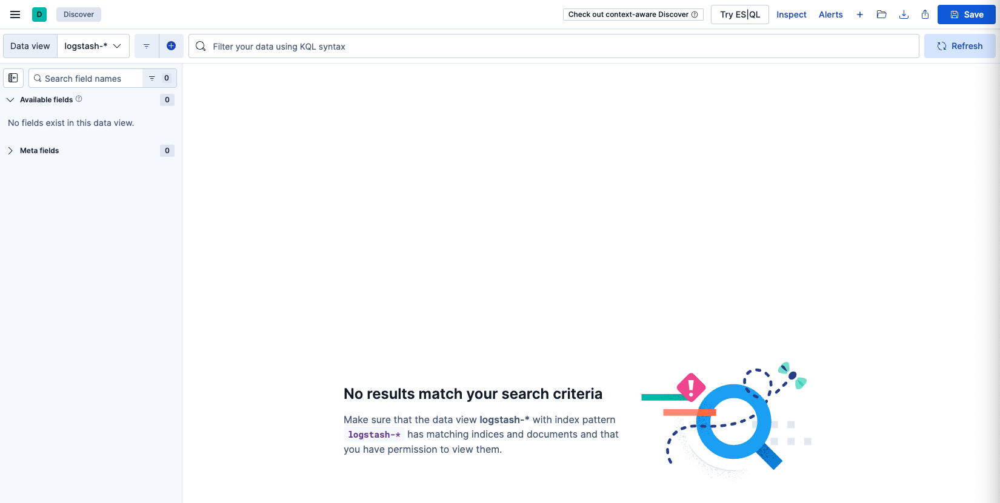

- [Importing Results Into SOF-ELK (Elastic Stack)](#importing-results-into-sof-elk-elastic-stack)
  - [Install and start SOF-ELK](#install-and-start-sof-elk)
    - [Network connectivity trouble on Macs](#network-connectivity-trouble-on-macs)
  - [Update SOF-ELK!](#update-sof-elk)
  - [Run Hayabusa](#run-hayabusa)
  - [Import Hayabusa results into SOF-ELK](#import-hayabusa-results-into-sof-elk)
  - [Check that the import worked](#check-that-the-import-worked)
  - [View results in Discover](#view-results-in-discover)
  - [Import the CSV results](#import-the-csv-results)
  - [Analyzing results](#analyzing-results)
  - [Hayabusa Dashboard](#hayabusa-dashboard)
  - [Future Plans](#future-plans)
  - [Acknowledgements](#acknowledgements)


# Importing Results Into SOF-ELK (Elastic Stack)

## Install and start SOF-ELK

Hayabusa results can easily be imported into Elastic Stack.
We recommend using [SOF-ELK](https://github.com/philhagen/sof-elk), a free elastic stack Linux distro focused on DFIR investigations.

First download and unzip the SOF-ELK 7-zipped VMware image from [https://github.com/philhagen/sof-elk/wiki/Virtual-Machine-README](https://github.com/philhagen/sof-elk/wiki/Virtual-Machine-README).

There are two versions, x86 for Intel CPUs and an ARM version for Apple M-series computers.

When you boot up the VM, you will get a screen similar to below:


You can log in with the following credentials:
* Username: `elk_user`
* Password: `forensics`

Open Kibana in a web browser according to the URL displayed.
For example: http://172.16.23.128:5601/

>> Note: it may take a while for Kibana to load.

You should see a webpage as follows:


We recommend that you SSH into the VM instead of typing commands inside the VM with `ssh elk_user@172.16.23.128`.

> Note: the default keyboard layout is the US keyboard.

### Network connectivity trouble on Macs

If you are on macOS and you get a `no route to host error` in the terminal or you cannot access Kibana in your browser, it is probably due to macOS's local network privacy controls.

In `System Settings`, open up `Privacy & Security` -> `Local Network` and make sure that your browser and terminal program are enabled to be able to communicate with devices on your local network.

## Update SOF-ELK!

Before importing data, be sure to update SOF-ELK with the `sudo sof-elk_update.sh` command.

## Run Hayabusa

Run Hayabusa and save results to CSV (and/or JSON?) 

Ex: `./hayabusa-3.x.x csv-timeline -d ../hayabusa-sample-evtx -w -p super-verbose -G /opt/homebrew/var/GeoIP -o super-verbose-and-geoip.csv`

## Import Hayabusa results into SOF-ELK

Logs are ingested into SOF-ELK by copying the logs into the appropriate directory inside the  `/logstash` directory.

Copy over the Hayabusa results file you created with `scp`:
`scp ./results.csv elk_user@172.16.23.128:/logstash/hayabusa`

## Check that the import worked

First take note of the `Total detections`, `First Timestamp` and `Last Timestamp` in the `Results Summary` of your Hayabusa scan.

If you cannot get this information, you can run `wc -l scan.csv` on *nix to get the total line count for `Total detections`.

By default, Hayabusa does not sort results in order to improve performance so you cannot look at the first and last lines to get the first and last timestamp.
If you do not know the exact first and last timestamps, just set the first date in Kibana to the year 2007 and the last day as `now` so you will have all results.

[!UpdateDates](03-ChangeDates.png)

You should now see the `Total Records` as well as the first and last timestamps of events that have been imported.

It sometimes takes a while to import all the events, so just keep refreshing the page until the `Total Records` is the count that you expect.

[!TotalRecords](04-TotalRecords.png)

You can also check from the terminal by running `sof-elk_clear.py -i list` to see if the import was successful.
You should see that your `evtxlogs` index should have more records:
```
The following indices are currently active in Elasticsearch:
- evtxlogs (32,298 documents)
```

## View results in Discover

Click on the top-left sidebar icon and click `Discover`:


By default, you will not see any results:




You need to make sure that you change the dates so that they include the logs and then click `Update`:


## Import the CSV results

Click the sidebar icon in top-lefthand corner and open `Integrations`.


Type in `csv` in the search bar and click `Upload a file`:


After uploading the CSV file, click `Override settings` to specify the correct timestamp format:


As shown below, perform the following changes and then click `Apply`:

1. Change `Timestamp format` to `custom`.
2. Specify the format as `yyyy-MM-dd HH:mm:ss.SSS XXX`
3. Change the `Time field` to `Timestamp`.
   


Now click `Import` in the bottom left-hand corner.


As shown below, click on `Advanced` and perform the following settings before clicking `Import`:

1. Title the `Index name` as `evtxlogs-hayabusa`.
2. Under `Index settings`, add `, "number_of_replicas": 0` so that the index health status does not turn yellow.
3. Under `Mappings`, change the `RuleTitle` type of `text` to `keyword` so that we can calculate metrics on the rule titles and change the `EventID` type of `long` to `keyword` in order to import without errors.
4. Under `Ingest pipeline`, add `, "field": "Timestamp"` under the `remove` section. Timestamps will be displayed as `@timestamp` so this duplicate field is not needed. Also, delete the following in order to import without errors:
   ```
    {
      "convert": {
        "field": "EventID",
        "type": "long",
        "ignore_missing": true
      }
    },
    ```

Settings should look similar to below:


After importing, you should receive something similar to below:


You can now click `View index in Discover` to view the results.

## Analyzing results

The default Discover view should look similar to this:


You can get an overview of when the events happened and frequency of events by looking at the histogram at top. 

In the left-side sidebar, you can add fields you want to display in the columns by clicking the plus sign after hovering over a field:


To start off, we recommend the following columns:


Your Discover view should now look like this:


You can filter with KQL to search for certain events and alerts. For example:
  * `Level: "critical"`: Just show critical alerts.
  * `Level: "critical" or Level: "high"`: Show high and critical alerts.
  * `NOT Level:info`: Do not show informational events, only alerts.
  * `*LatMov*`: Show events and alerts related to lateral movement.
  * `"Password Spray"`: Only show specific attacks such as "Password Spray".
  * `"LID: 0x8724ead"`: Display all activity associated with Logon ID 0x8724ead.

## Hayabusa Dashboard

We have exported a simple Hayabusa Dashboard in JSON to download [here](https://github.com/Yamato-Security/hayabusa/blob/main/doc/ElasticStackImport/HayabusaDashboard.ndjson)

To import the dashboard, open the left sidebar and click `Stack Management` under `Management`.


After clicking `Saved Objects`, please click `Import` in the upper right-hand corner and import the Hayabusa Dashboard JSON file you downloaded.


You should now be able to use the dashboard shown below:


## Future Plans

We plan on creating Hayabusa logstash parsers and a dashboard pre-built for SOF-ELK so that all you will need to do is copy the CSV results file to a directory in order to ingest the logs.

## Acknowledgements

Much of this documentation was taken from the blog write-up in Japanese from @kzzzzo2 [here](https://qiita.com/kzzzzo2/items/ead8ccc77b7609143749).

Many thanks to @kzzzzo2!