# Importing Results Into Elastic Stack

## Start an elastic stack distribution

Hayabusa results can easily be imported into Elastic Stack. We recommend using [SOF-ELK](https://github.com/philhagen/sof-elk/blob/main/VM_README.md), a free elastic stack Linux distro focused on DFIR investigations.

First download and unzip the SOF-ELK 7-zipped VMware image from [http://for572.com/sof-elk-vm](http://for572.com/sof-elk-vm).

* Username: `elk_user`
* Password: `forensics`

When you boot up the VM, you will get a screen similar to below:

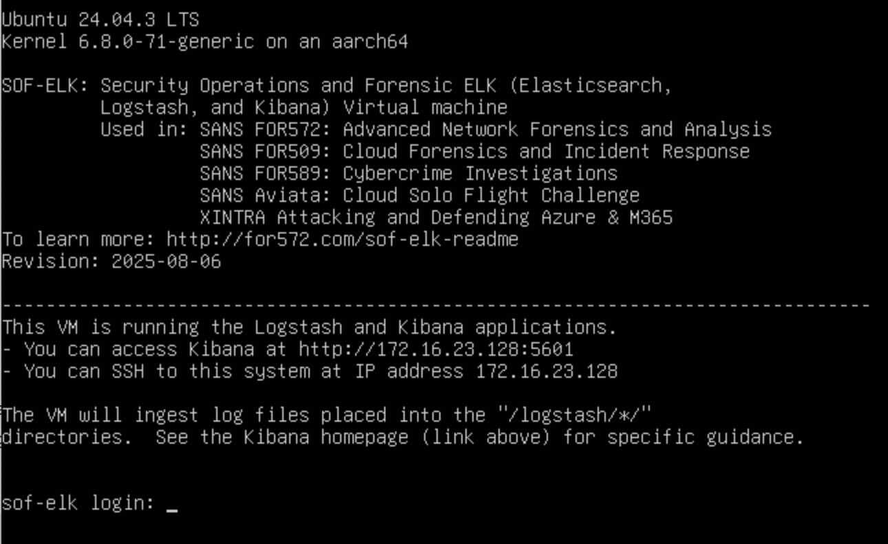

Open Kibana in a web browser according to the URL displayed. For example: http://172.16.62.130:5601/

>> Note: it may take a while for Kibana to load.

You should see a webpage as follows:


## Import the CSV results

Click the sidebar icon in top-lefthand corner and open `Integrations`.

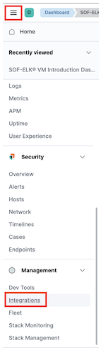

Type in `csv` in the search bar and click `Upload a file`:

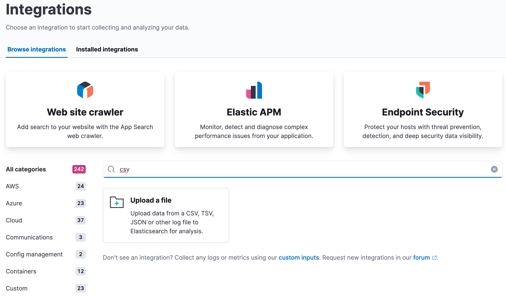

After uploading the CSV file, click `Override settings` to specify the correct timestamp format:

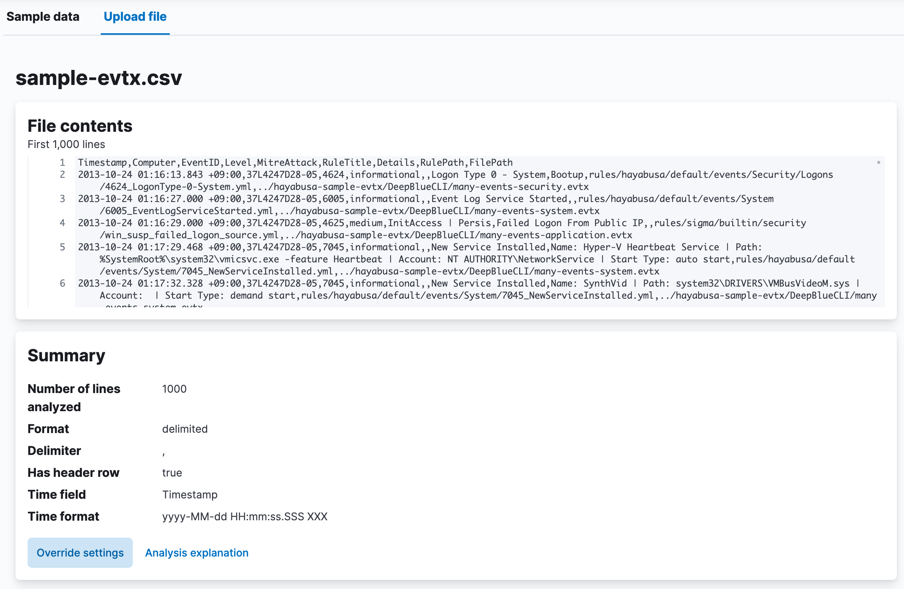

As shown below, perform the following changes and then click `Apply`:

1. Change `Timestamp format` to `custom`.
2. Specify the format as `yyyy-MM-dd HH:mm:ss.SSS XXX`
3. Change the `Time field` to `Timestamp`.
   
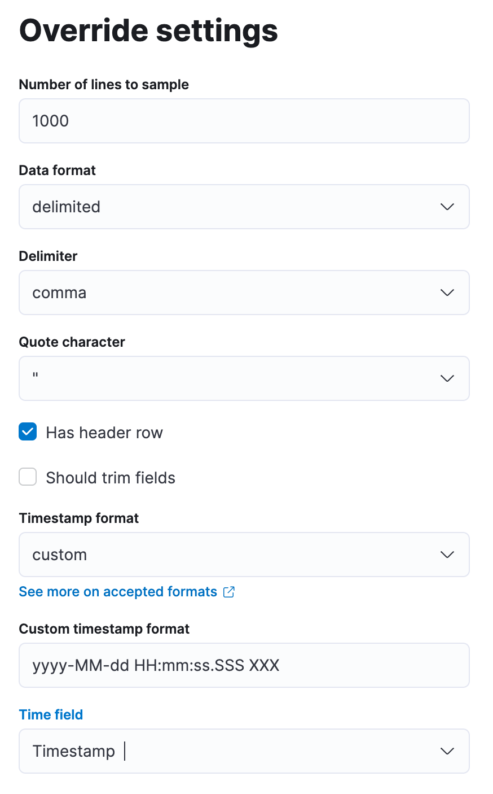

Now click `Import` in the bottom left-hand corner.

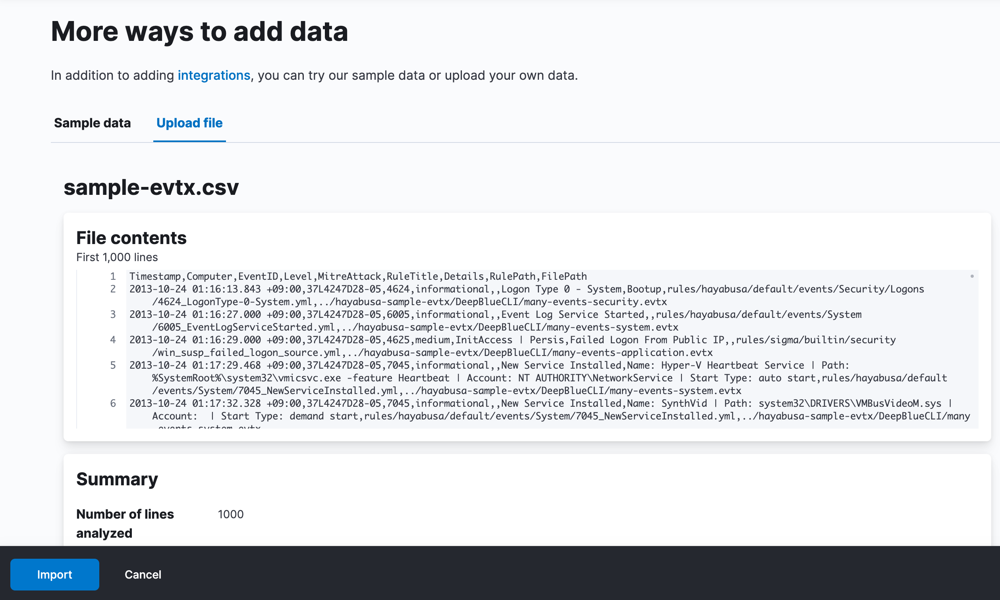

As shown below, click on `Advanced` and perform the following settings before clicking `Import`:

1. Title the `Index name` as `evtxlogs-hayabusa`.
2. Under `Index settings`, add `, "number_of_replicas": 0` so that the index health status does not turn yellow.
3. Under `Mappings`, change the `RuleTitle` type of `text` to `keyword` so that we can calculate metrics on the rule titles and change the `EventID` type of `long` to `keyword` in order to import without errors.
4. Under `Ingest pipeline`, add `, "field": "Timestamp"` under the `remove` section. Timestamps will be displayed as `@timestamp` so this duplicate field is not needed. Also, delete the following in order to import without errors:
   ```
    {
      "convert": {
        "field": "EventID",
        "type": "long",
        "ignore_missing": true
      }
    },
    ```

Settings should look similar to below:

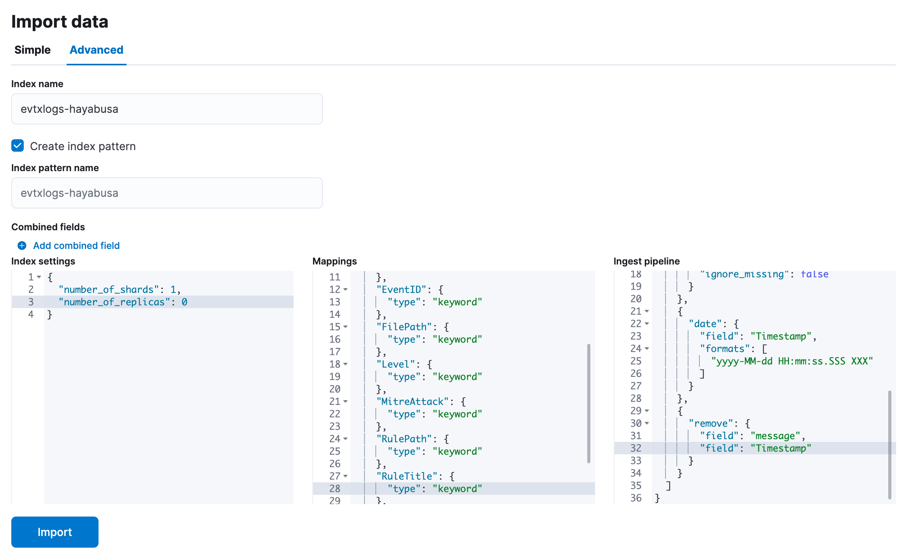

After importing, you should receive something similar to below:

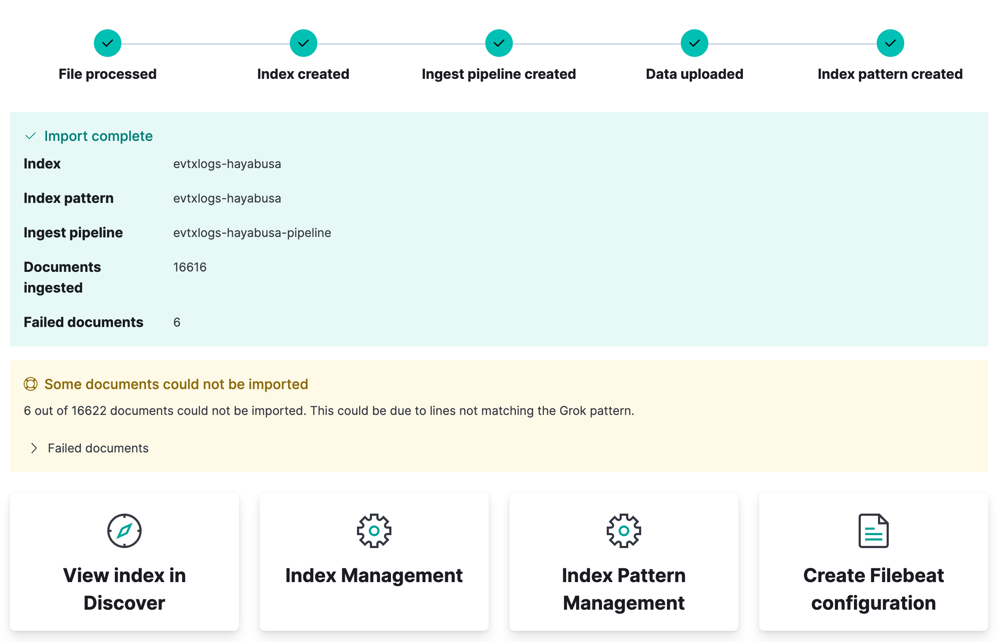

You can now click `View index in Discover` to view the results.

## Analyzing results

The default Discover view should look similar to this:

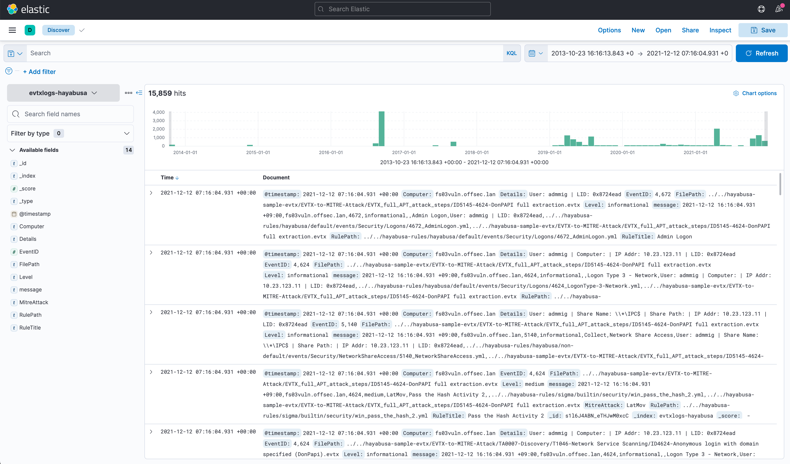

You can get an overview of when the events happened and frequency of events by looking at the histogram at top. 

In the left-side sidebar, you can add fields you want to display in the columns by clicking the plus sign after hovering over a field:

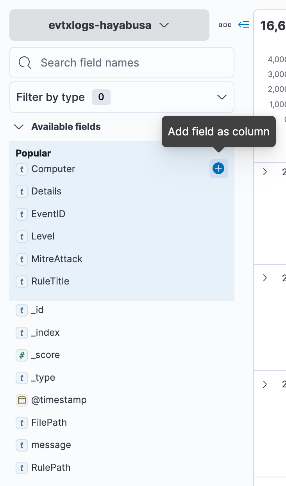

To start off, we recommend the following columns:

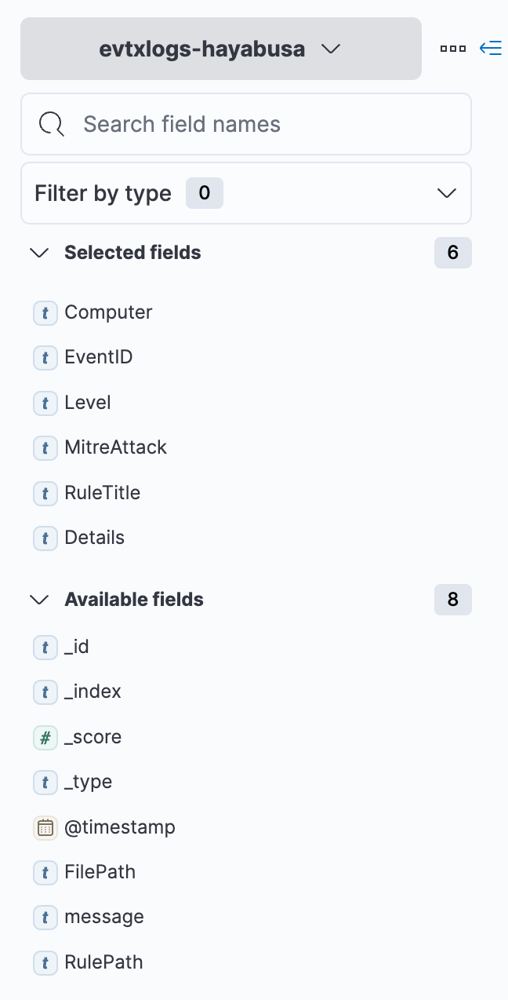

Your Discover view should now look like this:

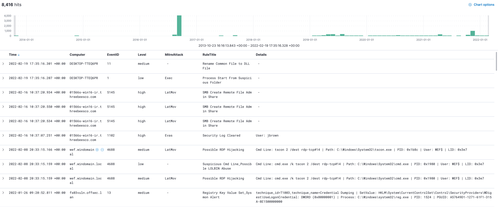

You can filter with KQL to search for certain events and alerts. For example:
  * `Level: "critical"`: Just show critical alerts.
  * `Level: "critical" or Level: "high"`: Show high and critical alerts.
  * `NOT Level:info`: Do not show informational events, only alerts.
  * `*LatMov*`: Show events and alerts related to lateral movement.
  * `"Password Spray"`: Only show specific attacks such as "Password Spray".
  * `"LID: 0x8724ead"`: Display all activity associated with Logon ID 0x8724ead.

## Hayabusa Dashboard

We have exported a simple Hayabusa Dashboard in JSON to download [here](https://github.com/Yamato-Security/hayabusa/blob/main/doc/ElasticStackImport/HayabusaDashboard.ndjson)

To import the dashboard, open the left sidebar and click `Stack Management` under `Management`.

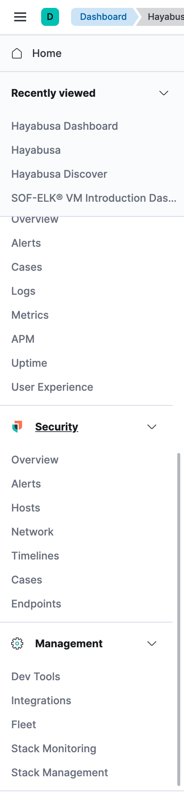

After clicking `Saved Objects`, please click `Import` in the upper right-hand corner and import the Hayabusa Dashboard JSON file you downloaded.

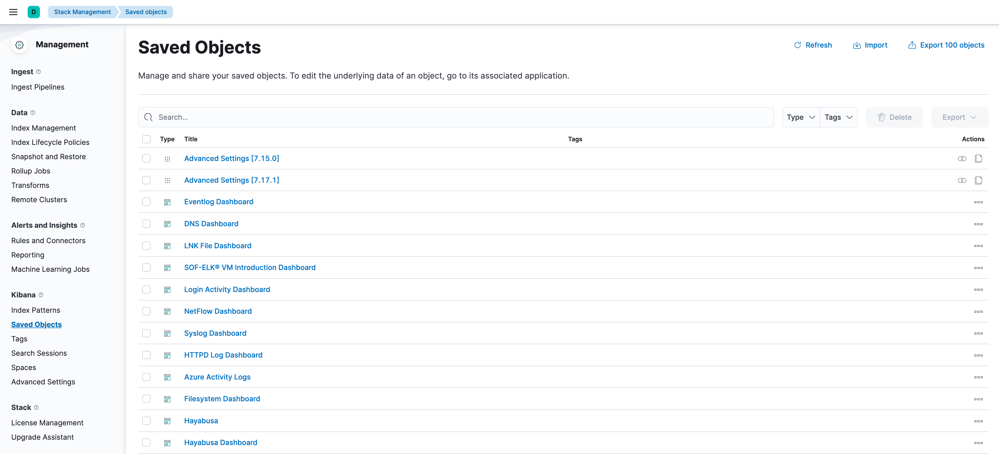

You should now be able to use the dashboard shown below:


## Future Plans

We plan on creating Hayabusa logstash parsers and a dashboard pre-built for SOF-ELK so that all you will need to do is copy the CSV results file to a directory in order to ingest the logs.

## Acknowledgements

Much of this documentation was taken from the blog write-up in Japanese from @kzzzzo2 [here](https://qiita.com/kzzzzo2/items/ead8ccc77b7609143749).

Many thanks to @kzzzzo2!