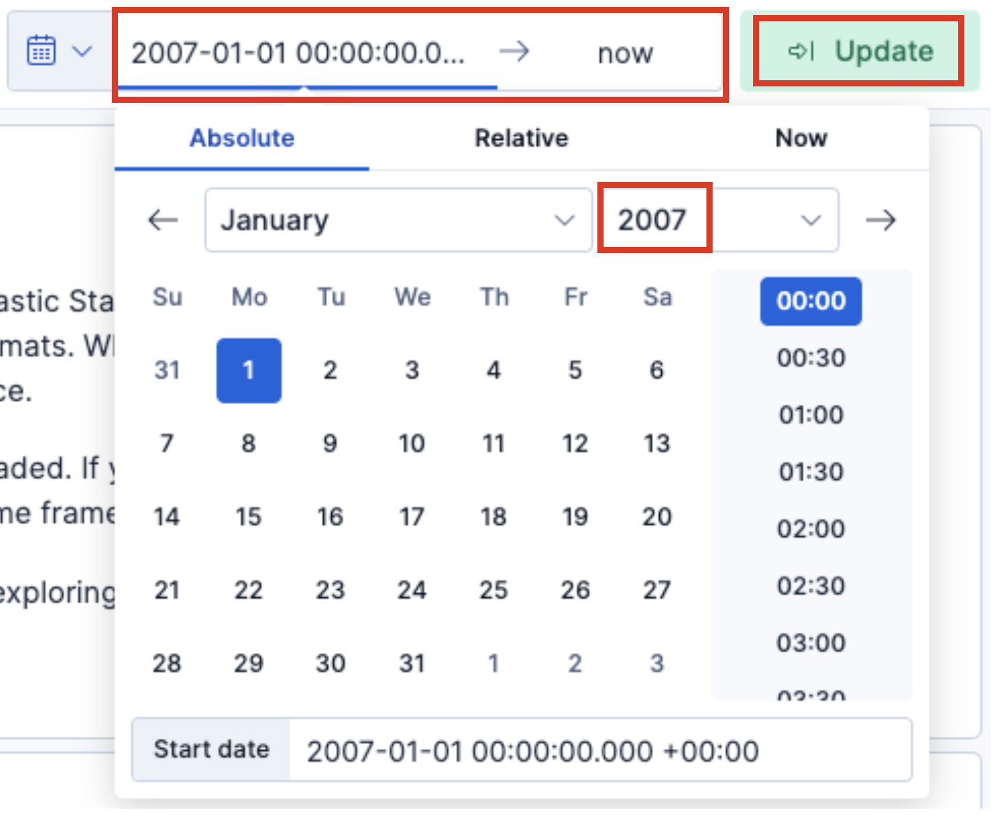
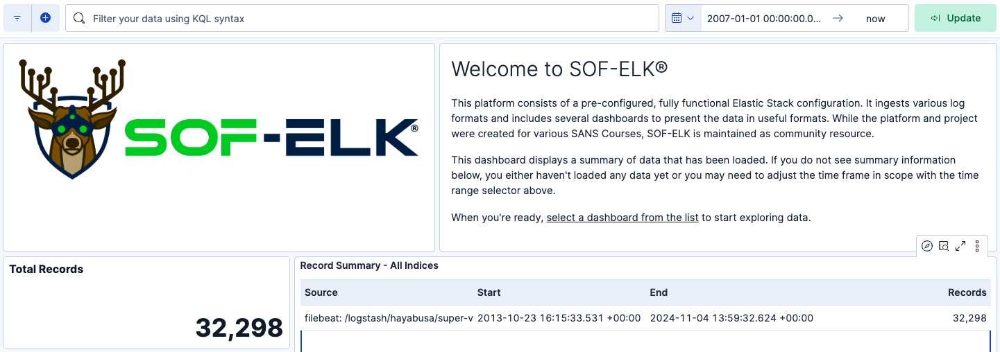
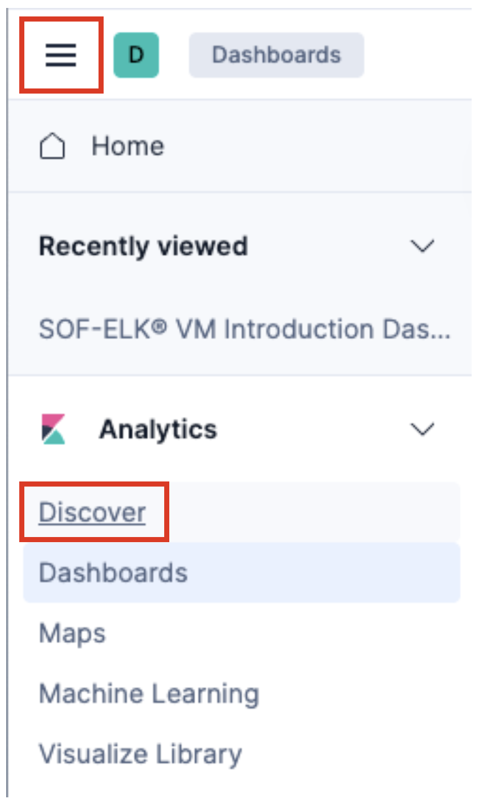
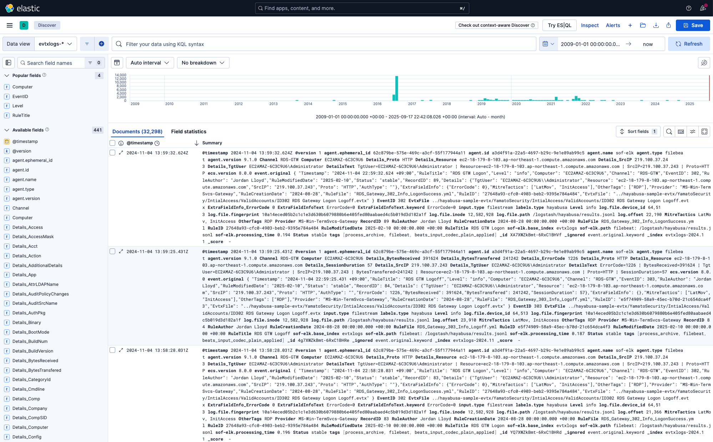
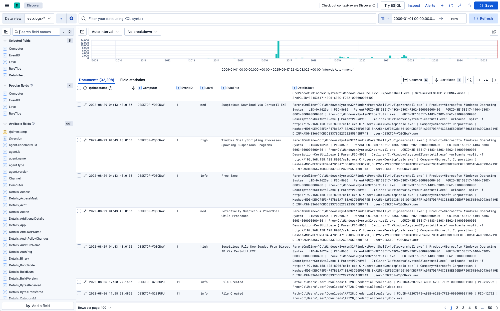
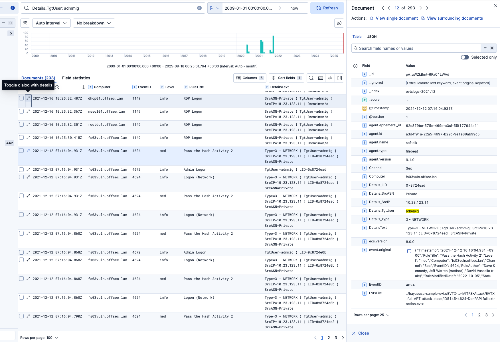
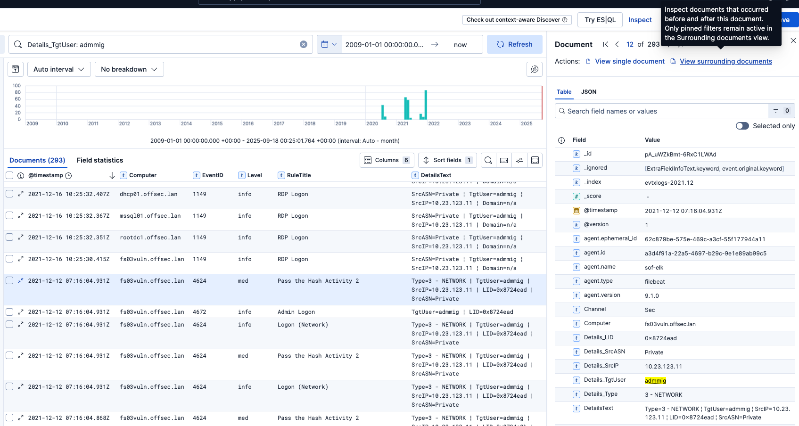
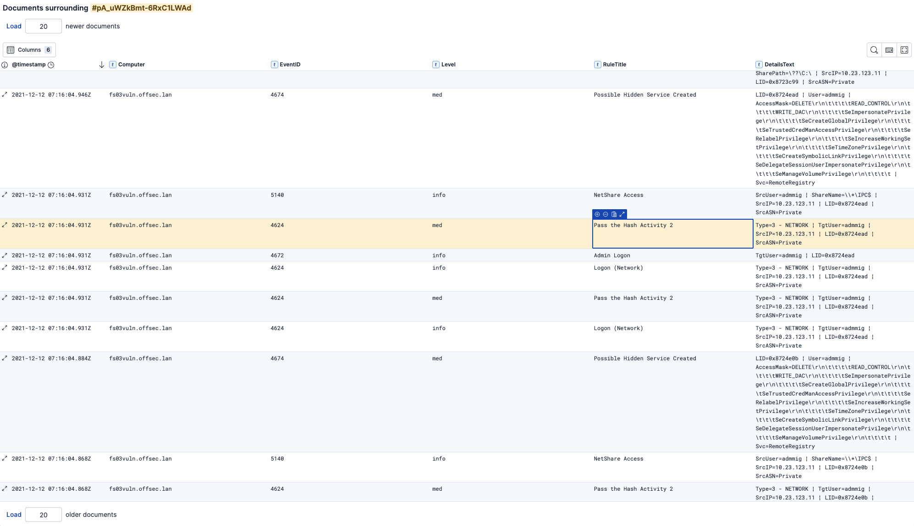
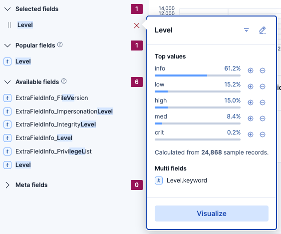

# SOF-ELK (Elastic Stack) へのインポート結果

## 目次
- [SOF-ELK (Elastic Stack) へのインポート結果](#sof-elk-elastic-stack-へのインポート結果)
  - [目次](#目次)
  - [SOF-ELKのインストールと起動](#sof-elkのインストールと起動)
    - [Macでのネットワーク接続の問題](#macでのネットワーク接続の問題)
  - [SOF-ELKをアップデート！](#sof-elkをアップデート)
  - [Hayabusaの実行](#hayabusaの実行)
  - [オプション：古いインポートデータの削除](#オプション古いインポートデータの削除)
  - [SOF-ELKでHayabusaのlogstash設定ファイルを構成](#sof-elkでhayabusaのlogstash設定ファイルを構成)
  - [SOF-ELKにHayabusaの結果をインポート](#sof-elkにhayabusaの結果をインポート)
  - [Kibanaでインポートが成功したか確認](#kibanaでインポートが成功したか確認)
  - [Discoverで結果を表示](#discoverで結果を表示)
  - [結果の分析](#結果の分析)
    - [カラムの追加](#カラムの追加)
    - [フィルタリング](#フィルタリング)
    - [詳細の切り替え](#詳細の切り替え)
    - [前後のドキュメントを表示](#前後のドキュメントを表示)
    - [フィールドのクイックメトリクスを取得](#フィールドのクイックメトリクスを取得)
  - [今後の計画](#今後の計画)

## SOF-ELKのインストールと起動

Hayabusaの結果はElastic Stackに簡単にインポートできます。
DFIRインベスティゲーションに特化した無料のElastic StackのLinuxディストリビューションである[SOF-ELK](https://github.com/philhagen/sof-elk)の使用を推奨します。

まず、[https://github.com/philhagen/sof-elk/wiki/Virtual-Machine-README](https://github.com/philhagen/sof-elk/wiki/Virtual-Machine-README)から、SOF-ELKの7-zip圧縮されたVMwareイメージをダウンロードして解凍してください。

Intel CPU用のx86版とApple M-seriesコンピュータ用のARM版の2つのバージョンがあります。

VMを起動すると、次のような画面が表示されます：


KibanaのURLとSSHサーバーのIPアドレスを控えておいてください。

以下の認証情報でログインできます：
* ユーザー名：`elk_user`
* パスワード：`forensics`

表示されたURLに従って、WebブラウザでKibanaを開きます。
例：http://172.16.23.128:5601/

> 注意：Kibanaが読み込まれるまでに時間がかかることがあります。

次のようなWebページが表示されます：


VM内でコマンドを入力する代わりに、`ssh elk_user@172.16.23.128`でVMにSSH接続することをお勧めします。

> 注意：デフォルトのキーボードレイアウトはUSキーボードです。

### Macでのネットワーク接続の問題

macOSを使用していて、ターミナルで`no route to host`エラーが発生したり、ブラウザでKibanaにアクセスできない場合は、macOSのローカルネットワークプライバシー制御が原因の可能性があります。

`システム設定`で、`プライバシーとセキュリティ` -> `ローカルネットワーク`を開き、ブラウザとターミナルプログラムがローカルネットワーク上のデバイスと通信できるように有効になっていることを確認してください。

## SOF-ELKをアップデート！

データをインポートする前に、必ず`sudo sof-elk_update.sh`コマンドでSOF-ELKをアップデートしてください。

## Hayabusaの実行

Hayabusaを実行し、結果をJSONLに保存します。

例：`./hayabusa json-timeline -L -d ../hayabusa-sample-evtx -w -p super-verbose -G /opt/homebrew/var/GeoIP -o results.jsonl`

## オプション：古いインポートデータの削除

初めてHayabusaの結果をインポートするのではなく、すべてをクリアしたい場合は、以下の手順で実行できます：

1. SOF-ELKに現在どのレコードがあるか確認：`sof-elk_clear.py -i list`
2. 現在のデータを削除：`sof-elk_clear.py -a`
3. logstashディレクトリのファイルを削除：`rm /logstash/hayabusa/*`

## SOF-ELKでHayabusaのlogstash設定ファイルを構成

SOF-ELKにはすでにフィールド名をElastic Common Schema形式に変換するHayabusaのlogstash設定ファイルが含まれています。
Hayabusaのフィールド名に慣れている場合は、私たちが提供するものを使用することをお勧めします。

1. まずSOF-ELKにSSH接続：`ssh elk_user@172.16.23.128`
2. 現在のlogstash設定ファイルを削除または移動：`sudo rm /etc/logstash/conf.d/6650-hayabusa.conf`
3. 新しい[6650-hayabusa-jsonl.conf](6650-hayabusa-jsonl.conf)ファイルを`/etc/logstash/conf.d/`にアップロード：`sudo wget https://raw.githubusercontent.com/Yamato-Security/hayabusa/main/doc/ElasticStackImport/6650-hayabusa-jsonl.conf -O /etc/logstash/conf.d/6650-hayabusa.conf`
4. logstashを再起動：`sudo systemctl restart logstash`

この設定ファイルは、統合された`DetailsText`と`ExtraFieldInfoText`フィールドを作成し、各レコードを一つずつ開いてすべてのフィールドを確認する代わりに、最も重要なフィールドを一目で確認できるようにします。

## SOF-ELKにHayabusaの結果をインポート

ログは`/logstash`ディレクトリ内の適切なディレクトリにコピーすることでSOF-ELKに取り込まれます。

まずSSHから`exit`し、作成したHayabusaの結果ファイルをコピーします：
`scp ./results.jsonl elk_user@172.16.23.128:/logstash/hayabusa`

## Kibanaでインポートが成功したか確認

まず、Hayabusaスキャンの`Results Summary`にある`Total detections`、`First Timestamp`、`Last Timestamp`を控えておいてください。

この情報が取得できない場合は、*nixで`wc -l results.jsonl`を実行して`Total detections`の合計行数を取得できます。

デフォルトでは、Hayabusaはパフォーマンスを向上させるために結果をソートしないため、最初と最後の行を見て最初と最後のタイムスタンプを取得することはできません。
正確な最初と最後のタイムスタンプがわからない場合は、Kibanaで最初の日付を2007年に、最後の日を`now`に設定して、すべての結果を表示できるようにしてください。



インポートされたイベントの`Total Records`と最初と最後のタイムスタンプが表示されるはずです。

すべてのイベントをインポートするのに時間がかかることがあるので、`Total Records`が期待するカウントになるまでページを更新し続けてください。



ターミナルから`sof-elk_clear.py -i list`を実行して、インポートが成功したかどうかを確認することもできます。
`evtxlogs`インデックスにより多くのレコードが表示されるはずです：
```
The following indices are currently active in Elasticsearch:
- evtxlogs (32,298 documents)
```

インポート時に解析エラーが発生した場合は、GitHubでissueを作成してください。
これは`/var/log/logstash/logstash-plain.log`ログファイルの末尾を確認することで確認できます。

## Discoverで結果を表示

左上のサイドバーアイコンをクリックし、`Discover`をクリックします：



おそらく`No results match your search criteria`と表示されるでしょう。

左上の`logstash-*`インデックスと表示されている場所をクリックし、`evtxlogs-*`に変更します。
これでDiscoverタイムラインが表示されるはずです。

## 結果の分析

デフォルトのDiscoverビューは次のようになります：



上部のヒストグラムを見ることで、イベントがいつ発生したか、イベントの頻度の概要を把握できます。

### カラムの追加

左側のサイドバーで、フィールドにカーソルを合わせた後にプラス記号をクリックすることで、カラムに表示したいフィールドを追加できます。
フィールドが多いため、検索ボックスに探しているフィールド名を入力することをお勧めします。


まず、以下のカラムをお勧めします：
- `Computer`
- `EventID`
- `Level`
- `RuleTitle`
- `DetailsText`

モニターが十分に広い場合は、すべてのフィールド情報を表示するために`ExtraFieldInfoText`も追加することをお勧めします。

Discoverビューは次のようになります：



### フィルタリング

KQL（Kibana Query Language）でフィルタリングして、特定のイベントとアラートを検索できます。例：
  * `Level: "crit"`：重要アラートのみを表示。
  * `Level: "crit" OR Level: "high"`：高および重要アラートを表示。
  * `NOT Level: info`：情報イベントは表示せず、アラートのみ。
  * `MitreTactics: *LatMov*`：ラテラルムーブメントに関連するイベントとアラートを表示。
  * `"PW Spray"`：「パスワードスプレー」などの特定の攻撃のみを表示。
  * `"LID: 0x8724ead"`：ログオンID 0x8724eadに関連するすべてのアクティビティを表示。
  * `Details_TgtUser: admmig`：ターゲットユーザーが`admmig`であるすべてのイベントを検索。

### 詳細の切り替え

レコード内のすべてのフィールドを確認するには、タイムスタンプの横にあるアイコン（詳細付きダイアログを切り替え）をクリックします：



### 前後のドキュメントを表示

特定のアラートの直前と直後のイベントを表示したい場合は、まずそのアラートの詳細を開き、右上の`View surrounding documents`をクリックします：



この例では、Pass the Hash攻撃アラートの前後のイベントを確認しています：



> 注意：より多くのイベントを取得するには、上部の`Load x newer documents`または下部の`Load x older documents`の数値を変更してください。

### フィールドのクイックメトリクスを取得

左の列で、フィールド名をクリックすると、その使用状況に関するクイックメトリクスが表示されます：



> データは速度のためにサンプリングされているため、100%正確ではないことに注意してください。

## 今後の計画

* CSV用のLogstashパーサー
* 事前構築されたダッシュボード