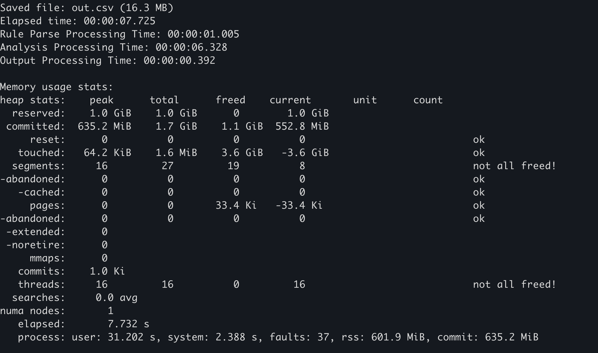
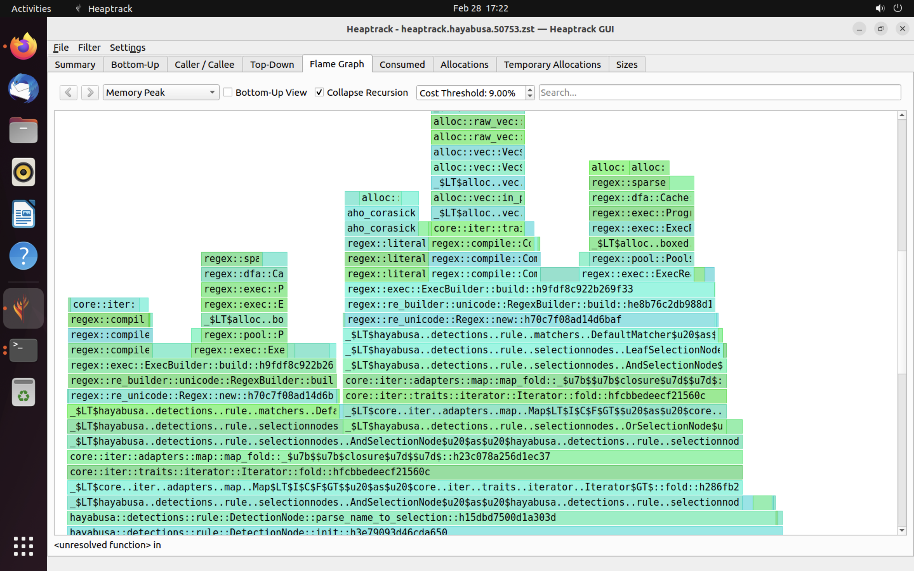
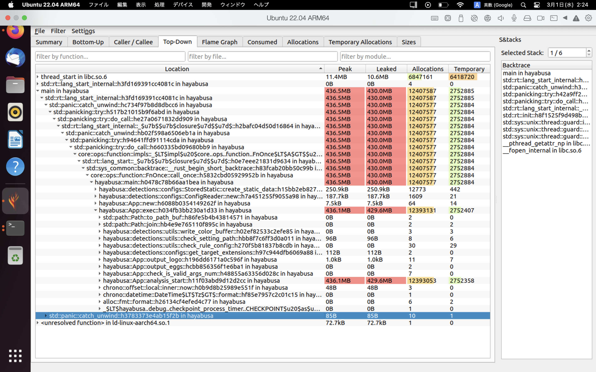

# Rust Performance Guide for Hayabusa Developers

# Table of Contents

- [Rust Performance Guide for Hayabusa Developers](#rust-performance-guide-for-hayabusa-developers)
- [Table of Contents](#table-of-contents)
- [Author](#author)
- [English translation](#english-translation)
- [About this document](#about-this-document)
- [Speed improvement](#speed-improvement)
  - [Change the memory allocator](#change-the-memory-allocator)
  - [Reduce IO processing in loops](#reduce-io-processing-in-loops)
  - [Avoid regular expression compilation in loops](#avoid-regular-expression-compilation-in-loops)
  - [Use buffer IO](#use-buffer-io)
  - [Use standard String methods instead of regular expressions](#use-standard-string-methods-instead-of-regular-expressions)
  - [Filter by string length](#filter-by-string-length)
  - [Do not compile with codegen-units=1](#do-not-compile-with-codegen-units1)
- [Reducing memory usage](#reducing-memory-usage)
  - [Avoid unnecessary use of clone(), to\_string(), and to\_owned()](#avoid-unnecessary-use-of-clone-to_string-and-to_owned)
  - [Use Iterator instead of Vec](#use-iterator-instead-of-vec)
  - [Use the compact\_str crate when handling short strings](#use-the-compact_str-crate-when-handling-short-strings)
  - [Delete unnecessary fields in long-lived structures](#delete-unnecessary-fields-in-long-lived-structures)
- [Benchmarking](#benchmarking)
  - [Use the memory allocator's statistics function.](#use-the-memory-allocators-statistics-function)
  - [Use Windows' performance counter](#use-windows-performance-counter)
  - [Use heaptrack](#use-heaptrack)
- [References](#references)
- [Contributions](#contributions)

# Author
Fukusuke Takahashi

# English translation
Zach Mathis ([@yamatosecurity](https://twitter.com/yamatosecurity))

# About this document
[Hayabusa](https://github.com/Yamato-Security/hayabusa) (English: "peregrine falcon") is a fast forensics analysis tool developed by the [Yamato Security](https://yamatosecurity.connpass.com/) group in Japan. It is developed in [Rust](https://www.rust-lang.org/) in order to (threat) hunt as fast as a peregrine falcon. Rust is a fast language in itself, however, there are many pitfalls that can result in slow speeds and high memory usage. We created this document based on actual performance improvements in Hayabusa (see the [changelog here](https://github.com/Yamato-Security/hayabusa/blob/main/CHANGELOG.md)), but these techniques should be applicable to other Rust programs as well. We hope you can benefit from the knowledge we have gained through our trial and error.

# Speed improvement
## Change the memory allocator
Simply changing the default memory allocator may improve speed significantly.
For example, according to these [benchmarks](https://github.com/rust-lang/rust-analyzer/issues/1441), the following two memory allocators

- [mimalloc](https://microsoft.github.io/mimalloc/)
- [jemalloc](https://jemalloc.net/)

are much faster than the default memory allocator. We were able to confirm a significant speed improvement by changing our memory allocator from jemalloc to mimalloc, so we made mimalloc the default since version 1.8.0. (Although mimalloc does use slightly more memory than jemalloc.)

### Before  <!-- omit in toc -->
```
# Not applicable. (You do not need to declare anything to use the default memory allocator.)
```
### After  <!-- omit in toc -->
You only need to perform the following 2 steps in order to change the global [memory allocator](https://doc.rust-lang.org/stable/std/alloc/trait.GlobalAlloc.html):

1. Add the [mimalloc crate](https://crates.io/crates/mimalloc) to the `Cargo.toml` file's [[dependencies] section](https://doc.rust-lang.org/cargo/guide/dependencies.html#adding-a-dependency):
    ```Toml
    [dependencies]
    mimalloc = { version = "*", default-features = false }
    ```
2. Define that you want to use mimalloc under [#[global_allocator]](https://doc.rust-lang.org/std/alloc/index.html#the-global_allocator-attribute) somewhere in the program:
    ```Rust
    use mimalloc::MiMalloc;
    
    #[global_allocator]
    static GLOBAL: MiMalloc = MiMalloc;
    ```
That is all you need to do to change the memory allocator.

### Effectiveness（Real example from a Pull Request）  <!-- omit in toc -->
How much speed improves will depend on the program, but in the following example
- [chg: build.rs(for vc runtime) to rustflags in config.toml and replace default global memory allocator with mimalloc. #777](https://github.com/Yamato-Security/hayabusa/pull/777)

changing the memory allocator to [mimalloc](https://github.com/microsoft/mimalloc) resulted in a 20-30% performance increase on Intel CPUs. 
(For some reason, there was not as a significant performance increase on ARM based macOS devices.)

## Reduce IO processing in loops
Disk IO processing is much slower than processing in memory. Therefore, it is desirable to avoid IO processing as much as possible, especially in loops.

### Before  <!-- omit in toc -->
The example below shows a file open occuring one million times in a loop:
```Rust
use std::fs;

fn main() {
    for _ in 0..1000000 {
        let f = fs::read_to_string("sample.txt").unwrap();
        f.len();
    }
}
```
### After  <!-- omit in toc -->
By opening the file outside of the loop as follows
```Rust
use std::fs;

fn main() {
    let f = fs::read_to_string("sample.txt").unwrap();
    for _ in 0..1000000 {
        f.len();
    }
}
```
there will be about a 1000 times speed increase.

### Effectiveness（Real example from a Pull Request）   <!-- omit in toc -->
In the following example, the IO processing when handling one detection result at a time was able to be performed outside of the loop:
- [Improve speed by removing IO process before insert_message() #858](https://github.com/Yamato-Security/hayabusa/pull/858)

This resulted in a speed improvement of about 20%.

## Avoid regular expression compilation in loops
Regular expression compilation is a very costly process compared to regular expression matching. Therefore, it is advisable to avoid regular expression compilation as much as possible, especially in loops.

### Before  <!-- omit in toc -->
For example, the following process creates 100,000 attempts to match a regular expression in a loop:
```Rust
extern crate regex;
use regex::Regex;

fn main() {
    let text = "1234567890";
    let match_str = "abc";
    for _ in 0..100000 {
        if Regex::new(match_str).unwrap().is_match(text){ // Regular expression compilation in a loop
            println!("matched!");
        }
    }
}
```
### After  <!-- omit in toc -->
By doing a regular expression compilation outside the loop, as shown below
```Rust
extern crate regex;
use regex::Regex;

fn main() {
    let text = "1234567890";
    let match_str = "abc";
    let r = Regex::new(match_str).unwrap(); // Compile the regular expression outside the loop
    for _ in 0..100000 {
        if r.is_match(text) {
            println!("matched!");
        }
    }
}
```
the updated code is about 100 times faster.

### Effectiveness（Real example from a Pull Request）   <!-- omit in toc -->
In the following example, regular expression compilation is performed outside the loop and cached.
- [cache regex for allowlist and regexes keyword. #174](https://github.com/Yamato-Security/hayabusa/pull/174)

This resulted in significant speed improvements.

## Use buffer IO
Without buffer IO, file IO is slow. With buffer IO, IO operations are performed through buffers in memory, reducing the number of system calls and improving speed.

### Before  <!-- omit in toc -->
For example, in the following process, [write](https://doc.rust-lang.org/std/io/trait.Write.html#tymethod.write) occurs 1,000,000 times.
```Rust
use std::fs::File;
use std::io::{BufWriter, Write};

fn main() {
    let mut f = File::create("sample.txt").unwrap();
    for _ in 0..1000000 {
        f.write(b"hello world!");
    }
}
```
### After  <!-- omit in toc -->
By using [BufWriter](https://doc.rust-lang.org/std/io/struct.BufWriter.html) as follows
```Rust
use std::fs::File;
use std::io::{BufWriter, Write};

fn main() {
    let mut f = File::create("sample.txt").unwrap();
    let mut writer = BufWriter::new(f);
    for _ in 0..1000000 {
        writer.write(b"some text");
    }
    writer.flush().unwrap();
}
```
there is about a 50 times speed improvement.

### Effectiveness（Real example from a Pull Request）   <!-- omit in toc -->
The method described above was implemented here
- [Feature/improve output#253 #285](https://github.com/Yamato-Security/hayabusa/pull/285)

and has resulted in significant speed improvements in output processing.

## Use standard String methods instead of regular expressions
While regular expressions can cover complex matching patterns, they are slower than [standard String methods](https://doc.rust-lang.org/std/string/struct.String.html). Therefore, it is faster to use standard String methods for simple string matching such as the following.

- Starts-with matching（Regex: `foo.*`）-> [String::starts_with()](https://doc.rust-lang.org/std/string/struct.String.html#method.starts_with)
- Ends-with matching（Regex: `.*foo`）-> [String::ends_with()](https://doc.rust-lang.org/std/string/struct.String.html#method.ends_with)
- Contains matching（Regex: `.*foo.*`）-> [String::contains()](https://doc.rust-lang.org/std/string/struct.String.html#method.contains)

### Before  <!-- omit in toc -->
For example, the following code performs ends-with matching in a regular expression one million times.
```Rust
extern crate regex;
use regex::Regex;

fn main() {
    let text = "1234567890";
    let match_str = ".*abc";
    let r = Regex::new(match_str).unwrap();
    for _ in 0..1000000 {
        if r.is_match(text) {
            println!("matched!");
        }
    }
}
```
### After  <!-- omit in toc -->
By using [String::ends_with()](https://doc.rust-lang.org/std/string/struct.String.html#method.ends_with) as follows
```Rust
fn main() {
    let text = "1234567890";
    let match_str = "abc";
    for _ in 0..1000000 {
        if text.ends_with(match_str) {
            println!("matched!");
        }
    }
}
```
processing will be 10 times faster.

### Effectiveness（Real example from a Pull Request）   <!-- omit in toc -->
Since Hayabusa requires case-insensitive string comparison, we use [to_lowercase()](https://doc.rust-lang.org/std/string/struct.String.html#method.to_lowercase) and then apply the above method. Even then, in the following examples
- [Imporving speed by changing wildcard search process from regular expression match to starts_with/ends_with match #890](https://github.com/Yamato-Security/hayabusa/pull/890)
- [Improving speed by using eq_ignore_ascii_case() before regular expression match #884](https://github.com/Yamato-Security/hayabusa/pull/884)

speed has improved by about 15% compared to before.

## Filter by string length
Depending on the characteristics of the strings being handled, adding a simple filter may reduce the number of string matching attempts and speed up the process. If you often compare strings of non-fixed and unmatched string lengths, you can speed up the process by using string length as a primary filter.

### Before  <!-- omit in toc -->
For example, the following code attempts one million regular expression matches.
```Rust
extern crate regex;
use regex::Regex;

fn main() {
    let text = "1234567890";
    let match_str = "abc";
    let r = Regex::new(match_str).unwrap();
    for _ in 0..1000000 {
        if r.is_match(text) {
            println!("matched!");
        }
    }
}
```
### After  <!-- omit in toc -->
By using [String::len()](https://doc.rust-lang.org/std/string/struct.String.html#method.len) as a primary filter, as shown below
```Rust
extern crate regex;
use regex::Regex;

fn main() {
    let text = "1234567890";
    let match_str = "abc";
    let r = Regex::new(match_str).unwrap();
    for _ in 0..1000000 {
        if text.len() == match_str.len() { // Primary filter by string length
            if r.is_match(text) {
                println!("matched!");
            }
        }
    }
}
```
speed will improve by about 20 times.

### Effectiveness（Real example from a Pull Request）   <!-- omit in toc -->
In the following example, the above method is used.
- [Improving speed by adding string length match before regular expression match #883](https://github.com/Yamato-Security/hayabusa/pull/883)

This improved speed by about 15%.

## Do not compile with codegen-units=1
Many articles on performance optimization with Rust advise to add `codegen-units = 1` under the `[profile.release]` section.
This will cause slower compilation times as the default is to compile in parallel but in theory should result in more optimized and faster code.
However, in our testing, Hayabusa actually runs slower with this option turned on and compilation takes longer so we keep this off.
The binary size of the executable is about 100kb smaller so this may be ideal for embedded systems where hard disk space is limited.

# Reducing memory usage

## Avoid unnecessary use of clone(), to_string(), and to_owned()
Using [clone()](https://doc.rust-lang.org/std/clone/trait.Clone.html) or [to_string()](https://doc.rust-lang.org/std/string/trait.ToString.html) are easy ways to resolve compilation errors related to [ownership](https://doc.rust-lang.org/book/ch04-01-what-is-ownership.html). However, they will usually result in high usage of memory and should be avoided. It is always best to first see if you can replace them with low cost [references](https://doc.rust-lang.org/book/ch04-02-references-and-borrowing.html).

### Before  <!-- omit in toc -->
For example, if you want to iterate the same `Vec` multiple times, you can use [clone()](https://doc.rust-lang.org/std/clone/trait.Clone.html) to eliminate compilation errors.
```Rust
fn main() {
    let lst = vec![1, 2, 3];
    for x in lst.clone() { // In order to eliminate compile errors
        println!("{x}");
    }

    for x in lst {
        println!("{x}");
    }
}
```
### After  <!-- omit in toc -->
However, by using [references](https://doc.rust-lang.org/book/ch04-02-references-and-borrowing.html) as shown below, you can remove the need to use [clone()](https://doc.rust-lang.org/std/clone/trait.Clone.html).
```Rust
fn main() {
    let lst = vec![1, 2, 3];
    for x in &lst { // Eliminate compile errors with a reference
        println!("{x}");
    }

    for x in lst {
        println!("{x}");
    }
}
```
By removing the clone() usage, memory usage is reduced by up to 50%.

### Effectiveness（Real example from a Pull Request）   <!-- omit in toc -->
In the following example, by replacing unnecessary [clone()](https://doc.rust-lang.org/std/clone/trait.Clone.html), [to_string()](https://doc.rust-lang.org/std/string/trait.ToString.html), and [to_owned()](https://doc.rust-lang.org/std/borrow/trait.ToOwned.html) usage,
- [Reduce used memory and Skipped rule author, detect counts aggregation when --no-summary option is used #782](https://github.com/Yamato-Security/hayabusa/pull/782)

we were able to significantly reduce memory usage.

## Use Iterator instead of Vec
[Vec](https://doc.rust-lang.org/std/vec/) keeps all elements in memory, so it uses a lot of memory in proportion to the number of elements. If processing one element at a time is sufficient, then using an [Iterator](https://doc.rust-lang.org/std/iter/trait.Iterator.html) instead will use much less memory.

### Before  <!-- omit in toc -->
For example, the following `return_lines()` function reads a file of about 1 GB and returns a [Vec](https://doc.rust-lang.org/std/vec/):
```Rust
use std::fs::File;
use std::io::{BufRead, BufReader};

fn return_lines() -> Vec<String> {
    let f = File::open("sample.txt").unwrap();
    let buf = BufReader::new(f);
    buf.lines()
        .map(|l| l.expect("Could not parse line"))
        .collect()
}

fn main() {
    let lines = return_lines();
    for line in lines {
        println!("{}", line)
    }
}
```
### After  <!-- omit in toc -->
Instead you should return an [Iterator Trait](https://doc.rust-lang.org/std/iter/trait.Iterator.html) as follows:
```Rust
use std::fs::File;
use std::io::{BufRead, BufReader};

fn return_lines() -> impl Iterator<Item=String> {
    let f = File::open("sample.txt").unwrap();
    let buf = BufReader::new(f);
    buf.lines()
        .map(|l| l.expect("Could not parse line"))
        // ここでcollect()せずに、Iteratorを戻り値として返す
}

fn main() {
    let lines = return_lines();
    for line in lines {
        println!("{}", line)
    }
}
```
Or if the type is different depending on which branch is taken, you can return a `Box<dyn Iterator<Item = T>>` as follows:
```Rust
use std::fs::File;
use std::io::{BufRead, BufReader};

fn return_lines(need_filter:bool) -> Box<dyn Iterator<Item = String>> {
    let f = File::open("sample.txt").unwrap();
    let buf = BufReader::new(f);
    if need_filter {
        let result= buf.lines()
            .filter_map(|l| l.ok())
            .map(|l| l.replace("A", "B"));
        return Box::new(result)
    }
    let result= buf.lines()
        .map(|l| l.expect("Could not parse line"));
    Box::new(result)
}

fn main() {
    let lines = return_lines(true);
    for line in lines {
        println!("{}", line)
    }
}
```
Memory usage drops significantly from 1 GB to only 3 MB.

### Effectiveness（Real example from a Pull Request）   <!-- omit in toc -->
The following example uses the method described above:
- [Reduce memory usage when reading JSONL file #921](https://github.com/Yamato-Security/hayabusa/pull/921)

When tested on a 1.7GB JSON file, memory decreased by 75%.

## Use the compact_str crate when handling short strings
When dealing with a large number of short strings of less than 24 bytes, the [compact_str crate](https://docs.rs/crate/compact_str/latest) can be used to reduce memory usage.

### Before  <!-- omit in toc -->
In the example below, the Vec holds 10 million strings.
```Rust
fn main() {
    let v: Vec<String> = vec![String::from("ABCDEFGHIJKLMNOPQRSTUV"); 10000000];
    // do some kind of processing
}
```
### After  <!-- omit in toc -->
It is better to replace them with a [CompactString](https://docs.rs/compact_str/latest/compact_str/):
```Rust
use compact_str::CompactString;

fn main() {
    let v: Vec<CompactString> = vec![CompactString::from("ABCDEFGHIJKLMNOPQRSTUV"); 10000000];
    // do some kind of processing
}
```
By doing this, memory usage is reduced by around 50%.

### Effectiveness（Real example from a Pull Request）   <!-- omit in toc -->
In the following example, short strings are handled with [CompactString](https://docs.rs/compact_str/latest/compact_str/):
- [To reduce ram usage and performance, Replaced String with other crate #793](https://github.com/Yamato-Security/hayabusa/pull/793)

This gave a reduction of memory usage by about 20%.

## Delete unnecessary fields in long-lived structures
Structures that continue to be retained in memory during process startup may affect the overall memory usage. In Hayabusa, the following structures (as of version 2.2.2), in particular, are retained in large numbers.
- [DetectInfo](https://github.com/Yamato-Security/hayabusa/blob/v2.2.2/src/detections/message.rs#L27-L36)
- [LeafSelectNode](https://github.com/Yamato-Security/hayabusa/blob/v2.2.2/src/detections/rule/selectionnodes.rs#L234-L239)

The removal of fields associated with the above structures had some effect on reducing overall memory usage.

### Before  <!-- omit in toc -->
For example, the `DetectInfo` field was, until version 1.8.1, the following:
```Rust
#[derive(Debug, Clone)]
pub struct DetectInfo {
    pub rulepath: CompactString,
    pub ruletitle: CompactString,
    pub level: CompactString,
    pub computername: CompactString,
    pub eventid: CompactString,
    pub detail: CompactString,
    pub record_information: CompactString,
    pub ext_field: Vec<(CompactString, Profile)>,
    pub is_condition: bool,
}
```
### After  <!-- omit in toc -->
By deleting the `record_information` field as follows
```Rust
#[derive(Debug, Clone)]
pub struct DetectInfo {
    pub rulepath: CompactString,
    pub ruletitle: CompactString,
    pub level: CompactString,
    pub computername: CompactString,
    pub eventid: CompactString,
    pub detail: CompactString,
    // remove record_information field
    pub ext_field: Vec<(CompactString, Profile)>,
    pub is_condition: bool,
}
```
a reduction in memory usage of several bytes per detection result record was achieved.

### Effectiveness（Real example from a Pull Request）   <!-- omit in toc -->
In the following example, when tested against data where the number of detection result records was about 1.5 million,
- [Reduced memory usage of DetectInfo/EvtxRecordInfo #837](https://github.com/Yamato-Security/hayabusa/pull/837)
- [Reduce memory usage by removing unnecessary regex #894](https://github.com/Yamato-Security/hayabusa/pull/894)

we were able to achieve about a 300MB reduction in memory usage.


# Benchmarking
## Use the memory allocator's statistics function.
Some memory allocators maintain their own memory usage statistics. For example, in [mimalloc](https://github.com/microsoft/mimalloc), the [mi_stats_print_out()](https://microsoft.github.io/mimalloc/group__extended.html#ga537f13b299ddf801e49a5a94fde02c79) function can be called to obtain memory usage.

### How to obtain statistics  <!-- omit in toc -->
Prerequisites: You need to be using mimalloc as explained in the [Change the memory allocator](#change-the-memory-allocator) section.

1.  In `Cargo.toml`'s [dependencies section](https://doc.rust-lang.org/cargo/guide/dependencies.html#adding-a-dependency), add the [libmimalloc-sys crate](https://crates.io/crates/libmimalloc-sys):
    ```Toml
    [dependencies]
    libmimalloc-sys = { version = "*",  features = ["extended"] }
    ```
2. Whenever you want to print the memory usage statistics, write the following code and inside an `unsafe` block, call [mi_stats_print_out()](https://microsoft.github.io/mimalloc/group__extended.html#ga537f13b299ddf801e49a5a94fde02c79). The memory usage statistics will be outputted to standard out.
    ```Rust
    use libmimalloc_sys::mi_stats_print_out;
    use std::ptr::null_mut;
    
    fn main() {
      
      // Write the following code where you want to measure memory usage
      unsafe {
            mi_stats_print_out(None, null_mut());
      }
    }
    ```
3. The upper left `peak/reserved` value is the maximum memory usage. 

    

### Example   <!-- omit in toc -->
The above implementation was applied in the following:
- [add --debug option for printing mimalloc memory stats #822](https://github.com/Yamato-Security/hayabusa/pull/822)

In Hayabusa, if you add the `--debug` option, memory usage statistics will be outputted at the end.

## Use Windows' performance counter
Various resource usage can be checked from statistics that can be obtained on the OS side. In this case, the following two points should be noted.

- Influence from anti-virus software (Windows Defender)
  - Only the first run is affected by the scan and is slower, so results from the second and subsequent runs after the build are suitable for comparison. (Or you can disable your anti-virus for more accurate results.)
- Influence from file caching
  - The results from the second and subsequent times after OS startup are faster than the first time because evtx and other file IOs are read from the file cache in memory, so the results from the first time after the OS boots is more ideal for taking benchmarks.

### How to obtain  <!-- omit in toc -->
Prerequisites：The following procedure is only valid for environments where `PowerShell 7` is already installed on Windows.

1. Restart the OS
2. Run `PowerShell 7`'s [Get-Counter command](https://learn.microsoft.com/en-us/powershell/module/microsoft.powershell.diagnostics/get-counter?view=powershell-7.3#example-3-get-continuous-samples-of-a-counter) which will continuously record the performance counter every second to a CSV file. (If you would like to measure resources other than those listed below, [this article](https://jpwinsup.github.io/blog/2021/06/07/Performance/SystemResource/PerformanceLogging/) is a good reference.)
    ```PowerShell
    Get-Counter -Counter "\Memory\Available MBytes",  "\Processor(_Total)\% Processor Time" -Continuous | ForEach {
         $_.CounterSamples | ForEach {
             [pscustomobject]@{
                 TimeStamp = $_.TimeStamp
                 Path = $_.Path
                 Value = $_.CookedValue
             }
         }
     } | Export-Csv -Path PerfMonCounters.csv -NoTypeInformation
    ```
3. Execute the process you want to measure.

### Example  <!-- omit in toc -->
The following contains an example procedure for measuring performance with Hayabusa.
- [Example of obtaining Windows performance counters](https://github.com/Yamato-Security/hayabusa/issues/778#issuecomment-1296504766)

## Use heaptrack
[heaptrack](https://github.com/KDE/heaptrack) is a sophisticated memory profiler available for Linux and macOS. By using heaptrack, you can thoroughly investigate bottlenecks.

### How to obtain  <!-- omit in toc -->
Prerequisites: Below is the procedure for Ubuntu 22.04. You cannot use heaptrack on Windows.

1. Install heaptrack with the following two commands.
      ```
      sudo apt install heaptrack
      sudo apt install heaptrack-gui
      ```
2. Remove the following mimalloc code from Hayabusa. (You cannot use heaptrack's memory profiler with mimalloc.
   - https://github.com/Yamato-Security/hayabusa/blob/v2.2.2/src/main.rs#L32-L33
   - https://github.com/Yamato-Security/hayabusa/blob/v2.2.2/src/main.rs#L59-L60
   - https://github.com/Yamato-Security/hayabusa/blob/v2.2.2/src/main.rs#L632-L634

3. Delete the [[profile.release] section](https://github.com/Yamato-Security/hayabusa/blob/v2.2.2/Cargo.toml#L65-L67) in Hayabusa's `Cargo.toml` file and change it to the following:
     ```
     [profile.release]
     debug = true
     ```

4. Build a release build: `cargo build --release`
5. Run `heaptrack hayabusa csv-timeline -d sample -o out.csv`

Now when Hayabusa finishes running, heaptrack's results will automatically open in a GUI application.

### Examples  <!-- omit in toc -->
An example of heaptrack's results are shown below. The `Flame Graph` and `Top-Down` tabs allow you to visually check functions with high memory usage.





# References

- [The Rust Performance Book](https://nnethercote.github.io/perf-book/title-page.html)
- [Memory Leak (and Growth) Flame Graphs](https://www.brendangregg.com/FlameGraphs/memoryflamegraphs.html)

# Contributions

This document is based on findings from actual improvement cases in [Hayabusa](https://github.com/Yamato-Security/hayabusa). If you find any errors or techniques that can improve performance, please send us an issue or pull request.