# Timeline Explorerを使ったHayabusaの結果解析

## 概要

[Timeline Explorer](https://ericzimmerman.github.io/#!index.md)は、DFIR（デジタルフォレンジックおよびインシデント対応）用途でCSVファイルを分析する際に、Excelの代替として利用できる無料のクローズドソースツールです。
Windows専用のC#製GUIツールであり、単独のアナリストによる小規模な調査や、DFIR解析を学び始めたばかりの方に適しています。
ただし、インターフェースはやや分かりにくい部分があるため、本ガイドを参照しながら各機能を理解してください。

## 目次

- [Timeline Explorerを使ったHayabusaの結果解析](#timeline-explorerを使ったhayabusaの結果解析)
  - [概要](#概要)
  - [目次](#目次)
  - [インストールと実行](#インストールと実行)
  - [CSVファイルの読み込み](#csvファイルの読み込み)
  - [データのフィルタリング](#データのフィルタリング)
  - [ヘッダーオプション](#ヘッダーオプション)
    - [条件付き書式](#条件付き書式)
  - [データの検索](#データの検索)
  - [列の固定](#列の固定)
  - [列ヘッダーをドラッグしてグループ化](#列ヘッダーをドラッグしてグループ化)
  - [フィールドのチェック](#フィールドのチェック)
  - [スキン](#スキン)
  - [セッション](#セッション)

## インストールと実行

本アプリケーションはインストール不要です。
公式サイト[https://ericzimmerman.github.io/#!index.md](https://ericzimmerman.github.io/#!index.md)から最新バージョンをダウンロードし、ZIPを解凍して `TimelineExplorer.exe` を実行するだけで利用できます。
.NETランタイムがインストールされていない場合、必要なバージョンのインストールを求めるメッセージが表示されます。
執筆時点（2025年2月14日）での最新バージョンは`2.1.0`で、.NETバージョン`9` 上で動作します。

## CSVファイルの読み込み

メニューから `File` -> `Open` をクリックするだけで、CSVファイルを読み込むことができます。

以下のような画面が表示されます。

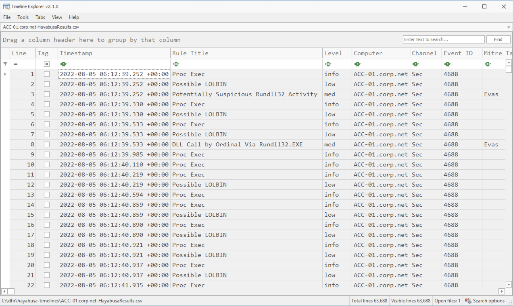

画面下部には、ファイル名、`Total lines`、`Visible lines` が表示されます。

CSVファイルに含まれる列に加え、Timeline Explorer によって左側に2つの列が追加されます：`Line` と `Tag`。
`Line` は行番号を表示しますが、通常の調査にはあまり役立たないため、この列を非表示にすることができます。
`Tag` は、後で詳細な分析などに備えてイベントにチェックマークを付けるために使用できます。
残念ながら、CSVファイルはデータの上書きを防ぐために読み取り専用モードで開かれているため、イベントにカスタムタグを追加したり、イベントに関するコメントを記述することはできません。

## データのフィルタリング

ヘッダーの右上部分にマウスを重ねると、黒いフィルターアイコンが表示されます。

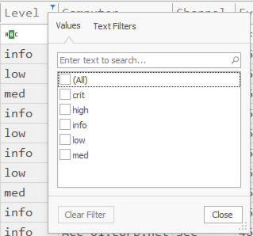

重要度レベルにチェックマークを付けることで、`high` および `crit`（`critical`）アラートを最初にトリアージできます。
このフィルタリングは、`Rule Title` の下にあるすべての項目をチェックし、ノイズの多いアラートをチェックを外すことで、ノイズの多いアラートをフィルタリングするのにも非常に便利です。

以下のように、`Text Filters` をクリックすると、より高度なフィルターを作成できます。

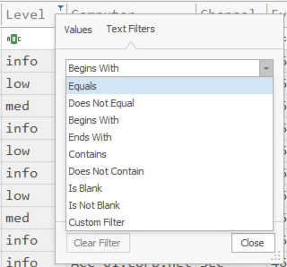

ただし、ここでフィルターを作成する代わりに、ヘッダーの下にある `ABC` アイコンをクリックしてフィルターを適用する方が通常は簡単です。

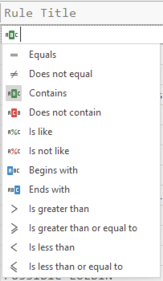

残念ながら、これら2つの場所は若干異なるフィルタリングオプションを提供するため、データのフィルタリングには両方の場所を把握しておく必要があります。

例えば、フィルタリングしたい `Proc Exec` イベントが多すぎる場合、`Does not contain` を選択し、`Proc Exec` と入力してこれらのイベントを無視することができます。

下部を見ると、異なる色でフィルターのルールが表示されます。
フィルターを一時的に無効にしたい場合は、チェックを外します。
すべてのフィルターをクリアしたい場合は、`X` ボタンをクリックします。

別のノイズの多いルールを無視したい場合は、`Filter Editor` を開いて、右下隅の `Edit Filter` をクリックします：

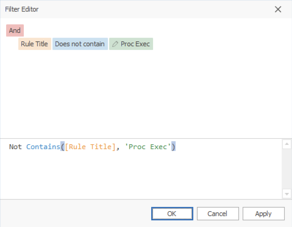

`Not Contains([Rule Title], 'Proc Exec')` テキストをコピーし、同じフィルターに `and` を追加し、`Proc Exec` を `Possible LOLBIN` に変更すると、これら2つのルールを無視できます。

複数のフィルターを組み合わせる最も簡単な方法は、まず `ABC` アイコンをクリックしてフィルター構文を作成し、そのテキストをコピーして貼り付けて編集し、フィルターを `and`、`or`、`not` で組み合わせることです。

また、フィルターを編集するために `Edit Filter` をクリックすると、フィルターの編集が可能です。

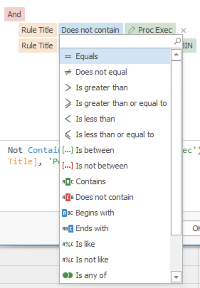

## ヘッダーオプション

ヘッダーのいずれかを右クリックすると、次のオプションが表示されます：

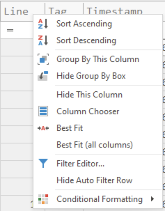

これらのオプションのほとんどは自己説明的です。

* 列を非表示にした後、`Column Chooser`を開き、列名の上で右クリックし、`Show Column`をクリックすることで、再び列を表示することができます。
* `Group By This Column` は、列ヘッダーをドラッグしてグループ化するのと同じ効果があります（後述）。
* `Hide Group By Box` は、`Drag a column header here to group by that column` テキストを非表示にし、検索バーを移動します。

### 条件付き書式

`Conditional Formatting` -> `Highlight Cell Rules` -> `Equal To...` をクリックすると、テキストの書式を色、太字フォントなどで設定できます：

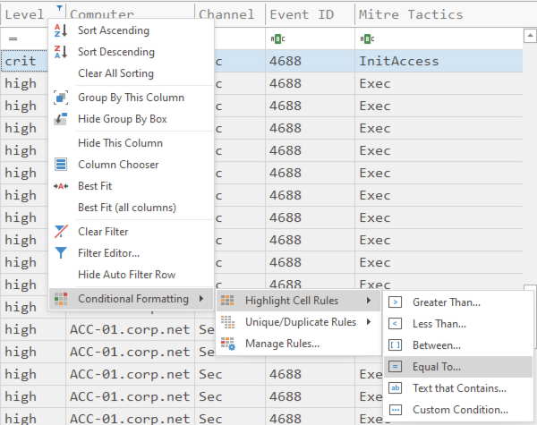

たとえば、`critical` アラートを `Red Fill` で表示したい場合は、`crit` と入力し、オプションから `Red Fill` を選択し、`Apply formatting to an entire row` をチェックして `OK` をクリックします。

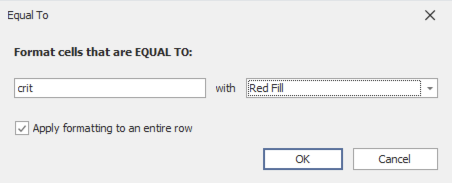

これで、以下のように `critical` アラートが赤く表示されます：

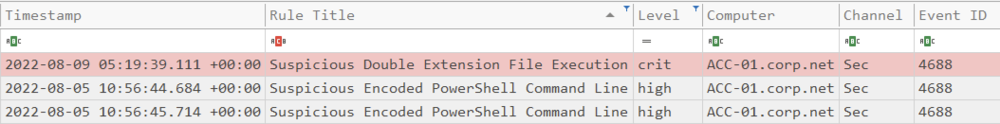

同様に、`low`、`medium`、`high` アラートに色を追加して続けることができます。

## データの検索

検索バーにテキストを入力すると、デフォルトでテキストが含まれる結果のみが表示されるフィルタリングが実行されます。
画面下部の `Visible lines` フィールドを確認することで、ヒット数を確認できます。

これを変更するには、右下の `Search options` をクリックします。
以下のように表示されます：

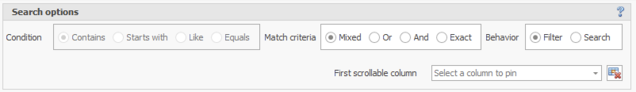

`Behavior` を `Filter` から `Search` に変更すると、通常のテキスト検索が可能になります。

> 注意：動作を切り替えるにはしばらく時間がかかることがあり、Timeline Explorer が一時的にフリーズすることがあるため、クリック後はしばらくお待ちください。

デフォルトの `Match criteria` は `Mixed` ですが、`Or`、`And`、または `Exact` に変更できます。
`Mixed` 以外のものに変更すると、`Condition` を `Contains` から `Starts with`、`Like`、または `Equals` に変更できます。

`Mixed` の `Match criteria` は、`AND` ロジックと `OR` ロジックを併用するため、複雑ですが、一度覚えてしまえば非常に柔軟に使用できます。
これは次のように動作します：
* スペースで単語を区切ると、`OR` ロジックとして扱われます。
* 検索にスペースを含める場合は、引用符を追加する必要があります。
* 条件の前に `+` を付けると `AND` ロジックとして扱われます。
* 条件の前に `-` を付けると結果を除外します。
* 特定の列でフィルタリングする場合は、`ColumnName:FilterString` 形式を使用します。
* 特定の列でフィルタリングし、別のキーワードを含める場合は、`AND` ロジックとして扱われます。

例:
| 検索条件                          | 説明                                                                                                                                    |
|----------------------------------|-------------------------------------------------------------------------------------------------------------------------------------------------|
| mimikatz                         | 全体的に`mimikatz`という文字列を含むレコードを選択する。                                                                        |
| one two three                    | 全体的に`one`または`two`または`three`のいずれかを含むレコードを選択する。                                                             |
| "hoge hoge"                      | 全体的に`hoge hoge`という文字列を含むレコードを選択する。                                                                                 |
| mimikatz +"Bad Guy"              | 全体的に`mimikatz`と`Bad Guy`の両方を含むレコードを選択する。                                                               |
| EventID:4624 kali                | `EventID`で始まる列に`4624`を含み、かつ全体的に`kali`を含むレコードを選択する。                                  |
| data +entry -mark                | `mark`を含むレコードを除外しながら、全体的に`data`と`entry`の両方を含むレコードを選択する。                               |
| manu mask -file                  | `file`を含むレコードを除外しながら、`menu` または `mask` を含むレコードを選択する。                                                           |
| From:Roller Subj:"currency mask" | `From`で始まる列に`Roller`を含み、かつ`Subj`から始まる列に`currency mask`を含むレコードを選択する。         |
| import -From:Steve               | `From`で始まる列に`Steve`を含むレコードを除外しながら、全体的に`import`を含むレコードを選択する。       |

## 列の固定

`Search options`メニューの `First scrollable column` を設定することで、列を固定できます。
ほとんどのアナリストは、常に特定のイベントが発生した時間を確認できるように、これを `Timestamp` に設定します。

## 列ヘッダーをドラッグしてグループ化

列ヘッダーを `Drag a column header here to group by that column` にドラッグすると、Timeline Explorer はその列でグループ化します。
優先度付けができるように、`Level` でグループ化することが一般的です。

複数のコンピュータが結果に表示される場合、`Computer` でグループ化して、各コンピュータごとに異なる重要度レベルに基づいてトリアージできます。

## フィールドのチェック

デフォルト設定でHayabusは，フィールドデータをブロークンパイプ `¦` で区切ります。
フィールドデータが水平線上にある場合、この文字はログにはあまり見られないため、複数のフィールドを区別するのが非常に簡単です。

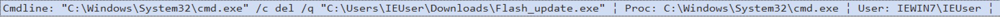

ときどきしかしながら、ログにフィールド情報が多すぎて、すべてが1つの画面に収まらないことがあります。
このような場合、セルをダブルクリックしてポップアップを表示すると、すべてのフィールド情報が表示されます：

Timeline Explorerの問題は、フィールドデータを改行文字（`CRLF`、`CR`、`LF`）、カンマ、タブでフォーマットできるだけであることです。

`-M, --multiline` オプションを使用すると、フィールドデータを改行文字で区切ることができ、セルの内容をダブルクリックして開くと、適切にフォーマットされます：

問題は、今ではタイムラインに最初のフィールドしか表示されないため、他のフィールドデータを確認するたびにダブルクリックして新しいウィンドウを開く必要があることです：

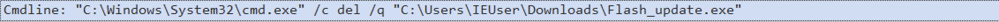

残念ながら、Timeline Explorer はタイムラインビューで複数行をサポートしていません。

Hayabusa `v3.1.0`では、ワークアラウンドとして、フィールドをタブで区切ることができます：

区別するのが難しいのは、1つのフィールドが終わり、次のフィールドが始まる場所です。
また、セルの内容をダブルクリックして開くと、フィールドが自動的にフォーマットされません：

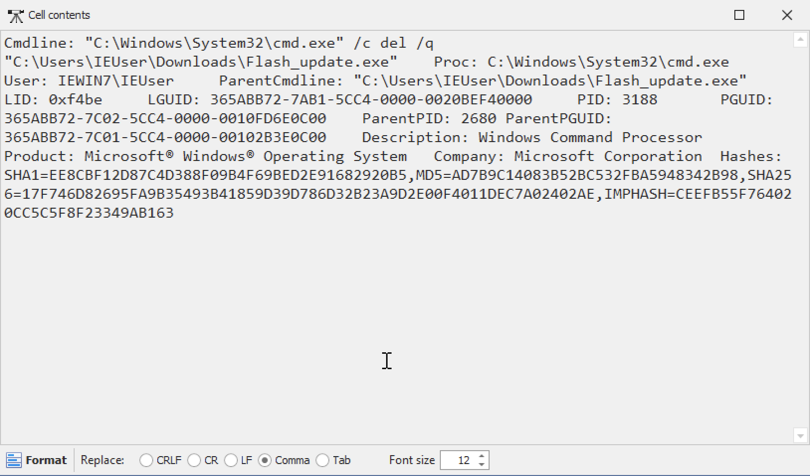

しかし、下部の `Tab` をクリックしてから `Format` をクリックすると、フィールドが見やすいビューにフォーマットされます：

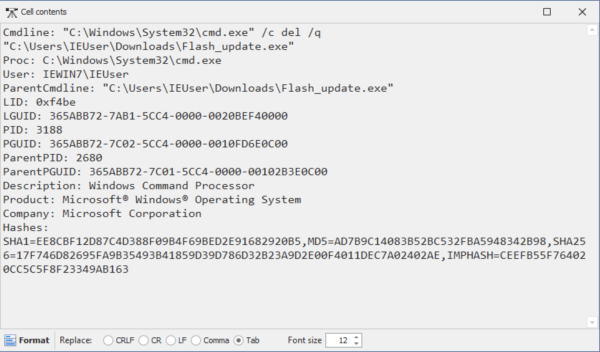

## スキン

`Tools` -> `Skins` からカラーテーマを変更できます。

## セッション

列をカスタマイズしたり、外観を変更したり、フィルターを追加したりすると、後でそれらの設定を保存したい場合は、`File` -> `Session` -> `Save` からセッションを保存してください。