# Analyzing Hayabusa Results With Timesketch

## About

"[Timesketch](https://timesketch.org/) is an open-source tool for collaborative forensic timeline analysis. Using sketches you and your collaborators can easily organize your timelines and analyze them all at the same time. Add meaning to your raw data with rich annotations, comments, tags and stars."

For small investigations where you are analyzing a CSV file less than 1GB and working alone, Timeline Explorer is suitable, however, when you are working with larger data or with a team, a tool like Timesketch is much better.

Timesketch offers the following benefits:
1. It is very fast and can handle large data
2. It is a collaborative tool where multiple users can use it simultaneously
3. It provides advanced data analysis, histograms and visualizations
4. It is not limited to Windows
5. It supports advanced querying

The only downside is that you will have to setup a Timesketch server in your lab environment but luckily this is very trival to do.

## Table of Contents

- [Analyzing Hayabusa Results With Timesketch](#analyzing-hayabusa-results-with-timesketch)
  - [About](#about)
  - [Table of Contents](#table-of-contents)
  - [Installing](#installing)
  - [Logging in](#logging-in)
  - [Creating a new sketch](#creating-a-new-sketch)
  - [Uploading your timeline](#uploading-your-timeline)
  - [Analysis tips](#analysis-tips)
    - [Showing the timeline](#showing-the-timeline)
    - [Alert details](#alert-details)
      - [Field filtering](#field-filtering)
      - [Aggregation analytics](#aggregation-analytics)
      - [User comments](#user-comments)
    - [Modifying columns](#modifying-columns)
    - [Top icons](#top-icons)
      - [Elipsis icon](#elipsis-icon)
      - [Event histogram](#event-histogram)
      - [Save current search](#save-current-search)
    - [Search bar](#search-bar)
    - [Search history](#search-history)
    - [Vertical elipsis](#vertical-elipsis)
    - [Stars and tags](#stars-and-tags)

## Installing

We recommend using the latest Ubuntu LTS Server edition with at least 8GB of memory.
You can download it [here](https://ubuntu.com/download/server).
Choose the minimal install when setting it up.
Do not install docker when setting up the OS.
You won't have `ifconfig` available, so install it with `sudo apt install net-tools`.

After that, run `ifconfig` to find the IP address of the VM and optionally ssh into it.

Run the following commands:

``` bash
# Delete any old versions of docker in case they are present
for pkg in docker.io docker-doc docker-compose docker-compose-v2 podman-docker containerd runc; do sudo apt-get remove $pkg; done

# Prepare to install docker
sudo apt-get update
sudo apt-get install ca-certificates curl
sudo install -m 0755 -d /etc/apt/keyrings
sudo curl -fsSL https://download.docker.com/linux/ubuntu/gpg -o /etc/apt/keyrings/docker.asc
sudo chmod a+r /etc/apt/keyrings/docker.asc

# Add the repository to Apt sources:
echo \
  "deb [arch=$(dpkg --print-architecture) signed-by=/etc/apt/keyrings/docker.asc] https://download.docker.com/linux/ubuntu \
  $(. /etc/os-release && echo "$VERSION_CODENAME") stable" | \
  sudo tee /etc/apt/sources.list.d/docker.list > /dev/null
sudo apt-get update

# Install docker
sudo apt-get install docker-ce docker-ce-cli containerd.io docker-buildx-plugin docker-compose-plugin

# Test docker
sudo docker run hello-world

curl -s -O https://raw.githubusercontent.com/google/timesketch/master/contrib/deploy_timesketch.sh
chmod 755 deploy_timesketch.sh
cd /opt
sudo ~/deploy_timesketch.sh
cd timesketch
sudo docker compose up -d

# Create a user named user. Set the password here.
sudo docker compose exec timesketch-web tsctl create-user user
```

## Logging in

Find out the Timesketch server's IP address with `ifconfig` and open it with a web browser.
You will be redirected to a login page.
Log in with the user credentials you used when adding a user.

## Creating a new sketch

Under `Start a new investigation`, click `BLANK SKETCH`.
Name the sketch something relevant to your investigation.

## Uploading your timeline

After you click `+ ADD TIMELINE`, you will see a dialog box asking you to upload a Plaso, JSONL or CSV file.
Unfortunately, Timesketch cannot currently import Hayabusa's `JSONL` format, so create and upload a CSV timeline with the following command:

```shell
hayabusa-x.x.x-win-x64.exe csv-timeline -d <DIR> -o timesketch-import.csv -p timesketch-verbose --ISO-8601
```

> Note: It is necessary to choose a `timesketch*` profile and specify the timestamp as `--ISO-8601` for UTC or `--RFC-3339` for local time. You may add other Hayabusa options if you desire, however, do not add the `-M, --multiline` option as the newline characters will corrupt the import.

At the "Select file to upload" dialog box, name your timeline something like `hayabusa`, choose the `Comma (,)` CSV delimiter and click `SUBMIT`.

> If your CSV file is too big to upload, you can split the file into multiple CSV files with Takajo's [split-csv-timeline](https://github.com/Yamato-Security/takajo?tab=readme-ov-file#split-csv-timeline-command) command.

While the file is being imported you will see a spinning circle so please wait until it finishes and you see `hayabusa` show up.

## Analysis tips

### Showing the timeline

**Note: Even after the import has successfully finished, it will show `Your search did not match any events` and there will be `0` events in the `hayabusa` timeline.**

Search for `*` and the events will show up as shown below:

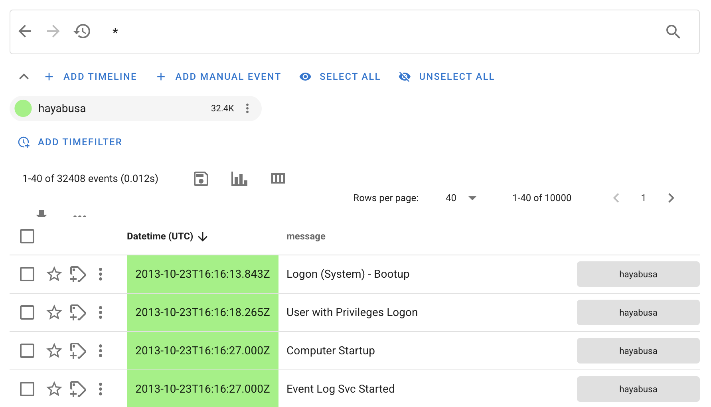

### Alert details

If you click on alert rule title under `message`, you will get the detailed information about the alert and log:

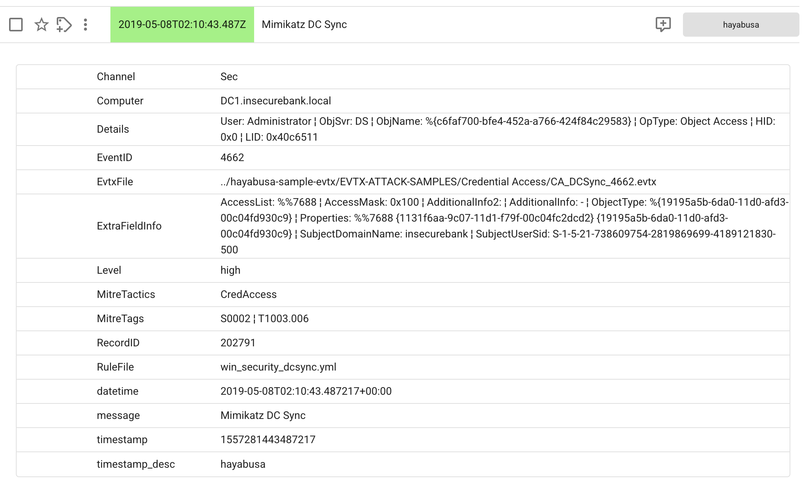

If you want to understand the sigma rule logic, look up the description and references, etc... please check the rule in the [hayabusa-rules](https://github.com/Yamato-Security/hayabusa-rules) repository.

#### Field filtering

After opening up the details of an event by clicking on it's rule title you can hover over any field to easily filter in or out the value:


#### Aggregation analytics

When hovering over, if you click the leftmost `Aggregation dialog` icon, you get really great event data analytics regarding that field:

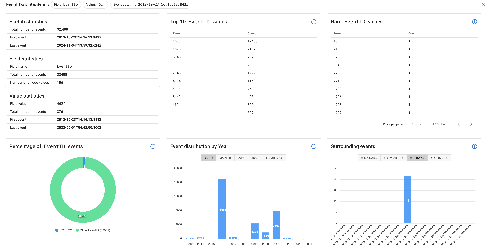

#### User comments

When you click on an alert to get detailed information, a new comment dialog box icon is shown on the right hand side, as shown below:

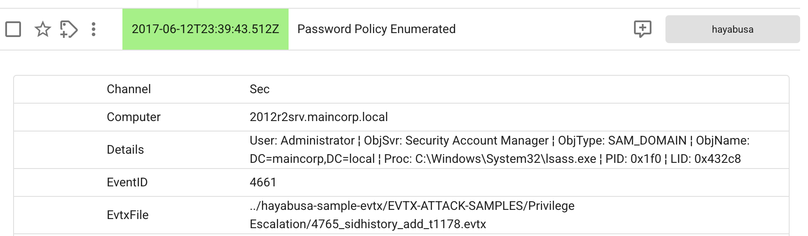

Here, users can start a chat and write comments about the investigation.
If you working on a team, you should probably create different user account for each member so that you know who wrote what.


If you hover over a comment, you can easily edit and delete the messages.

### Modifying columns

By default, only the timestamp and alert rule title will be displayed so click the `Modify columns` icons to customize the fields:

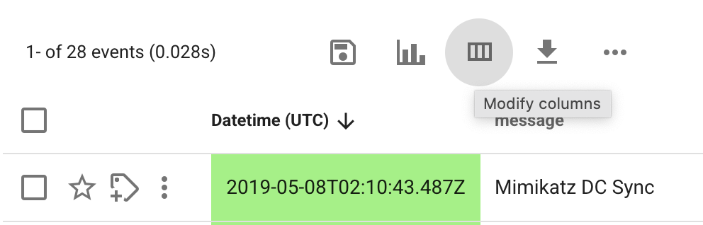

This will open the following dialog box:

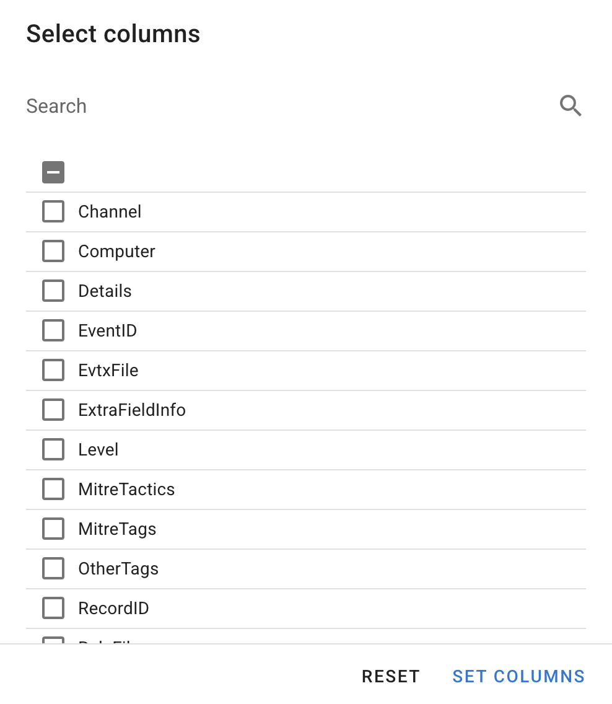

We recommend to add at least the following columns **in order**:

1. `Level`
2. `Computer`
3. `Channel`
4. `EventID`
5. `RecordID`

The order of the columns will change depending on the order that you add them, so add more important fields first.

If you still have room on your screen, we recommend to also add `Details`, as shown here:

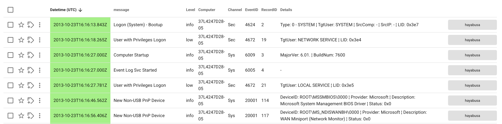

If you still have room on your screen, we recommend to also add `ExtraFieldInfo`, however, as you see here, if you add too many columns then the `message` field will become too narrow and you won't be able to read the alert titles anymore:


### Top icons

#### Elipsis icon

If you click on the `···` icon, you can make the rows more compact and remove the `Timeline name` to create more room for results:

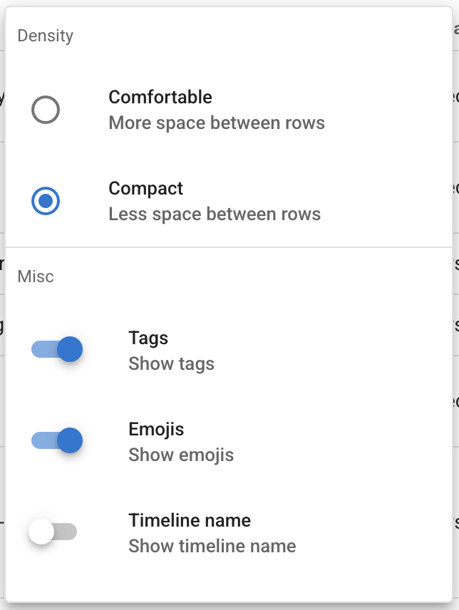

#### Event histogram

You can toggle on the event histogram to visualize the timeline:

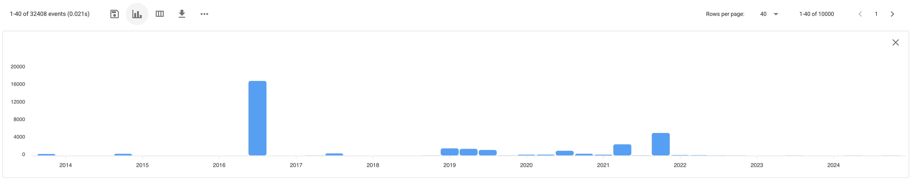

If you click on one of the bars, it will create a time filter to just show the results during that period of time.

#### Save current search

If you click the `Save current search` icon right above the timestamps and to the left of the `Toggle Event Histogram` icon, you can save your current search query as well as the column configuration to `Saved Searches`.
Later, from the lefthand sidebar you can easily access your favorite searches.

### Search bar

Here are some handy queries to start off with by only showing alerts with certain severity levels:
1. `Level:crit` to only show critical alerts.
2. `Level:crit OR Level:high` to show high and critical alerts
3. `NOT Level:info` to hide informational alerts

You can easily filter by typing the field name plus `:` plus the value.
You can combine filters with `AND`, `OR`, and `NOT`.
Wildcards and regular expressions are supported.

Refer to the user guide [here](https://timesketch.org/guides/user/search-query-guide/) for more advanced queries.

### Search history

If you click the clock icon to the left of the search bar you can show previously entered queries.
You can also click the left and right arrow icons to run previous and next queries.

### Vertical elipsis

If you click on the vertical elipsis to the left of a timestamp and click `Context search`, you can see alerts that happened before and after a certain event:

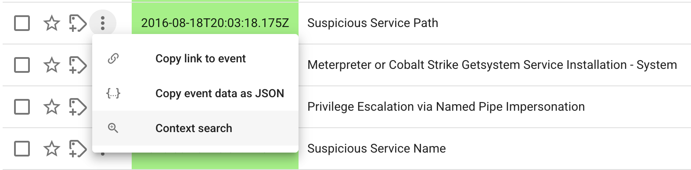

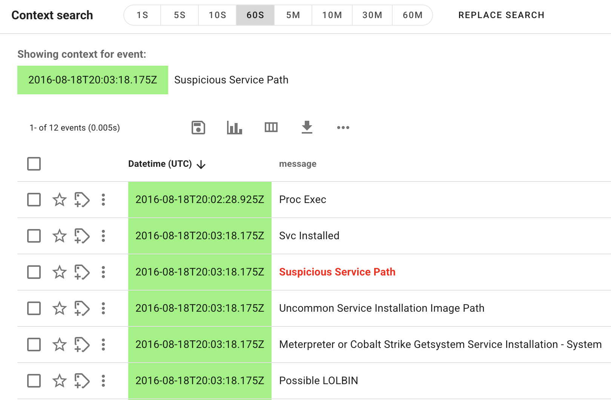

In the example above, events before and after 60 seconds (`60S`) are being shown but you can adjust that from +- 1 second (`1S`) to +- 60 minutes (`60M`).

If you want to further drill down into the events shown, click `Replace Search` to show the events in the standard timeline.

### Stars and tags

You can click the star icon to the left of a timestamp to star it and note it as an important event.

You can also add tags to events.
This is useful to indicate to others that you have confirmed that an event is suspicious, malicious, a false positive, etc...
If you are working in a team, you can create tags like `under investigation by xxx` to indicate that someone is currently investigating the alert.

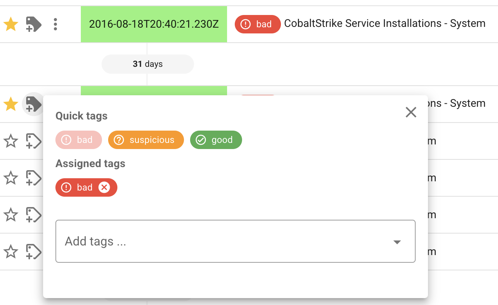