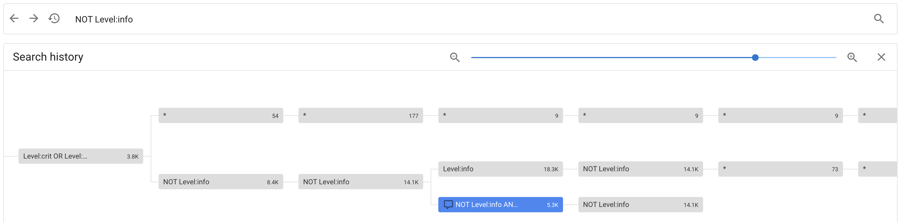

# Timesketchを使用したHayabusaの結果分析

## 概要

"[Timesketch](https://timesketch.org/)"は共同でフォレンジックのタイムライン分析を行うためのオープンソースツールです。スケッチを使用することで、あなたやチームメンバーがタイムラインを整理し、同時に分析を進めることができます。生データに注釈、コメント、タグ、スターを追加することで、データに意味を持たせることができます。

小規模な調査で数百MB程度のCSVファイルを単独で分析する場合は、Timeline Explorerが適しています。しかし、大規模なデータを扱う場合やチームで作業する場合は、Timesketchのようなツールを使用する方がはるかに効果的です。

Timesketchの利点は以下のとおりです：
1. 高速で大量のデータを処理可能
2. 複数ユーザーによる同時利用が可能
3. 高度なデータ分析、ヒストグラム、可視化機能を提供
4. Windowsに限定されない
5. 高度なクエリ検索が可能

その他にもCTIサポート、各種アナライザ、インタラクティブノートブック機能など、多くの利点があります。
詳しくは、[ユーザーガイド](https://timesketch.org/guides/user/upload-data/)や[YouTubeチャンネル](https://www.youtube.com/channel/UC_n6mMb0OxWRk7xiqiOOcRQ)をご覧ください。

唯一の欠点は、ラボ環境にTimesketchサーバーをセットアップする必要があることですが、幸いなことにこれは非常に簡単です。

## 目次

- [Timesketchを使用したHayabusaの結果分析](#Timesketchを使用したHayabusaの結果分析)
    - [概要](#概要)
    - [目次](#目次)
    - [インストール](#インストール)
    - [ログイン](#ログイン)
    - [新しいスケッチの作成](#新しいスケッチの作成)
    - [タイムラインのアップロード](#タイムラインのアップロード)
    - [分析のヒント](#分析のヒント)
        - [タイムラインの表示](#タイムラインの表示)
        - [アラートの詳細](#アラートの詳細)
            - [フィールドフィルタリング](#フィールドフィルタリング)
            - [集計分析](#集計分析)
            - [ユーザーコメント](#ユーザーコメント)
        - [カラムの変更](#カラムの変更)
        - [上部のアイコン](#上部のアイコン)
            - [省略記号アイコン](#省略記号アイコンn)
            - [イベントヒストグラム](#イベントヒストグラム)
            - [現在の検索を保存](#現在の検索を保存)
        - [検索バー](#検索バー)
            - [検索履歴](#検索履歴)
        - [縦の省略記号](#縦の省略記号)
        - [スターとタグ](#スターとタグ)

## インストール

最新のUbuntu LTS Server版（メモリ8GB以上）を使用することを推奨します。
ダウンロードは [こちら](https://ubuntu.com/download/server)から。
最小インストールを選択し、
OSのセットアップ時にDockerをインストールしないでください。
`ifconfig`コマンドが利用できない場合は、`sudo apt install net-tools`でインストールしてください。

そのあと, `ifconfig` を実行して、VMのIPアドレスを確認し、任意でsshでログインしてください。

以下のコマンドを実行します:

``` bash
# Delete any old versions of docker in case they are present
for pkg in docker.io docker-doc docker-compose docker-compose-v2 podman-docker containerd runc; do sudo apt-get remove $pkg; done

# Prepare to install docker
sudo apt-get update
sudo apt-get install ca-certificates curl
sudo install -m 0755 -d /etc/apt/keyrings
sudo curl -fsSL https://download.docker.com/linux/ubuntu/gpg -o /etc/apt/keyrings/docker.asc
sudo chmod a+r /etc/apt/keyrings/docker.asc

# Add the repository to Apt sources:
echo \
  "deb [arch=$(dpkg --print-architecture) signed-by=/etc/apt/keyrings/docker.asc] https://download.docker.com/linux/ubuntu \
  $(. /etc/os-release && echo "$VERSION_CODENAME") stable" | \
  sudo tee /etc/apt/sources.list.d/docker.list > /dev/null
sudo apt-get update

# Install docker
sudo apt-get install docker-ce docker-ce-cli containerd.io docker-buildx-plugin docker-compose-plugin

# Test docker
sudo docker run hello-world

curl -s -O https://raw.githubusercontent.com/google/timesketch/master/contrib/deploy_timesketch.sh
chmod 755 deploy_timesketch.sh
cd /opt
sudo ~/deploy_timesketch.sh
cd timesketch
sudo docker compose up -d

# Create a user named user. Set the password here.
sudo docker compose exec timesketch-web tsctl create-user user
```

## ログイン

`ifconfig`コマンドでTimesketchサーバーのIPアドレスを確認し、 Webブラウザで開きます。
ログインページにリダイレクトされます。
作成したユーザーの認証情報でログインしてください。

## 新しいスケッチの作成

`Start a new investigation`セクションで`BLANK SKETCH`をクリックし、
調査に関連する名前を付けます。

## タイムラインのアップロード

`ADD TIMELINE`をクリックし、Plaso、JSONL、またはCSVファイルをアップロードします。
Hayabusaの`JSONL`形式は現在Timesketchでサポートされていないため、以下のコマンドでCSVファイルを作成してください：

```shell
hayabusa-x.x.x-win-x64.exe csv-timeline -d <DIR> -o timesketch-import.csv -p timesketch-verbose --ISO-8601
```

> 注意:timesketch* プロファイルを指定し、タイムスタンプをUTCなら --ISO-8601、ローカルタイムなら --RFC-3339 で指定する必要があります。

`Select file to upload`ダイアログでタイムラインに hayabusa などの名前を付け、CSVの区切り文字として Comma (,) を選択し、`SUBMIT`をクリックします。

> CSVファイルが大きすぎる場合、Takajoの split-csv-timeline コマンドを使用して分割できます。

ファイルのインポート中は、回転する円が表示されます。処理が完了し、`hayabusa`が表示されるまでお待ちください。

## 分析のヒント

### タイムラインの表示

**注意: インポートが完了した後でも、Your search did not match any events と表示され、hayabusa タイムラインに 0 件のイベントが表示される場合があります。**
その場合は `*` で検索すると、イベントが表示されます:


### アラートの詳細

`message`カラム内のアラートルールのタイトルをクリックすると、アラートの詳細情報が表示されます。


Sigmaルールのロジックを理解したい場合は、[hayabusa-rules](https://github.com/Yamato-Security/hayabusa-rules)リポジトリでルールの説明や参照情報を確認してください。

#### フィールドフィルタリング

イベントの詳細を開いた後、任意のフィールドにカーソルを合わせると、その値を簡単にフィルタリングできます。


#### 集計分析

フィールド上にカーソルを置き、左端の`Aggregation dialog`アイコンをクリックすると、関連するデータの詳細な分析を確認できます。


#### ユーザーコメント

アラートの詳細を表示すると、右側に新しいコメントダイアログアイコンが表示されます。


ここで、ユーザーは調査についてのコメントを追加できます。

> チームで作業する場合は、各メンバーに異なるユーザーアカウントを作成すると、誰が何を書いたのか識別しやすくなります。
> 


> コメントにカーソルを合わせると、簡単に編集や削除ができます。

### 列の変更

デフォルトでは、タイムスタンプとアラートルールのタイトルのみが表示されます。`Modify columns`アイコンをクリックしてフィールドをカスタマイズできます。


これは以下のダイアログボックスを開きます:


次の列を **この順番**で追加することを推奨します:

1. `Level`
2. `Computer`
3. `Channel`
4. `EventID`
5. `RecordID`

追加の順番によって列の並びが変わるため、重要な項目を先に追加してください。

さらに余裕があれば `Details`を追加することを推奨します。以下の通りです:


さらに余裕があれば `ExtraFieldInfo`も追加できますが、列が多すぎると`message`フィールドが狭くなり、アラートのタイトルが読めなくなる可能性があります:


### 上部のアイコン

#### 省略記号アイコン

`···`アイコンをクリックすると、行をコンパクトにして`Timeline name`を削除して、結果を表示できます:


#### イベントヒストグラム

タイムラインを視覚化するために、イベントヒストグラムをトグルできます:


ヒストグラムの各バーをクリックすると、その期間の結果のみを表示する時間フィルタが作成されます。

#### 現在の検索を保存

タイムスケッチの上にあるタイムスタンプのすぐ上にある`Save current search`アイコンをクリックすると、現在の検索クエリと列構成を`Saved Searches`に保存できます。
その後、左側のサイドバーから簡単にお気に入りの検索にアクセスできます。


### 検索バー

以下のクエリを使用すると、特定の重大度のアラートのみを表示できます：
1. Level:crit - 重大なアラートのみ表示 
2. Level:crit OR Level:high - 高重大度以上のアラートを表示 
3. NOT Level:info - 情報レベルのアラートを非表示

フィールド名と値の間に`:`を追加することで、簡単にフィルタリングできます。
`AND`、`OR`、`NOT`を組み合わせることができます。
ワイルドカードと正規表現もサポートされています。

より高度なクエリについては、[ユーザーガイド](https://timesketch.org/guides/user/search-query-guide/)を参照してください。

#### 検索履歴

検索バーの左にある時計アイコンをクリックすると、以前に入力したクエリが表示されます。
左右の矢印アイコンをクリックすると、前のクエリと次のクエリを実行できます。



### 縦の省略記号

タイムスケッチの左側にあるタイムスタンプの縦の省略記号をクリックし、`Context search`をクリックすると、特定のイベントの前後のアラートを確認できます:


これにより、次の画面が表示されます:


上記の例では、60秒前後のイベント（`60S`）が表示されていますが、これは`1S`から`60M`まで調整できます。
`Replace Search`をクリックすると、表示されるイベントをさらに詳しく調べることができます。

### スターとタグ

タイムスケッチの左側にあるタイムスタンプの左にある星アイコンをクリックすると、重要なイベントをスター付けして、重要なイベントをメモすることができます。
イベントにタグを追加することもできます。
これは、あるイベントが疑わしい、悪意がある、偽陽性である、などを確認したことを他の人に示すのに便利です。
チームで作業している場合、`under investigation by xxx` のようなタグを作成して、誰かが現在アラートを調査中であることを示すことができます。

