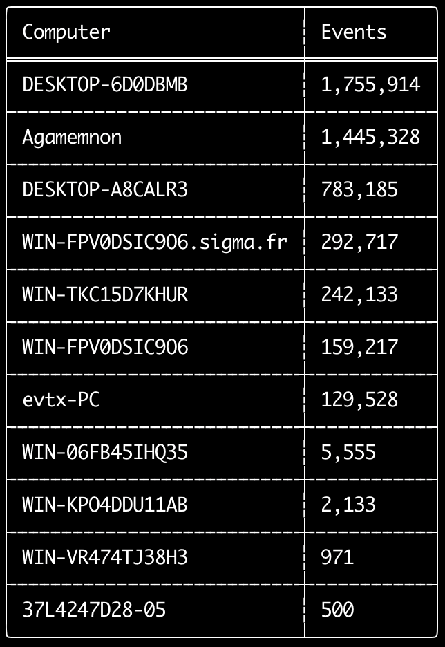
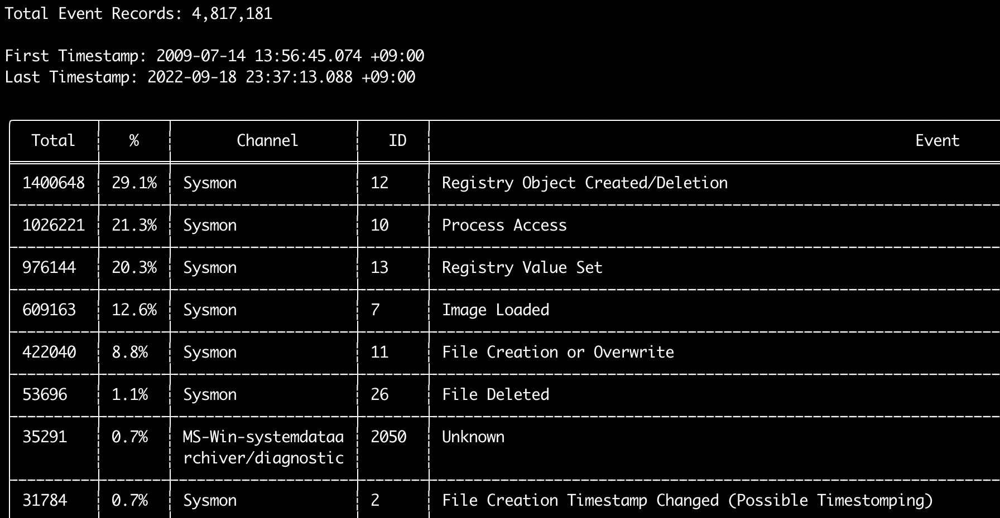
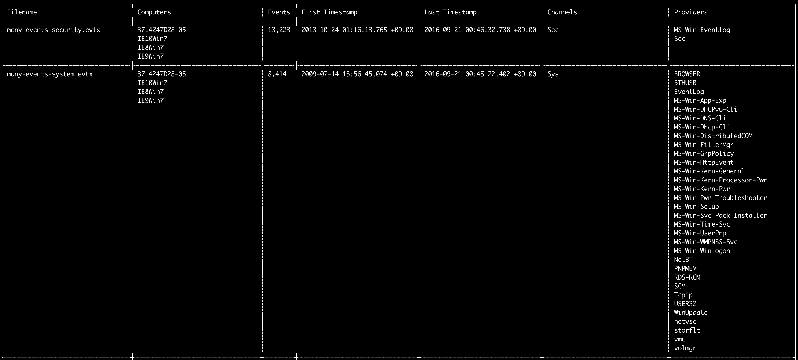
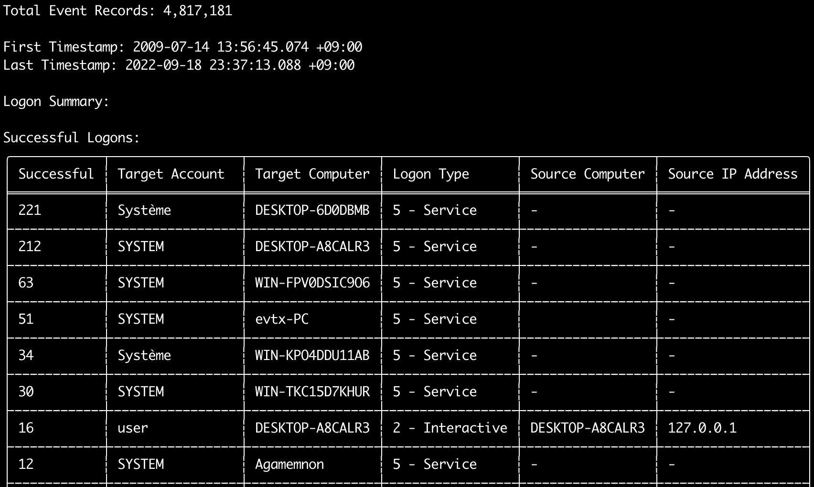
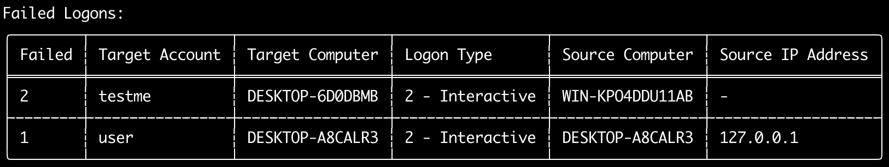

# Comandos de Análise

## Comando `computer-metrics`

Você pode usar o comando `computer-metrics` para verificar quantos eventos existem de acordo com cada computador definido no campo `<System><Computer>`.
Esteja ciente de que você não pode confiar completamente no campo `Computer` para separar eventos por seu computador de origem.
O Windows 11 às vezes usa nomes de `Computer` completamente diferentes ao salvar nos registros de eventos.
Além disso, o Windows 10 às vezes registra o nome de `Computer` todo em letras minúsculas.
Este comando não usa nenhuma regra de detecção, portanto analisará todos os eventos.
Este é um bom comando para executar e ver rapidamente quais computadores possuem mais registros.
Com essa informação, você pode então usar as opções `--include-computer` ou `--exclude-computer` ao criar suas linhas do tempo para tornar a geração da sua linha do tempo mais eficiente, criando múltiplas linhas do tempo de acordo com o computador ou excluindo eventos de determinados computadores.

```
Usage: computer-metrics <INPUT> [OPTIONS]

Input:
  -d, --directory <DIR>  Directory of multiple .evtx files
  -f, --file <FILE>      File path to one .evtx file
  -l, --live-analysis    Analyze the local C:\Windows\System32\winevt\Logs folder

General Options:
  -C, --clobber                        Overwrite files when saving
  -h, --help                           Show the help menu
  -J, --JSON-input                     Scan JSON formatted logs instead of .evtx (.json or .jsonl)
  -Q, --quiet-errors                   Quiet errors mode: do not save error logs
  -x, --recover-records                Carve evtx records from slack space (default: disabled)
  -c, --rules-config <DIR>             Specify custom rule config directory (default: ./rules/config)
      --target-file-ext <FILE-EXT...>  Specify additional evtx file extensions (ex: evtx_data)
  -t, --threads <NUMBER>               Number of threads (default: optimal number for performance)

Filtering:
      --time-offset <OFFSET>  Scan recent events based on an offset (ex: 1y, 3M, 30d, 24h, 30m)

Output:
  -o, --output <FILE>  Save the results in CSV format (ex: computer-metrics.csv)

Display Settings:
  -K, --no-color  Disable color output
  -q, --quiet     Quiet mode: do not display the launch banner
  -v, --verbose   Output verbose information
```

### Exemplos do comando `computer-metrics`

* Exibir métricas de nomes de computadores a partir de um diretório: `hayabusa.exe computer-metrics -d ../logs`
* Salvar os resultados em um arquivo CSV: `hayabusa.exe computer-metrics -d ../logs -o computer-metrics.csv`

### Captura de tela do `computer-metrics`



## Comando `eid-metrics`

Você pode usar o comando `eid-metrics` para exibir o número total e a porcentagem de IDs de eventos (campo `<System><EventID>`) separados por canais.
Este comando não usa nenhuma regra de detecção, portanto escaneará todos os eventos.

```
Usage: eid-metrics <INPUT> [OPTIONS]

Input:
  -d, --directory <DIR>  Directory of multiple .evtx files
  -f, --file <FILE>      File path to one .evtx file
  -l, --live-analysis    Analyze the local C:\Windows\System32\winevt\Logs folder

General Options:
  -C, --clobber                        Overwrite files when saving
  -h, --help                           Show the help menu
  -J, --JSON-input                     Scan JSON formatted logs instead of .evtx (.json or .jsonl)
  -Q, --quiet-errors                   Quiet errors mode: do not save error logs
  -x, --recover-records                Carve evtx records from slack space (default: disabled)
  -c, --rules-config <DIR>             Specify custom rule config directory (default: ./rules/config)
  -t, --threads <NUMBER>               Number of threads (default: optimal number for performance)
      --target-file-ext <FILE-EXT...>  Specify additional evtx file extensions (ex: evtx_data)

Filtering:
      --exclude-computer <COMPUTER...>  Do not scan specified computer names (ex: ComputerA) (ex: ComputerA,ComputerB)
      --include-computer <COMPUTER...>  Scan only specified computer names (ex: ComputerA) (ex: ComputerA,ComputerB)
      --time-offset <OFFSET>            Scan recent events based on an offset (ex: 1y, 3M, 30d, 24h, 30m)

Output:
  -b, --disable-abbreviations  Disable abbreviations
  -o, --output <FILE>          Save the Metrics in CSV format (ex: metrics.csv)

Display Settings:
  -K, --no-color  Disable color output
  -q, --quiet     Quiet mode: do not display the launch banner
  -v, --verbose   Output verbose information

Time Format:
      --European-time     Output timestamp in European time format (ex: 22-02-2022 22:00:00.123 +02:00)
  -O, --ISO-8601          Output timestamp in original ISO-8601 format (ex: 2022-02-22T10:10:10.1234567Z) (Always UTC)
      --RFC-2822          Output timestamp in RFC 2822 format (ex: Fri, 22 Feb 2022 22:00:00 -0600)
      --RFC-3339          Output timestamp in RFC 3339 format (ex: 2022-02-22 22:00:00.123456-06:00)
      --US-military-time  Output timestamp in US military time format (ex: 02-22-2022 22:00:00.123 -06:00)
      --US-time           Output timestamp in US time format (ex: 02-22-2022 10:00:00.123 PM -06:00)
  -U, --UTC               Output time in UTC format (default: local time)
```

### Exemplos do comando `eid-metrics`

* Exibir métricas de Event ID a partir de um único arquivo: `hayabusa.exe eid-metrics -f Security.evtx`
* Exibir métricas de Event ID a partir de um diretório: `hayabusa.exe eid-metrics -d ../logs`
* Salvar os resultados em um arquivo CSV: `hayabusa.exe eid-metrics -f Security.evtx -o eid-metrics.csv`

### Arquivo de configuração do comando `eid-metrics`

O canal, os IDs de eventos e os títulos dos eventos são definidos em `rules/config/channel_eid_info.txt`.

Exemplo:
```
Channel,EventID,EventTitle
Microsoft-Windows-Sysmon/Operational,1,Process Creation.
Microsoft-Windows-Sysmon/Operational,2,File Creation Timestamp Changed. (Possible Timestomping)
Microsoft-Windows-Sysmon/Operational,3,Network Connection.
Microsoft-Windows-Sysmon/Operational,4,Sysmon Service State Changed.
```

### Captura de tela do `eid-metrics`



## Comando `expand-list`

Extrai os marcadores `expand` da pasta de regras.
Isso é útil ao criar arquivos de configuração para usar qualquer regra que utilize o modificador de campo `expand`.
Para usar as regras `expand`, você só precisa criar um arquivo `.txt` com o nome do modificador de campo `expand` no diretório `./config/expand/`, e colocar nele todos os valores que deseja verificar.

Por exemplo, se a lógica de `detection` da regra for:
```yaml
detection:
    selection:
        EventID: 5145
        RelativeTargetName|contains: '\winreg'
    filter_main:
        IpAddress|expand: '%Admins_Workstations%'
    condition: selection and not filter_main
```

você criaria o arquivo de texto `./config/expand/Admins_Workstations.txt` e colocaria valores como:
```
AdminWorkstation1
AdminWorkstation2
AdminWorkstation3
```

Isso essencialmente verificaria a mesma lógica que:
```
- IpAddress: 'AdminWorkstation1'
- IpAddress: 'AdminWorkstation2'
- IpAddress: 'AdminWorkstation3'
```

Se o arquivo de configuração não existir, o Hayabusa ainda carregará a regra `expand`, mas a ignorará.

```
Usage:  expand-list <INPUT> [OPTIONS]

General Options:
  -h, --help              Show the help menu
  -r, --rules <DIR/FILE>  Specify rule directory (default: ./rules)

Display Settings:
  -K, --no-color  Disable color output
  -q, --quiet     Quiet mode: do not display the launch banner
```

### Exemplos do comando `expand-list`

* Extrair os modificadores de campo `expand` do diretório padrão `rules`: `hayabusa.exe expand-list`
* Extrair os modificadores de campo `expand` do diretório `sigma`: `hayabusa.exe eid-metrics -r ../sigma`

### Resultados do `expand-list`

```
5 unique expand placeholders found:
Admins_Workstations
DC-MACHINE-NAME
Workstations
internal_domains
domain_controller_hostnames
```

## Comando `extract-base64`

Este comando extrai strings base64 dos seguintes eventos, as decodifica e informa qual tipo de codificação está sendo utilizada.
  * Security 4688 CommandLine
  * Sysmon 1 CommandLine, ParentCommandLine
  * System 7045 ImagePath
  * PowerShell Operational 4104
  * PowerShell Operational 4103

```
Usage:  extract-base64 <INPUT> [OPTIONS]

Input:
  -d, --directory <DIR>  Directory of multiple .evtx files
  -f, --file <FILE>      File path to one .evtx file
  -l, --live-analysis    Analyze the local C:\Windows\System32\winevt\Logs folder

General Options:
  -C, --clobber                        Overwrite files when saving
  -h, --help                           Show the help menu
  -J, --JSON-input                     Scan JSON formatted logs instead of .evtx (.json or .jsonl)
  -Q, --quiet-errors                   Quiet errors mode: do not save error logs
  -x, --recover-records                Carve evtx records from slack space (default: disabled)
  -c, --rules-config <DIR>             Specify custom rule config directory (default: ./rules/config)
  -t, --threads <NUMBER>               Number of threads (default: optimal number for performance)
      --target-file-ext <FILE-EXT...>  Specify additional evtx file extensions (ex: evtx_data)

Filtering:
      --exclude-computer <COMPUTER...>  Do not scan specified computer names (ex: ComputerA) (ex: ComputerA,ComputerB)
      --include-computer <COMPUTER...>  Scan only specified computer names (ex: ComputerA) (ex: ComputerA,ComputerB)
      --time-offset <OFFSET>            Scan recent events based on an offset (ex: 1y, 3M, 30d, 24h, 30m)

Output:
  -o, --output <FILE>  Extract Base64 strings

Display Settings:
  -K, --no-color  Disable color output
  -q, --quiet     Quiet mode: do not display the launch banner
  -v, --verbose   Output verbose information

Time Format:
      --European-time     Output timestamp in European time format (ex: 22-02-2022 22:00:00.123 +02:00)
  -O, --ISO-8601          Output timestamp in original ISO-8601 format (ex: 2022-02-22T10:10:10.1234567Z) (Always UTC)
      --RFC-2822          Output timestamp in RFC 2822 format (ex: Fri, 22 Feb 2022 22:00:00 -0600)
      --RFC-3339          Output timestamp in RFC 3339 format (ex: 2022-02-22 22:00:00.123456-06:00)
      --US-military-time  Output timestamp in US military time format (ex: 02-22-2022 22:00:00.123 -06:00)
      --US-time           Output timestamp in US time format (ex: 02-22-2022 10:00:00.123 PM -06:00)
  -U, --UTC               Output time in UTC format (default: local time)
```

### Exemplos do comando `extract-base64`

* Escanear um diretório e exibir a saída no terminal: `hayabusa.exe  extract-base64 -d ../hayabusa-sample-evtx`
* Escanear um diretório e gerar a saída em um arquivo CSV: `hayabusa.exe eid-metrics -r ../sigma -o base64-extracted.csv`

### Resultados do `extract-base64`

Ao exibir a saída no terminal, como o espaço é limitado, apenas os seguintes campos são exibidos:
  * Timestamp
  * Computer
  * Base64 String
  * Decoded String (if not binary)

Ao salvar em um arquivo CSV, os seguintes campos são salvos:
  * Timestamp
  * Computer
  * Base64 String
  * Decoded String (if not binary)
  * Original Field
  * Length
  * Binary (`Y/N`)
  * Double Encoding (when `Y`, it usually is malicious)
  * Encoding Type
  * File Type
  * Event
  * Record ID
  * File Name

## Comando `log-metrics`

Você pode usar o comando `log-metrics` para exibir os seguintes metadados contidos nos registros de eventos:
  * Filename
  * Computer names
  * Number of events
  * First timestamp
  * Last timestamp
  * Channels
  * Providers

Este comando não usa nenhuma regra de detecção, portanto escaneará todos os eventos.

```
Usage: log-metrics <INPUT> [OPTIONS]

Input:
  -d, --directory <DIR>  Directory of multiple .evtx files
  -f, --file <FILE>      File path to one .evtx file
  -l, --live-analysis    Analyze the local C:\Windows\System32\winevt\Logs folder

General Options:
  -C, --clobber                        Overwrite files when saving
  -h, --help                           Show the help menu
  -J, --JSON-input                     Scan JSON formatted logs instead of .evtx (.json or .jsonl)
  -Q, --quiet-errors                   Quiet errors mode: do not save error logs
  -x, --recover-records                Carve evtx records from slack space (default: disabled)
  -c, --rules-config <DIR>             Specify custom rule config directory (default: ./rules/config)
  -t, --threads <NUMBER>               Number of threads (default: optimal number for performance)
      --target-file-ext <FILE-EXT...>  Specify additional evtx file extensions (ex: evtx_data)

Filtering:
      --exclude-computer <COMPUTER...>  Do not scan specified computer names (ex: ComputerA) (ex: ComputerA,ComputerB)
      --include-computer <COMPUTER...>  Scan only specified computer names (ex: ComputerA) (ex: ComputerA,ComputerB)
      --time-offset <OFFSET>            Scan recent events based on an offset (ex: 1y, 3M, 30d, 24h, 30m)

Output:
  -b, --disable-abbreviations  Disable abbreviations
  -M, --multiline              Output event field information in multiple rows for CSV output
  -o, --output <FILE>          Save the Metrics in CSV format (ex: metrics.csv)
  -S, --tab-separator          Separate event field information by tabs

Display Settings:
  -K, --no-color  Disable color output
  -q, --quiet     Quiet mode: do not display the launch banner
  -v, --verbose   Output verbose information

Time Format:
      --European-time     Output timestamp in European time format (ex: 22-02-2022 22:00:00.123 +02:00)
  -O, --ISO-8601          Output timestamp in original ISO-8601 format (ex: 2022-02-22T10:10:10.1234567Z) (Always UTC)
      --RFC-2822          Output timestamp in RFC 2822 format (ex: Fri, 22 Feb 2022 22:00:00 -0600)
      --RFC-3339          Output timestamp in RFC 3339 format (ex: 2022-02-22 22:00:00.123456-06:00)
      --US-military-time  Output timestamp in US military time format (ex: 02-22-2022 22:00:00.123 -06:00)
      --US-time           Output timestamp in US time format (ex: 02-22-2022 10:00:00.123 PM -06:00)
  -U, --UTC               Output time in UTC format (default: local time)
```

### Exemplos do comando `log-metrics`

* Exibir métricas de Event ID a partir de um único arquivo: `hayabusa.exe log-metrics -f Security.evtx`
* Exibir métricas de Event ID a partir de um diretório: `hayabusa.exe log-metrics -d ../logs`
* Salvar os resultados em um arquivo CSV: `hayabusa.exe log-metrics -d ../logs -o eid-metrics.csv`

### Captura de tela do `log-metrics`



## Comando `logon-summary`

Você pode usar o comando `logon-summary` para gerar um resumo das informações de logon (nomes de usuários de logon e a contagem de logons bem-sucedidos e malsucedidos).
Você pode exibir as informações de logon de um arquivo evtx com `-f` ou de múltiplos arquivos evtx com a opção `-d`.

Logons bem-sucedidos são obtidos dos seguintes eventos:
  * `Security 4624` (Logon Bem-sucedido)
  * `RDS-LSM 21` (Logon no Gerenciador de Sessão Local do Serviço de Área de Trabalho Remota)
  * `RDS-GTW 302` (Logon no Gateway do Serviço de Área de Trabalho Remota)

Logons malsucedidos são obtidos dos eventos `Security 4625`.

```
Usage: logon-summary <INPUT> [OPTIONS]

Input:
  -d, --directory <DIR>  Directory of multiple .evtx files
  -f, --file <FILE>      File path to one .evtx file
  -l, --live-analysis    Analyze the local C:\Windows\System32\winevt\Logs folder

General Options:
  -C, --clobber                        Overwrite files when saving
  -h, --help                           Show the help menu
  -J, --JSON-input                     Scan JSON formatted logs instead of .evtx (.json or .jsonl)
  -Q, --quiet-errors                   Quiet errors mode: do not save error logs
  -x, --recover-records                Carve evtx records from slack space (default: disabled)
  -c, --rules-config <DIR>             Specify custom rule config directory (default: ./rules/config)
  -t, --threads <NUMBER>               Number of threads (default: optimal number for performance)
      --target-file-ext <FILE-EXT...>  Specify additional evtx file extensions (ex: evtx_data)

Filtering:
      --exclude-computer <COMPUTER...>  Do not scan specified computer names (ex: ComputerA) (ex: ComputerA,ComputerB)
      --include-computer <COMPUTER...>  Scan only specified computer names (ex: ComputerA) (ex: ComputerA,ComputerB)
      --time-offset <OFFSET>            Scan recent events based on an offset (ex: 1y, 3M, 30d, 24h, 30m)
      --timeline-end <DATE>             End time of the event logs to load (ex: "2022-02-22 23:59:59 +09:00")
      --timeline-start <DATE>           Start time of the event logs to load (ex: "2020-02-22 00:00:00 +09:00")

Output:
  -o, --output <FILENAME-PREFIX>  Save the logon summary to two CSV files (ex: -o logon-summary)

Display Settings:
  -K, --no-color  Disable color output
  -q, --quiet     Quiet mode: do not display the launch banner
  -v, --verbose   Output verbose information

Time Format:
      --European-time     Output timestamp in European time format (ex: 22-02-2022 22:00:00.123 +02:00)
  -O, --ISO-8601          Output timestamp in original ISO-8601 format (ex: 2022-02-22T10:10:10.1234567Z) (Always UTC)
      --RFC-2822          Output timestamp in RFC 2822 format (ex: Fri, 22 Feb 2022 22:00:00 -0600)
      --RFC-3339          Output timestamp in RFC 3339 format (ex: 2022-02-22 22:00:00.123456-06:00)
      --US-military-time  Output timestamp in US military time format (ex: 02-22-2022 22:00:00.123 -06:00)
      --US-time           Output timestamp in US time format (ex: 02-22-2022 10:00:00.123 PM -06:00)
  -U, --UTC               Output time in UTC format (default: local time)
```

### Exemplos do comando `logon-summary`

* Exibir o resumo de logon: `hayabusa.exe logon-summary -f Security.evtx`
* Salvar os resultados do resumo de logon: `hayabusa.exe logon-summary -d ../logs -o logon-summary.csv`

### Capturas de tela do `logon-summary`





## Comando `pivot-keywords-list`

Você pode usar o comando `pivot-keywords-list` para criar uma lista de palavras-chave de pivô exclusivas para identificar rapidamente usuários, nomes de host, processos, etc. anormais, bem como correlacionar eventos.

Importante: por padrão, o hayabusa retornará resultados de todos os eventos (informativos e superiores), portanto recomendamos fortemente combinar o comando `pivot-keywords-list` com a opção `-m, --min-level`.
Por exemplo, comece criando palavras-chave apenas a partir de alertas `critical` com `-m critical` e então continue com `-m high`, `-m medium`, etc.
Provavelmente haverá palavras-chave comuns em seus resultados que corresponderão a muitos eventos normais, portanto, após verificar manualmente os resultados e criar uma lista de palavras-chave exclusivas em um único arquivo, você pode então criar uma linha do tempo restrita de atividades suspeitas com um comando como `grep -f keywords.txt timeline.csv`.

```
Usage: pivot-keywords-list <INPUT> [OPTIONS]

Input:
  -d, --directory <DIR>  Directory of multiple .evtx files
  -f, --file <FILE>      File path to one .evtx file
  -l, --live-analysis    Analyze the local C:\Windows\System32\winevt\Logs folder

General Options:
  -C, --clobber                        Overwrite files when saving
  -h, --help                           Show the help menu
  -J, --JSON-input                     Scan JSON formatted logs instead of .evtx (.json or .jsonl)
  -w, --no-wizard                      Do not ask questions. Scan for all events and alerts
  -Q, --quiet-errors                   Quiet errors mode: do not save error logs
  -x, --recover-records                Carve evtx records from slack space (default: disabled)
  -c, --rules-config <DIR>             Specify custom rule config directory (default: ./rules/config)
  -t, --threads <NUMBER>               Number of threads (default: optimal number for performance)
      --target-file-ext <FILE-EXT...>  Specify additional evtx file extensions (ex: evtx_data)

Filtering:
  -E, --EID-filter                      Scan only common EIDs for faster speed (./rules/config/target_event_IDs.txt)
  -D, --enable-deprecated-rules         Enable rules with a status of deprecated
  -n, --enable-noisy-rules              Enable rules set to noisy (./rules/config/noisy_rules.txt)
  -u, --enable-unsupported-rules        Enable rules with a status of unsupported
  -e, --exact-level <LEVEL>             Only load rules with a specific level (informational, low, medium, high, critical)
      --exclude-computer <COMPUTER...>  Do not scan specified computer names (ex: ComputerA) (ex: ComputerA,ComputerB)
      --exclude-eid <EID...>            Do not scan specific EIDs for faster speed (ex: 1) (ex: 1,4688)
      --exclude-status <STATUS...>      Do not load rules according to status (ex: experimental) (ex: stable,test)
      --exclude-tag <TAG...>            Do not load rules with specific tags (ex: sysmon)
      --include-computer <COMPUTER...>  Scan only specified computer names (ex: ComputerA) (ex: ComputerA,ComputerB)
      --include-eid <EID...>            Scan only specified EIDs for faster speed (ex: 1) (ex: 1,4688)
      --include-status <STATUS...>      Only load rules with specific status (ex: experimental) (ex: stable,test)
      --include-tag <TAG...>            Only load rules with specific tags (ex: attack.execution,attack.discovery)
  -m, --min-level <LEVEL>               Minimum level for rules to load (default: informational)
      --time-offset <OFFSET>            Scan recent events based on an offset (ex: 1y, 3M, 30d, 24h, 30m)
      --timeline-end <DATE>             End time of the event logs to load (ex: "2022-02-22 23:59:59 +09:00")
      --timeline-start <DATE>           Start time of the event logs to load (ex: "2020-02-22 00:00:00 +09:00")

Output:
  -o, --output <FILENAME-PREFIX>  Save pivot words to separate files (ex: PivotKeywords)

Display Settings:
  -K, --no-color  Disable color output
  -q, --quiet     Quiet mode: do not display the launch banner
  -v, --verbose   Output verbose information
```

### Exemplos do comando `pivot-keywords-list`

* Exibir palavras-chave de pivô na tela: `hayabusa.exe pivot-keywords-list -d ../logs -m critical`
* Criar uma lista de palavras-chave de pivô a partir de alertas críticos e salvar os resultados. (Os resultados serão salvos em `keywords-Ip Addresses.txt`, `keywords-Users.txt`, etc.):

```
hayabusa.exe pivot-keywords-list -d ../logs -m critical -o keywords`
```

### Arquivo de configuração do `pivot-keywords-list`

Você pode personalizar quais palavras-chave deseja pesquisar editando `./rules/config/pivot_keywords.txt`.
[Esta página](https://github.com/Yamato-Security/hayabusa-rules/blob/main/config/pivot_keywords.txt) é a configuração padrão.

O formato é `KeywordName.FieldName`. Por exemplo, ao criar a lista de `Users`, o hayabusa listará todos os valores dos campos `SubjectUserName`, `TargetUserName` e `User`.

## Comando `search`

O comando `search` permite que você faça pesquisas por palavra-chave em todos os eventos.
(Não apenas nos resultados de detecção do Hayabusa.)
Isso é útil para determinar se há alguma evidência em eventos que não são detectados pelo Hayabusa.

```
Usage: hayabusa.exe search <INPUT> <--keywords "<KEYWORDS>" OR --regex "<REGEX>"> [OPTIONS]

Display Settings:
  -K, --no-color  Disable color output
  -q, --quiet     Quiet mode: do not display the launch banner
  -v, --verbose   Output verbose information

General Options:
  -C, --clobber                        Overwrite files when saving
  -h, --help                           Show the help menu
  -Q, --quiet-errors                   Quiet errors mode: do not save error logs
  -x, --recover-records                Carve evtx records from slack space (default: disabled)
  -c, --rules-config <DIR>             Specify custom rule config directory (default: ./rules/config)
  -t, --threads <NUMBER>               Number of threads (default: optimal number for performance)
      --target-file-ext <FILE-EXT...>  Specify additional evtx file extensions (ex: evtx_data)
  -s, --sort                           Sort results before saving the file (warning: this uses much more memory!)

Input:
  -d, --directory <DIR>  Directory of multiple .evtx files
  -f, --file <FILE>      File path to one .evtx file
  -l, --live-analysis    Analyze the local C:\Windows\System32\winevt\Logs folder

Filtering:
  -a, --and-logic              Search keywords with AND logic (default: OR)
  -F, --filter <FILTER...>     Filter by specific field(s)
  -i, --ignore-case            Case-insensitive keyword search
  -k, --keyword <KEYWORD...>   Search by keyword(s)
  -r, --regex <REGEX>          Search by regular expression
      --time-offset <OFFSET>   Scan recent events based on an offset (ex: 1y, 3M, 30d, 24h, 30m)
      --timeline-end <DATE>    End time of the event logs to load (ex: "2022-02-22 23:59:59 +09:00")
      --timeline-start <DATE>  Start time of the event logs to load (ex: "2020-02-22 00:00:00 +09:00")

Output:
  -b, --disable-abbreviations  Disable abbreviations
  -J, --JSON-output            Save the search results in JSON format (ex: -J -o results.json)
  -L, --JSONL-output           Save the search results in JSONL format (ex: -L -o results.jsonl)
  -M, --multiline              Output event field information in multiple rows for CSV output
  -o, --output <FILE>          Save the search results in CSV format (ex: search.csv)
  -S, --tab-separator          Separate event field information by tabs

Time Format:
      --European-time     Output timestamp in European time format (ex: 22-02-2022 22:00:00.123 +02:00)
  -O, --ISO-8601          Output timestamp in original ISO-8601 format (ex: 2022-02-22T10:10:10.1234567Z) (Always UTC)
      --RFC-2822          Output timestamp in RFC 2822 format (ex: Fri, 22 Feb 2022 22:00:00 -0600)
      --RFC-3339          Output timestamp in RFC 3339 format (ex: 2022-02-22 22:00:00.123456-06:00)
      --US-military-time  Output timestamp in US military time format (ex: 02-22-2022 22:00:00.123 -06:00)
      --US-time           Output timestamp in US time format (ex: 02-22-2022 10:00:00.123 PM -06:00)
  -U, --UTC               Output time in UTC format (default: local time)
```

### Exemplos do comando `search`

* Pesquisar a palavra-chave `mimikatz` no diretório `../hayabusa-sample-evtx`:

```
hayabusa.exe search -d ../hayabusa-sample-evtx -k "mimikatz"
```

> Nota: A palavra-chave corresponderá se `mimikatz` for encontrado em qualquer lugar dos dados. Não é uma correspondência exata.

* Pesquisar as palavras-chave `mimikatz` ou `kali` no diretório `../hayabusa-sample-evtx`:

```
hayabusa.exe search -d ../hayabusa-sample-evtx -k "mimikatz" -k "kali"
```

* Pesquisar a palavra-chave `mimikatz` no diretório `../hayabusa-sample-evtx` ignorando maiúsculas e minúsculas:

```
hayabusa.exe search -d ../hayabusa-sample-evtx -k "mimikatz" -i
```

* Pesquisar endereços IP no diretório `../hayabusa-sample-evtx` usando expressões regulares:

```
hayabusa.exe search -d ../hayabusa-sample-evtx -r "(?:[0-9]{1,3}\.){3}[0-9]{1,3}"
```

* Pesquisar no diretório `../hayabusa-sample-evtx` e exibir todos os eventos em que o campo `WorkstationName` é `kali`:

```
hayabusa.exe search -d ../hayabusa-sample-evtx -r ".*" -F WorkstationName:"kali"
```

> Nota: `.*` é a expressão regular para corresponder a todos os eventos.

### Arquivos de configuração do comando `search`

`./rules/config/channel_abbreviations.txt`: Mapeamentos de nomes de canais e suas abreviações.
