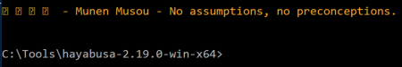
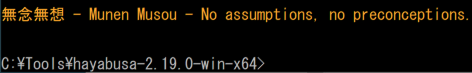
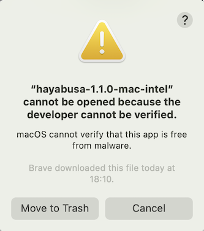
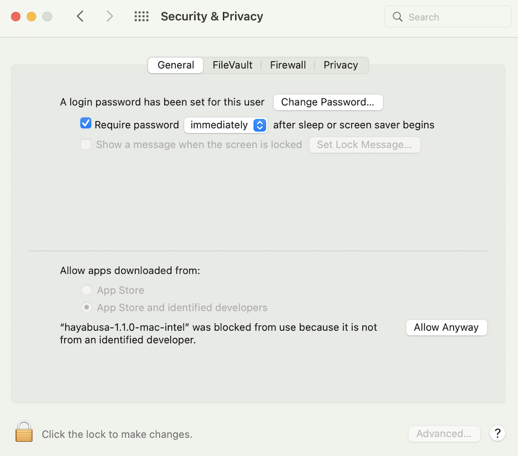
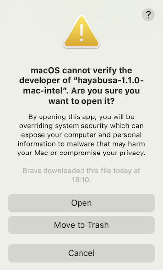

# Exécuter Hayabusa

## Attention : avertissements anti-virus/EDR et temps d'exécution lents

Vous pourriez recevoir une alerte de produits anti-virus ou EDR lorsque vous tentez d'exécuter hayabusa ou même simplement lorsque vous téléchargez les règles `.yml`, car il y aura des mots-clés comme `mimikatz` et des commandes PowerShell suspectes dans la signature de détection.
Ce sont des faux positifs, vous devrez donc configurer des exclusions dans vos produits de sécurité pour permettre à hayabusa de s'exécuter.
Si vous êtes inquiet au sujet des logiciels malveillants ou des attaques de la chaîne d'approvisionnement, veuillez consulter le code source de hayabusa et compiler les binaires vous-même.

Vous pourriez constater un temps d'exécution lent, en particulier lors de la première exécution après un redémarrage, en raison de la protection en temps réel de Windows Defender.
Vous pouvez éviter cela en désactivant temporairement la protection en temps réel ou en ajoutant une exclusion pour le répertoire d'exécution de hayabusa.
(Veuillez prendre en compte les risques de sécurité avant de faire cela.)

## Windows

Dans une invite de commande/PowerShell ou Windows Terminal, exécutez simplement le binaire Windows 32 bits ou 64 bits approprié.

### Erreur lors de la tentative d'analyse d'un fichier ou d'un répertoire dont le chemin contient un espace

Lorsque vous utilisez l'invite de commande ou PowerShell intégrée de Windows, vous pourriez recevoir une erreur indiquant que Hayabusa n'a pas pu charger de fichiers .evtx s'il y a un espace dans le chemin de votre fichier ou répertoire.
Afin de charger correctement les fichiers .evtx, assurez-vous de faire ce qui suit :
1. Entourez le chemin du fichier ou du répertoire de guillemets doubles.
2. S'il s'agit d'un chemin de répertoire, assurez-vous de ne pas inclure de barre oblique inverse comme dernier caractère.

### Caractères qui ne s'affichent pas correctement

Avec la police par défaut `Lucida Console` sur Windows, divers caractères utilisés dans le logo et les tableaux ne s'afficheront pas correctement.
Vous devriez changer la police pour `Consalas` afin de corriger cela.

Cela corrigera la plupart du rendu du texte, à l'exception de l'affichage des caractères japonais dans les messages de clôture :



Vous avez quatre options pour corriger cela :
1. Utilisez [Windows Terminal](https://learn.microsoft.com/en-us/windows/terminal/) au lieu de l'invite de commande ou PowerShell. (Recommandé)
2. Utilisez la police `MS Gothic`. Notez que les barres obliques inverses se transformeront en symboles Yen.
   
3. Installez les polices [HackGen](https://github.com/yuru7/HackGen/releases) et utilisez `HackGen Console NF`.
4. Utilisez `-q, --quiet` pour ne pas afficher les messages de clôture contenant du japonais.

## Linux

Vous devez d'abord rendre le binaire exécutable.

```bash
chmod +x ./hayabusa
```

Puis exécutez-le depuis le répertoire racine de Hayabusa :

```bash
./hayabusa
```

## macOS

Depuis Terminal ou iTerm2, vous devez d'abord rendre le binaire exécutable.

```bash
chmod +x ./hayabusa
```

Puis essayez de l'exécuter depuis le répertoire racine de Hayabusa :

```bash
./hayabusa
```

Sur la dernière version de macOS, vous pourriez recevoir l'erreur de sécurité suivante lorsque vous tentez de l'exécuter :



Cliquez sur « Annuler », puis depuis Préférences Système, ouvrez « Sécurité et confidentialité » et, dans l'onglet Général, cliquez sur « Autoriser quand même ».



Après cela, essayez de l'exécuter à nouveau.

```bash
./hayabusa
```

L'avertissement suivant apparaîtra, veuillez donc cliquer sur « Ouvrir ».



Vous devriez maintenant pouvoir exécuter hayabusa.
