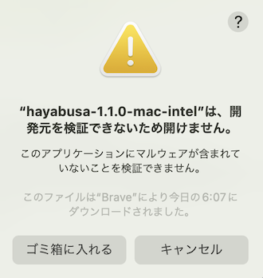
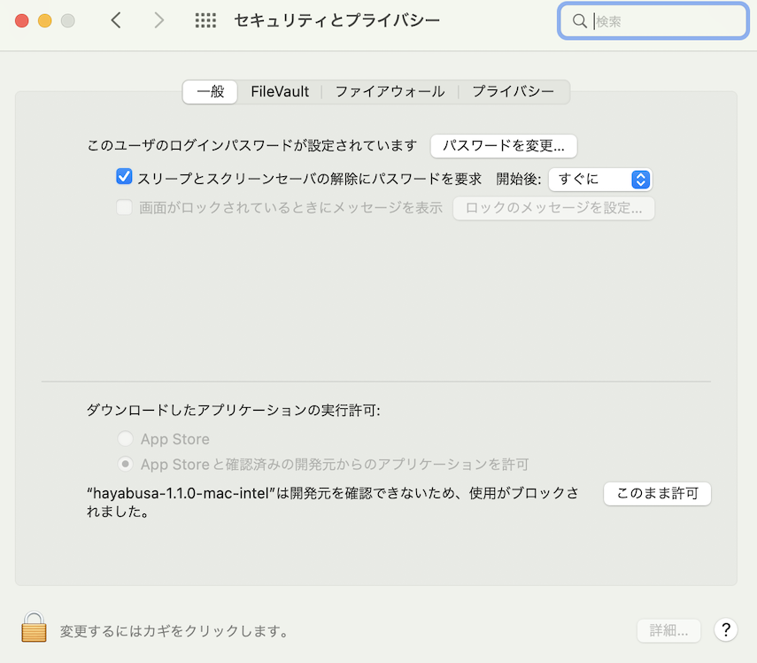
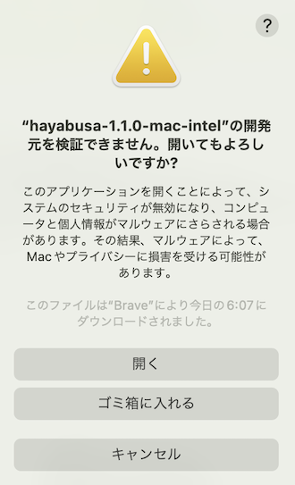

# Hayabusaの実行

## 注意: アンチウィルス/EDRの誤検知と遅い初回実行

Hayabusa実行する際や、`.yml`ルールのダウンロードや実行時にルール内でdetectionに不審なPowerShellコマンドや`mimikatz`のようなキーワードが書かれている際に、アンチウィルスやEDRにブロックされる可能性があります。
誤検知のため、セキュリティ対策の製品がHayabusaを許可するように設定する必要があります。
マルウェア感染が心配であれば、ソースコードを確認した上で、自分でバイナリをコンパイルして下さい。

Windows PC起動後の初回実行時に時間がかかる場合があります。
これはWindows Defenderのリアルタイムスキャンが行われていることが原因です。
リアルタイムスキャンを無効にするかHayabusaのディレクトリをアンチウィルススキャンから除外することでこの現象は解消しますが、設定を変える前にセキュリティリスクを十分ご考慮ください。

## Windows

コマンドプロンプトやWindows Terminalから32ビットもしくは64ビットのWindowsバイナリをHayabusaのルートディレクトリから実行します。

### パスにスペースが含まれるファイルまたはディレクトリをスキャンしようとするとエラーが発生した場合

Windowsに組み込まれているコマンドプロンプトまたはPowerShellプロンプトを使用する場合、ファイルまたはディレクトリのパスに空白があると、.evtxファイルをロードできないというエラーが表示されることがあります。
.evtxファイルを正しくロードするために、以下のことを行ってください:
1. ファイルまたはディレクトリのパスをダブルクォートで囲む。
2. ディレクトリパスの場合は、最後の文字にバックスラッシュを入れない。

### 文字が正常に表示されない場合

デフォルトのフォントがWindowsの`Lucida Console`の場合、ロゴやテーブルに使用されているさまざまな文字が正しく表示されません。
フォントを`Consolas`に変更することで、これを修正できます。

これにより、ほとんどのテキスト表示の問題は修正されますが、終了メッセージに含まれる日本語文字の表示は修正されません。


以下の4つのオプションのいずれかで修正できます：
1. [Windows Terminal](https://learn.microsoft.com/en-us/windows/terminal/)をCommand PromptまたはPowerShellの代わりに使用する。（推奨）
2. `MS Gothic`フォントを使用する。ただし、バックスラッシュが円記号（¥）に変わることに注意してください。
   
3. [HackGen](https://github.com/yuru7/HackGen/releases)フォントをインストールし、`HackGen Console NF`を使用する。
4. 日本語を含む終了メッセージを表示しないために、`-q, --quiet`オプションを使用する。

## Linux

まず、バイナリに実行権限を与える必要があります。

```bash
chmod +x ./hayabusa
```

次に、Hayabusaのルートディレクトリから実行します：

```bash
./hayabusa
```

## macOS

まず、ターミナルやiTerm2からバイナリに実行権限を与える必要があります。

```bash
chmod +x ./hayabusa
```

次に、Hayabusaのルートディレクトリから実行してみてください：

```bash
./hayabusa
```

macOSの最新版では、以下のセキュリティ警告が出る可能性があります：



macOSの環境設定から「セキュリティとプライバシー」を開き、「一般」タブから「このまま許可」ボタンをクリックしてください。



その後、ターミナルからもう一回実行してみてください：

```bash
./hayabusa
```

以下の警告が出るので、「開く」をクリックしてください。



これで実行できるようになります。
