- [การนำเข้าผลลัพธ์สู่ SOF-ELK (Elastic Stack)](#importing-results-into-sof-elk-elastic-stack)
  - [ติดตั้งและเริ่มต้น SOF-ELK](#install-and-start-sof-elk)
    - [ปัญหาการเชื่อมต่อเครือข่ายบนเครื่อง Mac](#network-connectivity-trouble-on-macs)
  - [อัปเดต SOF-ELK!](#update-sof-elk)
  - [รัน Hayabusa](#run-hayabusa)
  - [ทางเลือก: การลบข้อมูลที่นำเข้าไว้ก่อนหน้า](#optional-deleting-old-imported-data)
  - [กำหนดค่าไฟล์ config ของ logstash สำหรับ Hayabusa ใน SOF-ELK](#configure-the-hayabusa-logstash-config-file-in-sof-elk)
  - [นำเข้าผลลัพธ์ของ Hayabusa สู่ SOF-ELK](#import-hayabusa-results-into-sof-elk)
  - [ตรวจสอบว่าการนำเข้าทำงานได้ใน Kibana](#check-that-the-import-worked-in-kibana)
  - [ดูผลลัพธ์ใน Discover](#view-results-in-discover)
  - [การวิเคราะห์ผลลัพธ์](#analyzing-results)
    - [การเพิ่มคอลัมน์](#adding-columns)
    - [การกรอง](#filtering)
    - [การสลับแสดงรายละเอียด](#toggling-details)
    - [ดูเอกสารที่อยู่โดยรอบ](#view-surrounding-documents)
    - [ดูเมตริกอย่างรวดเร็วของฟิลด์](#get-quick-metrics-on-fields)
  - [แผนในอนาคต](#future-plans)

# การนำเข้าผลลัพธ์สู่ SOF-ELK (Elastic Stack)

## ติดตั้งและเริ่มต้น SOF-ELK

ผลลัพธ์ของ Hayabusa สามารถนำเข้าสู่ Elastic Stack ได้อย่างง่ายดาย
เราแนะนำให้ใช้ [SOF-ELK](https://github.com/philhagen/sof-elk) ซึ่งเป็น Linux distro ของ elastic stack แบบฟรีที่มุ่งเน้นการสืบสวน DFIR

ก่อนอื่นให้ดาวน์โหลดและแตกไฟล์ SOF-ELK 7-zipped VMware image จาก [https://github.com/philhagen/sof-elk/wiki/Virtual-Machine-README](https://github.com/philhagen/sof-elk/wiki/Virtual-Machine-README)

มีอยู่สองเวอร์ชัน คือ x86 สำหรับ CPU ของ Intel และเวอร์ชัน ARM สำหรับคอมพิวเตอร์ Apple M-series

เมื่อคุณบูตเครื่อง VM ขึ้นมา คุณจะเห็นหน้าจอคล้ายกับนี้:

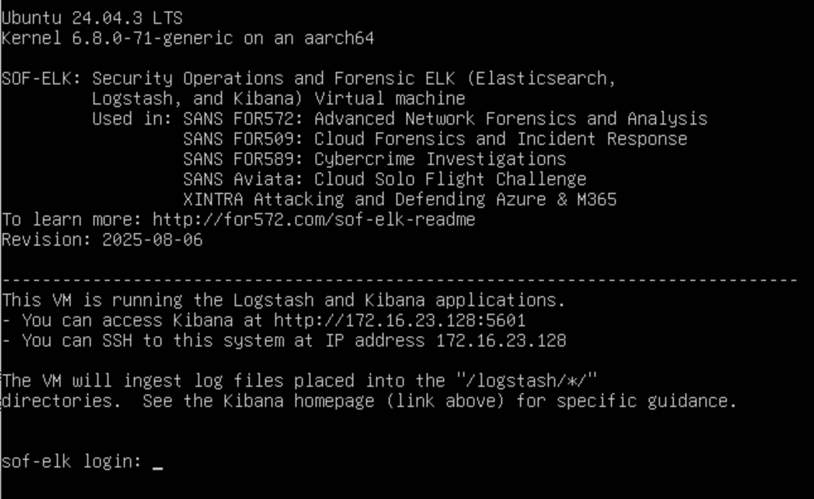

จดบันทึก URL ของ Kibana และที่อยู่ IP ของเซิร์ฟเวอร์ SSH ไว้

คุณสามารถเข้าสู่ระบบได้ด้วยข้อมูลรับรองต่อไปนี้:
* Username: `elk_user`
* Password: `forensics`

เปิด Kibana ในเว็บเบราว์เซอร์ตาม URL ที่แสดงไว้
ตัวอย่างเช่น: http://172.16.23.128:5601/

> Note: อาจใช้เวลาสักครู่ในการโหลด Kibana

คุณควรจะเห็นหน้าเว็บดังต่อไปนี้:

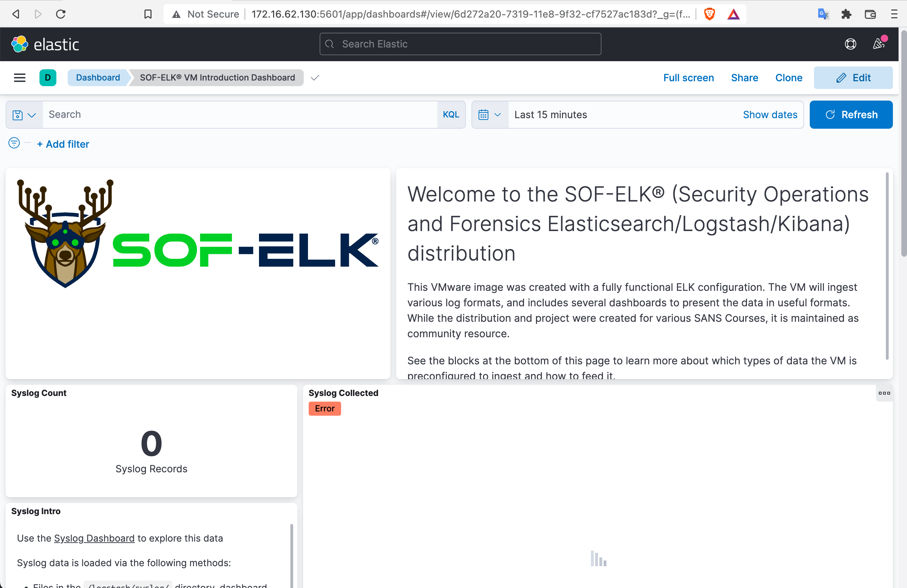

เราแนะนำให้คุณ SSH เข้าสู่ VM แทนการพิมพ์คำสั่งภายใน VM ด้วย `ssh elk_user@172.16.23.128`

> Note: เลย์เอาต์แป้นพิมพ์เริ่มต้นคือแป้นพิมพ์แบบ US

### ปัญหาการเชื่อมต่อเครือข่ายบนเครื่อง Mac

หากคุณใช้ macOS และพบข้อผิดพลาด `no route to host` ในเทอร์มินัล หรือคุณไม่สามารถเข้าถึง Kibana ในเบราว์เซอร์ของคุณได้ อาจเป็นเพราะการควบคุมความเป็นส่วนตัวของเครือข่ายภายในของ macOS

ใน `System Settings` ให้เปิด `Privacy & Security` -> `Local Network` และตรวจสอบให้แน่ใจว่าเบราว์เซอร์และโปรแกรมเทอร์มินัลของคุณถูกเปิดใช้งานเพื่อให้สามารถสื่อสารกับอุปกรณ์บนเครือข่ายภายในของคุณได้

## อัปเดต SOF-ELK!

ก่อนนำเข้าข้อมูล ตรวจสอบให้แน่ใจว่าได้อัปเดต SOF-ELK ด้วยคำสั่ง `sudo sof-elk_update.sh`

## รัน Hayabusa

รัน Hayabusa และบันทึกผลลัพธ์เป็น JSONL

ตัวอย่าง: `./hayabusa json-timeline -L -d ../hayabusa-sample-evtx -w -p super-verbose -G /opt/homebrew/var/GeoIP -o results.jsonl`

## ทางเลือก: การลบข้อมูลที่นำเข้าไว้ก่อนหน้า

หากนี่ไม่ใช่ครั้งแรกที่นำเข้าผลลัพธ์ของ Hayabusa และคุณต้องการล้างทุกอย่างออก คุณสามารถทำได้ดังต่อไปนี้:

1. ตรวจสอบว่ามีเรคคอร์ดใดอยู่ใน SOF-ELK ในขณะนี้: `sof-elk_clear.py -i list`
2. ลบข้อมูลปัจจุบัน: `sof-elk_clear.py -a`
3. ลบไฟล์ในไดเรกทอรี logstash: `rm /logstash/hayabusa/*`

## กำหนดค่าไฟล์ config ของ logstash สำหรับ Hayabusa ใน SOF-ELK

มีไฟล์ config ของ logstash สำหรับ Hayabusa รวมอยู่ใน SOF-ELK อยู่แล้ว ซึ่งจะแปลงชื่อฟิลด์ให้อยู่ในรูปแบบ Elastic Common Schema
หากคุณคุ้นเคยกับชื่อฟิลด์ของ Hayabusa มากกว่า เราแนะนำให้ใช้ไฟล์ที่เราจัดเตรียมไว้ให้

1. ก่อนอื่นให้ SSH เข้าสู่ SOF-ELK: `ssh elk_user@172.16.23.128`
2. ลบหรือย้ายไฟล์ config ของ logstash ปัจจุบัน: `sudo rm /etc/logstash/conf.d/6650-hayabusa.conf`
3. อัปโหลดไฟล์ [6650-hayabusa-jsonl.conf](../assets/doc/ElasticStackImport/6650-hayabusa-jsonl.conf) ใหม่ไปยัง `/etc/logstash/conf.d/`: `sudo wget https://raw.githubusercontent.com/Yamato-Security/hayabusa/main/doc/ElasticStackImport/6650-hayabusa-jsonl.conf -O /etc/logstash/conf.d/6650-hayabusa.conf`
4. รีบูต logstash: `sudo systemctl restart logstash`

ไฟล์ config นี้จะสร้างฟิลด์ `DetailsText` และ `ExtraFieldInfoText` แบบรวมที่ให้คุณดูฟิลด์ที่สำคัญที่สุดได้อย่างรวดเร็วในพริบตา แทนที่จะต้องเสียเวลาเปิดดูแต่ละเรคคอร์ดทีละรายการเพื่อดูฟิลด์ทั้งหมด

## นำเข้าผลลัพธ์ของ Hayabusa สู่ SOF-ELK

ล็อกจะถูกนำเข้าสู่ SOF-ELK โดยการคัดลอกล็อกไปยังไดเรกทอรีที่เหมาะสมภายในไดเรกทอรี `/logstash`

ก่อนอื่นให้ `exit` ออกจาก SSH แล้วคัดลอกไฟล์ผลลัพธ์ของ Hayabusa ที่คุณสร้างขึ้น:
`scp ./results.jsonl elk_user@172.16.23.128:/logstash/hayabusa`

## ตรวจสอบว่าการนำเข้าทำงานได้ใน Kibana

ก่อนอื่นให้จดบันทึก `Total detections`, `First Timestamp` และ `Last Timestamp` ใน `Results Summary` ของการสแกน Hayabusa ของคุณ

หากคุณไม่สามารถหาข้อมูลนี้ได้ คุณสามารถรัน `wc -l results.jsonl` บน *nix เพื่อหาจำนวนบรรทัดทั้งหมดสำหรับ `Total detections`

โดยค่าเริ่มต้น Hayabusa จะไม่เรียงลำดับผลลัพธ์เพื่อเพิ่มประสิทธิภาพ ดังนั้นคุณจึงไม่สามารถดูบรรทัดแรกและบรรทัดสุดท้ายเพื่อหา timestamp แรกและสุดท้ายได้
หากคุณไม่ทราบ timestamp แรกและสุดท้ายที่แน่นอน เพียงตั้งวันที่แรกใน Kibana เป็นปี 2007 และวันสุดท้ายเป็น `now` เพื่อให้คุณได้ผลลัพธ์ทั้งหมด

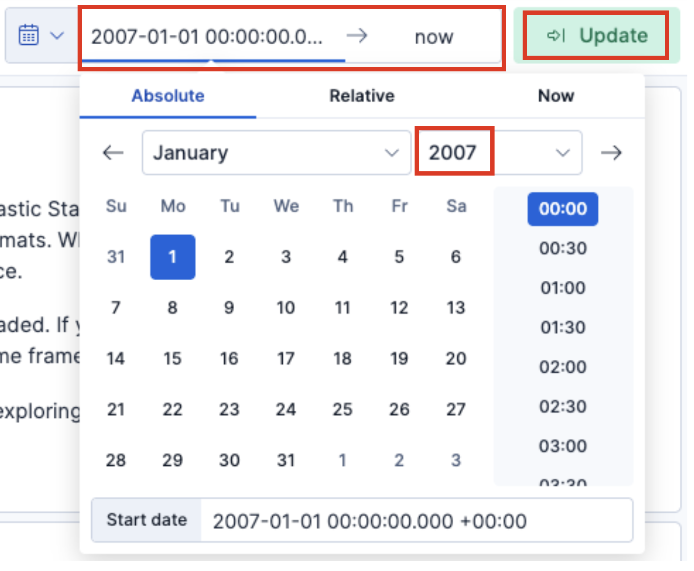

ตอนนี้คุณควรจะเห็น `Total Records` รวมถึง timestamp แรกและสุดท้ายของเหตุการณ์ที่ถูกนำเข้ามาแล้ว

บางครั้งอาจใช้เวลาสักครู่ในการนำเข้าเหตุการณ์ทั้งหมด ดังนั้นเพียงรีเฟรชหน้าเว็บไปเรื่อย ๆ จนกว่า `Total Records` จะเป็นจำนวนที่คุณคาดหวัง

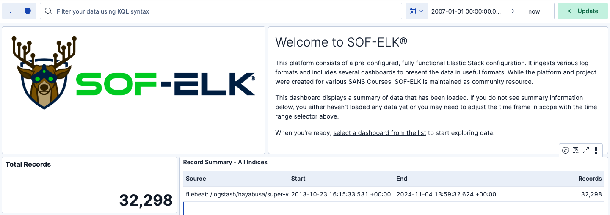

คุณยังสามารถตรวจสอบจากเทอร์มินัลได้โดยรัน `sof-elk_clear.py -i list` เพื่อดูว่าการนำเข้าสำเร็จหรือไม่
คุณควรจะเห็นว่า index `evtxlogs` ของคุณควรมีเรคคอร์ดเพิ่มขึ้น:
```
The following indices are currently active in Elasticsearch:
- evtxlogs (32,298 documents)
```

โปรดสร้าง issue บน GitHub หากคุณพบข้อผิดพลาดในการ parse เมื่อนำเข้า
คุณสามารถตรวจสอบได้โดยดูที่ส่วนท้ายของไฟล์ล็อก `/var/log/logstash/logstash-plain.log`

## ดูผลลัพธ์ใน Discover

คลิกที่ไอคอนแถบด้านข้างมุมบนซ้าย และคลิก `Discover`:

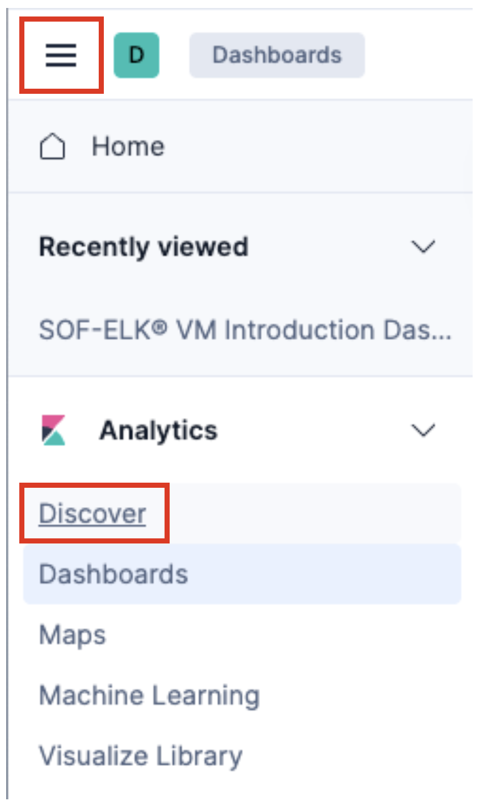

คุณอาจจะเห็น `No results match your search criteria`

ที่มุมบนซ้ายซึ่งระบุว่าเป็น index `logstash-*` ให้คลิกที่นั่นและเปลี่ยนเป็น `evtxlogs-*`
ตอนนี้คุณควรจะเห็นไทม์ไลน์ของ Discover

## การวิเคราะห์ผลลัพธ์

มุมมอง Discover เริ่มต้นควรจะมีลักษณะคล้ายกับนี้:

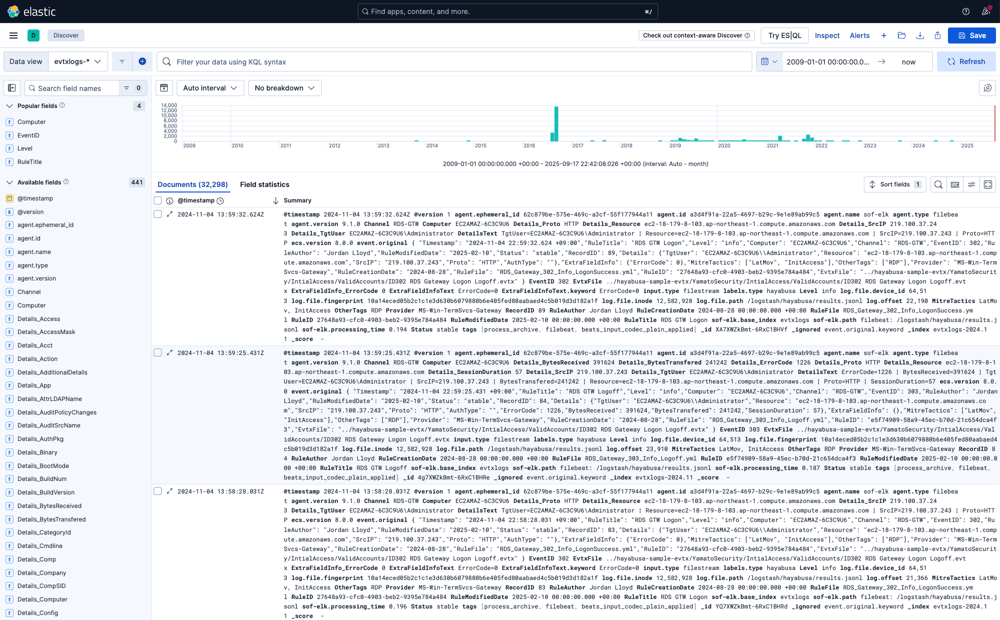

คุณสามารถดูภาพรวมของช่วงเวลาที่เหตุการณ์เกิดขึ้นและความถี่ของเหตุการณ์ได้โดยดูที่ฮิสโตแกรมที่ด้านบน 

### การเพิ่มคอลัมน์

ในแถบด้านข้างด้านซ้าย คุณสามารถเพิ่มฟิลด์ที่ต้องการแสดงในคอลัมน์ได้โดยคลิกเครื่องหมายบวกหลังจากเลื่อนเมาส์ไปวางเหนือฟิลด์
เนื่องจากมีฟิลด์จำนวนมาก คุณอาจต้องการพิมพ์ชื่อของฟิลด์ที่คุณกำลังมองหาในช่องค้นหา

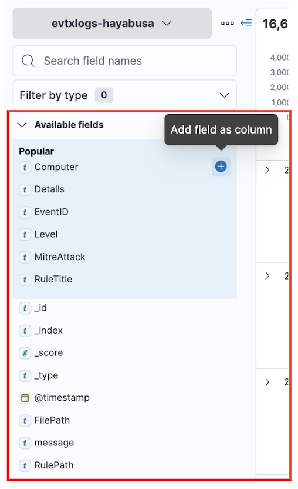

ในการเริ่มต้น เราแนะนำคอลัมน์ต่อไปนี้:
- `Computer`
- `EventID`
- `Level`
- `RuleTitle`
- `DetailsText`

หากจอภาพของคุณกว้างพอ คุณอาจต้องการเพิ่ม `ExtraFieldInfoText` ด้วยเพื่อให้คุณเห็นข้อมูลฟิลด์ทั้งหมด

ตอนนี้มุมมอง Discover ของคุณควรจะมีลักษณะดังนี้:

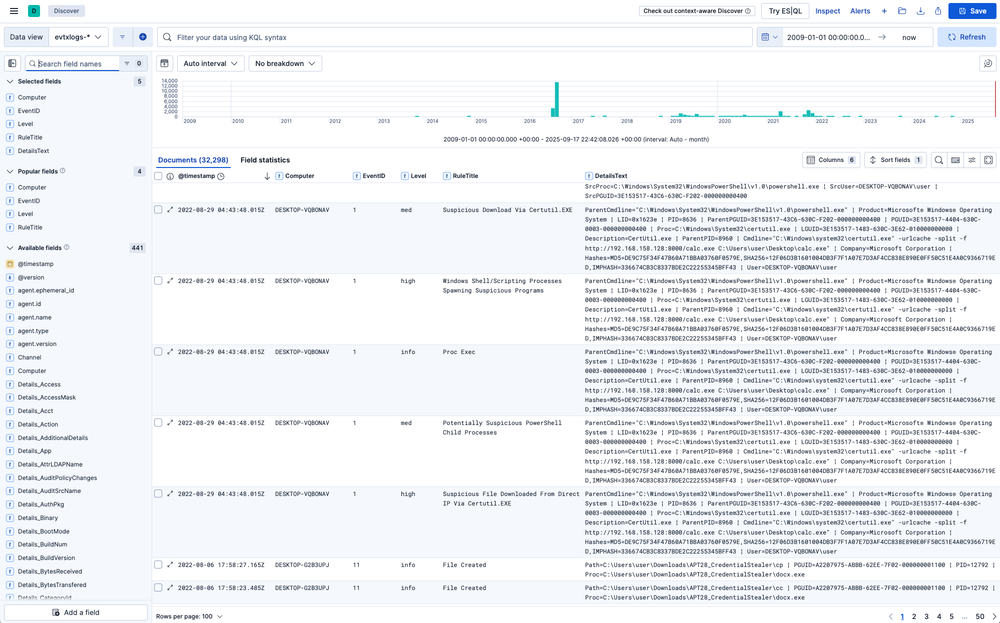

### การกรอง

คุณสามารถกรองด้วย KQL(Kibana Query Language) เพื่อค้นหาเหตุการณ์และการแจ้งเตือนบางอย่างได้ ตัวอย่างเช่น:
  * `Level: "crit"`: แสดงเฉพาะการแจ้งเตือนระดับ critical
  * `Level: "crit" OR Level: "high"`: แสดงการแจ้งเตือนระดับ high และ critical
  * `NOT Level: info`: ไม่แสดงเหตุการณ์เชิงข้อมูล แสดงเฉพาะการแจ้งเตือนเท่านั้น
  * `MitreTactics: *LatMov*`: แสดงเหตุการณ์และการแจ้งเตือนที่เกี่ยวข้องกับ lateral movement
  * `"PW Spray"`: แสดงเฉพาะการโจมตีบางอย่าง เช่น "Password Spray"
  * `"LID: 0x8724ead"`: แสดงกิจกรรมทั้งหมดที่เกี่ยวข้องกับ Logon ID 0x8724ead
  * `Details_TgtUser: admmig`: ค้นหาเหตุการณ์ทั้งหมดที่ผู้ใช้เป้าหมายคือ `admmig`

### การสลับแสดงรายละเอียด

ในการตรวจสอบฟิลด์ทั้งหมดในเรคคอร์ด เพียงคลิกไอคอน (Toggle dialog with details) ถัดจาก timestamp:

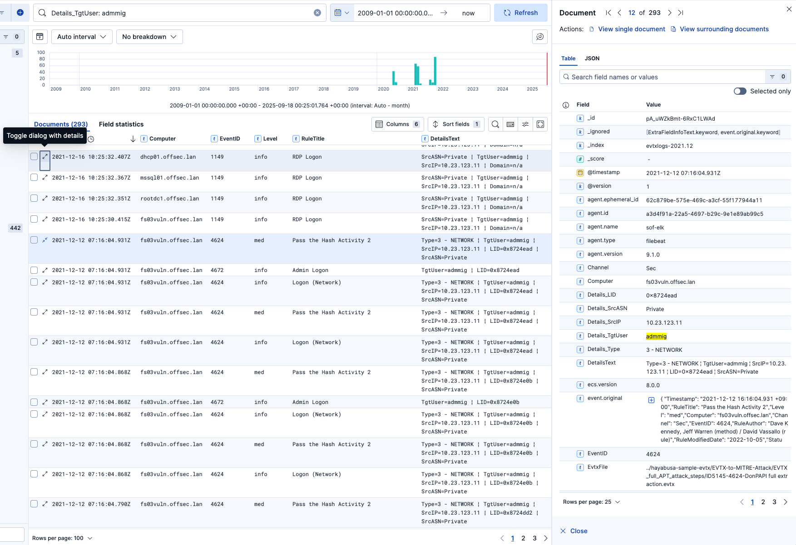

### ดูเอกสารที่อยู่โดยรอบ

หากคุณต้องการดูเหตุการณ์ที่อยู่ก่อนหน้าและถัดจากการแจ้งเตือนบางอย่างโดยตรง ก่อนอื่นให้เปิดรายละเอียดของการแจ้งเตือนนั้น แล้วคลิก `View surrounding documents` ที่มุมบนขวา:

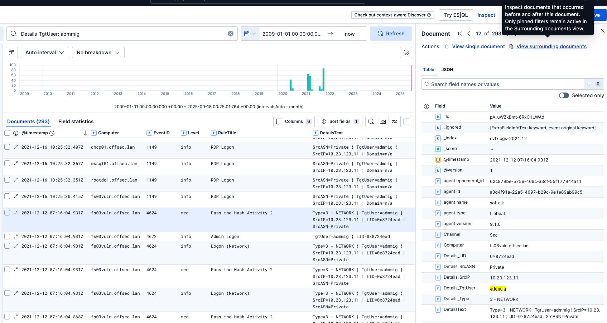

ในตัวอย่างนี้ เรากำลังดูเหตุการณ์ก่อนหน้าและถัดจากการแจ้งเตือนการโจมตี Pass the Hash:

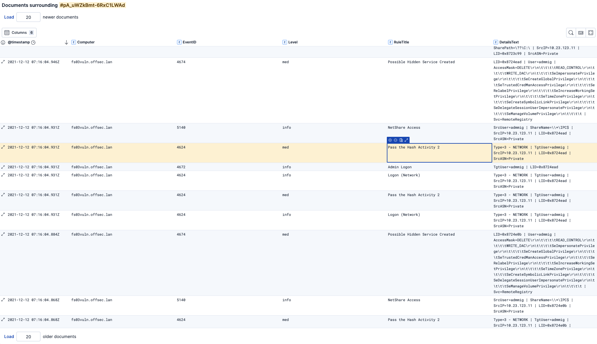

> Note: เปลี่ยนตัวเลขที่ด้านบน `Load x newer documents` หรือด้านล่าง `Load x older documents` เพื่อดึงเหตุการณ์เพิ่มเติม

### ดูเมตริกอย่างรวดเร็วของฟิลด์

ในคอลัมน์ด้านซ้าย หากคุณคลิกที่ชื่อฟิลด์ มันจะแสดงเมตริกอย่างรวดเร็วเกี่ยวกับการใช้งานของฟิลด์นั้น:

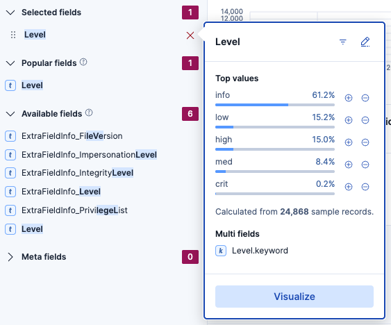

> โปรดทราบว่าข้อมูลถูกสุ่มตัวอย่างเพื่อความรวดเร็ว ดังนั้นจึงไม่ถูกต้อง 100%

## แผนในอนาคต

* Logstash parsers สำหรับ CSV
* แดชบอร์ดที่สร้างไว้ล่วงหน้า
