# Timeline Explorer로 Hayabusa 결과 분석하기

## 개요

[Timeline Explorer](https://ericzimmerman.github.io/#!index.md)는 DFIR 목적으로 CSV 파일을 분석할 때 Excel을 대체하기 위한 무료(단, 비공개 소스) 도구입니다.
C#으로 작성된 Windows 전용 GUI 도구입니다.
이 도구는 단일 분석가가 수행하는 소규모 조사나 DFIR 분석을 처음 배우는 사람들에게 매우 유용하지만, 인터페이스가 처음에는 이해하기 어려울 수 있으므로 다양한 기능을 이해하기 위해 이 가이드를 활용하시기 바랍니다.

## 설치 및 실행

이 애플리케이션은 설치할 필요가 없습니다.
[https://ericzimmerman.github.io/#!index.md](https://ericzimmerman.github.io/#!index.md)에서 최신 버전을 다운로드하여 압축을 풀고 `TimelineExplorer.exe`를 실행하기만 하면 됩니다.
적절한 .NET 런타임이 없는 경우, 설치가 필요하다는 메시지가 표시됩니다.
작성 시점(2025/2/14) 기준으로 최신 버전은 `2.1.0`이며 .NET 버전 `9`에서 실행됩니다.

## CSV 파일 불러오기

메뉴에서 `File` -> `Open`을 클릭하기만 하면 CSV 파일을 불러올 수 있습니다.

다음과 같은 화면이 표시됩니다:

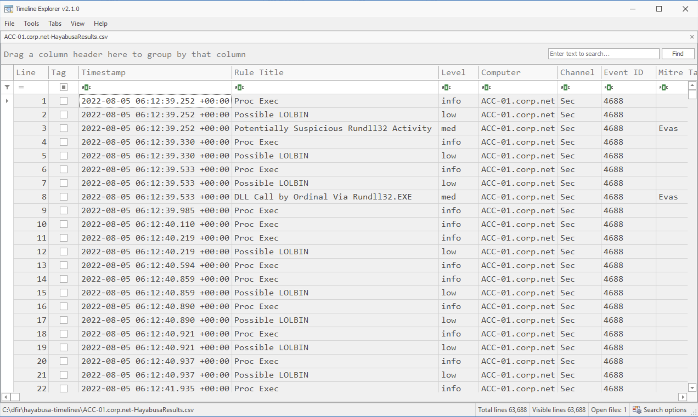

맨 아래에서 파일명, `Total lines` 및 `Visible lines`를 확인할 수 있습니다.

CSV 파일에 있는 열 외에도, Timeline Explorer가 왼쪽에 추가한 두 개의 열이 있습니다: `Line`과 `Tag`입니다.
`Line`은 행 번호를 표시하지만 일반적으로 조사에 유용하지 않으므로 이 열을 숨기는 것이 좋습니다.
`Tag`를 사용하면 나중에 추가 분석을 위해 기록해 두고 싶은 이벤트에 체크 표시를 할 수 있습니다.
안타깝게도, CSV 파일이 데이터 덮어쓰기를 방지하기 위해 읽기 전용 모드로 열리기 때문에 이벤트에 사용자 지정 태그를 추가하거나 이벤트에 대한 코멘트를 작성할 수 있는 방법은 없습니다.

## 데이터 필터링

헤더의 오른쪽 상단 부분에 마우스를 올리면 검은색 필터 아이콘이 나타납니다.

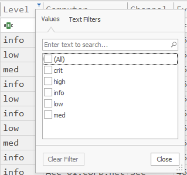

심각도 수준에 체크 표시를 하여 먼저 `high` 및 `crit`(`critical`) 알림을 분류할 수 있습니다.
이 필터링은 `Rule Title` 아래의 모든 항목을 체크한 다음 노이즈가 많은 규칙의 체크를 해제하여 노이즈가 많은 알림을 걸러내는 데에도 매우 유용합니다.

아래와 같이, `Text Filters`를 클릭하면 더 고급 필터를 만들 수 있습니다:

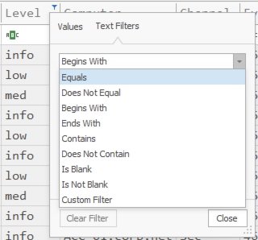

다만 여기서 필터를 만드는 대신, 보통은 헤더 아래의 `ABC` 아이콘을 클릭하여 여기서 필터를 적용하는 것이 더 쉽습니다:

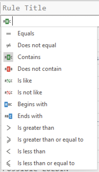

안타깝게도 이 두 곳은 약간 다른 필터링 옵션을 제공하므로 데이터를 필터링할 두 곳 모두를 알고 있어야 합니다.

예를 들어, 걸러내고 싶은 `Proc Exec` 이벤트가 너무 많다면, `Does not contain`을 선택하고 `Proc Exec`를 입력하여 해당 이벤트를 무시할 수 있습니다:

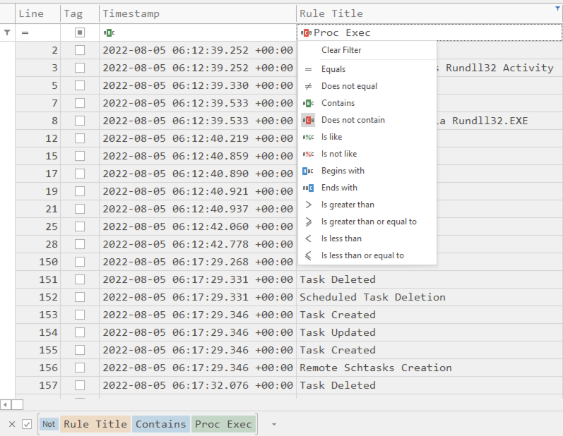

아래쪽을 보면 필터 규칙이 서로 다른 색상으로 표시되는 것을 확인할 수 있습니다.
필터를 일시적으로 비활성화하려면 체크를 해제하기만 하면 됩니다.
모든 필터를 지우려면 `X` 버튼을 클릭하세요.

다른 노이즈가 많은 규칙을 무시하고 싶다면, 오른쪽 하단의 `Edit Filter`를 클릭하여 `Filter Editor`를 열어야 합니다:

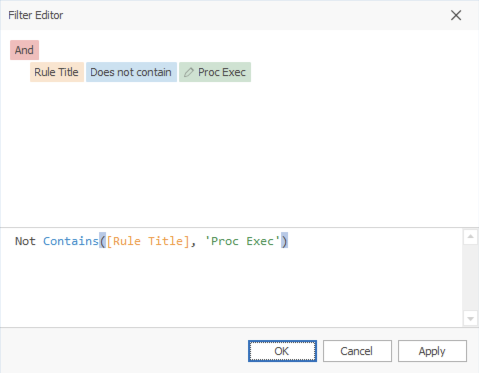

`Not Contains([Rule Title], 'Proc Exec')` 텍스트를 복사하고, `and`를 추가한 다음, 동일한 필터를 붙여넣고 `Proc Exec`를 `Possible LOLBIN`으로 변경하면 이제 이 두 규칙을 무시할 수 있습니다:

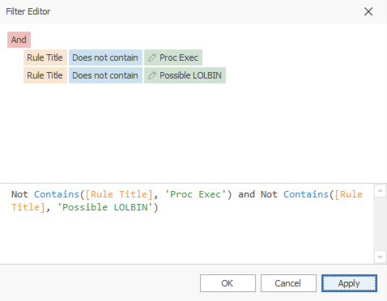

여러 필터를 결합하는 가장 쉬운 방법은 먼저 `ABC` 아이콘에서 필터 구문을 만든 다음, 해당 텍스트를 복사, 붙여넣기, 편집하고 `and`, `or`, `not`으로 필터를 결합하는 것입니다.

또한 색상이 있는 텍스트를 클릭하면 필터를 편집할 수 있는 가능한 옵션이 담긴 드롭다운 상자를 얻을 수 있습니다:

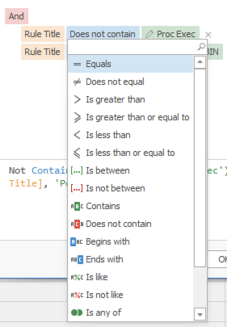

## 헤더 옵션

헤더를 마우스 오른쪽 버튼으로 클릭하면 다음 옵션이 표시됩니다:

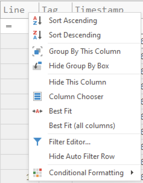

이러한 옵션 대부분은 따로 설명이 필요 없습니다.

* 열을 숨긴 후에는 `Column Chooser`를 열고 열 이름을 마우스 오른쪽 버튼으로 클릭한 다음 `Show Column`을 클릭하여 다시 표시할 수 있습니다.
* `Group By This Column`은 그룹화하기 위해 열 헤더를 위로 드래그하는 것과 동일한 효과를 가집니다. (자세한 내용은 나중에 설명합니다.)
* `Hide Group By Box`는 `Drag a column header here to group by that column` 텍스트를 숨기고 검색 바를 위로 이동시킵니다.

### 조건부 서식

`Conditional Formatting` -> `Highlight Cell Rules` -> `Equal To...`를 클릭하여 텍스트에 색상, 굵은 글꼴 등의 서식을 적용할 수 있습니다:

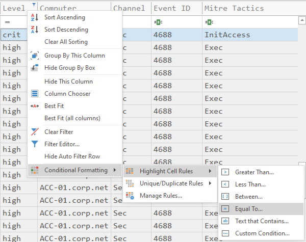

예를 들어, `critical` 알림을 `Red Fill`로 표시하고 싶다면, `crit`를 입력하고 옵션에서 `Red Fill`을 선택한 다음 `Apply formatting to an entire row`를 체크하고 `OK`를 누르기만 하면 됩니다.

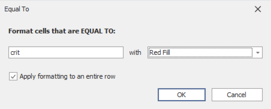

이제 아래와 같이 `critical` 알림이 빨간색으로 표시됩니다:

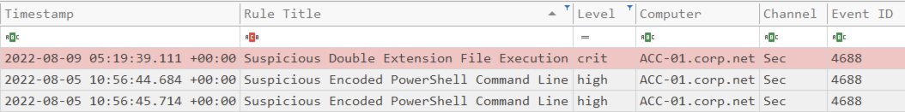

`low`, `medium`, `high` 알림에도 색상을 추가하여 이 작업을 계속할 수 있습니다.

## 검색

기본적으로 검색 바에 텍스트를 입력하면 필터링이 수행되어 해당 텍스트가 행 어딘가에 포함된 결과만 표시됩니다.
하단의 `Visible lines` 필드를 확인하여 몇 개의 결과가 있는지 알 수 있습니다.

맨 아래 오른쪽의 `Search options`를 클릭하여 이 동작을 변경할 수 있습니다.
그러면 다음이 표시됩니다:

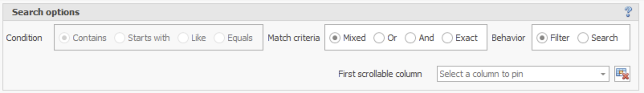

`Behavior`를 `Filter`에서 `Search`로 변경하면 텍스트를 일반적으로 검색할 수 있습니다.

> 참고: 동작을 전환하는 데 보통 시간이 걸리며 Timeline Explorer가 잠시 멈추므로, 클릭한 후에는 인내심을 가지세요.

기본 `Match criteria`는 `Mixed`이지만 `Or`, `And`, `Exact`로 변경할 수 있습니다.
`Mixed`를 제외한 다른 것으로 변경하면, `Condition`을 `Contains`에서 `Starts with`, `Like` 또는 `Equals`로 설정할 수 있습니다.

`Mixed`의 `Match criteria`는 때로는 `AND` 논리를 사용하고 때로는 `OR`를 사용하기 때문에 복잡하지만, 일단 익히면 매우 유연하게 사용할 수 있습니다.
다음과 같이 작동합니다:

* 단어를 공백으로 구분하면 `OR` 논리로 처리됩니다.
* 검색에 공백을 포함하려면 따옴표를 추가해야 합니다.
* `AND` 논리를 위해서는 조건 앞에 `+`를 붙이세요.
* 결과를 제외하려면 조건 앞에 `-`를 붙이세요.
* `ColumnName:FilterString` 형식으로 특정 열에 대해 필터링하세요.
* 특정 열에 대해 필터링하면서 별도의 키워드도 포함하면 `AND` 논리가 됩니다.

예시:
| 검색 기준                          | 설명                                                                                                                                            |
|----------------------------------|-------------------------------------------------------------------------------------------------------------------------------------------------|
| mimikatz                         | 검색 열 중 어느 곳에든 `mimikatz` 문자열을 포함하는 레코드를 선택합니다.                                                                              |
| one two three                    | 검색 열 중 어느 곳에든 `one` OR `two` OR `three`를 포함하는 레코드를 선택합니다.                                                                       |
| "hoge hoge"                      | 검색 열 중 어느 곳에든 `hoge hoge`를 포함하는 레코드를 선택합니다.                                                                                    |
| mimikatz +"Bad Guy"              | 검색 열 중 어느 곳에든 `mimikatz` AND `Bad Guy`를 모두 포함하는 레코드를 선택합니다.                                                                   |
| EventID:4624 kali                | `EventID`로 시작하는 열에 `4624`를 포함하고 AND 검색 열 중 어느 곳에든 `kali`를 포함하는 레코드를 선택합니다.                                            |
| data +entry -mark                | 검색 열 중 어느 곳에든 `data` AND `entry`를 모두 포함하되, `mark`를 포함하는 레코드는 제외하고 선택합니다.                                               |
| manu mask -file                  | `menu` OR `mask`를 포함하되, `file`을 포함하는 레코드는 제외하고 선택합니다.                                                                          |
| From:Roller Subj:"currency mask" | `From`으로 시작하는 열에 `Roller`를 포함하고 AND `Subj`로 시작하는 열에 `currency mask`를 포함하는 레코드를 선택합니다.                                  |
| import -From:Steve               | 검색 열 중 어느 곳에든 `import`를 포함하되, `From`으로 시작하는 열에 `Steve`를 포함하는 레코드는 제외하고 선택합니다.                                      |

## 열 고정

검색 옵션은 아니지만, `Search options` 메뉴에서 `First scrollable column`을 구성할 수 있습니다.
대부분의 분석가는 특정 이벤트가 언제 발생했는지 항상 볼 수 있도록 이 값을 `Timestamp`로 설정합니다.

## 열 헤더를 드래그하여 그룹화하기

열 헤더를 `Drag a column header here to group by that column`으로 드래그하면, Timeline Explorer가 해당 열을 기준으로 그룹화합니다.
심각도별로 알림의 우선순위를 정할 수 있도록 `Level`로 그룹화하는 것이 일반적입니다:

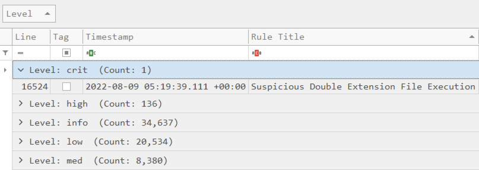

결과에 여러 대의 컴퓨터가 있는 경우, `Computer`로 추가로 그룹화하여 각 컴퓨터의 서로 다른 심각도 수준에 따라 분류할 수 있습니다.

## 필드 확인

기본적으로 Hayabusa는 깨진 파이프 기호 `¦`로 필드 데이터를 구분합니다.
필드 데이터가 가로 한 줄에 있을 때, 이 문자는 로그에서 자주 발견되지 않기 때문에 여러 필드를 매우 쉽게 구별할 수 있게 해줍니다:

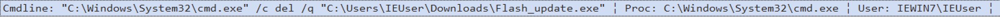

그러나 때로는 로그에 필드 정보가 너무 많아 모든 것이 한 화면에 들어가지 않을 수 있습니다.
이 경우, 셀을 더블 클릭하면 모든 필드 정보를 표시하는 팝업을 얻을 수 있습니다:

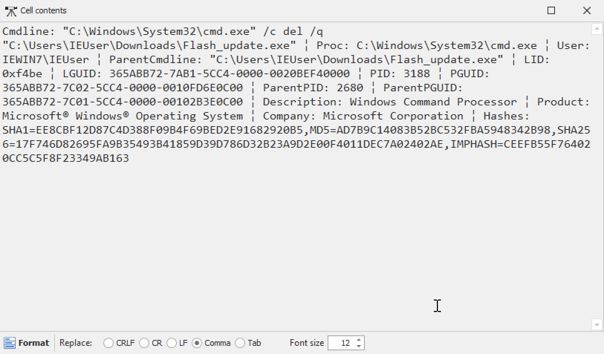

문제는 Timeline Explorer가 줄 바꿈 문자(`CRLF`, `CR`, `LF`), 쉼표 및 탭으로만 필드 데이터를 서식 지정할 수 있다는 것입니다.

`-M, --multiline` 옵션을 사용하면 줄 바꿈 문자로 필드를 구분할 수 있으며, 셀의 내용을 열기 위해 더블 클릭하면 올바르게 서식이 지정됩니다:

문제는 이제 타임라인에 첫 번째 필드만 표시되므로 다른 필드 데이터를 확인하려고 할 때마다 더블 클릭하여 새 창을 열어야 한다는 것입니다:

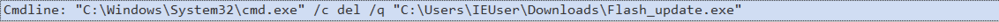

안타깝게도, Timeline Explorer는 타임라인 보기에서 여러 줄을 지원하지 않습니다.

이를 우회하기 위해, Hayabusa `v3.1.0`부터는 탭으로 필드를 구분할 수 있습니다:

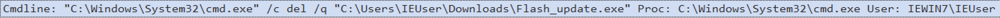

한 필드가 끝나고 다음 필드가 시작되는 지점을 구별하기가 조금 더 어렵습니다.
또한 더블 클릭하여 셀의 내용을 열 때 필드가 자동으로 서식 지정되지 않습니다:

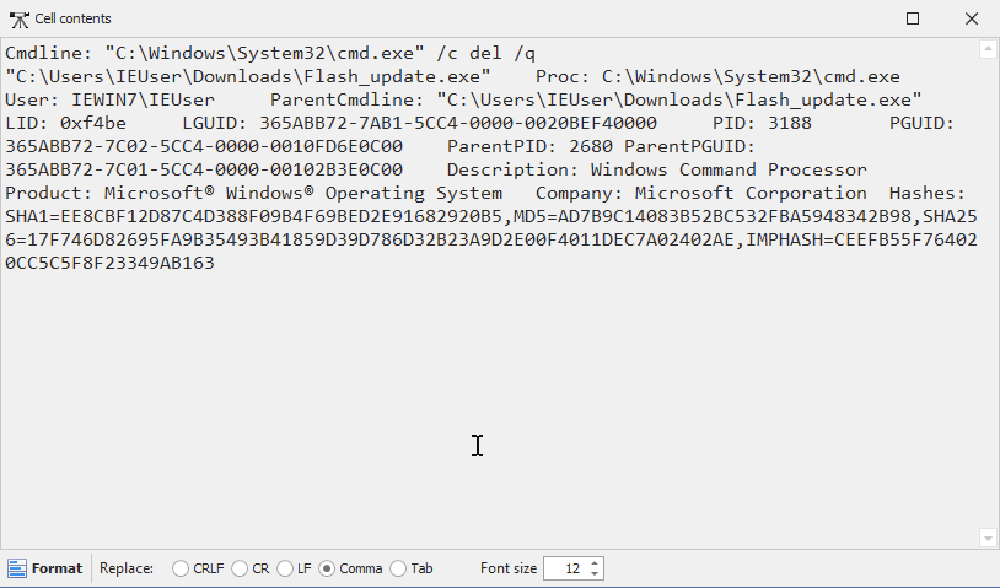

그러나 하단의 `Tab`을 클릭한 다음 `Format`을 클릭하면 필드를 읽기 쉬운 보기로 서식 지정할 수 있습니다:

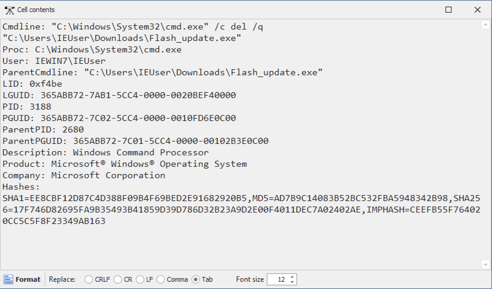

## 스킨

다크 모드 등을 선호하는 경우 `Tools` -> `Skins`에서 색상 테마를 변경할 수 있습니다.

## 세션

열, 모양, 필터 추가 등을 사용자 지정하고 나중을 위해 해당 설정을 저장하려면, `File` -> `Session` -> `Save`에서 세션을 저장하세요.
