# การวิเคราะห์ผลลัพธ์ของ Hayabusa ด้วย Timesketch

## เกี่ยวกับ

"[Timesketch](https://timesketch.org/) เป็นเครื่องมือโอเพนซอร์สสำหรับการวิเคราะห์ไทม์ไลน์ทางนิติวิทยาศาสตร์แบบร่วมมือกัน ด้วยการใช้ sketch คุณและผู้ร่วมงานสามารถจัดระเบียบไทม์ไลน์ของคุณและวิเคราะห์พร้อมกันได้อย่างง่ายดาย เพิ่มความหมายให้กับข้อมูลดิบของคุณด้วยคำอธิบายประกอบ ความคิดเห็น แท็ก และดาวอันหลากหลาย"

สำหรับการสืบสวนขนาดเล็กที่คุณกำลังวิเคราะห์ไฟล์ CSV ขนาดเพียงไม่กี่ร้อย MB และทำงานเพียงคนเดียว Timeline Explorer ก็เหมาะสมดี อย่างไรก็ตาม เมื่อคุณทำงานกับข้อมูลขนาดใหญ่ขึ้นหรือทำงานเป็นทีม เครื่องมืออย่าง Timesketch จะดีกว่ามาก

Timesketch มอบประโยชน์ดังต่อไปนี้:

1. มันรวดเร็วมากและสามารถจัดการกับข้อมูลขนาดใหญ่ได้
2. มันเป็นเครื่องมือแบบร่วมมือกันที่ผู้ใช้หลายคนสามารถใช้พร้อมกันได้
3. มันมีการวิเคราะห์ข้อมูลขั้นสูง ฮิสโตแกรม และการแสดงผลภาพ
4. มันไม่ได้จำกัดอยู่แค่ Windows
5. มันรองรับการค้นหาขั้นสูง

ยังมีประโยชน์อื่นๆ อีกมากมาย เช่น การรองรับ CTI, ตัววิเคราะห์ต่างๆ, โน้ตบุ๊กแบบโต้ตอบ ฯลฯ...
โปรดดู [คู่มือผู้ใช้](https://timesketch.org/guides/user/upload-data/) และ [ช่อง YouTube](https://www.youtube.com/channel/UC_n6mMb0OxWRk7xiqiOOcRQ) เพื่อข้อมูลเพิ่มเติม

ข้อเสียเพียงอย่างเดียวคือคุณจะต้องตั้งค่าเซิร์ฟเวอร์ Timesketch ในสภาพแวดล้อมแล็บของคุณ แต่โชคดีที่การทำเช่นนี้ง่ายมาก

## การติดตั้ง
### Docker
ทำตามคำแนะนำอย่างเป็นทางการ [ที่นี่](https://docs.docker.com/compose/install)

### Ubuntu
**หมายเหตุ:** ต้องติดตั้ง Docker ก่อนดำเนินการต่อ โปรดทำตาม [คำแนะนำการติดตั้ง Docker ด้านบน](#docker) หากคุณยังไม่ได้ติดตั้ง Docker
เราขอแนะนำให้ใช้ Ubuntu LTS Server edition เวอร์ชันล่าสุดที่มีหน่วยความจำอย่างน้อย 8GB
คุณสามารถดาวน์โหลดได้ [ที่นี่](https://ubuntu.com/download/server)
เลือกการติดตั้งแบบ minimal เมื่อตั้งค่า
อย่าติดตั้ง docker เมื่อตั้งค่าระบบปฏิบัติการ
คุณจะไม่มี `ifconfig` ให้ใช้งาน ดังนั้นให้ติดตั้งมันด้วย `sudo apt install net-tools`

หลังจากนั้น ให้รัน `ifconfig` เพื่อหาที่อยู่ IP ของ VM และเลือกที่จะ ssh เข้าไปได้ตามต้องการ

รันคำสั่งต่อไปนี้:
``` bash
curl -s -O https://raw.githubusercontent.com/google/timesketch/master/contrib/deploy_timesketch.sh
chmod 755 deploy_timesketch.sh
cd /opt
sudo ~/deploy_timesketch.sh
cd timesketch
sudo docker compose up -d

# Create a user named user. Set the password here.
sudo docker compose exec timesketch-web tsctl create-user user
```
### macOS
**หมายเหตุ:** ก่อนดำเนินการต่อ ตรวจสอบให้แน่ใจว่าคุณได้ติดตั้ง [Docker Desktop for Mac](https://docs.docker.com/desktop/install/mac/) และกำลังทำงานอยู่บนระบบของคุณ
โคลน repository ของ Timesketch และเปลี่ยนเข้าไปในไดเรกทอรี
```bash
git clone https://github.com/google/timesketch.git
cd timesketch
```
เริ่ม Docker container โดยทำตามขั้นตอนด้านล่าง

- https://github.com/google/timesketch/tree/master/docker/e2e#build-and-start-containers

## การเข้าสู่ระบบ

ค้นหาที่อยู่ IP ของเซิร์ฟเวอร์ Timesketch ด้วย `ifconfig` และเปิดมันด้วยเว็บเบราว์เซอร์
คุณจะถูกเปลี่ยนเส้นทางไปยังหน้าเข้าสู่ระบบ
เข้าสู่ระบบด้วยข้อมูลรับรองผู้ใช้ที่คุณใช้ตอนเพิ่มผู้ใช้

## การสร้าง sketch ใหม่

ภายใต้ `Start a new investigation` ให้คลิก `BLANK SKETCH`
ตั้งชื่อ sketch ให้เกี่ยวข้องกับการสืบสวนของคุณ

## การอัปโหลดไทม์ไลน์ของคุณ

หลังจากคุณคลิก `+ ADD TIMELINE` คุณจะเห็นกล่องโต้ตอบที่ขอให้คุณอัปโหลดไฟล์ Plaso, JSONL หรือ CSV
น่าเสียดายที่ปัจจุบัน Timesketch ไม่สามารถนำเข้ารูปแบบ `JSONL` ของ Hayabusa ได้ ดังนั้นให้สร้างและอัปโหลดไทม์ไลน์ CSV ด้วยคำสั่งต่อไปนี้:

```shell
hayabusa-x.x.x-win-x64.exe dfir-timeline -d <DIR> -o timesketch-import.csv -p timesketch-verbose --ISO-8601
```

> หมายเหตุ: จำเป็นต้องเลือกโปรไฟล์ `timesketch*` และระบุ timestamp เป็น `--ISO-8601` สำหรับ UTC หรือ `--RFC-3339` สำหรับเวลาท้องถิ่น คุณอาจเพิ่มตัวเลือก Hayabusa อื่นๆ ได้หากต้องการ อย่างไรก็ตาม อย่าเพิ่มตัวเลือก `-M, --multiline` เนื่องจากอักขระขึ้นบรรทัดใหม่จะทำให้การนำเข้าเสียหาย

ที่กล่องโต้ตอบ "Select file to upload" ให้ตั้งชื่อไทม์ไลน์ของคุณเป็นอะไรทำนอง `hayabusa` เลือกตัวคั่น CSV เป็น `Comma (,)` แล้วคลิก `SUBMIT`

> หากไฟล์ CSV ของคุณใหญ่เกินไปที่จะอัปโหลด คุณสามารถแบ่งไฟล์ออกเป็นไฟล์ CSV หลายไฟล์ด้วยคำสั่ง [split-dfir-timeline](https://github.com/Yamato-Security/takajo?tab=readme-ov-file#split-dfir-timeline-command) ของ Takajo

ในขณะที่ไฟล์กำลังถูกนำเข้า คุณจะเห็นวงกลมหมุนอยู่ ดังนั้นโปรดรอจนกว่าจะเสร็จสิ้นและคุณเห็น `hayabusa` ปรากฏขึ้น

## เคล็ดลับการวิเคราะห์

### การแสดงไทม์ไลน์

**หมายเหตุ: แม้ว่าการนำเข้าจะเสร็จสิ้นเรียบร้อยแล้ว มันจะแสดง `Your search did not match any events` และจะมี `0` เหตุการณ์ในไทม์ไลน์ `hayabusa`**

ค้นหา `*` แล้วเหตุการณ์ต่างๆ จะปรากฏขึ้นดังที่แสดงด้านล่าง:

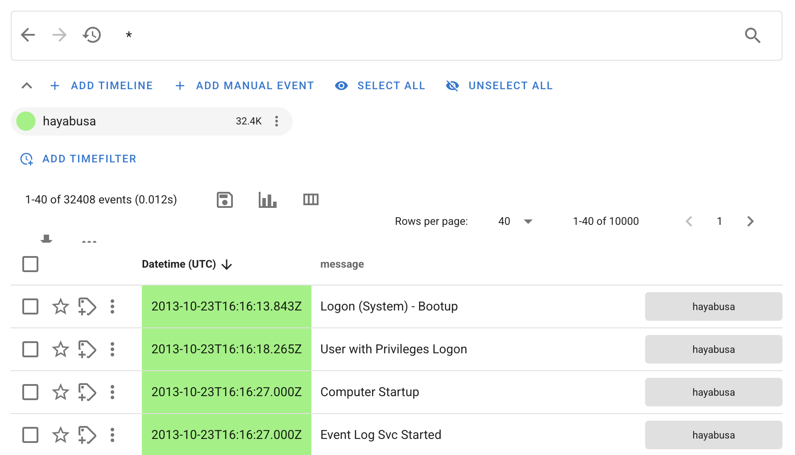

### รายละเอียดการแจ้งเตือน

หากคุณคลิกที่ชื่อกฎการแจ้งเตือนภายใต้คอลัมน์ `message` คุณจะได้รับข้อมูลรายละเอียดเกี่ยวกับการแจ้งเตือน:

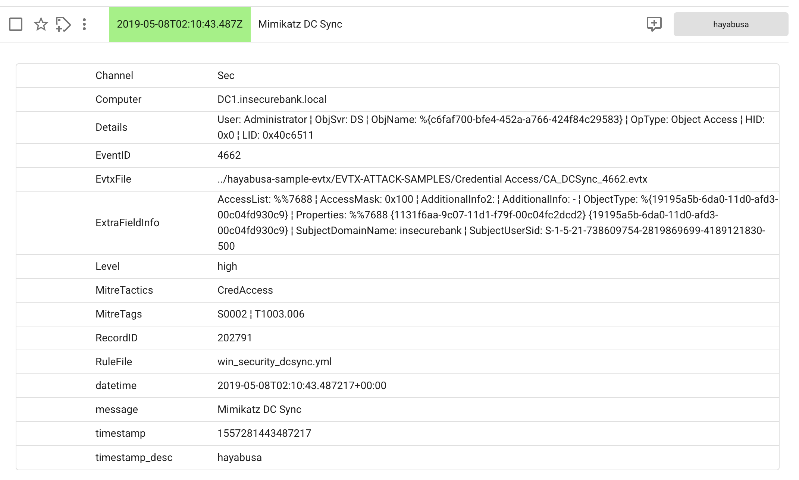

หากคุณต้องการเข้าใจตรรกะของกฎ sigma ดูคำอธิบายและการอ้างอิง ฯลฯ... โปรดค้นหากฎดังกล่าวใน repository [hayabusa-rules](https://github.com/Yamato-Security/hayabusa-rules)

#### การกรองฟิลด์

หลังจากเปิดรายละเอียดของเหตุการณ์โดยคลิกที่ชื่อกฎของมัน คุณสามารถวางเมาส์เหนือฟิลด์ใดก็ได้เพื่อกรองค่าเข้าหรือออกได้อย่างง่ายดาย:

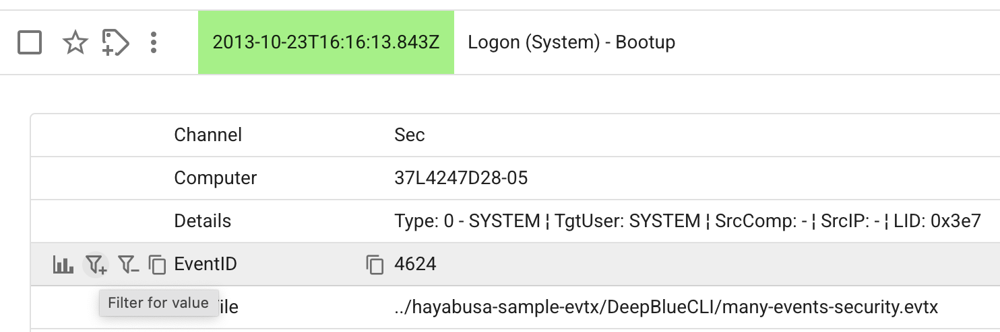

#### การวิเคราะห์แบบรวม

เมื่อวางเมาส์เหนือ หากคุณคลิกไอคอน `Aggregation dialog` ที่อยู่ซ้ายสุด คุณจะได้รับการวิเคราะห์ข้อมูลเหตุการณ์ที่ยอดเยี่ยมเกี่ยวกับฟิลด์นั้น:

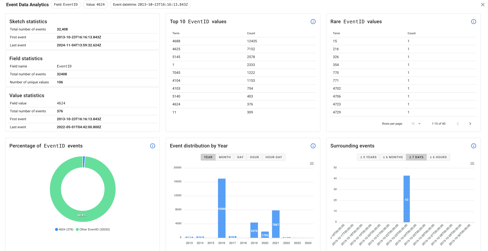

#### ความคิดเห็นของผู้ใช้

เมื่อคุณคลิกที่การแจ้งเตือนเพื่อรับข้อมูลรายละเอียด ไอคอนกล่องโต้ตอบความคิดเห็นใหม่จะแสดงอยู่ทางด้านขวามือ ดังที่แสดงด้านล่าง:

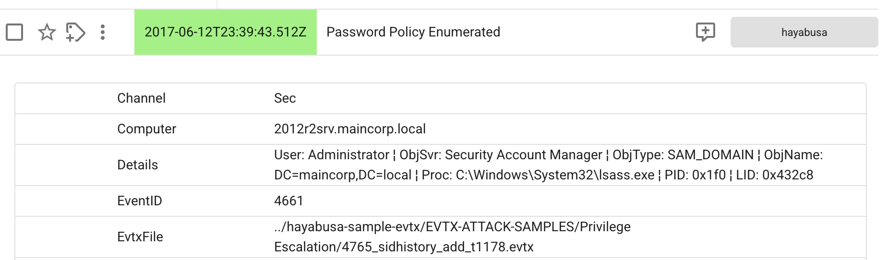

ที่นี่ ผู้ใช้สามารถเริ่มแชทและเขียนความคิดเห็นเกี่ยวกับการสืบสวนได้

> หากคุณทำงานเป็นทีม คุณควรสร้างบัญชีผู้ใช้ที่แตกต่างกันสำหรับสมาชิกแต่ละคน เพื่อให้คุณรู้ว่าใครเขียนอะไร

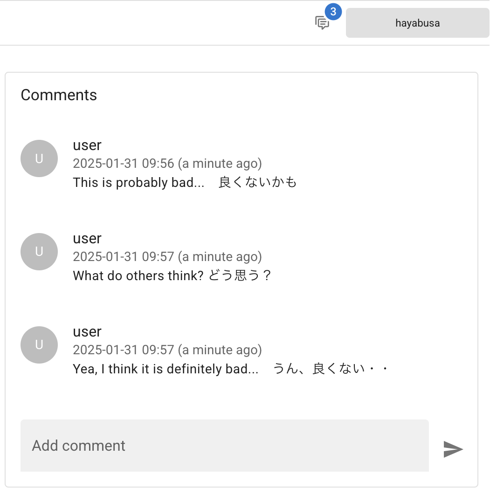

> หากคุณวางเมาส์เหนือความคิดเห็น คุณสามารถแก้ไขและลบข้อความได้อย่างง่ายดาย

### การปรับเปลี่ยนคอลัมน์

โดยค่าเริ่มต้น จะแสดงเฉพาะ timestamp และชื่อกฎการแจ้งเตือนเท่านั้น ดังนั้นให้คลิกไอคอน `Modify columns` เพื่อปรับแต่งฟิลด์:

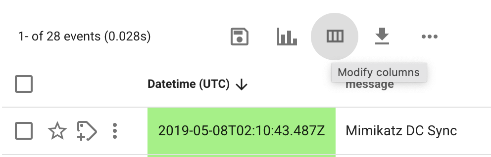

นี่จะเปิดกล่องโต้ตอบต่อไปนี้:

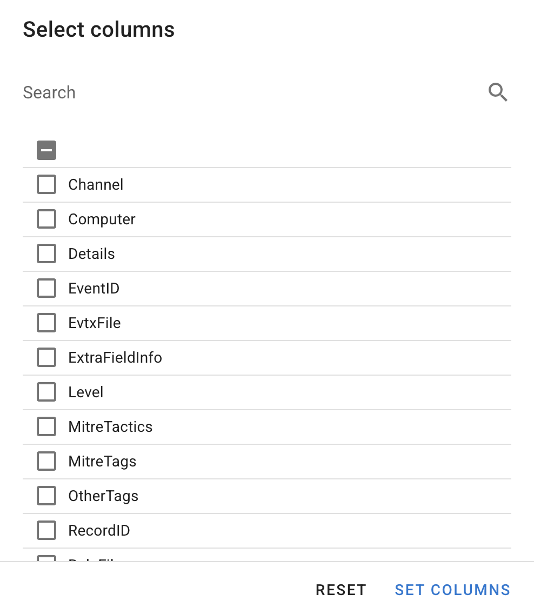

เราขอแนะนำให้เพิ่มคอลัมน์ต่อไปนี้อย่างน้อย **ตามลำดับ**:

1. `Level`
2. `Computer`
3. `Channel`
4. `EventID`
5. `RecordID`

ลำดับของคอลัมน์จะเปลี่ยนไปขึ้นอยู่กับลำดับที่คุณเพิ่ม ดังนั้นให้เพิ่มฟิลด์ที่สำคัญกว่าก่อน

หากคุณยังมีพื้นที่บนหน้าจอเหลืออยู่ เราขอแนะนำให้เพิ่ม `Details` ด้วย ดังที่แสดงที่นี่:

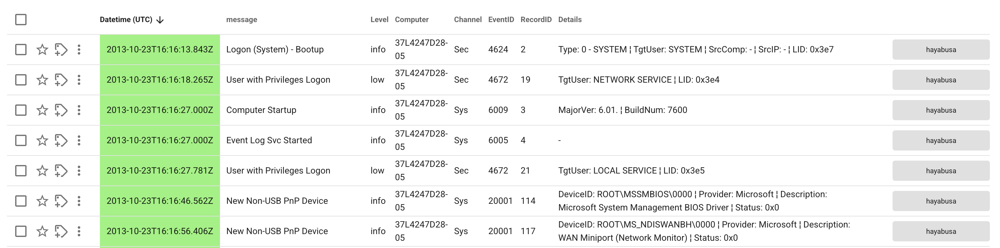

หากคุณยังมีพื้นที่บนหน้าจอเหลืออยู่ เราขอแนะนำให้เพิ่ม `ExtraFieldInfo` ด้วย อย่างไรก็ตาม ดังที่คุณเห็นที่นี่ หากคุณเพิ่มคอลัมน์มากเกินไป ฟิลด์ `message` จะแคบเกินไปและคุณจะไม่สามารถอ่านชื่อการแจ้งเตือนได้อีกต่อไป:

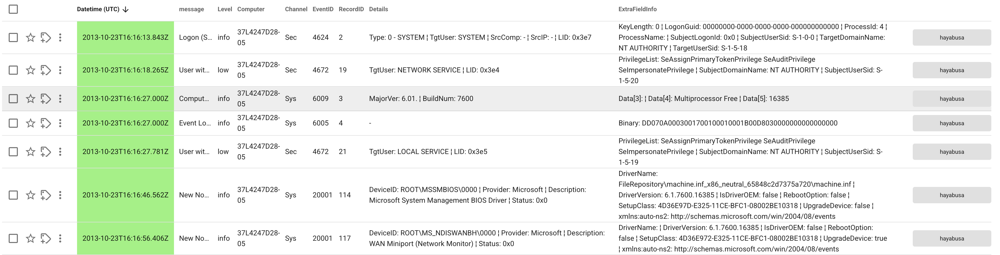

### ไอคอนด้านบน

#### ไอคอนจุดไข่ปลา

หากคุณคลิกที่ไอคอน `···` คุณสามารถทำให้แถวกระชับขึ้นและลบ `Timeline name` ออกเพื่อสร้างพื้นที่สำหรับผลลัพธ์มากขึ้น:

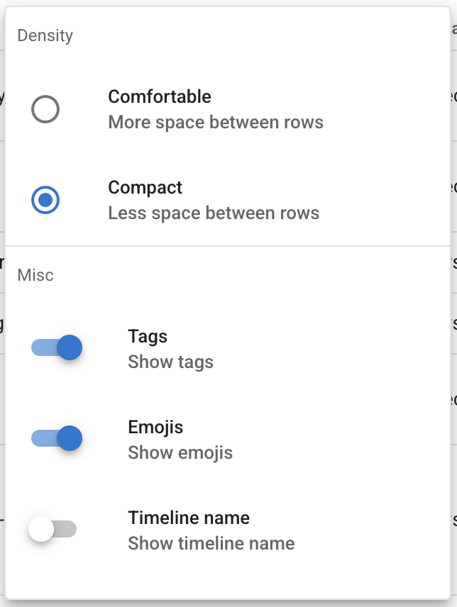

#### ฮิสโตแกรมเหตุการณ์

คุณสามารถเปิดฮิสโตแกรมเหตุการณ์เพื่อแสดงภาพไทม์ไลน์ได้:

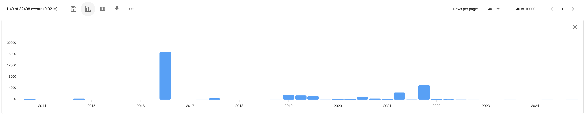

หากคุณคลิกที่แท่งใดแท่งหนึ่ง มันจะสร้างตัวกรองเวลาเพื่อแสดงเฉพาะผลลัพธ์ในช่วงเวลานั้น

#### บันทึกการค้นหาปัจจุบัน

หากคุณคลิกไอคอน `Save current search` ที่อยู่เหนือ timestamp และทางซ้ายของไอคอน `Toggle Event Histogram` คุณสามารถบันทึกคำค้นหาปัจจุบันของคุณ รวมถึงการตั้งค่าคอลัมน์ไปยัง `Saved Searches`
ต่อมา จากแถบด้านข้างซ้ายมือ คุณสามารถเข้าถึงการค้นหาที่คุณชื่นชอบได้อย่างง่ายดาย

### แถบค้นหา

นี่คือคำค้นหาที่มีประโยชน์บางส่วนสำหรับการเริ่มต้น โดยแสดงเฉพาะการแจ้งเตือนที่มีระดับความรุนแรงบางอย่าง:

1. `Level:crit` เพื่อแสดงเฉพาะการแจ้งเตือนระดับ critical
2. `Level:crit OR Level:high` เพื่อแสดงการแจ้งเตือนระดับ high และ critical
3. `NOT Level:info` เพื่อซ่อนการแจ้งเตือนระดับ informational

คุณสามารถกรองได้อย่างง่ายดายโดยพิมพ์ชื่อฟิลด์บวก `:` บวกค่า
คุณสามารถรวมตัวกรองด้วย `AND`, `OR`, และ `NOT`
รองรับไวลด์การ์ดและนิพจน์ปกติ (regular expressions)

ดูคู่มือผู้ใช้ [ที่นี่](https://timesketch.org/guides/user/search-query-guide/) สำหรับคำค้นหาขั้นสูงเพิ่มเติม

#### ประวัติการค้นหา

หากคุณคลิกไอคอนนาฬิกาทางซ้ายของแถบค้นหา คุณสามารถแสดงคำค้นหาที่ป้อนไว้ก่อนหน้านี้ได้
คุณยังสามารถคลิกไอคอนลูกศรซ้ายและขวาเพื่อรันคำค้นหาก่อนหน้าและถัดไปได้

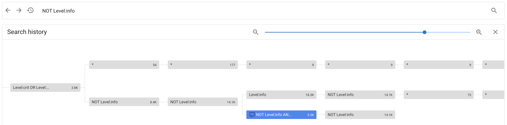

### จุดไข่ปลาแนวตั้ง

หากคุณคลิกที่จุดไข่ปลาแนวตั้งทางซ้ายของ timestamp แล้วคลิก `Context search` คุณจะเห็นการแจ้งเตือนที่เกิดขึ้นก่อนและหลังเหตุการณ์หนึ่งๆ:

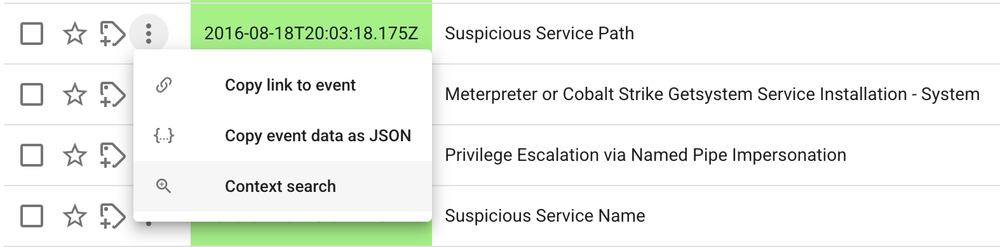

นี่จะแสดงสิ่งนี้ขึ้นมา:

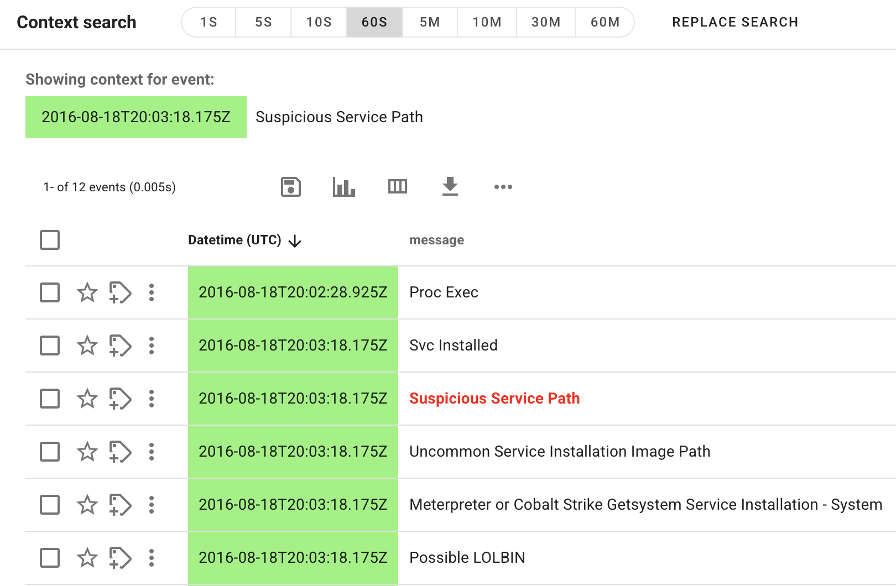

ในตัวอย่างด้านบน เหตุการณ์ก่อนและหลัง 60 วินาที (`60S`) กำลังถูกแสดง แต่คุณสามารถปรับได้จาก +- 1 วินาที (`1S`) ถึง +- 60 นาที (`60M`)

หากคุณต้องการเจาะลึกลงไปในเหตุการณ์ที่แสดงต่อไป ให้คลิก `Replace Search` เพื่อแสดงเหตุการณ์ในไทม์ไลน์มาตรฐาน

### ดาวและแท็ก

คุณสามารถคลิกไอคอนดาวทางซ้ายของ timestamp เพื่อติดดาวและบันทึกว่าเป็นเหตุการณ์สำคัญ

คุณยังสามารถเพิ่มแท็กให้กับเหตุการณ์ได้
สิ่งนี้มีประโยชน์ในการบ่งบอกให้ผู้อื่นทราบว่าคุณได้ยืนยันแล้วว่าเหตุการณ์นั้นน่าสงสัย เป็นอันตราย เป็น false positive ฯลฯ...
หากคุณทำงานเป็นทีม คุณสามารถสร้างแท็กเช่น `under investigation by xxx` เพื่อบ่งบอกว่ามีใครบางคนกำลังสืบสวนการแจ้งเตือนนั้นอยู่

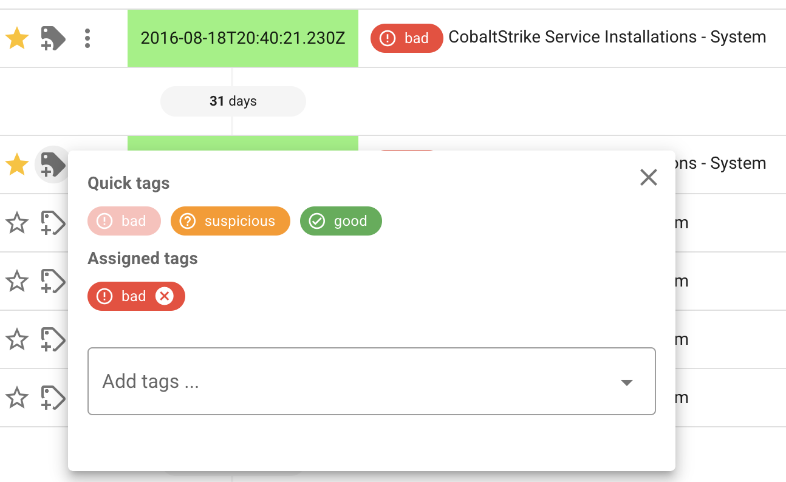
