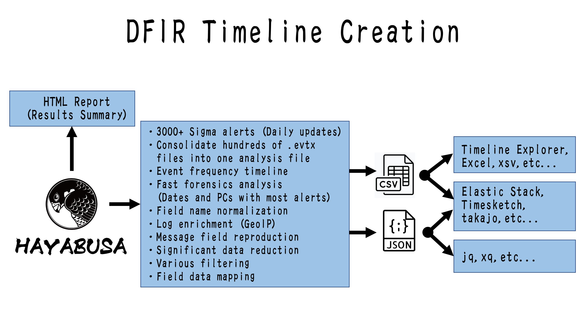

---
hide:
  - navigation
  - toc
---

{ .hb-logo }

<strong>Hayabusa</strong> es un <strong>generador rápido de líneas de tiempo forenses</strong> de registros de eventos de Windows
y una <strong>herramienta de caza de amenazas</strong> creada por
<a href="https://yamatosecurity.connpass.com/">Yamato Security</a>.
Escrita en Rust con seguridad de memoria, multihilo para mayor velocidad, y la única herramienta de código abierto
con soporte completo de la especificación Sigma, incluidas las reglas de correlación v2.

[Comenzar :material-rocket-launch:](getting-started/index.md){ .md-button .md-button--primary }
[Referencia de comandos :material-console:](commands/index.md){ .md-button }
[Ver en GitHub :fontawesome-brands-github:](https://github.com/Yamato-Security/hayabusa){ .md-button }

---

## ¿Por qué Hayabusa?

-   :material-flash:{ .lg .middle } __Increíblemente rápida__

    ---

    Escrita en **Rust** con seguridad de memoria y multihilo completo para analizar montañas
    de archivos `.evtx` y producir una sola línea de tiempo lo más rápido posible.

-   :material-shield-search:{ .lg .middle } __Soporte completo de Sigma__

    ---

    La única herramienta de código abierto con soporte completo de la especificación Sigma, incluidas
    las **reglas de correlación v2**, respaldada por más de 4000 reglas de detección curadas.

-   :material-timeline-clock:{ .lg .middle } __Líneas de tiempo DFIR__

    ---

    Consolida eventos de un solo host o de miles en una única línea de tiempo forense
    **CSV / JSON / JSONL** lista para el análisis.

-   :material-server-network:{ .lg .middle } __Caza en toda la empresa__

    ---

    Ejecútala en vivo en un solo sistema, recopila registros para análisis sin conexión, o caza en toda
    la empresa con el artefacto Hayabusa de **Velociraptor**.

-   :material-chart-box:{ .lg .middle } __Salida de análisis enriquecida__

    ---

    Métricas, resúmenes de inicio de sesión, pivoteo por palabras clave, informes HTML y una línea de tiempo
    de frecuencia de detecciones para revelar rápidamente lo que importa.

-   :material-import:{ .lg .middle } __Se integra con otras herramientas__

    ---

    Importa los resultados directamente a **Elastic Stack**, **Timesketch**, **Timeline
    Explorer**, o segmenta el JSON con **jq**.

## Velo en acción

Explora la galería de [Capturas de pantalla](overview/screenshots.md) para ver la salida de terminal, el
resumen de resultados HTML, y el análisis en LibreOffice, Timeline Explorer y Timesketch.

## Enlaces rápidos

-   __:material-book-open-variant: ¿Nuevo por aquí?__

    Comienza con la [Visión general](overview/index.md), luego dirígete a
    [Primeros pasos](getting-started/index.md) para descargar y ejecutar Hayabusa.

-   __:material-console-line: ¿Trabajando con la CLI?__

    Salta a la [Lista de comandos](commands/index.md) y a la referencia por comando de
    [Análisis](commands/analysis.md), [Configuración](commands/config.md) y comandos de
    [Línea de tiempo DFIR](commands/dfir-timeline.md).

-   __:material-tune: ¿Ajustando la salida?__

    Consulta las opciones de [Perfiles de salida](output/index.md), [Abreviaturas](output/abbreviations.md)
    y [Visualización y resumen](output/display.md).

-   __:material-puzzle: ¿Quieres profundizar?__

    Explora las [Reglas](rules/index.md), el [ecosistema del proyecto](resources/index.md)
    y cómo [contribuir](resources/contributing.md).

