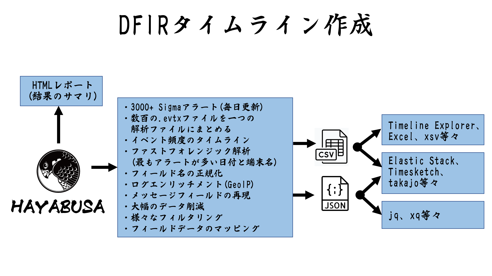

---
hide:
  - navigation
  - toc
---

<strong>Hayabusa</strong>（隼）は、日本の<a href="https://yamatosecurity.connpass.com/">Yamato Security</a>
グループによって開発された、<strong>Windows イベントログの高速フォレンジックタイムライン生成ツール</strong>
兼<strong>スレットハンティングツール</strong>です。メモリセーフな Rust で記述され、可能な限り高速に動作するよう
マルチスレッドに対応しており、v2 相関ルールを含む Sigma 仕様を完全にサポートする唯一のオープンソースツールです。

[はじめる :material-rocket-launch:](getting-started/index.md){ .md-button .md-button--primary }
[コマンド一覧 :material-console:](commands/index.md){ .md-button }
[GitHub で見る :fontawesome-brands-github:](https://github.com/Yamato-Security/hayabusa){ .md-button }

---

## なぜ Hayabusa なのか？

-   :material-flash:{ .lg .middle } __圧倒的な速さ__

    ---

    メモリセーフな **Rust** で記述され、フルマルチスレッドに対応。大量の `.evtx`
    ファイルを解析し、単一のタイムラインを可能な限り高速に生成します。

-   :material-shield-search:{ .lg .middle } __Sigma を完全サポート__

    ---

    **v2 相関ルール**を含む Sigma 仕様を完全にサポートする唯一のオープンソースツール。
    4,000 件以上のキュレーションされた検知ルールが利用できます。

-   :material-timeline-clock:{ .lg .middle } __DFIR タイムライン__

    ---

    1 台から数千台までのイベントを、解析しやすい単一の **CSV / JSON / JSONL**
    フォレンジックタイムラインに集約します。

-   :material-server-network:{ .lg .middle } __組織全体のハンティング__

    ---

    単一システムでのライブ解析、ログ収集によるオフライン解析、**Velociraptor**
    の Hayabusa アーティファクトを用いた組織全体のハンティングに対応。

-   :material-chart-box:{ .lg .middle } __豊富な解析出力__

    ---

    メトリクス、ログオンサマリ、キーワードのピボット、HTML レポート、検知頻度
    タイムラインで、重要な事象を素早く可視化します。

-   :material-import:{ .lg .middle } __他ツールとの連携__

    ---

    結果を **Elastic Stack**・**Timesketch**・**Timeline Explorer** に直接インポート
    したり、**jq** で JSON を加工したりできます。

## 実際の動作

ターミナル出力、HTML 結果サマリ、LibreOffice・Timeline Explorer・Timesketch での解析例は
[スクリーンショット](overview/screenshots.md)のページをご覧ください。

## クイックリンク

-   __:material-book-open-variant: はじめての方へ__

    まずは[概要](overview/index.md)を読み、[はじめる](getting-started/index.md)で
    Hayabusa のダウンロードと実行を行いましょう。

-   __:material-console-line: CLI を使う__

    [コマンド一覧](commands/index.md)や、[分析](commands/analysis.md)・
    [Config](commands/config.md)・[DFIR タイムライン](commands/dfir-timeline.md)
    の各コマンドリファレンスへ。

-   __:material-tune: 出力の調整__

    [出力プロファイル](output/index.md)、[省略形](output/abbreviations.md)、
    [表示とサマリ](output/display.md)のオプションを確認できます。

-   __:material-puzzle: さらに活用する__

    [ルール](rules/index.md)、[プロジェクトエコシステム](resources/index.md)、
    [貢献方法](resources/contributing.md)を見てみましょう。

