# スクリーンショット

## 起動

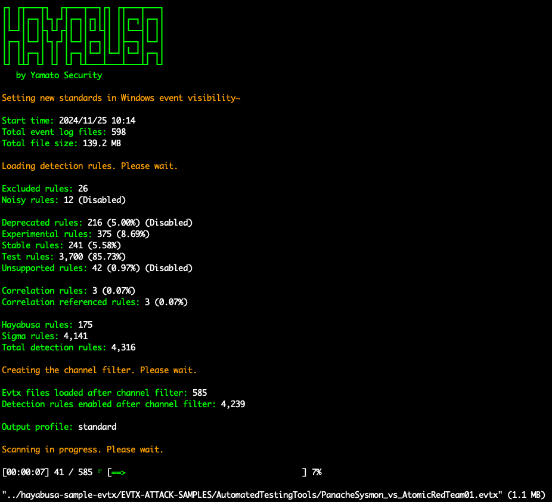

## DFIRタイムラインのターミナル出力

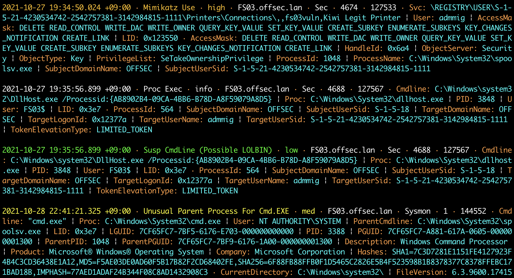

## キーワード検索結果

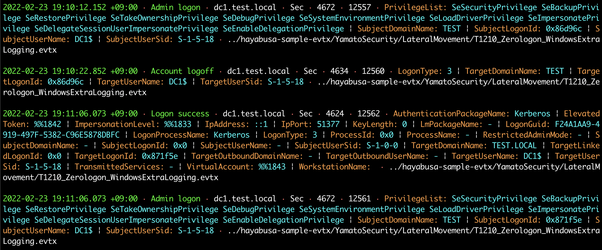

## 検知頻度タイムライン出力 (`-T`オプション)

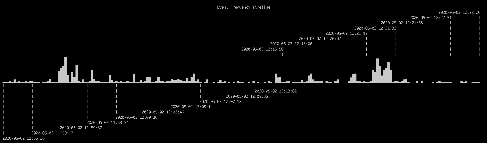

## 結果サマリ (Results Summary)

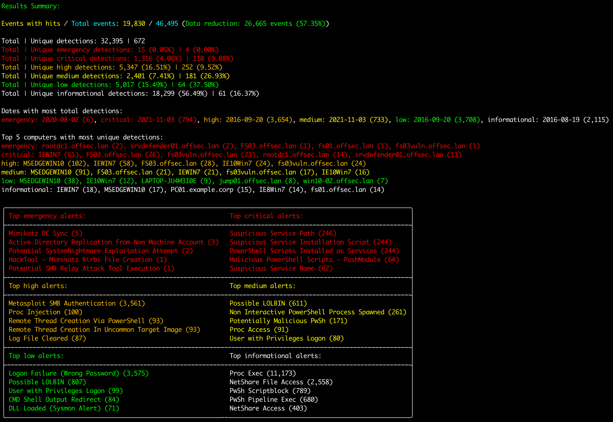

## HTMLの結果サマリ (`-H`オプション)

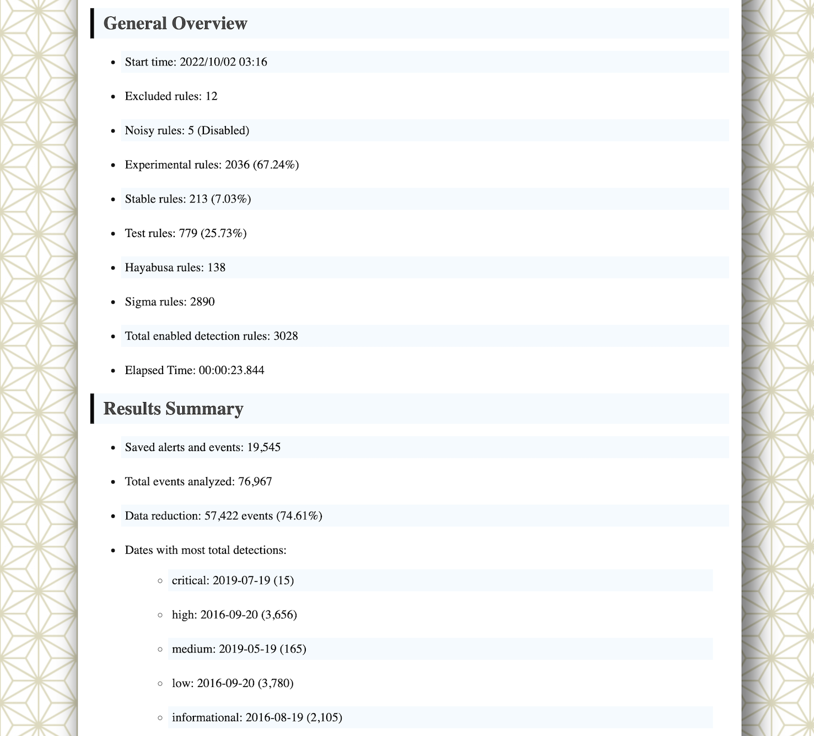

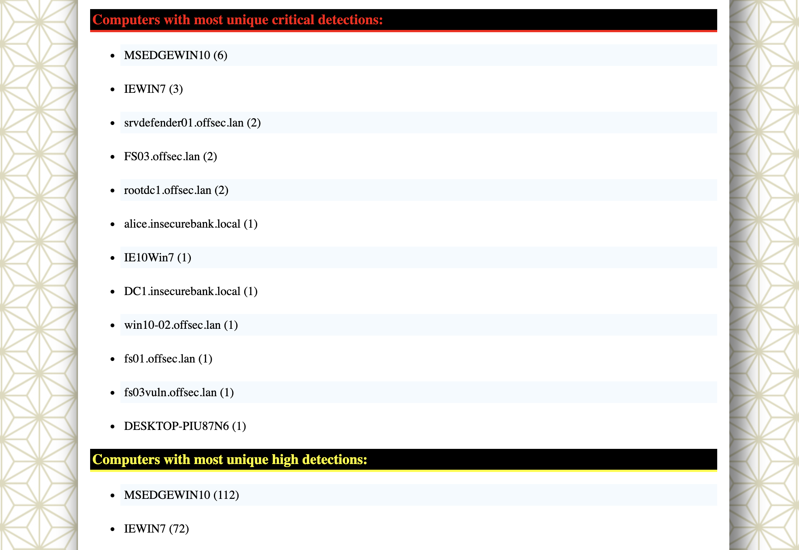

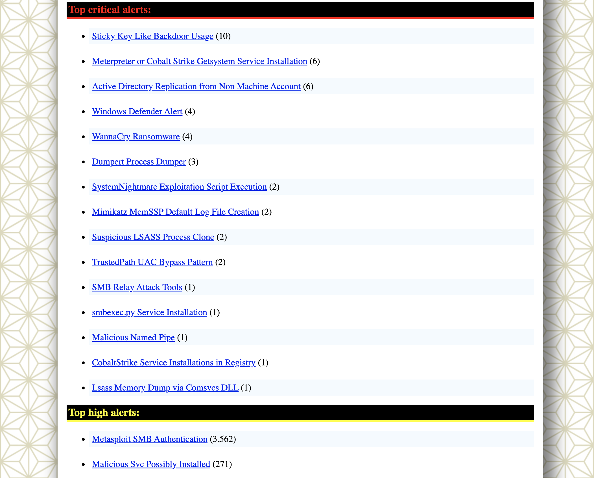

## LibreOfficeでのDFIRタイムライン解析 (`-M` マルチライン出力)

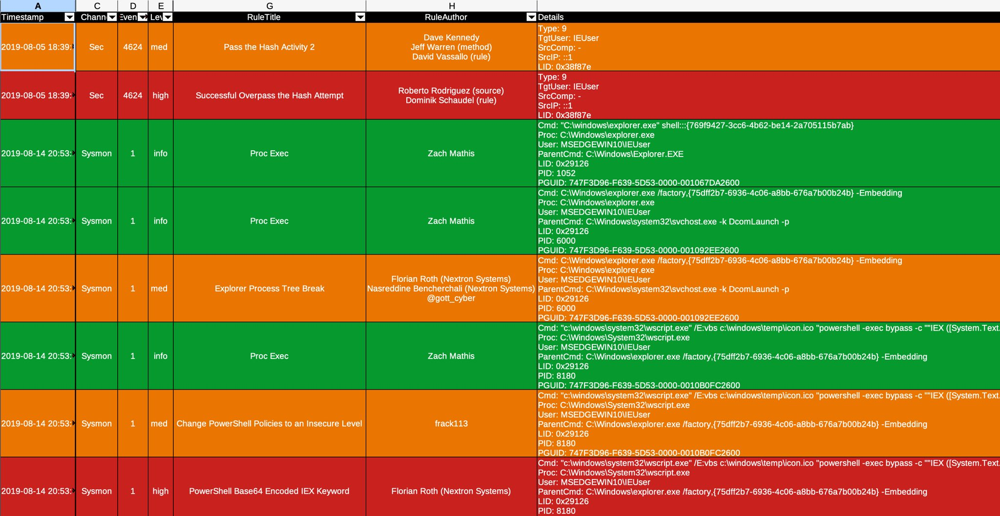

## Timeline ExplorerでのDFIRタイムライン解析

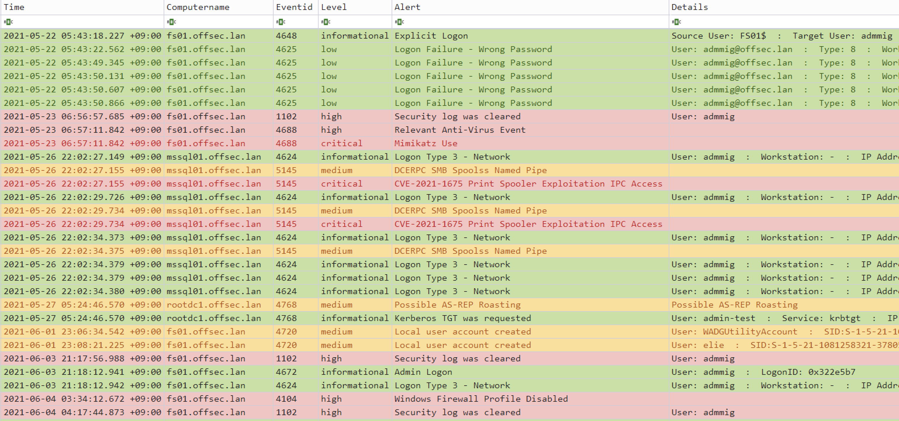

## Criticalアラートのフィルタリングとコンピュータごとのグルーピング

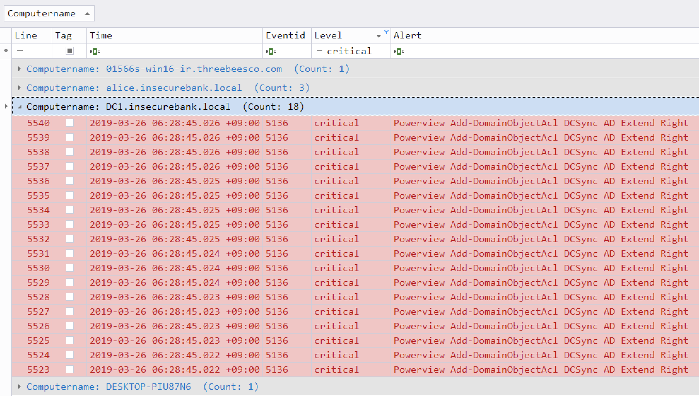

## Timesketchでの解析

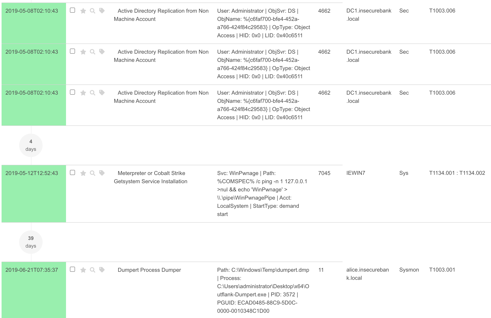
