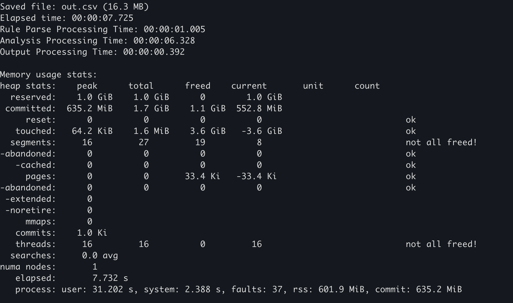
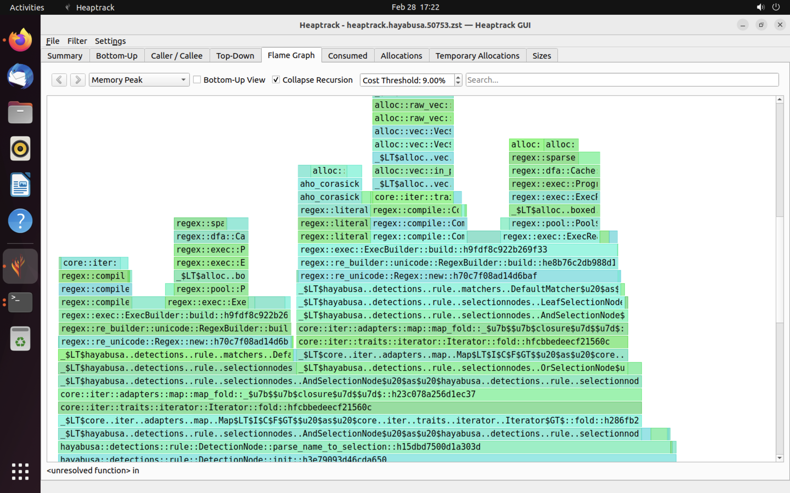
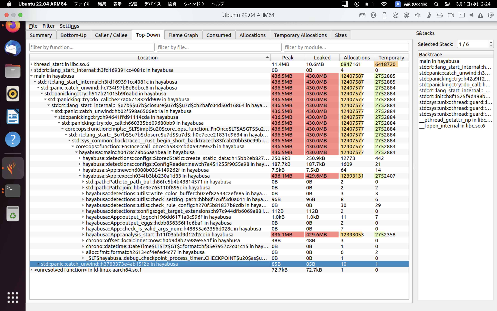

# Guía de rendimiento de Rust para desarrolladores de Hayabusa

# Autor
Fukusuke Takahashi

# Traducción al inglés
Zach Mathis ([@yamatosecurity](https://twitter.com/yamatosecurity))

# Acerca de este documento
[Hayabusa](https://github.com/Yamato-Security/hayabusa) (en inglés: "peregrine falcon", halcón peregrino) es una herramienta rápida de análisis forense desarrollada por el grupo [Yamato Security](https://yamatosecurity.connpass.com/) en Japón. Está desarrollada en [Rust](https://www.rust-lang.org/) para poder cazar (amenazas) tan rápido como un halcón peregrino. Rust es un lenguaje rápido en sí mismo, sin embargo, hay muchas trampas que pueden resultar en velocidades lentas y un alto uso de memoria. Creamos este documento basándonos en mejoras reales de rendimiento en Hayabusa (consulta el [registro de cambios aquí](https://github.com/Yamato-Security/hayabusa/blob/main/CHANGELOG.md)), pero estas técnicas también deberían ser aplicables a otros programas de Rust. Esperamos que puedas beneficiarte del conocimiento que hemos adquirido a través de nuestra prueba y error.

# Mejora de la velocidad
## Cambia el asignador de memoria
Simplemente cambiar el asignador de memoria predeterminado puede mejorar la velocidad significativamente.
Por ejemplo, según estos [benchmarks](https://github.com/rust-lang/rust-analyzer/issues/1441), los siguientes dos asignadores de memoria

- [mimalloc](https://microsoft.github.io/mimalloc/)
- [jemalloc](https://jemalloc.net/)

son mucho más rápidos que el asignador de memoria predeterminado. Pudimos confirmar una mejora significativa de la velocidad al cambiar nuestro asignador de memoria de jemalloc a mimalloc, por lo que hicimos de mimalloc el predeterminado desde la versión 1.8.0. (Aunque mimalloc usa un poco más de memoria que jemalloc.)

### Antes  <!-- omit in toc -->
```
# Not applicable. (You do not need to declare anything to use the default memory allocator.)
```
### Después  <!-- omit in toc -->
Solo necesitas realizar los siguientes 2 pasos para cambiar el [asignador de memoria](https://doc.rust-lang.org/stable/std/alloc/trait.GlobalAlloc.html) global:

1. Agrega el [crate mimalloc](https://crates.io/crates/mimalloc) a la [sección [dependencies]](https://doc.rust-lang.org/cargo/guide/dependencies.html#adding-a-dependency) del archivo `Cargo.toml`:
    ```Toml
    [dependencies]
    mimalloc = { version = "*", default-features = false }
    ```
2. Define que quieres usar mimalloc bajo [#[global_allocator]](https://doc.rust-lang.org/std/alloc/index.html#the-global_allocator-attribute) en algún lugar del programa:
    ```Rust
    use mimalloc::MiMalloc;
    
    #[global_allocator]
    static GLOBAL: MiMalloc = MiMalloc;
    ```
Eso es todo lo que necesitas hacer para cambiar el asignador de memoria.

### Eficacia（Ejemplo real de un Pull Request）  <!-- omit in toc -->
Cuánto mejora la velocidad dependerá del programa, pero en el siguiente ejemplo

- [chg: build.rs(for vc runtime) to rustflags in config.toml and replace default global memory allocator with mimalloc. #777](https://github.com/Yamato-Security/hayabusa/pull/777)

cambiar el asignador de memoria a [mimalloc](https://github.com/microsoft/mimalloc) resultó en un aumento de rendimiento del 20-30% en CPU Intel. 
(Por alguna razón, no hubo un aumento de rendimiento tan significativo en dispositivos macOS basados en ARM.)

## Reduce el procesamiento de IO en bucles
El procesamiento de IO de disco es mucho más lento que el procesamiento en memoria. Por lo tanto, es deseable evitar el procesamiento de IO tanto como sea posible, especialmente en bucles.

### Antes  <!-- omit in toc -->
El ejemplo a continuación muestra la apertura de un archivo que ocurre un millón de veces en un bucle:
```Rust
use std::fs;

fn main() {
    for _ in 0..1000000 {
        let f = fs::read_to_string("sample.txt").unwrap();
        f.len();
    }
}
```
### Después  <!-- omit in toc -->
Al abrir el archivo fuera del bucle de la siguiente manera
```Rust
use std::fs;

fn main() {
    let f = fs::read_to_string("sample.txt").unwrap();
    for _ in 0..1000000 {
        f.len();
    }
}
```
habrá un aumento de velocidad de aproximadamente 1000 veces.

### Eficacia（Ejemplo real de un Pull Request）   <!-- omit in toc -->
En el siguiente ejemplo, el procesamiento de IO al manejar un resultado de detección a la vez pudo realizarse fuera del bucle:

- [Improve speed by removing IO process before insert_message() #858](https://github.com/Yamato-Security/hayabusa/pull/858)

Esto resultó en una mejora de velocidad de aproximadamente el 20%.

## Evita la compilación de expresiones regulares en bucles
La compilación de expresiones regulares es un proceso muy costoso en comparación con la coincidencia de expresiones regulares. Por lo tanto, es aconsejable evitar la compilación de expresiones regulares tanto como sea posible, especialmente en bucles.

### Antes  <!-- omit in toc -->
Por ejemplo, el siguiente proceso crea 100.000 intentos de coincidir con una expresión regular en un bucle:
```Rust
extern crate regex;
use regex::Regex;

fn main() {
    let text = "1234567890";
    let match_str = "abc";
    for _ in 0..100000 {
        if Regex::new(match_str).unwrap().is_match(text){ // Regular expression compilation in a loop
            println!("matched!");
        }
    }
}
```
### Después  <!-- omit in toc -->
Al realizar una compilación de expresión regular fuera del bucle, como se muestra a continuación
```Rust
extern crate regex;
use regex::Regex;

fn main() {
    let text = "1234567890";
    let match_str = "abc";
    let r = Regex::new(match_str).unwrap(); // Compile the regular expression outside the loop
    for _ in 0..100000 {
        if r.is_match(text) {
            println!("matched!");
        }
    }
}
```
el código actualizado es aproximadamente 100 veces más rápido.

### Eficacia（Ejemplo real de un Pull Request）   <!-- omit in toc -->
En el siguiente ejemplo, la compilación de expresiones regulares se realiza fuera del bucle y se almacena en caché.

- [cache regex for allowlist and regexes keyword. #174](https://github.com/Yamato-Security/hayabusa/pull/174)

Esto resultó en mejoras significativas de velocidad.

## Usa IO con búfer
Sin IO con búfer, el IO de archivos es lento. Con IO con búfer, las operaciones de IO se realizan a través de búferes en memoria, reduciendo el número de llamadas al sistema y mejorando la velocidad.

### Antes  <!-- omit in toc -->
Por ejemplo, en el siguiente proceso, [write](https://doc.rust-lang.org/std/io/trait.Write.html#tymethod.write) ocurre 1.000.000 de veces.
```Rust
use std::fs::File;
use std::io::{BufWriter, Write};

fn main() {
    let mut f = File::create("sample.txt").unwrap();
    for _ in 0..1000000 {
        f.write(b"hello world!");
    }
}
```
### Después  <!-- omit in toc -->
Al usar [BufWriter](https://doc.rust-lang.org/std/io/struct.BufWriter.html) de la siguiente manera
```Rust
use std::fs::File;
use std::io::{BufWriter, Write};

fn main() {
    let mut f = File::create("sample.txt").unwrap();
    let mut writer = BufWriter::new(f);
    for _ in 0..1000000 {
        writer.write(b"some text");
    }
    writer.flush().unwrap();
}
```
hay una mejora de velocidad de aproximadamente 50 veces.

### Eficacia（Ejemplo real de un Pull Request）   <!-- omit in toc -->
El método descrito anteriormente se implementó aquí

- [Feature/improve output#253 #285](https://github.com/Yamato-Security/hayabusa/pull/285)

y ha resultado en mejoras significativas de velocidad en el procesamiento de salida.

## Usa métodos estándar de String en lugar de expresiones regulares
Si bien las expresiones regulares pueden cubrir patrones de coincidencia complejos, son más lentas que los [métodos estándar de String](https://doc.rust-lang.org/std/string/struct.String.html). Por lo tanto, es más rápido usar métodos estándar de String para coincidencias simples de cadenas como las siguientes.

- Coincidencia de inicio（Regex: `foo.*`）-> [String::starts_with()](https://doc.rust-lang.org/std/string/struct.String.html#method.starts_with)
- Coincidencia de final（Regex: `.*foo`）-> [String::ends_with()](https://doc.rust-lang.org/std/string/struct.String.html#method.ends_with)
- Coincidencia de contenido（Regex: `.*foo.*`）-> [String::contains()](https://doc.rust-lang.org/std/string/struct.String.html#method.contains)

### Antes  <!-- omit in toc -->
Por ejemplo, el siguiente código realiza una coincidencia de final con una expresión regular un millón de veces.
```Rust
extern crate regex;
use regex::Regex;

fn main() {
    let text = "1234567890";
    let match_str = ".*abc";
    let r = Regex::new(match_str).unwrap();
    for _ in 0..1000000 {
        if r.is_match(text) {
            println!("matched!");
        }
    }
}
```
### Después  <!-- omit in toc -->
Al usar [String::ends_with()](https://doc.rust-lang.org/std/string/struct.String.html#method.ends_with) de la siguiente manera
```Rust
fn main() {
    let text = "1234567890";
    let match_str = "abc";
    for _ in 0..1000000 {
        if text.ends_with(match_str) {
            println!("matched!");
        }
    }
}
```
el procesamiento será 10 veces más rápido.

### Eficacia（Ejemplo real de un Pull Request）   <!-- omit in toc -->
Dado que Hayabusa requiere comparación de cadenas sin distinción de mayúsculas y minúsculas, usamos [to_lowercase()](https://doc.rust-lang.org/std/string/struct.String.html#method.to_lowercase) y luego aplicamos el método anterior. Aun así, en los siguientes ejemplos

- [Imporving speed by changing wildcard search process from regular expression match to starts_with/ends_with match #890](https://github.com/Yamato-Security/hayabusa/pull/890)
- [Improving speed by using eq_ignore_ascii_case() before regular expression match #884](https://github.com/Yamato-Security/hayabusa/pull/884)

la velocidad ha mejorado aproximadamente un 15% en comparación con antes.

## Filtra por longitud de cadena
Dependiendo de las características de las cadenas que se manejan, agregar un filtro simple puede reducir el número de intentos de coincidencia de cadenas y acelerar el proceso. Si a menudo comparas cadenas de longitudes no fijas y no coincidentes, puedes acelerar el proceso usando la longitud de la cadena como filtro principal.

### Antes  <!-- omit in toc -->
Por ejemplo, el siguiente código intenta un millón de coincidencias de expresión regular.
```Rust
extern crate regex;
use regex::Regex;

fn main() {
    let text = "1234567890";
    let match_str = "abc";
    let r = Regex::new(match_str).unwrap();
    for _ in 0..1000000 {
        if r.is_match(text) {
            println!("matched!");
        }
    }
}
```
### Después  <!-- omit in toc -->
Al usar [String::len()](https://doc.rust-lang.org/std/string/struct.String.html#method.len) como filtro principal, como se muestra a continuación
```Rust
extern crate regex;
use regex::Regex;

fn main() {
    let text = "1234567890";
    let match_str = "abc";
    let r = Regex::new(match_str).unwrap();
    for _ in 0..1000000 {
        if text.len() == match_str.len() { // Primary filter by string length
            if r.is_match(text) {
                println!("matched!");
            }
        }
    }
}
```
la velocidad mejorará aproximadamente 20 veces.

### Eficacia（Ejemplo real de un Pull Request）   <!-- omit in toc -->
En el siguiente ejemplo, se utiliza el método anterior.

- [Improving speed by adding string length match before regular expression match #883](https://github.com/Yamato-Security/hayabusa/pull/883)

Esto mejoró la velocidad aproximadamente un 15%.

## No compiles con codegen-units=1
Muchos artículos sobre optimización de rendimiento con Rust aconsejan agregar `codegen-units = 1` bajo la sección `[profile.release]`.
Esto causará tiempos de compilación más lentos ya que el valor predeterminado es compilar en paralelo, pero en teoría debería resultar en código más optimizado y rápido.
Sin embargo, en nuestras pruebas, Hayabusa en realidad se ejecuta más lento con esta opción activada y la compilación tarda más, por lo que la mantenemos desactivada.
El tamaño del binario del ejecutable es aproximadamente 100kb más pequeño, por lo que esto puede ser ideal para sistemas embebidos donde el espacio en disco duro es limitado.

# Reducir el uso de memoria

## Evita el uso innecesario de clone(), to_string() y to_owned()
Usar [clone()](https://doc.rust-lang.org/std/clone/trait.Clone.html) o [to_string()](https://doc.rust-lang.org/std/string/trait.ToString.html) son maneras fáciles de resolver errores de compilación relacionados con la [propiedad (ownership)](https://doc.rust-lang.org/book/ch04-01-what-is-ownership.html). Sin embargo, generalmente resultan en un alto uso de memoria y deben evitarse. Siempre es mejor ver primero si puedes reemplazarlos con [referencias](https://doc.rust-lang.org/book/ch04-02-references-and-borrowing.html) de bajo costo.

### Antes  <!-- omit in toc -->
Por ejemplo, si quieres iterar el mismo `Vec` varias veces, puedes usar [clone()](https://doc.rust-lang.org/std/clone/trait.Clone.html) para eliminar errores de compilación.
```Rust
fn main() {
    let lst = vec![1, 2, 3];
    for x in lst.clone() { // In order to eliminate compile errors
        println!("{x}");
    }

    for x in lst {
        println!("{x}");
    }
}
```
### Después  <!-- omit in toc -->
Sin embargo, al usar [referencias](https://doc.rust-lang.org/book/ch04-02-references-and-borrowing.html) como se muestra a continuación, puedes eliminar la necesidad de usar [clone()](https://doc.rust-lang.org/std/clone/trait.Clone.html).
```Rust
fn main() {
    let lst = vec![1, 2, 3];
    for x in &lst { // Eliminate compile errors with a reference
        println!("{x}");
    }

    for x in lst {
        println!("{x}");
    }
}
```
Al eliminar el uso de clone(), el uso de memoria se reduce hasta en un 50%.

### Eficacia（Ejemplo real de un Pull Request）   <!-- omit in toc -->
En el siguiente ejemplo, al reemplazar el uso innecesario de [clone()](https://doc.rust-lang.org/std/clone/trait.Clone.html), [to_string()](https://doc.rust-lang.org/std/string/trait.ToString.html) y [to_owned()](https://doc.rust-lang.org/std/borrow/trait.ToOwned.html),

- [Reduce used memory and Skipped rule author, detect counts aggregation when --no-summary option is used #782](https://github.com/Yamato-Security/hayabusa/pull/782)

pudimos reducir significativamente el uso de memoria.

## Usa Iterator en lugar de Vec
[Vec](https://doc.rust-lang.org/std/vec/) mantiene todos los elementos en memoria, por lo que usa mucha memoria en proporción al número de elementos. Si procesar un elemento a la vez es suficiente, entonces usar un [Iterator](https://doc.rust-lang.org/std/iter/trait.Iterator.html) en su lugar usará mucha menos memoria.

### Antes  <!-- omit in toc -->
Por ejemplo, la siguiente función `return_lines()` lee un archivo de aproximadamente 1 GB y devuelve un [Vec](https://doc.rust-lang.org/std/vec/):
```Rust
use std::fs::File;
use std::io::{BufRead, BufReader};

fn return_lines() -> Vec<String> {
    let f = File::open("sample.txt").unwrap();
    let buf = BufReader::new(f);
    buf.lines()
        .map(|l| l.expect("Could not parse line"))
        .collect()
}

fn main() {
    let lines = return_lines();
    for line in lines {
        println!("{}", line)
    }
}
```
### Después  <!-- omit in toc -->
En su lugar, deberías devolver un [Iterator Trait](https://doc.rust-lang.org/std/iter/trait.Iterator.html) de la siguiente manera:
```Rust
use std::fs::File;
use std::io::{BufRead, BufReader};

fn return_lines() -> impl Iterator<Item=String> {
    let f = File::open("sample.txt").unwrap();
    let buf = BufReader::new(f);
    buf.lines()
        .map(|l| l.expect("Could not parse line"))
        // ここでcollect()せずに、Iteratorを戻り値として返す
}

fn main() {
    let lines = return_lines();
    for line in lines {
        println!("{}", line)
    }
}
```
O si el tipo es diferente según qué rama se tome, puedes devolver un `Box<dyn Iterator<Item = T>>` de la siguiente manera:
```Rust
use std::fs::File;
use std::io::{BufRead, BufReader};

fn return_lines(need_filter:bool) -> Box<dyn Iterator<Item = String>> {
    let f = File::open("sample.txt").unwrap();
    let buf = BufReader::new(f);
    if need_filter {
        let result= buf.lines()
            .filter_map(|l| l.ok())
            .map(|l| l.replace("A", "B"));
        return Box::new(result)
    }
    let result= buf.lines()
        .map(|l| l.expect("Could not parse line"));
    Box::new(result)
}

fn main() {
    let lines = return_lines(true);
    for line in lines {
        println!("{}", line)
    }
}
```
El uso de memoria cae significativamente de 1 GB a solo 3 MB.

### Eficacia（Ejemplo real de un Pull Request）   <!-- omit in toc -->
El siguiente ejemplo usa el método descrito anteriormente:

- [Reduce memory usage when reading JSONL file #921](https://github.com/Yamato-Security/hayabusa/pull/921)

Cuando se probó en un archivo JSON de 1.7GB, la memoria disminuyó en un 75%.

## Usa el crate compact_str al manejar cadenas cortas
Al tratar con una gran cantidad de cadenas cortas de menos de 24 bytes, el [crate compact_str](https://docs.rs/crate/compact_str/latest) puede usarse para reducir el uso de memoria.

### Antes  <!-- omit in toc -->
En el ejemplo a continuación, el Vec contiene 10 millones de cadenas.
```Rust
fn main() {
    let v: Vec<String> = vec![String::from("ABCDEFGHIJKLMNOPQRSTUV"); 10000000];
    // do some kind of processing
}
```
### Después  <!-- omit in toc -->
Es mejor reemplazarlas con un [CompactString](https://docs.rs/compact_str/latest/compact_str/):
```Rust
use compact_str::CompactString;

fn main() {
    let v: Vec<CompactString> = vec![CompactString::from("ABCDEFGHIJKLMNOPQRSTUV"); 10000000];
    // do some kind of processing
}
```
Al hacer esto, el uso de memoria se reduce alrededor de un 50%.

### Eficacia（Ejemplo real de un Pull Request）   <!-- omit in toc -->
En el siguiente ejemplo, las cadenas cortas se manejan con [CompactString](https://docs.rs/compact_str/latest/compact_str/):

- [To reduce ram usage and performance, Replaced String with other crate #793](https://github.com/Yamato-Security/hayabusa/pull/793)

Esto dio una reducción del uso de memoria de aproximadamente el 20%.

## Elimina campos innecesarios en estructuras de larga duración
Las estructuras que continúan reteniéndose en memoria durante el inicio del proceso pueden afectar el uso general de memoria. En Hayabusa, las siguientes estructuras (a partir de la versión 2.2.2), en particular, se retienen en grandes cantidades.

- [DetectInfo](https://github.com/Yamato-Security/hayabusa/blob/v2.2.2/src/detections/message.rs#L27-L36)
- [LeafSelectNode](https://github.com/Yamato-Security/hayabusa/blob/v2.2.2/src/detections/rule/selectionnodes.rs#L234-L239)

La eliminación de campos asociados con las estructuras anteriores tuvo cierto efecto en la reducción del uso general de memoria.

### Antes  <!-- omit in toc -->
Por ejemplo, el campo `DetectInfo` era, hasta la versión 1.8.1, el siguiente:
```Rust
#[derive(Debug, Clone)]
pub struct DetectInfo {
    pub rulepath: CompactString,
    pub ruletitle: CompactString,
    pub level: CompactString,
    pub computername: CompactString,
    pub eventid: CompactString,
    pub detail: CompactString,
    pub record_information: CompactString,
    pub ext_field: Vec<(CompactString, Profile)>,
    pub is_condition: bool,
}
```
### Después  <!-- omit in toc -->
Al eliminar el campo `record_information` de la siguiente manera
```Rust
#[derive(Debug, Clone)]
pub struct DetectInfo {
    pub rulepath: CompactString,
    pub ruletitle: CompactString,
    pub level: CompactString,
    pub computername: CompactString,
    pub eventid: CompactString,
    pub detail: CompactString,
    // remove record_information field
    pub ext_field: Vec<(CompactString, Profile)>,
    pub is_condition: bool,
}
```
se logró una reducción en el uso de memoria de varios bytes por registro de resultado de detección.

### Eficacia（Ejemplo real de un Pull Request）   <!-- omit in toc -->
En el siguiente ejemplo, cuando se probó contra datos donde el número de registros de resultados de detección era de aproximadamente 1.5 millones,

- [Reduced memory usage of DetectInfo/EvtxRecordInfo #837](https://github.com/Yamato-Security/hayabusa/pull/837)
- [Reduce memory usage by removing unnecessary regex #894](https://github.com/Yamato-Security/hayabusa/pull/894)

pudimos lograr una reducción de aproximadamente 300MB en el uso de memoria.

# Benchmarking
## Usa la función de estadísticas del asignador de memoria.
Algunos asignadores de memoria mantienen sus propias estadísticas de uso de memoria. Por ejemplo, en [mimalloc](https://github.com/microsoft/mimalloc), se puede llamar a la función [mi_stats_print_out()](https://microsoft.github.io/mimalloc/group__extended.html#ga537f13b299ddf801e49a5a94fde02c79) para obtener el uso de memoria.

### Cómo obtener estadísticas  <!-- omit in toc -->
Requisitos previos: Necesitas estar usando mimalloc como se explica en la sección [Cambia el asignador de memoria](#change-the-memory-allocator).

1.  En la [sección dependencies](https://doc.rust-lang.org/cargo/guide/dependencies.html#adding-a-dependency) de `Cargo.toml`, agrega el [crate libmimalloc-sys](https://crates.io/crates/libmimalloc-sys):
    ```Toml
    [dependencies]
    libmimalloc-sys = { version = "*",  features = ["extended"] }
    ```
2. Siempre que quieras imprimir las estadísticas de uso de memoria, escribe el siguiente código y dentro de un bloque `unsafe`, llama a [mi_stats_print_out()](https://microsoft.github.io/mimalloc/group__extended.html#ga537f13b299ddf801e49a5a94fde02c79). Las estadísticas de uso de memoria se enviarán a la salida estándar.
    ```Rust
    use libmimalloc_sys::mi_stats_print_out;
    use std::ptr::null_mut;
    
    fn main() {
      
      // Write the following code where you want to measure memory usage
      unsafe {
            mi_stats_print_out(None, null_mut());
      }
    }
    ```
3. El valor `peak/reserved` en la parte superior izquierda es el uso máximo de memoria. 

    

### Ejemplo   <!-- omit in toc -->
La implementación anterior se aplicó en lo siguiente:

- [add --debug option for printing mimalloc memory stats #822](https://github.com/Yamato-Security/hayabusa/pull/822)

En Hayabusa, si agregas la opción `--debug`, las estadísticas de uso de memoria se enviarán al final.

## Usa el contador de rendimiento de Windows
Se pueden verificar diversos usos de recursos a partir de estadísticas que se pueden obtener del lado del sistema operativo. En este caso, deben tenerse en cuenta los siguientes dos puntos.

- Influencia del software antivirus (Windows Defender)
  - Solo la primera ejecución se ve afectada por el escaneo y es más lenta, por lo que los resultados de la segunda ejecución y las siguientes después de la compilación son adecuados para la comparación. (O puedes desactivar tu antivirus para obtener resultados más precisos.)
- Influencia del almacenamiento en caché de archivos
  - Los resultados de la segunda vez y las siguientes después del inicio del sistema operativo son más rápidos que la primera vez porque las IO de evtx y otros archivos se leen desde la caché de archivos en memoria, por lo que los resultados de la primera vez después de que el sistema operativo arranca son más ideales para tomar benchmarks.

### Cómo obtener  <!-- omit in toc -->
Requisitos previos：El siguiente procedimiento solo es válido para entornos donde `PowerShell 7` ya está instalado en Windows.

1. Reinicia el sistema operativo
2. Ejecuta el [comando Get-Counter](https://learn.microsoft.com/en-us/powershell/module/microsoft.powershell.diagnostics/get-counter?view=powershell-7.3#example-3-get-continuous-samples-of-a-counter) de `PowerShell 7` que registrará continuamente el contador de rendimiento cada segundo en un archivo CSV. (Si deseas medir recursos distintos a los enumerados a continuación, [este artículo](https://jpwinsup.github.io/blog/2021/06/07/Performance/SystemResource/PerformanceLogging/) es una buena referencia.)
    ```PowerShell
    Get-Counter -Counter "\Memory\Available MBytes",  "\Processor(_Total)\% Processor Time" -Continuous | ForEach {
         $_.CounterSamples | ForEach {
             [pscustomobject]@{
                 TimeStamp = $_.TimeStamp
                 Path = $_.Path
                 Value = $_.CookedValue
             }
         }
     } | Export-Csv -Path PerfMonCounters.csv -NoTypeInformation
    ```
3. Ejecuta el proceso que quieres medir.

### Ejemplo  <!-- omit in toc -->
Lo siguiente contiene un procedimiento de ejemplo para medir el rendimiento con Hayabusa.

- [Example of obtaining Windows performance counters](https://github.com/Yamato-Security/hayabusa/issues/778#issuecomment-1296504766)

## Usa heaptrack
[heaptrack](https://github.com/KDE/heaptrack) es un sofisticado perfilador de memoria disponible para Linux y macOS. Al usar heaptrack, puedes investigar a fondo los cuellos de botella.

### Cómo obtener  <!-- omit in toc -->
Requisitos previos: A continuación se muestra el procedimiento para Ubuntu 22.04. No puedes usar heaptrack en Windows.

1. Instala heaptrack con los siguientes dos comandos.
      ```
      sudo apt install heaptrack
      sudo apt install heaptrack-gui
      ```
2. Elimina el siguiente código de mimalloc de Hayabusa. (No puedes usar el perfilador de memoria de heaptrack con mimalloc.
   - https://github.com/Yamato-Security/hayabusa/blob/v2.2.2/src/main.rs#L32-L33
   - https://github.com/Yamato-Security/hayabusa/blob/v2.2.2/src/main.rs#L59-L60
   - https://github.com/Yamato-Security/hayabusa/blob/v2.2.2/src/main.rs#L632-L634

3. Elimina la [sección [profile.release]](https://github.com/Yamato-Security/hayabusa/blob/v2.2.2/Cargo.toml#L65-L67) en el archivo `Cargo.toml` de Hayabusa y cámbiala a lo siguiente:
     ```
     [profile.release]
     debug = true
     ```

4. Compila una compilación de release: `cargo build --release`
5. Ejecuta `heaptrack hayabusa csv-timeline -d sample -o out.csv`

Ahora, cuando Hayabusa termine de ejecutarse, los resultados de heaptrack se abrirán automáticamente en una aplicación GUI.

### Ejemplos  <!-- omit in toc -->
A continuación se muestra un ejemplo de los resultados de heaptrack. Las pestañas `Flame Graph` y `Top-Down` te permiten verificar visualmente las funciones con un alto uso de memoria.





# Referencias

- [The Rust Performance Book](https://nnethercote.github.io/perf-book/title-page.html)
- [Memory Leak (and Growth) Flame Graphs](https://www.brendangregg.com/FlameGraphs/memoryflamegraphs.html)

# Contribuciones

Este documento se basa en hallazgos de casos reales de mejora en [Hayabusa](https://github.com/Yamato-Security/hayabusa). Si encuentras algún error o técnicas que puedan mejorar el rendimiento, envíanos un issue o un pull request.
