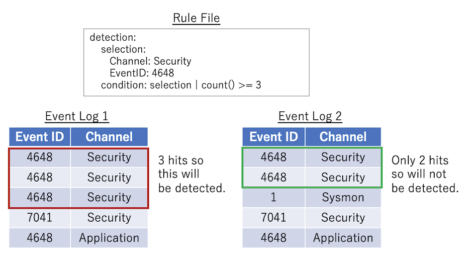
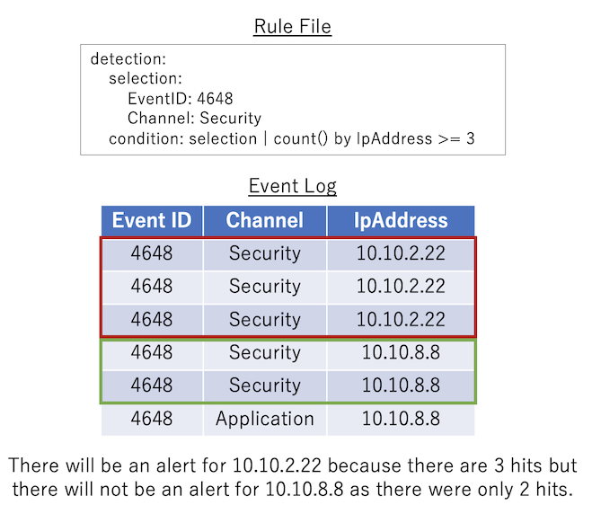
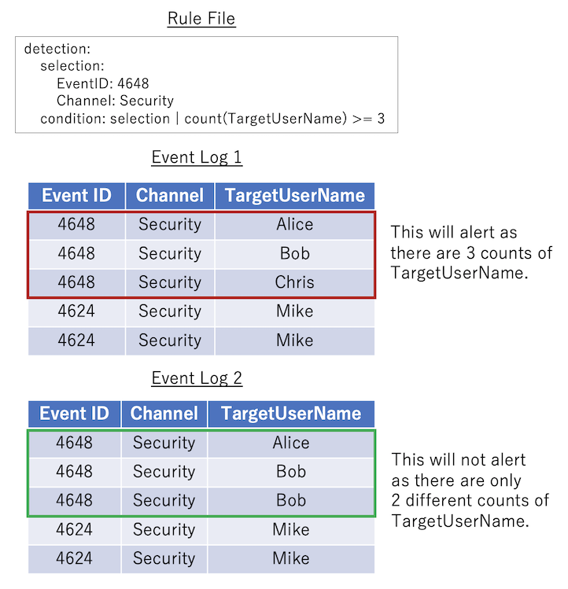
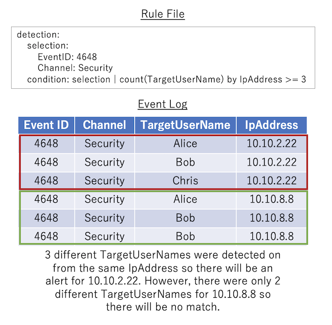

# Funcionalidades obsoletas

Las palabras clave especiales obsoletas y la agregación `count` todavía son compatibles en Hayabusa, pero no se utilizarán dentro de las reglas en el futuro.

## Palabras clave especiales obsoletas

Actualmente, se pueden especificar las siguientes palabras clave especiales:

- `value`: coincide por cadena de texto (también se pueden especificar comodines y barras verticales).
- `min_length`: coincide cuando el número de caracteres es mayor o igual al número especificado.
- `regexes`: coincide si una de las expresiones regulares del archivo que especifique en este campo coincide.
- `allowlist`: la regla se omitirá si se encuentra alguna coincidencia en la lista de expresiones regulares del archivo que especifique en este campo.

En el ejemplo siguiente, la regla coincidirá si se cumple lo siguiente:

- `ServiceName` se llama `malicious-service` o contiene una expresión regular en `./rules/config/regex/detectlist_suspicous_services.txt`.
- `ImagePath` tiene un mínimo de 1000 caracteres.
- `ImagePath` no tiene ninguna coincidencia en la `allowlist`.

```yaml
detection:
    selection:
        Channel: System
        EventID: 7045
        ServiceName:
            - value: malicious-service
            - regexes: ./rules/config/regex/detectlist_suspicous_services.txt
        ImagePath:
            min_length: 1000
            allowlist: ./rules/config/regex/allowlist_legitimate_services.txt
    condition: selection
```

### Archivos de ejemplo para las palabras clave regexes y allowlist

Hayabusa tenía dos archivos de expresiones regulares integrados que se usaban para el archivo `./rules/hayabusa/default/alerts/System/7045_CreateOrModiftySystemProcess-WindowsService_MaliciousServiceInstalled.yml`:

- `./rules/config/regex/detectlist_suspicous_services.txt`: para detectar nombres de servicios sospechosos
- `./rules/config/regex/allowlist_legitimate_services.txt`: para permitir servicios legítimos

Los archivos definidos en `regexes` y `allowlist` se pueden editar para cambiar el comportamiento de todas las reglas que los referencian sin tener que modificar ningún archivo de regla en sí.

También puede utilizar diferentes archivos de texto de detectlist y allowlist que cree usted mismo.

## Condiciones de agregación obsoletas (reglas `count`)

Esto todavía es compatible en Hayabusa, pero será reemplazado por las reglas de correlación de Sigma en el futuro.

### Conceptos básicos

La palabra clave `condition` descrita anteriormente no solo implementa la lógica `AND` y `OR`, sino que también es capaz de contar o "agregar" eventos.
Esta función se denomina "condición de agregación" y se especifica conectando una condición con una barra vertical.
En este ejemplo de detección de password spray a continuación, se utiliza una expresión condicional para determinar si hay 5 o más valores de `TargetUserName` desde una sola `IpAddress` de origen dentro de un período de 5 minutos.

```yaml
detection:
  selection:
    Channel: Security
    EventID: 4648
  condition: selection | count(TargetUserName) by IpAddress > 5
  timeframe: 5m
```

Las condiciones de agregación se pueden definir en el siguiente formato:

- `count() {operator} {number}`: Para los eventos de registro que coinciden con la primera condición antes de la barra vertical, la condición coincidirá si el número de registros coincidentes satisface la expresión de condición especificada por `{operator}` y `{number}`.

`{operator}` puede ser uno de los siguientes:

- `==`: Si el valor es igual al valor especificado, se trata como coincidente con la condición.
- `>=`: Si el valor es mayor o igual al valor especificado, se considera que se ha cumplido la condición.
- `>`: Si el valor es mayor que el valor especificado, se considera que se ha cumplido la condición.
- `<=`: Si el valor es menor o igual al valor especificado, se considera que se ha cumplido la condición.
- `<`: Si el valor es menor que el valor especificado, se tratará como si la condición se cumpliera.

`{number}` debe ser un número.

`timeframe` se puede definir de la siguiente manera:

- `15s`: 15 segundos
- `30m`: 30 minutos
- `12h`: 12 horas
- `7d`: 7 días
- `3M`: 3 meses

### Cuatro patrones para las condiciones de agregación

1. Sin argumento de count ni palabra clave `by`. Ejemplo: `selection | count() > 10`
   > Si `selection` coincide más de 10 veces dentro del período de tiempo, la condición coincidirá.
   > Estas se reemplazan por reglas de correlación de Event Count que no utilizan el campo `group-by`.
2. Sin argumento de count pero con una palabra clave `by`. Ejemplo: `selection | count() by IpAddress > 10`
   > `selection` tendrá que ser verdadero más de 10 veces para la **misma** `IpAddress`.
   > Estas reglas n.º 2 son más comunes que las reglas n.º 1.
   > También puede especificar varios campos para agrupar. Por ejemplo: `by IpAddress, Computer`
   > Estas se reemplazan por reglas de correlación de Event Count que sí utilizan el campo `group-by`.
3. Hay un argumento de count pero no una palabra clave `by`. Ejemplo: `selection | count(TargetUserName) > 10`
   > Si `selection` coincide y `TargetUserName` es **diferente** más de 10 veces dentro del período de tiempo, la condición coincidirá.
   > Estas se reemplazan por reglas de correlación de Value Count que no utilizan el campo `group-by`.
4. Hay tanto un argumento de count como una palabra clave `by`. Ejemplo: `selection | count(Users) by IpAddress > 10`
   > Para la **misma** `IpAddress`, tendrá que haber más de 10 `TargetUserName` **diferentes** para que la condición coincida.
   > Estas reglas n.º 4 son más comunes que las reglas n.º 3.
   > Estas se reemplazan por reglas de correlación de Value Count que utilizan el campo `group-by`.

### Ejemplo del patrón 1

Este es el patrón más básico: `count() {operator} {number}`. La regla siguiente coincidirá si `selection` ocurre 3 o más veces.



### Ejemplo del patrón 2

`count() by {eventkey} {operator} {number}`: Los eventos de registro que coinciden con la `condition` antes de la barra vertical se agrupan por el **mismo** `{eventkey}`. Si el número de eventos coincidentes para cada agrupación satisface la condición especificada por `{operator}` y `{number}`, entonces la condición coincidirá.



### Ejemplo del patrón 3

`count({eventkey}) {operator} {number}`: Cuenta cuántos valores **diferentes** de `{eventkey}` existen en el evento de registro que coincide con la condición antes de la barra vertical de la condición. Si el número satisface la expresión condicional especificada en `{operator}` y `{number}`, se considera que se ha cumplido la condición.



### Ejemplo del patrón 4

`count({eventkey_1}) by {eventkey_2} {operator} {number}`: Los registros que coinciden con la condición antes de la barra vertical de la condición se agrupan por el **mismo** `{eventkey_2}`, y se cuenta el número de valores **diferentes** de `{eventkey_1}` en cada grupo. Si los valores contados para cada agrupación satisfacen la expresión condicional especificada por `{operator}` y `{number}`, la condición coincidirá.



### Salida de las reglas count

La salida de detalles para las reglas count es fija e imprimirá la condición de count original en `[condition]` seguida de los eventkeys registrados en `[result]`.

En el ejemplo siguiente, una lista de nombres de usuario `TargetUserName` que estaban siendo objeto de ataques de fuerza bruta seguida de la `IpAddress` de origen:

```
[condition] count(TargetUserName) by IpAddress >= 5 in timeframe [result] count:41 TargetUserName:jorchilles/jlake/cspizor/lpesce/bgalbraith/jkulikowski/baker/eskoudis/dpendolino/sarmstrong/lschifano/drook/rbowes/ebooth/melliott/econrad/sanson/dmashburn/bking/mdouglas/cragoso/psmith/bhostetler/zmathis/thessman/kperryman/cmoody/cdavis/cfleener/gsalinas/wstrzelec/jwright/edygert/ssims/jleytevidal/celgee/Administrator/mtoussain/smisenar/tbennett/bgreenwood IpAddress:10.10.2.22 timeframe:5m
```

La marca de tiempo de la alerta será la hora del primer evento detectado.
