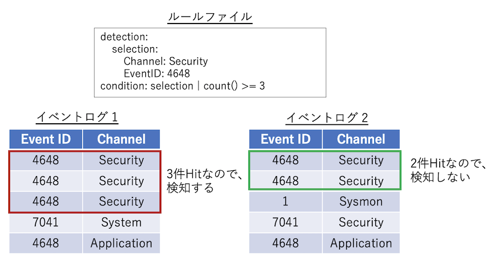
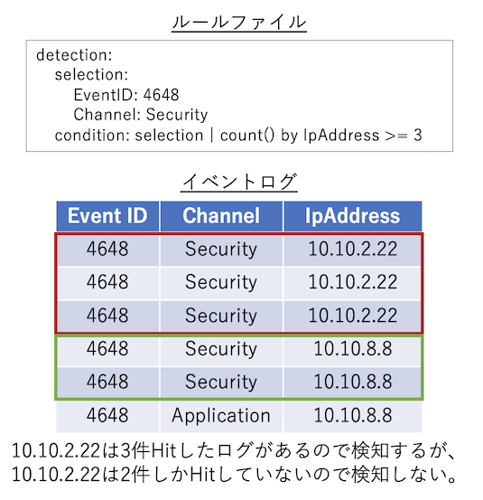
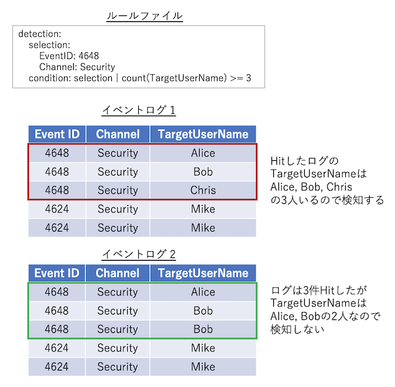
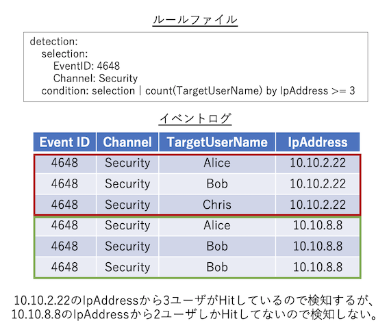

# 非推奨機能

これらの機能はHayabusaでサポートされていますが、今後ルール内で使用されることはありません。

## イベントキー内のキーワードのネスト

イベントキーには特定のキーワードをネストすることができます。

```yaml
detection:
    selection:
        Channel: System
        EventID: 7045
        ServiceName:
            - value: malicious-service
            - regexes: ./rules/config/regex/detectlist_suspicous_services.txt
        ImagePath:
            min_length: 1000
            allowlist: ./rules/config/regex/allowlist_legitimate_services.txt
    condition: selection
```

## 非推奨の特殊キーワード

- `value`: 文字列によるマッチング (ワイルドカードやパイプも指定可能)。
- `min_length`: 指定された文字数以上の場合にマッチします。
- `regexes`: 指定されたファイルに定義された正規表現に1つ以上に一致する場合、**条件にマッチした**ものとして扱われます。
- `allowlist`: 指定されたファイルに定義された正規表現に1つ以上に一致する場合、**条件にマッチしてない**ものとして扱われます。

### regexesとallowlistキーワード

Hayabusaに`./rules/hayabusa/default/alerts/System/7045_CreateOrModiftySystemProcess-WindowsService_MaliciousServiceInstalled.yml`のルールのために使う2つの正規表現ファイルが用意されています。

- `./rules/config/regex/detectlist_suspicous_services.txt`: 怪しいサービス名を検知するためのものです。
- `./rules/config/regex/allowlist_legitimate_services.txt`: 正規のサービスを許可するためのものです。

`regexes` と `allowlist` で定義されたファイルの正規表現を変更すると、それらを参照するすべてのルールの動作を一度に変更できます。

また、`regexes` と `allowlist` にはユーザーが独自で作成したファイルを指定することも可能です。
デフォルトの `./rules/config/detectlist_suspicous_services.txt` と `./rules/config/allowlist_legitimate_services.txt` を参考にして、独自のファイルを作成してください。

## 非推奨の集計条件（'count'ルール）

非推奨の特殊キーワードと `count` 集計は、Hayabusaではまだサポートされていますが、今後ルール内では使用されません。

### 基本事項

上記の `condition` キーワードは `AND` や `OR` だけでなく、マッチしたイベントの集計も可能です。この機能を利用するには`aggregation condition`を利用します。指定するには条件をパイプでつなぎます。
以下のパスワードスプレー攻撃の例では、5分以内に同じ送信元の`IpAddress`で5個以上の `TargetUserName`があるかどうかを判断します。

```yaml
detection:
  selection:
    Channel: Security
    EventID: 4648
  condition: selection | count(TargetUserName) by IpAddress > 5
  timeframe: 5m
```

`aggregation condition`は以下の形式で定義します。

- `count() {operator} {number}`: パイプの前の最初の条件にマッチするログイベントに対して、マッチしたログの数が `{operator}` と `{number}` で指定した条件式を満たす場合に条件がマッチします。

`{operator}` は以下のいずれかになります。

- `==`: 指定された値と等しい場合、条件にマッチしたものとして扱われる。
- `>=`: 指定された値以上であれば、条件にマッチしたものとして扱われる。
- `>`: 指定された値以上であれば、条件にマッチしたものとして扱われる。
- `<=`: 指定された値以下の場合、条件にマッチしたものとして扱われる。
- `<`: 指定された値より小さい場合、条件にマッチしたものとして扱われる。

`{number}` は数値である必要があります。

`timeframe` は以下のように定義することができます。

- `15s`: 15秒
- `30m`: 30分
- `12h`: 12時間
- `7d`: 7日間
- `3M`: 3ヶ月

### countの4パターン

1. countの引数と`by` キーワード共に指定しないパターン。例: `selection | count() > 10`
   > `selection`にマッチしたログが10件以上ある場合、このルールは検知します。
2. countの引数はないが、`by` キーワードはある。例: `selection | count() by date > 10`
   > `selection`にマッチするログが10件以上あるかどうか、日付毎にチェックします。
3. countの引数があるが、`by` キーワードがない場合。例:  `selection | count(TargetUserName) > 10`
   > `selection`に一致する`TargetUserName`が10人以上存在する場合、このルールは検知します。
4. count 引数と `by` キーワードの両方が存在する。例: `selection | count(TargetUserName) by date > 10`
   > `selection`に一致する`TargetUserName`が10人以上存在するかどうか、日付毎にチェックします。

### パターン1の例

これは最も基本的なパターンです：`count() {operator} {number}`. 以下のルールは、`selection`にマッチしたログが3つ以上である場合、このルールが検知されます。



### パターン2の例

`count() by {eventkey} {operator} {number}`： `selection`にマッチしたログは、`{eventkey}`の値が**同じログ毎にグルーピング**されます。各グループにおいて、マッチしたイベントの数が`{operator}`と`{number}`で指定した条件を満たした場合、このルールが検知されます。



### パターン3の例

`count({eventkey}) {operator} {number}`：`selection`にマッチしたログの内、 `{eventkey}` が**異なる**値の数をカウントします。そのカウントされた値が`{operator}`と`{number}`で指定された条件式を満たす場合、このルールが検知されます。



### パターン4の例

`count({eventkey_1}) by {eventkey_2} {operator} {number}`： `selection`にマッチしたログは、`{eventkey}`の値が**同じログ毎にグルーピングし**、各グループに含まれる`{eventkey_1}`が**異なる**値の数をカウントします。各グループでカウントされた値が`{operator}`と`{number}`で指定された条件式を満たした場合、このルールが検知されます。



### Countルールの出力

CountルールのDetails出力は固定で、`[condition]`にcount条件と`[result]`に記録されたイベントキーが出力されます。

以下の例では、ブルートフォースされた`TargetUserName`のユーザ名のリストと送信元の`IpAddress`が出力されます：

```
[condition] count(TargetUserName) by IpAddress >= 5 in timeframe [result] count:41 TargetUserName:jorchilles/jlake/cspizor/lpesce/bgalbraith/jkulikowski/baker/eskoudis/dpendolino/sarmstrong/lschifano/drook/rbowes/ebooth/melliott/econrad/sanson/dmashburn/bking/mdouglas/cragoso/psmith/bhostetler/zmathis/thessman/kperryman/cmoody/cdavis/cfleener/gsalinas/wstrzelec/jwright/edygert/ssims/jleytevidal/celgee/Administrator/mtoussain/smisenar/tbennett/bgreenwood IpAddress:10.10.2.22 timeframe:5m
```

アラートのタイムスタンプには、timeframe内で最初に検知されたイベントの時間が表示されます。
