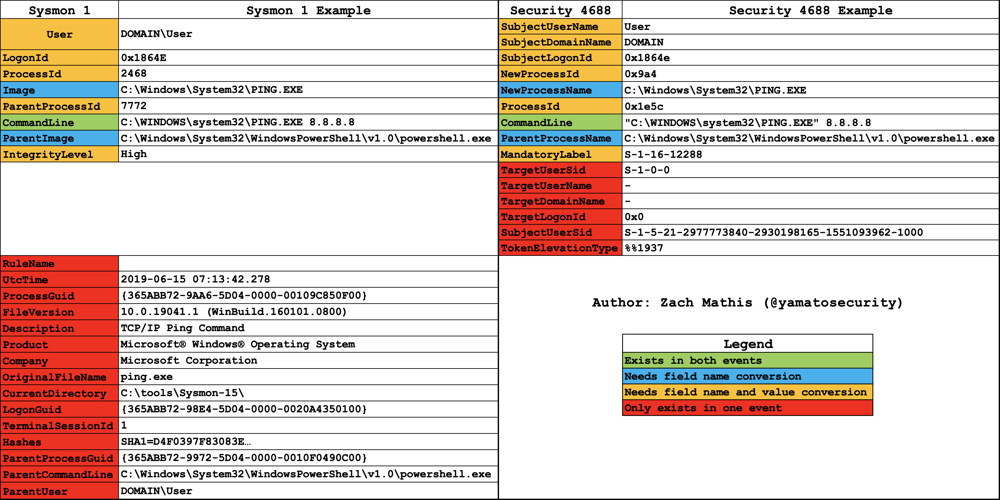
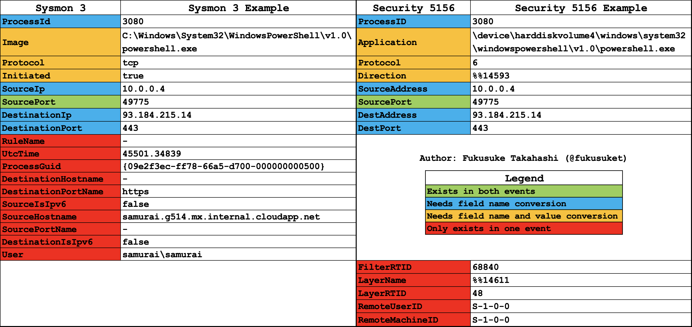

# تنظيم قواعد Sigma لسجلات أحداث Windows

توضّح هذه الصفحة كيف تقوم Yamato Security بتنظيم قواعد [Sigma](https://github.com/SigmaHQ/sigma) الأصلية (upstream) الخاصة بسجلات أحداث Windows وتحويلها إلى صيغة أكثر قابلية للاستخدام، وذلك عبر إزالة التجريد عن حقل `logsource` وتصفية القواعد غير القابلة للاستخدام أو التي يصعب استخدامها. ويتم ذلك باستخدام أداة [`sigma-to-hayabusa-converter`](https://github.com/Yamato-Security/sigma-to-hayabusa-converter)، التي تُستخدم بشكل أساسي لإنشاء مجموعة قواعد Sigma المنظَّمة المستضافة في [hayabusa-rules](https://github.com/Yamato-Security/hayabusa-rules). وتُستخدم مجموعة القواعد تلك بواسطة [Hayabusa](https://github.com/Yamato-Security/hayabusa) و[Velociraptor](https://github.com/Velocidex/velociraptor).

!!! info "المصدر"
    تُصان هذه الوثائق جنبًا إلى جنب مع أداة التحويل في [Yamato-Security/sigma-to-hayabusa-converter](https://github.com/Yamato-Security/sigma-to-hayabusa-converter). ونأمل أن تكون هذه المعلومات مفيدة أيضًا للمشاريع الأخرى التي ترغب في استخدام قواعد Sigma لاكتشاف الهجمات في سجلات أحداث Windows. راجع أيضًا [إنشاء ملفات القواعد](creating-rules.md) و[معدّلات الحقول](field-modifiers.md).

## الخلاصة

* إن إزالة التجريد عن حقل `logsource` وإنشاء ملفات قواعد `.yml` جديدة للقواعد المُدمجة (built-in) إلى جانب القواعد الأصلية المبنية على Sysmon يجعل الدعم الكامل للأحداث المُدمجة في قواعد Sigma أسهل، ويجعل القواعد أيسر للمحلّلين على القراءة.
* عند كتابة قواعد Sigma لسجلات أحداث Windows، من المهم فهم الفروق بين السجلات الأصلية المبنية على Sysmon والسجلات المُدمجة المتوافقة معها، ويُفضَّل كتابة قواعدك بحيث تكون متوافقة مع كليهما.
* كثير من المؤسسات لا تستطيع أو لا ترغب في تثبيت وكلاء Sysmon وصيانتهم على جميع نقاط النهاية (endpoints) الخاصة بها التي تعمل بنظام Windows، إما لأنها لا تملك الموارد المخصصة للتعامل مع ذلك، أو لأنها ترغب في تجنّب خطر أي تباطؤ أو أعطال قد يسببها Sysmon. ولهذا السبب، من المهم تفعيل أكبر عدد ممكن من سجلات الأحداث المُدمجة واستخدام أدوات قادرة على اكتشاف الهجمات في تلك السجلات المُدمجة.

## التحديات المتعلقة بقواعد Sigma الأصلية (upstream) لسجلات أحداث Windows

استنادًا إلى تجربتنا، كان التحدي الرئيسي في إنشاء مُحلِّل (parser) أصلي لقواعد Sigma الخاصة بسجلات أحداث Windows هو دعم حقل `logsource`. وهذا حاليًا أحد الأمور القليلة التي لا يدعمها Hayabusa بشكل أصلي بعد، إذ إنه لا يزال معقدًا جدًا وقيد التطوير. وفي الوقت الحالي، نتجاوز هذه المشكلة عبر تحويل القواعد الأصلية إلى صيغة أسهل في الاستخدام، كما هو موضَّح بالتفصيل أدناه.

### حول حقل `logsource`

في قواعد Sigma الخاصة بسجلات أحداث Windows، يُضبط حقل `product` على `windows`، متبوعًا إما بحقل `service` أو بحقل `category`.

مثال على حقل `service`:

```yaml
logsource:
    product: windows
    service: application
```

مثال على حقل `category`:

```yaml
logsource:
    product: windows
    category: process_creation
```

#### حقول Service

حقول `service` بسيطة نسبيًا في التعامل معها، وهي تُخبر أيّ واجهة خلفية (backend) تستخدم قاعدة Sigma بأن تبحث في قناة واحدة أو عدة قنوات استنادًا إلى حقل `Channel` في سجل أحداث Windows بصيغة XML.

**مثال على قناة واحدة**

`service: application` يعادل إضافة شرط تحديد (selection) هو `Channel: Application` إلى قاعدة Sigma.

**مثال على قنوات متعددة**

يُنشئ `service: applocker` حاليًا أكبر عدد من القنوات التي يجب البحث فيها، لأن AppLocker يحفظ المعلومات في أربعة سجلات مختلفة. وللبحث في سجلات AppLocker فقط بشكل صحيح، يجب إضافة الشرط التالي إلى منطق قاعدة Sigma:

```yaml
Channel:
    - Microsoft-Windows-AppLocker/MSI and Script
    - Microsoft-Windows-AppLocker/EXE and DLL
    - Microsoft-Windows-AppLocker/Packaged app-Deployment
    - Microsoft-Windows-AppLocker/Packaged app-Execution
```

**القائمة الحالية لتعيينات الخدمات (service)**

| الخدمة (Service)                            | القناة (Channel)                                                                                                                    |
|--------------------------------------------|-------------------------------------------------------------------------------------------------------------------------------------|
| application                                | Application                                                                                                                         |
| application-experience                     | Microsoft-Windows-Application-Experience/Program-Telemetry, Microsoft-Windows-Application-Experience/Program-Compatibility-Assistant |
| applocker                                  | Microsoft-Windows-AppLocker/MSI and Script, Microsoft-Windows-AppLocker/EXE and DLL, Microsoft-Windows-AppLocker/Packaged app-Deployment, Microsoft-Windows-AppLocker/Packaged app-Execution |
| appmodel-runtime                           | Microsoft-Windows-AppModel-Runtime/Admin                                                                                            |
| appxpackaging-om                           | Microsoft-Windows-AppxPackaging/Operational                                                                                         |
| bits-client                                | Microsoft-Windows-Bits-Client/Operational                                                                                           |
| capi2                                      | Microsoft-Windows-CAPI2/Operational                                                                                                 |
| certificateservicesclient-lifecycle-system | Microsoft-Windows-CertificateServicesClient-Lifecycle-System/Operational                                                            |
| codeintegrity-operational                  | Microsoft-Windows-CodeIntegrity/Operational                                                                                         |
| diagnosis-scripted                         | Microsoft-Windows-Diagnosis-Scripted/Operational                                                                                    |
| dhcp                                       | Microsoft-Windows-DHCP-Server/Operational                                                                                           |
| dns-client                                 | Microsoft-Windows-DNS Client Events/Operational                                                                                     |
| dns-server                                 | DNS Server                                                                                                                          |
| dns-server-analytic                        | Microsoft-Windows-DNS-Server/Analytical                                                                                             |
| driver-framework                           | Microsoft-Windows-DriverFrameworks-UserMode/Operational                                                                             |
| firewall-as                                | Microsoft-Windows-Windows Firewall With Advanced Security/Firewall                                                                  |
| hyper-v-worker                             | Microsoft-Windows-Hyper-V-Worker                                                                                                     |
| kernel-event-tracing                       | Microsoft-Windows-Kernel-EventTracing                                                                                               |
| kernel-shimengine                          | Microsoft-Windows-Kernel-ShimEngine/Operational, Microsoft-Windows-Kernel-ShimEngine/Diagnostic                                     |
| ldap_debug                                 | Microsoft-Windows-LDAP-Client/Debug                                                                                                 |
| lsa-server                                 | Microsoft-Windows-LSA/Operational                                                                                                   |
| microsoft-servicebus-client                | Microsoft-ServiceBus-Client                                                                                                         |
| msexchange-management                      | MSExchange Management                                                                                                               |
| ntfs                                       | Microsoft-Windows-Ntfs/Operational                                                                                                  |
| ntlm                                       | Microsoft-Windows-NTLM/Operational                                                                                                  |
| openssh                                    | OpenSSH/Operational                                                                                                                 |
| powershell                                 | Microsoft-Windows-PowerShell/Operational, PowerShellCore/Operational                                                                |
| powershell-classic                         | Windows PowerShell                                                                                                                  |
| printservice-admin                         | Microsoft-Windows-PrintService/Admin                                                                                                |
| printservice-operational                   | Microsoft-Windows-PrintService/Operational                                                                                          |
| security                                   | Security                                                                                                                            |
| security-mitigations                       | Microsoft-Windows-Security-Mitigations*                                                                                             |
| shell-core                                 | Microsoft-Windows-Shell-Core/Operational                                                                                            |
| smbclient-connectivity                     | Microsoft-Windows-SmbClient/Connectivity                                                                                            |
| smbclient-security                         | Microsoft-Windows-SmbClient/Security                                                                                                |
| system                                     | System                                                                                                                              |
| sysmon                                     | Microsoft-Windows-Sysmon/Operational                                                                                                |
| taskscheduler                              | Microsoft-Windows-TaskScheduler/Operational                                                                                         |
| terminalservices-localsessionmanager       | Microsoft-Windows-TerminalServices-LocalSessionManager/Operational                                                                  |
| vhdmp                                      | Microsoft-Windows-VHDMP/Operational                                                                                                 |
| wmi                                        | Microsoft-Windows-WMI-Activity/Operational                                                                                          |
| windefend                                  | Microsoft-Windows-Windows Defender/Operational                                                                                      |

**مصادر تعيينات الخدمات**

لقد أنشأنا ملفات تعيين بصيغة YAML تربط الخدمات بأسماء القنوات، ونتولّى صيانتها دوريًا ونستضيفها في مستودع أداة التحويل. وهي مبنية على معلومات تعيين الخدمات المأخوذة من [SigmaHQ/sigma `tests/thor.yml`](https://github.com/SigmaHQ/sigma/blob/master/tests/thor.yml): ومع أنه لا يبدو أن هذا ملف إعداد عام رسمي مُخصَّص للاستخدام، إلا أنه يبدو الأحدث تحديثًا.

#### حقول Category

تكتفي معظم حقول `category` بإضافة شرط للتحقق من معرّفات أحداث معينة في حقل `EventID`، بالإضافة إلى البحث في `Channel` محدَّدة. وأسماء الفئات مبنية في معظمها على أحداث [Sysmon](https://learn.microsoft.com/en-us/sysinternals/downloads/sysmon)، مع بعض الفئات الإضافية لسجلات PowerShell المُدمجة و Windows Defender.

**مثال على حقل Category**

```yaml
process_creation:
    EventID: 1
    Channel: Microsoft-Windows-Sysmon/Operational
```

**القائمة الحالية لتعيينات الفئات (category)**

تُعيَّن بعض الفئات إلى أكثر من خدمة/معرّف حدث واحد (تظهر بخط **عريض**).

| الفئة (Category)          | الخدمة (Service)   | معرّفات الأحداث (EventIDs)                                             |
|---------------------------|--------------------|-----------------------------------------------------------------------|
| antivirus                 | windefend          | 1006, 1007, 1008, 1009, 1010, 1011, 1012, 1017, 1018, 1019, 1115, 1116 |
| clipboard_change          | sysmon             | 24                                                                    |
| create_remote_thread      | sysmon             | 8                                                                     |
| create_stream_hash        | sysmon             | 15                                                                    |
| dns_query                 | sysmon             | 22                                                                    |
| driver_load               | sysmon             | 6                                                                     |
| file_block_executable     | sysmon             | 27                                                                    |
| file_block_shredding      | sysmon             | 28                                                                    |
| file_change               | sysmon             | 2                                                                     |
| file_creation             | sysmon             | 11                                                                    |
| file_delete               | sysmon             | 23, 26                                                                |
| file_delete_detected      | sysmon             | 26                                                                    |
| file_executable_detected  | sysmon             | 29                                                                    |
| image_load                | sysmon             | 7                                                                     |
| **network_connection**    | sysmon             | 3                                                                     |
| **network_connection**    | security           | 5156                                                                  |
| pipe_created              | sysmon             | 17, 18                                                                |
| process_access            | sysmon             | 10                                                                    |
| **process_creation**      | sysmon             | 1                                                                     |
| **process_creation**      | security           | 4688                                                                  |
| process_tampering         | sysmon             | 25                                                                    |
| process_termination       | sysmon             | 5                                                                     |
| ps_classic_provider_start | powershell-classic | 600                                                                   |
| ps_classic_start          | powershell-classic | 400                                                                   |
| ps_module                 | powershell         | 4103                                                                  |
| ps_script                 | powershell         | 4104                                                                  |
| raw_access_thread         | sysmon             | 9                                                                     |
| **registry_add**          | sysmon             | 12                                                                    |
| **registry_add**          | security           | 4657                                                                  |
| registry_delete           | sysmon             | 12                                                                    |
| **registry_event**        | sysmon             | 12, 13, 14                                                            |
| **registry_event**        | security           | 4657                                                                  |
| registry_rename           | sysmon             | 14                                                                    |
| **registry_set**          | sysmon             | 13                                                                    |
| **registry_set**          | security           | 4657                                                                  |
| sysmon_error              | sysmon             | 255                                                                   |
| sysmon_status             | sysmon             | 4, 16                                                                 |
| wmi_event                 | sysmon             | 19, 20, 21                                                            |

**تحديات حقل Category**

كما هو موضَّح أعلاه، يمكن أن تستخدم الفئة `category` نفسها خدمات ومعرّفات أحداث متعددة (مُشار إليها بخط **عريض**). وهذا يعني أنه من الممكن استخدام بعض قواعد Sigma المصمَّمة لـ `sysmon` مع سجلات أحداث `security` المُدمجة المماثلة في Windows، إذا كانت الحقول التي تستخدمها القاعدة موجودة أيضًا في سجل الأحداث المُدمج. وفي هذه الحالة، قد يلزم تحويل أسماء الحقول — وأحيانًا القيم أيضًا — لتتطابق مع أسماء الحقول والقيم الموجودة في سجل أحداث `security` المُدمج. ومع أن هذا قد يكون بسيطًا كإعادة تسمية بعض أسماء الحقول لفئات معينة، إلا أنه قد يتطلب في فئات أخرى تحويلات متنوعة في قيم الحقول أيضًا. وتُشرح كيفية إجرائنا لهذا التحويل، وكذلك التوافق بين سجلات `sysmon` وسجلات `security`، بالتفصيل [أدناه](#sysmon-builtin-comparison).

**مصادر تعيينات الفئات**

تُستضاف ملفات تعيين الفئات بصيغة YAML أيضًا في مستودع أداة التحويل، وهي مبنية كذلك على المعلومات المأخوذة من [SigmaHQ/sigma `tests/thor.yml`](https://github.com/SigmaHQ/sigma/blob/master/tests/thor.yml).

## مزايا وتحديات تجريد مصدر السجل (log source)

هناك مزايا وتحديات على حد سواء لتجريد مصدر السجل وإنشاء تعيينات لمختلف قيم `Channel` و`EventID` والحقول في الواجهة الخلفية.

### المزايا

1. قد يكون من الأسهل تحويل أسماء حقلي `Channel` و`EventID` إلى أسماء الحقول المناسبة في الواجهة الخلفية عند تحويل قواعد Sigma إلى استعلامات واجهات خلفية أخرى.
2. من الممكن دمج قاعدتين في قاعدة واحدة. على سبيل المثال، يمكن تسجيل أحداث إنشاء العمليات في `Sysmon 1` وكذلك في `Security 4688`. فبدلًا من كتابة قاعدتين تنظران إلى قنوات ومعرّفات أحداث وحقول مختلفة لكنهما تحتويان على المنطق نفسه فيما عدا ذلك، من الممكن توحيد الحقول لتطابق ما يستخدمه Sysmon، ثم جعل مُحوِّل الواجهة الخلفية يضيف حقلي `Channel` و`EventID` ويحوّل معلومات الحقول الأخرى عند الحاجة. وهذا يجعل صيانة القواعد أسهل، لأن عدد القواعد التي يجب صيانتها يصبح أقل.
3. ومع أن ذلك نادر جدًا، إذا بدأ مصدر سجلٍ ما بتسجيل بياناته في `Channel` أو `EventID` مختلف، فلن يلزم سوى تحديث منطق التعيين بدلًا من تحديث جميع قواعد Sigma، مما يجعل الصيانة أسهل.

### التحديات

1. ماذا يحدث إذا كانت قاعدة Sigma الأصلية المبنية على Sysmon تستخدم حقلًا غير موجود في السجلات المُدمجة من أجل تصفية النتائج الإيجابية الكاذبة (false positives)؟ هل ينبغي لك إنشاء القاعدة على أي حال مع إعطاء الأولوية لإمكانية الاكتشاف، أم تجاهلها لإعطاء الأولوية لتقليل النتائج الإيجابية الكاذبة؟ من الناحية المثالية، سيلزم إنشاء قاعدتين بمعلومات مختلفة في `severity` و`status` والنتائج الإيجابية الكاذبة، لكي يتمكن المستخدم من التعامل معها بشكل أفضل.
2. يجعل تصفية القواعد أكثر صعوبة، إذ لا يمكنك التصفية بالاعتماد فقط على حقلي `Channel` أو `EventID` في ملف `.yml` أو على مسار ملف القاعدة إذا لم يكن الملف قد أُنشئ بعد — لأنها قاعدة مُشتقّة (derived) لسجل مُدمج بدلًا من قاعدة Sysmon الأصلية. كما أنه بما أن معرّف القاعدة نفسه واحد، فلا يمكنك التصفية بناءً على معرّفات القواعد.
3. يجعل تأكيد التنبيه أكثر صعوبة عندما يأتي التنبيه من قاعدة خاصة بالسجلات المُدمجة اشتُقّت من سجل Sysmon. إذ لن تتطابق أسماء الحقول وقيمها، ولذلك يحتاج المحلّل إلى فهم عملية التحويل المعقّدة نوعًا ما.
4. يجعل إنشاء منطق الواجهة الخلفية أكثر تعقيدًا.

ورغم أننا لا نستطيع فعل شيء حيال المشكلة الأولى سوى إنشاء قواعد جديدة وصيانتها عندما توجد حالة استخدام مهمة تبرّر هذا الجهد، فقد قررنا — لمعالجة المشكلات من 2 إلى 4 — إزالة التجريد عن حقل `logsource` وإنشاء مجموعتين من القواعد لأي قاعدة يمكن أن تُنتج قواعد متعددة. تُخرَج القواعد القادرة على اكتشاف الهجمات في السجلات المُدمجة إلى دليل `builtin`، وتُخرَج القواعد الخاصة بـ Sysmon إلى دليل `sysmon`.

## مثال على التحويل

إليك مثالًا بسيطًا لفهم عملية التحويل بشكل أفضل.

**قبل التحويل** — قاعدة Sigma الأصلية:

```yaml
logsource:
    category: process_creation
    product: windows
detection:
    selection:
        - Image|endswith: '.exe'
    condition: selection
```

**بعد التحويل** — قاعدة متوافقة مع Hayabusa لسجلات Sysmon:

```yaml
logsource:
    category: process_creation
    product: windows
detection:
    process_creation:
        Channel: Microsoft-Windows-Sysmon/Operational
        EventID: 1
    selection:
        - Image|endswith: '.exe'
    condition: process_creation and selection
```

...وقاعدة متوافقة مع Hayabusa لسجلات Windows المُدمجة:

```yaml
logsource:
    category: process_creation
    product: windows
detection:
    process_creation:
        Channel: Security
        EventID: 4688
    selection:
        - NewProcessName|endswith: '.exe'
    condition: process_creation and selection
```

كما ترى، أُنشئت قاعدتان: واحدة لسجلات Sysmon 1 وأخرى لسجلات Security 4688 المُدمجة. أُضيف شرط `process_creation` جديد يحتوي على معلومات القناة ومعرّف الحدث، وأُضيف إلى حقل `condition` لجعل هذا الشرط مطلوبًا. كما تم تغيير اسم الحقل الأصلي `Image` إلى `NewProcessName`.

## القواسم المشتركة في التحويل

قبل الشرح المفصَّل لكيفية تحويلنا لفئات محددة، إليك الجزء من عملية التحويل الذي ينطبق على جميع القواعد.

1. يتم تجاهل أي قاعدة يوجد معرّفها في `ignore-uuid-list.txt`. حاليًا نتجاهل فقط القواعد التي تسبب نتائج إيجابية كاذبة على Windows Defender لأنها تحتوي على كلمات مفتاحية مثل `mimikatz`.
2. يتم تجاهل القواعد "النائبة" (Placeholder) لأنه لا يمكن استخدامها كما هي. وهذه هي القواعد الموضوعة في مجلد [`rules-placeholder`](https://github.com/SigmaHQ/sigma/tree/master/rules-placeholder/windows/) في مستودع Sigma.
3. يتم إسقاط القواعد التي تستخدم معدّلات حقول (field modifiers) غير متوافقة. يدعم Hayabusa غالبية معدّلات الحقول، لذا لن يُخرِج المُحوِّل أي قاعدة تستخدم معدّلًا غير هذه المعدّلات، تجنّبًا لأخطاء التحليل (راجع [معدّلات الحقول](field-modifiers.md)):

    `all`, `base64`, `base64offset`, `cased`, `cidr`, `contains`, `endswith`, `endswithfield`, `equalsfield`, `exists`, `fieldref`, `gt`, `gte`, `lt`, `lte`, `re`, `startswith`, `utf16`, `utf16be`, `utf16le`, `wide`, `windash`

4. لا يتم تحويل القواعد التي تحتوي على أخطاء في الصياغة (syntax errors).
5. يتم تحديث الوسوم (tags) في القواعد `deprecated` و`unsupported` من صيغة V1 إلى صيغة V2، التي تستخدم `-` بدلًا من `_`، للحفاظ على اتساق كل شيء ولتسهيل التعامل مع الاختصارات في Hayabusa. مثال: يصبح `initial_access` هو `initial-access`.
6. بما أننا نضيف معلومات `Channel` و`EventID` إلى القواعد، فإننا ننشئ معرّف UUIDv4 جديدًا باستخدام تجزئة MD5 للمعرّف الأصلي، ونحدد المعرّف الأصلي في حقل `related`، ونضع علامة على `type` بأنه `derived`. أما القواعد التي يمكن تحويلها إلى قواعد متعددة (`sysmon` و`builtin`)، فنحتاج إلى إنشاء معرّفات قواعد جديدة للقواعد `builtin` المشتقّة أيضًا. وللقيام بذلك، نحسب تجزئة MD5 لمعرّف قاعدة `sysmon` ونستخدمها لمعرّف UUIDv4. على سبيل المثال:

    قاعدة Sigma الأصلية:

    ```yaml
    title: 7Zip Compressing Dump Files
    id: 1ac14d38-3dfc-4635-92c7-e3fd1c5f5bfc
    ```

    قاعدة `sysmon` الجديدة:

    ```yaml
    title: 7Zip Compressing Dump Files
    id: ec570e53-4c76-45a9-804d-dc3f355ff7a7
    related:
        - id: 1ac14d38-3dfc-4635-92c7-e3fd1c5f5bfc
        type: derived
    ```

    قاعدة `builtin` الجديدة:

    ```yaml
    title: 7Zip Compressing Dump Files
    id: 93586827-5f54-fc91-0b2f-338fd5365694
    related:
        - id: 1ac14d38-3dfc-4635-92c7-e3fd1c5f5bfc
        type: derived
        - id: ec570e53-4c76-45a9-804d-dc3f355ff7a7
        type: derived
    ```

7. تُخرَج القواعد التي تكتشف الأمور في سجلات أحداث Windows المُدمجة إلى دليل `builtin`، بينما تُخرَج القواعد التي تعتمد على سجلات Sysmon إلى دليل `sysmon`، مع أدلة فرعية تطابق الأدلة الموجودة في مستودع Sigma الأصلي (upstream).

## قيود التحويل

يوجد [خلل معروف](https://github.com/Yamato-Security/sigma-to-hayabusa-converter/issues/2) واحد فقط في الوقت الحالي: لن تُضمَّن أسطر التعليقات في قواعد Sigma ضمن القواعد الناتجة ما لم تأتِ التعليقات بعد بعض التعليمات البرمجية (source code).

## مقارنة أحداث Sysmon والأحداث المُدمجة وتحويل القواعد { #sysmon-builtin-comparison }

### إنشاء العملية

* الفئة: `process_creation`
* Sysmon
    * القناة: `Microsoft-Windows-Sysmon/Operational`
    * معرّف الحدث: `1`
* السجل المُدمج
    * القناة: `Security`
    * معرّف الحدث: `4688`

**المقارنة**



**ملاحظات التحويل**

1. يجب فصل معلومات حقل `User` إلى حقلي `SubjectUserName` و`SubjectDomainName`.
2. يتغير اسم الحقل `LogonId` إلى `SubjectLogonId`، ويجب تحويل أي أحرف في القيمة الست عشرية (hex) إلى أحرف صغيرة.
3. يتغير اسم الحقل `ProcessId` إلى `NewProcessId`، ويجب تحويل القيمة إلى النظام الست عشري (hex).
4. يتغير اسم الحقل `Image` إلى `NewProcessName`.
5. يتغير اسم الحقل `ParentProcessId` إلى `ProcessId`، ويجب تحويل القيمة إلى النظام الست عشري (hex).
6. يتغير اسم الحقل `ParentImage` إلى `ParentProcessName`.
7. يتغير اسم الحقل `IntegrityLevel` إلى `MandatoryLabel`، ويلزم تحويل القيم التالي:
    * `Low`: `S-1-16-4096`
    * `Medium`: `S-1-16-8192`
    * `High`: `S-1-16-12288`
    * `System`: `S-1-16-16384`
8. إذا كانت القاعدة تحتوي على الحقول التالية التي توجد فقط في أحداث `Security 4688`، فإننا لا ننشئ قاعدة `Sysmon 1`:
    * `SubjectUserSid`, `TokenElevationType`, `TargetUserSid`, `TargetUserName`, `TargetDomainName`, `TargetLogonId`
9. إذا كانت القاعدة تحتوي على الحقول التالية التي توجد فقط في أحداث `Sysmon 1`، فإننا لا ننشئ قاعدة `Security 4688`:
    * `RuleName`, `UtcTime`, `ProcessGuid`, `FileVersion`, `Description`, `Product`, `Company`, `OriginalFileName`, `CurrentDirectory`, `LogonGuid`, `TerminalSessionId`, `Hashes`, `ParentProcessGuid`, `ParentCommandLine`, `ParentUser`
10. هناك استثناء للنقطتين #8 و#9: حتى لو استُخدم حقل موجود في نوع سجل واحد فقط، فإذا كان ذلك الحقل ضمن شرط `OR` فينبغي لك مع ذلك إنشاء تلك القاعدة. على سبيل المثال، القاعدة التالية ينبغي أن **لا** تُنتج قاعدة `Security 4688` لأن حقل `OriginalFileName` مطلوب (منطق `AND` داخل التحديد):

    ```yaml
    selection_img:
        Image|endswith: \addinutil.exe
        OriginalFileName: AddInUtil.exe
    ```

    غير أن القاعدة ذات الشرط التالي **ينبغي** أن تُنشئ قاعدة `Security 4688` لأن `OriginalFileName` اختياري (منطق `OR` داخل التحديد):

    ```yaml
    selection_img:
        - Image|endswith: \addinutil.exe
        - OriginalFileName: AddInUtil.exe
    ```

    تتعقّد الأمور في أن مُحلِّلك يجب أن يفهم ليس فقط المنطق داخل التحديدات (selections) بل أيضًا داخل حقل `condition`. على سبيل المثال، القاعدة التالية **لا ينبغي** أن تُنشئ قاعدة `Security 4688` لأنها تستخدم منطق `AND`:

    ```yaml
    selection_img:
        Image|endswith: \addinutil.exe
    selection_orig:
        OriginalFileName: AddInUtil.exe
    condition: selection_img and selection_orig
    ```

    غير أن القاعدة التالية **ينبغي** أن تُنشئ قاعدة `Security 4688` لأنها تستخدم منطق `OR`:

    ```yaml
    selection_img:
        Image|endswith: \addinutil.exe
    selection_orig:
        OriginalFileName: AddInUtil.exe
    condition: selection_img or selection_orig
    ```

**ملاحظات أخرى**

* يُظهر حقل `SubjectUserSid` في `Security 4688` مُعرّف الأمان (SID)؛ غير أنه في `Message` المعروض في سجل الأحداث يُحوَّل إلى `DOMAIN\User`.
* قد لا تتضمن أحداث `Security 4688` معلومات خيارات سطر الأوامر في `CommandLine` تبعًا للإعدادات.
* يُعرض `TokenElevationType` كما هو في `Message` دون معالجة عرضه.
* تُحوَّل قيم مثل `S-1-16-4096` داخل `MandatoryLabel` إلى `Mandatory Label\Low Mandatory Level` ونحو ذلك في `Message` المعروض.

**إعدادات السجل المُدمج**

!!! warning "غير مُفعَّل افتراضيًا"
    سجلات أحداث إنشاء العمليات المُدمجة المهمة `Security 4688` ليست مُفعَّلة افتراضيًا. تحتاج إلى تفعيل أحداث `4688` وتسجيل خيارات سطر الأوامر كليهما لكي تتمكن من استخدام غالبية قواعد Sigma.

*التفعيل باستخدام نهج المجموعة (group policy):*

* `Computer Configuration > Policies > Windows Settings > Security Settings > Advanced Audit Configuration > Detailed Tracking > Audit Process Creation`: `Enabled`
* `Administrative Templates > System > Audit Process Creation > Include command line in process creation events`: `Enabled`

*التفعيل عبر سطر الأوامر:*

```bat
auditpol /set /subcategory:{0CCE922B-69AE-11D9-BED3-505054503030} /success:enable /failure:enable
reg add HKLM\SOFTWARE\Microsoft\Windows\CurrentVersion\Policies\System\Audit /v ProcessCreationIncludeCmdLine_Enabled /f /t REG_DWORD /d 1
```

### اتصال الشبكة

* الفئة: `network_connection`
* Sysmon
    * القناة: `Microsoft-Windows-Sysmon/Operational`
    * معرّف الحدث: `3`
* السجل المُدمج
    * القناة: `Security`
    * معرّف الحدث: `5156`

**المقارنة**



**ملاحظات التحويل**

1. يتغير اسم الحقل `ProcessId` إلى `ProcessID`.
2. يتغير اسم الحقل `Image` إلى `Application`، ويتغير `C:\` إلى `\device\harddiskvolume?\`. (ملاحظة: بما أننا لا نعرف رقم وحدة تخزين القرص الصلب، نستبدله بحرف بدل (wildcard) مكوّن من حرف واحد وهو `?`.)
3. تتغير قيمة الحقل `Protocol` من `tcp` إلى `6` ومن `udp` إلى `17`.
4. يتغير اسم الحقل `Initiated` إلى `Direction`، وتتغير القيمة `true` إلى `%%14593` والقيمة `false` إلى `%%14592`.
5. يتغير اسم الحقل `SourceIp` إلى `SourceAddress`.
6. يتغير اسم الحقل `DestinationIp` إلى `DestAddress`.
7. يتغير اسم الحقل `DestinationPort` إلى `DestPort`.

**إعدادات السجل المُدمج**

!!! warning "غير مُفعَّل افتراضيًا"
    سجلات اتصال الشبكة المُدمجة `Security 5156` ليست مُفعَّلة افتراضيًا. فهي تنتج كمية كبيرة من السجلات، مما قد يؤدي إلى الكتابة فوق سجلات مهمة أخرى في سجل أحداث `Security` وربما إبطاء النظام إذا كان لديه عدد كبير من اتصالات الشبكة. تأكّد من أن الحد الأقصى لحجم ملف سجل `Security` مرتفع، واختبر للتأكد من عدم وجود آثار سلبية على النظام.

*التفعيل باستخدام نهج المجموعة (group policy):*

* `Computer Configuration -> Windows Settings -> Security Settings -> Advanced Audit Policy Configuration -> System Audit Policies -> Object Access -> Filtering Platform Connection`: `Success and Failure`

*التفعيل عبر سطر الأوامر:*

```bat
auditpol /set /subcategory:"Filtering Platform Connection" /success:enable /failure:enable
```

...أو ما يلي إذا كنت تستخدم لغة (locale) غير الإنجليزية:

```bat
auditpol /set /subcategory:{0CCE922F-69AE-11D9-BED3-505054503030} /success:enable /failure:enable
```

!!! tip "راجع أيضًا"
    لمزيد من المعلومات حول تفعيل سجلات أحداث Windows المُدمجة اللازمة لالتقاط الأدلة التي تعتمد عليها هذه القواعد، راجع [تسجيل Windows وSysmon](../resources/logging.md) ومشروع [EnableWindowsLogSettings](https://github.com/Yamato-Security/EnableWindowsLogSettings).

## نصائح لكتابة قواعد Sigma

!!! tip
    إذا استخدمت أي حقل موجود في سجل `sysmon` لكنه غير موجود في سجل `builtin`، فتأكّد من جعل ذلك الحقل اختياريًا حتى يظل من الممكن استخدام القاعدة مع سجلات `builtin`.

على سبيل المثال:

```yaml
selection_img:
    - Image|endswith: \addinutil.exe
    - OriginalFileName: AddInUtil.exe
```

يبحث هذا التحديد عن الحالة التي يكون فيها اسم العملية (`Image`) هو `addinutil.exe`. المشكلة أن المهاجم يمكنه ببساطة إعادة تسمية الملف لتجاوز القاعدة. أما حقل `OriginalFileName`، الموجود في سجلات Sysmon فقط، فهو اسم الملف المضمَّن داخل الملف الثنائي (binary) وقت الترجمة (compile time). وحتى لو أعاد المهاجم تسمية الملف، فلن يتغير الاسم المضمَّن، ولذلك يمكن لهذه القاعدة اكتشاف الهجمات التي أعاد فيها المهاجم تسمية الملف عند استخدام Sysmon، كما يمكنها اكتشاف الهجمات التي لم يتغير فيها اسم الملف عند استخدام السجلات المُدمجة القياسية.

## قواعد Sigma المُحوَّلة مسبقًا

إن قواعد Sigma المنظَّمة بالطريقة الموصوفة في هذه الصفحة — عبر إزالة التجريد عن حقل `logsource` — مستضافة في مستودع [hayabusa-rules](https://github.com/Yamato-Security/hayabusa-rules) ضمن مجلد `sigma`.

## بيئة الأداة

إذا كنت ترغب في تحويل قواعد Sigma محليًا إلى صيغة متوافقة مع Hayabusa، فعليك أولًا تثبيت [Poetry](https://python-poetry.org/). يُرجى الرجوع إلى [وثائق التثبيت](https://python-poetry.org/docs/#installation) الرسمية الخاصة بـ Poetry.

## استخدام الأداة

`sigma-to-hayabusa-converter.py` هي أداتنا الرئيسية لتحويل حقل `logsource` في قواعد Sigma إلى صيغة متوافقة مع Hayabusa. نفّذ المهام التالية لتشغيلها:

```bash
git clone https://github.com/SigmaHQ/sigma.git
git clone https://github.com/Yamato-Security/sigma-to-hayabusa-converter.git
cd sigma-to-hayabusa-converter
poetry install --no-root
poetry run python sigma-to-hayabusa-converter.py -r ../sigma -o ./converted_sigma_rules
```

بعد تنفيذ الأوامر أعلاه، ستُخرَج القواعد المُحوَّلة إلى الصيغة المتوافقة مع Hayabusa إلى دليل `./converted_sigma_rules`.
